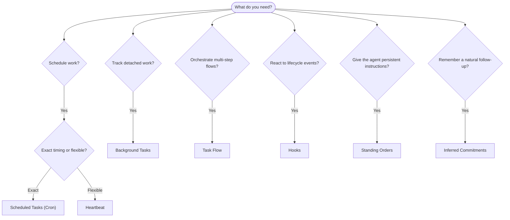

---
read_when:
    - Decidere come automatizzare il lavoro con OpenClaw
    - Scegliere tra Heartbeat, Cron, impegni, hook e istruzioni permanenti
    - Cercare il punto di ingresso corretto per l'automazione
summary: 'Panoramica dei meccanismi di automazione: attività, Cron, hook, ordini permanenti e Task Flow'
title: Automazione e attività
x-i18n:
    generated_at: "2026-05-06T08:39:59Z"
    model: gpt-5.5
    provider: openai
    source_hash: ee7f34fa4840c0e43e50d09e415b2529ef0c8bc3ccb6e3546b8a873c9458832d
    source_path: automation/index.md
    workflow: 16
---

OpenClaw esegue il lavoro in background tramite attività, job pianificati, impegni
dedotti, hook di eventi e istruzioni permanenti. Questa pagina ti aiuta a scegliere
il meccanismo corretto e a capire come si combinano.

## Guida rapida alla scelta

| Caso d'uso                              | Consigliato            | Perché                                           |
| --------------------------------------- | ---------------------- | ------------------------------------------------ |
| Inviare il report quotidiano alle 9 in punto | Attività pianificate (Cron) | Tempistica esatta, esecuzione isolata            |
| Ricordami tra 20 minuti                 | Attività pianificate (Cron) | Singola esecuzione con tempistica precisa (`--at`) |
| Eseguire un'analisi approfondita settimanale | Attività pianificate (Cron) | Attività autonoma, può usare un modello diverso |
| Controllare la posta ogni 30 min        | Heartbeat              | Raggruppa con altri controlli, consapevole del contesto |
| Monitorare il calendario per eventi imminenti | Heartbeat              | Scelta naturale per consapevolezza periodica     |
| Ricontrollare dopo un colloquio menzionato | Impegni dedotti        | Follow-up simile a memoria, senza richiesta di promemoria esatto |
| Check-in discreto di assistenza dopo il contesto utente | Impegni dedotti        | Limitato allo stesso agente e canale             |
| Ispezionare lo stato di un sottoagente o di un'esecuzione ACP | Attività in background | Il registro attività traccia tutto il lavoro scollegato |
| Verificare che cosa è stato eseguito e quando | Attività in background | `openclaw tasks list` e `openclaw tasks audit` |
| Ricerca in più passaggi, poi riepilogo  | Flusso attività        | Orchestrazione durevole con tracciamento delle revisioni |
| Eseguire uno script al reset della sessione | Hook                   | Basato su eventi, si attiva sugli eventi del ciclo di vita |
| Eseguire codice a ogni chiamata di strumento | Hook Plugin            | Gli hook in-process possono intercettare le chiamate agli strumenti |
| Controllare sempre la conformità prima di rispondere | Ordini permanenti      | Iniettati automaticamente in ogni sessione       |

### Attività pianificate (Cron) e Heartbeat

| Dimensione      | Attività pianificate (Cron)          | Heartbeat                             |
| --------------- | ----------------------------------- | ------------------------------------- |
| Tempistica      | Esatta (espressioni cron, singola esecuzione) | Approssimativa (predefinita ogni 30 min) |
| Contesto della sessione | Fresco (isolato) o condiviso       | Contesto completo della sessione principale |
| Record attività | Sempre creati                       | Mai creati                            |
| Consegna        | Canale, webhook o silenziosa        | Inline nella sessione principale      |
| Ideale per      | Report, promemoria, job in background | Controlli posta, calendario, notifiche |

Usa le attività pianificate (Cron) quando hai bisogno di tempistiche precise o di esecuzione isolata. Usa Heartbeat quando il lavoro trae vantaggio dal contesto completo della sessione e una tempistica approssimativa è sufficiente.

## Concetti fondamentali

### Attività pianificate (cron)

Cron è lo scheduler integrato del Gateway per una tempistica precisa. Mantiene i job, risveglia l'agente al momento giusto e può consegnare l'output a un canale di chat o a un endpoint webhook. Supporta promemoria a singola esecuzione, espressioni ricorrenti e trigger webhook in ingresso.

Vedi [Attività pianificate](/it/automation/cron-jobs).

### Attività

Il registro delle attività in background traccia tutto il lavoro scollegato: esecuzioni ACP, creazioni di sottoagenti, esecuzioni cron isolate e operazioni CLI. Le attività sono record, non scheduler. Usa `openclaw tasks list` e `openclaw tasks audit` per ispezionarle.

Vedi [Attività in background](/it/automation/tasks).

### Impegni dedotti

Gli impegni sono memorie di follow-up opzionali e di breve durata. OpenClaw li deduce
dalle conversazioni normali, li limita allo stesso agente e canale e
consegna i check-in dovuti tramite Heartbeat. I promemoria esatti richiesti dall'utente restano
di competenza di cron.

Vedi [Impegni dedotti](/it/concepts/commitments).

### Flusso attività

Flusso attività è il substrato di orchestrazione dei flussi sopra le attività in background. Gestisce flussi durevoli in più passaggi con modalità di sincronizzazione gestite e rispecchiate, tracciamento delle revisioni e `openclaw tasks flow list|show|cancel` per l'ispezione.

Vedi [Flusso attività](/it/automation/taskflow).

### Ordini permanenti

Gli ordini permanenti concedono all'agente autorità operativa permanente per programmi definiti. Risiedono nei file del workspace (in genere `AGENTS.md`) e vengono iniettati in ogni sessione. Combinali con cron per l'applicazione basata sul tempo.

Vedi [Ordini permanenti](/it/automation/standing-orders).

### Hook

Gli hook interni sono script basati su eventi attivati dagli eventi del ciclo di vita dell'agente
(`/new`, `/reset`, `/stop`), dalla Compaction della sessione, dall'avvio del Gateway e dal flusso
dei messaggi. Vengono scoperti automaticamente dalle directory e possono essere gestiti
con `openclaw hooks`. Per l'intercettazione in-process delle chiamate agli strumenti, usa
gli [hook Plugin](/it/plugins/hooks).

Vedi [Hook](/it/automation/hooks).

### Heartbeat

Heartbeat è un turno periodico della sessione principale (predefinito ogni 30 minuti). Raggruppa più controlli (posta in arrivo, calendario, notifiche) in un turno dell'agente con il contesto completo della sessione. I turni Heartbeat non creano record attività e non estendono la freschezza del reset quotidiano/per inattività della sessione. Usa `HEARTBEAT.md` per una piccola checklist, oppure un blocco `tasks:` quando vuoi controlli periodici solo alla scadenza all'interno di Heartbeat stesso. I file Heartbeat vuoti vengono saltati come `empty-heartbeat-file`; la modalità attività solo alla scadenza viene saltata come `no-tasks-due`. Gli Heartbeat vengono rinviati mentre il lavoro cron è attivo o in coda, e `heartbeat.skipWhenBusy` può anche rinviarli mentre i sottoagenti o le corsie annidate sono occupati.

Vedi [Heartbeat](/it/gateway/heartbeat).

## Come funzionano insieme

- **Cron** gestisce pianificazioni precise (report quotidiani, revisioni settimanali) e promemoria a singola esecuzione. Tutte le esecuzioni cron creano record attività.
- **Heartbeat** gestisce il monitoraggio di routine (posta in arrivo, calendario, notifiche) in un unico turno raggruppato ogni 30 minuti.
- **Hook** reagisce a eventi specifici (reset della sessione, Compaction, flusso dei messaggi) con script personalizzati. Gli hook Plugin coprono le chiamate agli strumenti.
- **Ordini permanenti** forniscono all'agente contesto persistente e confini di autorità.
- **Flusso attività** coordina flussi in più passaggi sopra le singole attività.
- **Attività** traccia automaticamente tutto il lavoro scollegato, così puoi ispezionarlo e verificarlo.

## Correlati

- [Attività pianificate](/it/automation/cron-jobs) — pianificazione precisa e promemoria a singola esecuzione
- [Impegni dedotti](/it/concepts/commitments) — check-in di follow-up simili a memoria
- [Attività in background](/it/automation/tasks) — registro attività per tutto il lavoro scollegato
- [Flusso attività](/it/automation/taskflow) — orchestrazione durevole di flussi in più passaggi
- [Hook](/it/automation/hooks) — script del ciclo di vita basati su eventi
- [Hook Plugin](/it/plugins/hooks) — hook in-process per strumenti, prompt, messaggi e ciclo di vita
- [Ordini permanenti](/it/automation/standing-orders) — istruzioni persistenti per l'agente
- [Heartbeat](/it/gateway/heartbeat) — turni periodici della sessione principale
- [Riferimento di configurazione](/it/gateway/configuration-reference) — tutte le chiavi di configurazione
