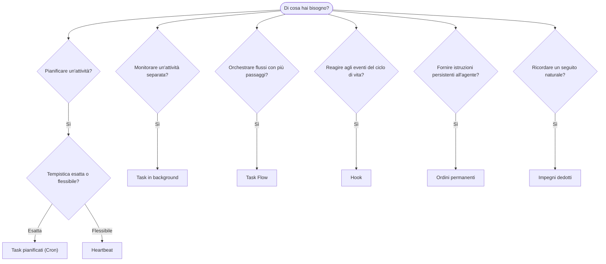

OpenClaw esegue attività in background tramite task, processi pianificati, impegni dedotti, hook di eventi e istruzioni permanenti. Usa questa pagina per scegliere il meccanismo corretto.

## Guida rapida alla scelta

| Caso d'uso                                      | Consigliato               | Motivo                                                       |
| ------------------------------------------------ | ------------------------- | ------------------------------------------------------------ |
| Inviare il rapporto giornaliero alle 9:00 precise | Task pianificati (Cron)   | Tempistica esatta, esecuzione isolata                        |
| Ricordarmelo tra 20 minuti                        | Task pianificati (Cron)   | Esecuzione singola con tempistica precisa (`--at`)            |
| Eseguire un'analisi approfondita settimanale      | Task pianificati (Cron)   | Task autonomo, può usare un modello diverso                  |
| Controllare la posta ogni 30 minuti               | Heartbeat                 | Raggruppato con altri controlli, tiene conto del contesto    |
| Monitorare il calendario per i prossimi eventi    | Heartbeat                 | Soluzione naturale per una consapevolezza periodica          |
| Verificare l'esito dopo un colloquio menzionato   | Impegni dedotti           | Seguito simile a un ricordo, senza richiesta di promemoria esatto |
| Controllo premuroso dopo il contesto dell'utente  | Impegni dedotti           | Limitato allo stesso agente e canale                         |
| Esaminare lo stato di un subagente o esecuzione ACP | Task in background      | Il registro dei task tiene traccia di tutte le attività separate |
| Verificare cosa è stato eseguito e quando         | Task in background        | `openclaw tasks list` e `openclaw tasks audit`               |
| Ricerca in più passaggi seguita da un riepilogo   | Task Flow                 | Orchestrazione durevole con tracciamento delle revisioni     |
| Eseguire uno script al ripristino della sessione  | Hook                      | Basato sugli eventi, si attiva sugli eventi del ciclo di vita |
| Eseguire codice a ogni chiamata di strumento      | Hook dei Plugin           | Gli hook nello stesso processo possono intercettare le chiamate agli strumenti |
| Verificare sempre la conformità prima di rispondere | Ordini permanenti       | Inseriti automaticamente in ogni sessione                    |

### Task pianificati (Cron) e Heartbeat a confronto

| Dimensione              | Task pianificati (Cron)               | Heartbeat                                      |
| ----------------------- | ------------------------------------- | ---------------------------------------------- |
| Tempistica              | Esatta (espressioni cron, esecuzione singola) | Approssimativa (predefinita ogni 30 minuti) |
| Contesto della sessione | Nuovo (isolato) o condiviso           | Contesto completo della sessione principale    |
| Registrazioni dei task  | Sempre create                         | Mai create                                     |
| Consegna                | Canale, webhook o nessuna             | Integrata nella sessione principale            |
| Ideale per              | Rapporti, promemoria, processi in background | Controlli della posta, calendario, notifiche |

Usa i Task pianificati (Cron) quando hai bisogno di una tempistica precisa o di un'esecuzione isolata. Usa Heartbeat quando l'attività trae vantaggio dal contesto completo della sessione e una tempistica approssimativa è accettabile.

## Concetti fondamentali

### Task pianificati (cron)

Cron è il pianificatore integrato del Gateway per una tempistica precisa. Rende persistenti i processi, attiva l'agente al momento giusto e può consegnare l'output a un canale di chat o a un endpoint webhook. Supporta promemoria con esecuzione singola, espressioni ricorrenti e attivazioni tramite webhook in ingresso.

Vedi [Task pianificati](/it/automation/cron-jobs).

### Task

Il registro dei task in background tiene traccia di tutte le attività separate: esecuzioni ACP, avvii di subagenti, esecuzioni cron isolate e operazioni CLI. I task sono registrazioni, non pianificatori. Usa `openclaw tasks list` e `openclaw tasks audit` per esaminarli.

Vedi [Task in background](/it/automation/tasks).

### Impegni dedotti

Gli impegni sono ricordi di follow-up facoltativi e di breve durata. OpenClaw li deduce
dalle normali conversazioni, li limita allo stesso agente e canale e
consegna tramite Heartbeat i controlli giunti a scadenza. I promemoria esatti richiesti dall'utente
restano di competenza di Cron.

Vedi [Impegni dedotti](/it/concepts/commitments).

### Task Flow

Task Flow è il livello di orchestrazione dei flussi sopra i task in background. Gestisce flussi durevoli in più passaggi con modalità di sincronizzazione gestita e speculare, tracciamento delle revisioni e `openclaw tasks flow list|show|cancel` per l'ispezione.

Vedi [Task Flow](/it/automation/taskflow).

### Ordini permanenti

Gli ordini permanenti conferiscono all'agente un'autorità operativa permanente per programmi definiti. Risiedono nei file dell'area di lavoro, in genere `AGENTS.md`, e vengono inseriti in ogni sessione. Combinali con Cron per l'applicazione basata sul tempo.

Vedi [Ordini permanenti](/it/automation/standing-orders).

### Hook

Gli hook interni sono script basati sugli eventi, attivati dagli eventi del ciclo di vita dell'agente
(`/new`, `/reset`, `/stop`), dalla Compaction della sessione, dall'avvio del Gateway e dal flusso
dei messaggi. Vengono individuati nelle directory degli hook e gestiti con
`openclaw hooks`. Per intercettare nello stesso processo le chiamate agli strumenti, usa gli
[hook dei Plugin](/it/plugins/hooks).

Vedi [Hook](/it/automation/hooks).

### Heartbeat

Heartbeat è un turno periodico della sessione principale, per impostazione predefinita ogni 30 minuti. Raggruppa più controlli, come posta, calendario e notifiche, in un singolo turno dell'agente con il contesto completo della sessione. I turni Heartbeat non creano registrazioni dei task e non prolungano la validità per il ripristino giornaliero o per inattività della sessione. Usa `HEARTBEAT.md` per un breve elenco di controllo oppure un blocco `tasks:` quando vuoi eseguire all'interno di Heartbeat solo i controlli periodici giunti a scadenza. I file Heartbeat vuoti vengono ignorati con `empty-heartbeat-file`; la modalità task solo a scadenza viene ignorata con `no-tasks-due`. Gli Heartbeat vengono rinviati mentre sono attive o in coda attività Cron e `heartbeat.skipWhenBusy` può inoltre rinviare un agente mentre sono occupate le corsie del subagente associate alla sessione dello stesso agente o quelle nidificate.

Vedi [Heartbeat](/it/gateway/heartbeat).

## Come interagiscono

- **Cron** gestisce le pianificazioni precise, come rapporti giornalieri e revisioni settimanali, e i promemoria con esecuzione singola. Tutte le esecuzioni Cron creano registrazioni dei task.
- **Heartbeat** gestisce il monitoraggio di routine, come posta, calendario e notifiche, in un singolo turno raggruppato ogni 30 minuti.
- Gli **hook** reagiscono a eventi specifici, come ripristini delle sessioni, Compaction e flusso dei messaggi, mediante script personalizzati. Gli hook dei Plugin gestiscono le chiamate agli strumenti.
- Gli **ordini permanenti** forniscono all'agente un contesto persistente e limiti di autorità.
- **Task Flow** coordina i flussi in più passaggi sopra i singoli task.
- I **task** tengono automaticamente traccia di tutte le attività separate, consentendoti di esaminarle e verificarle.

## Contenuti correlati

- [Task pianificati](/it/automation/cron-jobs) — pianificazione precisa e promemoria con esecuzione singola
- [Impegni dedotti](/it/concepts/commitments) — controlli di follow-up simili a ricordi
- [Task in background](/it/automation/tasks) — registro dei task per tutte le attività separate
- [Task Flow](/it/automation/taskflow) — orchestrazione durevole di flussi in più passaggi
- [Hook](/it/automation/hooks) — script del ciclo di vita basati sugli eventi
- [Hook dei Plugin](/it/plugins/hooks) — hook nello stesso processo per strumenti, prompt, messaggi e ciclo di vita
- [Ordini permanenti](/it/automation/standing-orders) — istruzioni persistenti per l'agente
- [Heartbeat](/it/gateway/heartbeat) — turni periodici della sessione principale
- [Riferimento della configurazione](/it/gateway/configuration-reference) — tutte le chiavi di configurazione
