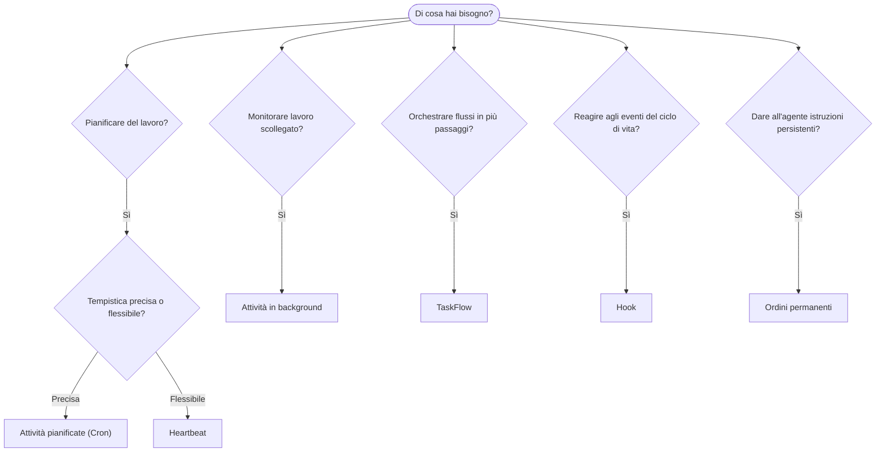

---
read_when:
    - Decidere come automatizzare il lavoro con OpenClaw
    - Scegliere tra Heartbeat, Cron, hook e ordini permanenti
    - Trovare il giusto punto di ingresso per l’automazione
summary: 'Panoramica dei meccanismi di automazione: attività, Cron, hook, ordini permanenti e TaskFlow'
title: Automazione e attività
x-i18n:
    generated_at: "2026-04-24T08:28:48Z"
    model: gpt-5.4
    provider: openai
    source_hash: 1b4615cc05a6d0ef7c92f44072d11a2541bc5e17b7acb88dc27ddf0c36b2dcab
    source_path: automation/index.md
    workflow: 15
---

OpenClaw esegue il lavoro in background tramite attività, lavori pianificati, hook e istruzioni permanenti. Questa pagina ti aiuta a scegliere il meccanismo giusto e a capire come si integrano tra loro.

## Guida rapida alla scelta

| Caso d’uso                                | Consigliato            | Perché                                           |
| ----------------------------------------- | ---------------------- | ------------------------------------------------ |
| Inviare un report giornaliero alle 9:00 precise | Attività pianificate (Cron) | Tempistica precisa, esecuzione isolata           |
| Ricordamelo tra 20 minuti                 | Attività pianificate (Cron) | Esecuzione singola con tempistica precisa (`--at`) |
| Eseguire un’analisi approfondita settimanale | Attività pianificate (Cron) | Attività autonoma, può usare un modello diverso  |
| Controllare la posta ogni 30 minuti       | Heartbeat              | Raggruppa con altri controlli, consapevole del contesto |
| Monitorare il calendario per eventi imminenti | Heartbeat              | Adattamento naturale per la consapevolezza periodica |
| Ispezionare lo stato di un subagente o di un’esecuzione ACP | Attività in background | Il registro delle attività tiene traccia di tutto il lavoro scollegato |
| Verificare cosa è stato eseguito e quando | Attività in background | `openclaw tasks list` e `openclaw tasks audit`   |
| Ricerca in più passaggi e poi riepilogo   | TaskFlow              | Orchestrazione durevole con tracciamento delle revisioni |
| Eseguire uno script al ripristino della sessione | Hook                  | Basato su eventi, si attiva sugli eventi del ciclo di vita |
| Eseguire codice a ogni chiamata di strumento | Hook                  | Gli hook possono filtrare per tipo di evento     |
| Verificare sempre la conformità prima di rispondere | Ordini permanenti     | Inseriti automaticamente in ogni sessione        |

### Attività pianificate (Cron) vs Heartbeat

| Dimensione      | Attività pianificate (Cron)         | Heartbeat                            |
| --------------- | ----------------------------------- | ------------------------------------ |
| Tempistica      | Precisa (espressioni cron, una tantum) | Approssimativa (predefinita ogni 30 min) |
| Contesto di sessione | Nuovo (isolato) o condiviso      | Contesto completo della sessione principale |
| Record attività | Sempre creati                       | Mai creati                           |
| Consegna        | Canale, Webhook o silenziosa        | Inline nella sessione principale     |
| Ideale per      | Report, promemoria, lavori in background | Controlli posta, calendario, notifiche |

Usa Attività pianificate (Cron) quando hai bisogno di una tempistica precisa o di un’esecuzione isolata. Usa Heartbeat quando il lavoro beneficia del contesto completo della sessione e una tempistica approssimativa va bene.

## Concetti di base

### Attività pianificate (cron)

Cron è il pianificatore integrato del Gateway per una tempistica precisa. Mantiene i lavori, riattiva l’agente al momento giusto e può consegnare l’output a un canale chat o a un endpoint Webhook. Supporta promemoria una tantum, espressioni ricorrenti e trigger Webhook in ingresso.

Vedi [Attività pianificate](/it/automation/cron-jobs).

### Attività

Il registro delle attività in background tiene traccia di tutto il lavoro scollegato: esecuzioni ACP, avvii di subagenti, esecuzioni cron isolate e operazioni CLI. Le attività sono record, non pianificatori. Usa `openclaw tasks list` e `openclaw tasks audit` per ispezionarle.

Vedi [Attività in background](/it/automation/tasks).

### Task Flow

TaskFlow è il substrato di orchestrazione dei flussi sopra le attività in background. Gestisce flussi durevoli in più passaggi con modalità di sincronizzazione gestite e mirror, tracciamento delle revisioni e `openclaw tasks flow list|show|cancel` per l’ispezione.

Vedi [Task Flow](/it/automation/taskflow).

### Ordini permanenti

Gli ordini permanenti concedono all’agente autorità operativa permanente per programmi definiti. Risiedono in file del workspace (tipicamente `AGENTS.md`) e vengono inseriti in ogni sessione. Combinali con cron per l’applicazione basata sul tempo.

Vedi [Ordini permanenti](/it/automation/standing-orders).

### Hook

Gli hook sono script basati su eventi attivati dagli eventi del ciclo di vita dell’agente (`/new`, `/reset`, `/stop`), dalla Compaction della sessione, dall’avvio del gateway, dal flusso dei messaggi e dalle chiamate agli strumenti. Gli hook vengono rilevati automaticamente dalle directory e possono essere gestiti con `openclaw hooks`.

Vedi [Hook](/it/automation/hooks).

### Heartbeat

Heartbeat è un turno periodico della sessione principale (predefinito ogni 30 minuti). Raggruppa più controlli (posta, calendario, notifiche) in un unico turno dell’agente con il contesto completo della sessione. I turni Heartbeat non creano record attività. Usa `HEARTBEAT.md` per una piccola checklist, oppure un blocco `tasks:` quando vuoi controlli periodici solo alla scadenza all’interno di Heartbeat stesso. I file heartbeat vuoti vengono saltati come `empty-heartbeat-file`; la modalità attività solo alla scadenza viene saltata come `no-tasks-due`.

Vedi [Heartbeat](/it/gateway/heartbeat).

## Come lavorano insieme

- **Cron** gestisce pianificazioni precise (report giornalieri, revisioni settimanali) e promemoria una tantum. Tutte le esecuzioni cron creano record attività.
- **Heartbeat** gestisce il monitoraggio di routine (posta, calendario, notifiche) in un unico turno raggruppato ogni 30 minuti.
- **Hook** reagiscono a eventi specifici (chiamate agli strumenti, ripristini di sessione, Compaction) con script personalizzati.
- **Ordini permanenti** forniscono all’agente contesto persistente e limiti di autorità.
- **Task Flow** coordina flussi in più passaggi sopra le singole attività.
- **Attività** tengono automaticamente traccia di tutto il lavoro scollegato così puoi ispezionarlo e verificarlo.

## Correlati

- [Attività pianificate](/it/automation/cron-jobs) — pianificazione precisa e promemoria una tantum
- [Attività in background](/it/automation/tasks) — registro delle attività per tutto il lavoro scollegato
- [Task Flow](/it/automation/taskflow) — orchestrazione durevole di flussi in più passaggi
- [Hook](/it/automation/hooks) — script del ciclo di vita basati su eventi
- [Ordini permanenti](/it/automation/standing-orders) — istruzioni persistenti per l’agente
- [Heartbeat](/it/gateway/heartbeat) — turni periodici della sessione principale
- [Riferimento della configurazione](/it/gateway/configuration-reference) — tutte le chiavi di configurazione
