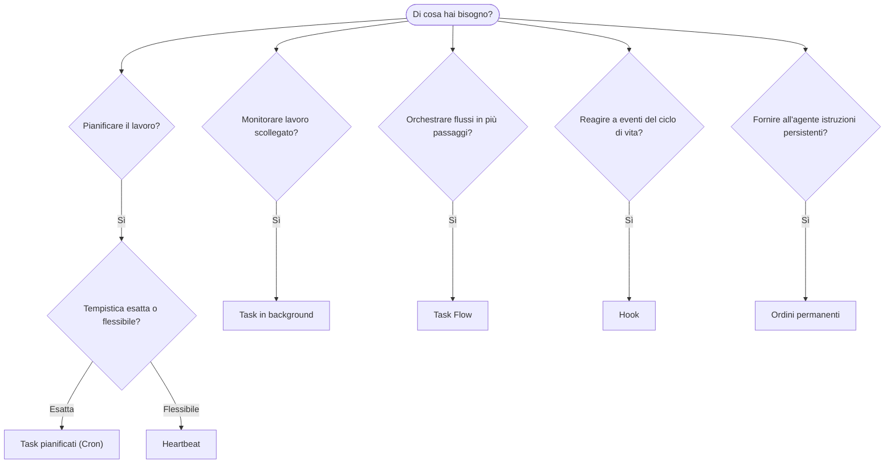

---
read_when:
    - Decidere come automatizzare il lavoro con OpenClaw
    - Scegliere tra heartbeat, cron, hook e ordini permanenti
    - Cercare il punto di ingresso giusto per l'automazione
summary: 'Panoramica dei meccanismi di automazione: task, cron, hook, ordini permanenti e Task Flow'
title: Automazione e task
x-i18n:
    generated_at: "2026-04-05T13:42:01Z"
    model: gpt-5.4
    provider: openai
    source_hash: 13cd05dcd2f38737f7bb19243ad1136978bfd727006fd65226daa3590f823afe
    source_path: automation/index.md
    workflow: 15
---

# Automazione e task

OpenClaw esegue il lavoro in background tramite task, processi pianificati, hook di eventi e istruzioni permanenti. Questa pagina ti aiuta a scegliere il meccanismo giusto e a capire come si integrano tra loro.

## Guida rapida alle decisioni

| Caso d'uso                              | Consigliato            | Perché                                           |
| --------------------------------------- | ---------------------- | ------------------------------------------------ |
| Inviare un report giornaliero alle 9:00 precise | Task pianificati (Cron) | Tempistica esatta, esecuzione isolata            |
| Ricordamelo tra 20 minuti               | Task pianificati (Cron) | Esecuzione singola con tempistica precisa (`--at`) |
| Eseguire un'analisi approfondita settimanale | Task pianificati (Cron) | Task autonomo, può usare un modello diverso      |
| Controllare la posta in arrivo ogni 30 min | Heartbeat              | Raggruppa con altri controlli, consapevole del contesto |
| Monitorare il calendario per eventi imminenti | Heartbeat              | Scelta naturale per una consapevolezza periodica |
| Ispezionare lo stato di un subagente o di un'esecuzione ACP | Task in background       | Il registro dei task tiene traccia di tutto il lavoro scollegato |
| Verificare cosa è stato eseguito e quando | Task in background       | `openclaw tasks list` e `openclaw tasks audit` |
| Ricerca in più passaggi e poi riepilogo | Task Flow              | Orchestrazione duratura con tracciamento delle revisioni |
| Eseguire uno script al reset della sessione | Hook                  | Basato su eventi, si attiva sugli eventi del ciclo di vita |
| Eseguire codice a ogni chiamata di tool | Hook                  | Gli hook possono filtrare per tipo di evento     |
| Controllare sempre la conformità prima di rispondere | Ordini permanenti        | Iniettati automaticamente in ogni sessione       |

### Task pianificati (Cron) vs Heartbeat

| Dimensione      | Task pianificati (Cron)             | Heartbeat                             |
| --------------- | ----------------------------------- | ------------------------------------- |
| Tempistica      | Esatta (espressioni cron, esecuzione singola) | Approssimativa (predefinita ogni 30 min) |
| Contesto sessione | Nuovo (isolato) o condiviso        | Contesto completo della sessione principale |
| Record dei task | Sempre creati                       | Mai creati                            |
| Consegna        | Canale, webhook o silenziosa        | Inline nella sessione principale      |
| Ideale per      | Report, promemoria, processi in background | Controlli della posta, calendario, notifiche |

Usa i Task pianificati (Cron) quando hai bisogno di una tempistica precisa o di un'esecuzione isolata. Usa Heartbeat quando il lavoro beneficia del contesto completo della sessione e una tempistica approssimativa va bene.

## Concetti fondamentali

### Task pianificati (cron)

Cron è lo scheduler integrato del Gateway per una tempistica precisa. Mantiene i processi, riattiva l'agente al momento giusto e può consegnare l'output a un canale chat o a un endpoint webhook. Supporta promemoria monouso, espressioni ricorrenti e trigger webhook in ingresso.

Vedi [Task pianificati](/automation/cron-jobs).

### Task

Il registro dei task in background tiene traccia di tutto il lavoro scollegato: esecuzioni ACP, avvii di subagenti, esecuzioni cron isolate e operazioni CLI. I task sono record, non scheduler. Usa `openclaw tasks list` e `openclaw tasks audit` per ispezionarli.

Vedi [Task in background](/automation/tasks).

### Task Flow

Task Flow è il substrato di orchestrazione dei flussi sopra i task in background. Gestisce flussi duraturi in più passaggi con modalità di sincronizzazione gestite e replicate, tracciamento delle revisioni e `openclaw tasks flow list|show|cancel` per l'ispezione.

Vedi [Task Flow](/automation/taskflow).

### Ordini permanenti

Gli ordini permanenti concedono all'agente un'autorità operativa permanente per programmi definiti. Risiedono nei file dell'area di lavoro (tipicamente `AGENTS.md`) e vengono iniettati in ogni sessione. Combinali con cron per l'applicazione basata sul tempo.

Vedi [Ordini permanenti](/automation/standing-orders).

### Hook

Gli hook sono script basati su eventi attivati da eventi del ciclo di vita dell'agente (`/new`, `/reset`, `/stop`), compattazione della sessione, avvio del gateway, flusso dei messaggi e chiamate ai tool. Gli hook vengono rilevati automaticamente dalle directory e possono essere gestiti con `openclaw hooks`.

Vedi [Hook](/automation/hooks).

### Heartbeat

Heartbeat è un turno periodico della sessione principale (predefinito ogni 30 minuti). Raggruppa più controlli (posta in arrivo, calendario, notifiche) in un unico turno dell'agente con il contesto completo della sessione. I turni Heartbeat non creano record di task. Usa `HEARTBEAT.md` per una piccola checklist, oppure un blocco `tasks:` quando vuoi controlli periodici solo-se-dovuti all'interno di heartbeat stesso. I file heartbeat vuoti vengono saltati come `empty-heartbeat-file`; la modalità task solo-se-dovuti viene saltata come `no-tasks-due`.

Vedi [Heartbeat](/gateway/heartbeat).

## Come lavorano insieme

- **Cron** gestisce pianificazioni precise (report giornalieri, revisioni settimanali) e promemoria monouso. Tutte le esecuzioni cron creano record di task.
- **Heartbeat** gestisce il monitoraggio di routine (posta in arrivo, calendario, notifiche) in un unico turno raggruppato ogni 30 minuti.
- **Hook** reagiscono a eventi specifici (chiamate ai tool, reset della sessione, compattazione) con script personalizzati.
- **Ordini permanenti** forniscono all'agente contesto persistente e limiti di autorità.
- **Task Flow** coordina flussi in più passaggi sopra i singoli task.
- **Task** tengono automaticamente traccia di tutto il lavoro scollegato, così puoi ispezionarlo e verificarlo.

## Correlati

- [Task pianificati](/automation/cron-jobs) — pianificazione precisa e promemoria monouso
- [Task in background](/automation/tasks) — registro dei task per tutto il lavoro scollegato
- [Task Flow](/automation/taskflow) — orchestrazione duratura di flussi in più passaggi
- [Hook](/automation/hooks) — script del ciclo di vita basati su eventi
- [Ordini permanenti](/automation/standing-orders) — istruzioni persistenti per l'agente
- [Heartbeat](/gateway/heartbeat) — turni periodici della sessione principale
- [Riferimento configurazione](/gateway/configuration-reference) — tutte le chiavi di configurazione
