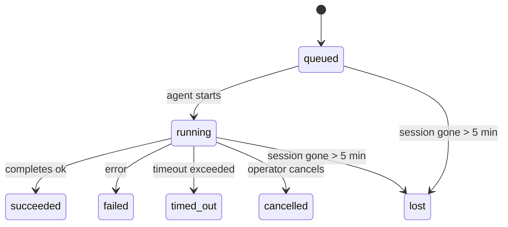

---
read_when:
    - Ispezione delle attività in background in corso o completate di recente
    - Debug degli errori di recapito per esecuzioni di agenti scollegate
    - Comprendere il rapporto tra le esecuzioni in background, le sessioni, Cron e Heartbeat
sidebarTitle: Background tasks
summary: Tracciamento delle attività in background per le esecuzioni ACP, i sottoagenti, i job Cron isolati e le operazioni CLI
title: Attività in background
x-i18n:
    generated_at: "2026-05-05T01:44:30Z"
    model: gpt-5.5
    provider: openai
    source_hash: 60d6ea6178535b19b95d761b8e8b05a665234584ae69852fd21097988aa32991
    source_path: automation/tasks.md
    workflow: 16
---

<Note>
Cerchi la pianificazione? Consulta [Automazione e attività](/it/automation) per scegliere il meccanismo giusto. Questa pagina è il registro delle attività per il lavoro in background, non lo scheduler.
</Note>

Le attività in background tracciano il lavoro che viene eseguito **al di fuori della tua sessione di conversazione principale**: esecuzioni ACP, avvii di subagent, esecuzioni isolate di Cron job e operazioni avviate dalla CLI.

Le attività **non** sostituiscono sessioni, Cron job o Heartbeat: sono il **registro delle attività** che registra quale lavoro separato è avvenuto, quando e se è riuscito.

<Note>
Non ogni esecuzione dell'agente crea un'attività. I turni Heartbeat e la normale chat interattiva non lo fanno. Tutte le esecuzioni Cron, gli avvii ACP, gli avvii di subagent e i comandi agente della CLI lo fanno.
</Note>

## In breve

- Le attività sono **record**, non scheduler: Cron e Heartbeat decidono _quando_ viene eseguito il lavoro, le attività tracciano _che cosa è successo_.
- ACP, subagent, tutti i Cron job e le operazioni CLI creano attività. I turni Heartbeat no.
- Ogni attività passa attraverso `queued → running → terminal` (succeeded, failed, timed_out, cancelled o lost).
- Le attività Cron restano attive finché il runtime Cron possiede ancora il job; se lo stato runtime in memoria è scomparso, la manutenzione delle attività controlla prima la cronologia durevole delle esecuzioni Cron prima di contrassegnare un'attività come persa.
- Il completamento è guidato da push: il lavoro separato può notificare direttamente o risvegliare la sessione/Heartbeat del richiedente quando termina, quindi i cicli di polling dello stato sono di solito la forma sbagliata.
- Le esecuzioni Cron isolate e i completamenti dei subagent tentano, al meglio, di ripulire schede/processi del browser tracciati per la loro sessione figlia prima della contabilità finale di pulizia.
- La consegna Cron isolata sopprime le risposte intermedie obsolete del genitore mentre il lavoro dei subagent discendenti è ancora in svuotamento, e preferisce l'output finale del discendente quando arriva prima della consegna.
- Le notifiche di completamento vengono consegnate direttamente a un canale o messe in coda per il prossimo Heartbeat.
- `openclaw tasks list` mostra tutte le attività; `openclaw tasks audit` evidenzia i problemi.
- I record terminali vengono conservati per 7 giorni, poi eliminati automaticamente.

## Avvio rapido

<Tabs>
  <Tab title="List and filter">
    ```bash
    # List all tasks (newest first)
    openclaw tasks list

    # Filter by runtime or status
    openclaw tasks list --runtime acp
    openclaw tasks list --status running
    ```

  </Tab>
  <Tab title="Inspect">
    ```bash
    # Show details for a specific task (by ID, run ID, or session key)
    openclaw tasks show <lookup>
    ```
  </Tab>
  <Tab title="Cancel and notify">
    ```bash
    # Cancel a running task (kills the child session)
    openclaw tasks cancel <lookup>

    # Change notification policy for a task
    openclaw tasks notify <lookup> state_changes
    ```

  </Tab>
  <Tab title="Audit and maintenance">
    ```bash
    # Run a health audit
    openclaw tasks audit

    # Preview or apply maintenance
    openclaw tasks maintenance
    openclaw tasks maintenance --apply
    ```

  </Tab>
  <Tab title="Task flow">
    ```bash
    # Inspect TaskFlow state
    openclaw tasks flow list
    openclaw tasks flow show <lookup>
    openclaw tasks flow cancel <lookup>
    ```
  </Tab>
</Tabs>

## Che cosa crea un'attività

| Origine                | Tipo di runtime | Quando viene creato un record attività                 | Criterio di notifica predefinito |
| ---------------------- | ------------ | ------------------------------------------------------ | --------------------- |
| Esecuzioni ACP in background | `acp`        | Avvio di una sessione ACP figlia                       | `done_only`           |
| Orchestrazione subagent | `subagent`   | Avvio di un subagent tramite `sessions_spawn`          | `done_only`           |
| Cron job (tutti i tipi) | `cron`       | Ogni esecuzione Cron (sessione principale e isolata)   | `silent`              |
| Operazioni CLI         | `cli`        | Comandi `openclaw agent` eseguiti tramite il Gateway   | `silent`              |
| Job multimediali dell'agente | `cli`        | Esecuzioni `music_generate`/`video_generate` supportate da sessione | `silent`              |

<AccordionGroup>
  <Accordion title="Notify defaults for cron and media">
    Le attività Cron della sessione principale usano per impostazione predefinita il criterio di notifica `silent`: creano record per il tracciamento ma non generano notifiche. Anche le attività Cron isolate hanno `silent` come valore predefinito, ma sono più visibili perché vengono eseguite nella propria sessione.

    Anche le esecuzioni `music_generate` e `video_generate` supportate da sessione usano il criterio di notifica `silent`. Creano comunque record attività, ma il completamento viene restituito alla sessione agente originale come risveglio interno, così l'agente può scrivere il messaggio di follow-up e allegare autonomamente il contenuto multimediale completato. I completamenti di gruppo/canale seguono il normale criterio di risposta visibile, quindi l'agente usa lo strumento messaggi quando la consegna di origine lo richiede.

  </Accordion>
  <Accordion title="Concurrent video_generate guardrail">
    Mentre un'attività `video_generate` supportata da sessione è ancora attiva, lo strumento agisce anche come guardrail: chiamate `video_generate` ripetute nella stessa sessione restituiscono lo stato dell'attività attiva invece di avviare una seconda generazione concorrente. Usa `action: "status"` quando vuoi una consultazione esplicita di avanzamento/stato dal lato agente.
  </Accordion>
  <Accordion title="What does not create tasks">
    - Turni Heartbeat: sessione principale; consulta [Heartbeat](/it/gateway/heartbeat)
    - Normali turni di chat interattiva
    - Risposte dirette `/command`

  </Accordion>
</AccordionGroup>

## Ciclo di vita dell'attività



| Stato       | Che cosa significa                                                        |
| ----------- | -------------------------------------------------------------------------- |
| `queued`    | Creata, in attesa che l'agente si avvii                                    |
| `running`   | Il turno dell'agente è in esecuzione attiva                                |
| `succeeded` | Completata correttamente                                                   |
| `failed`    | Completata con un errore                                                   |
| `timed_out` | Ha superato il timeout configurato                                         |
| `cancelled` | Fermata dall'operatore tramite `openclaw tasks cancel`                     |
| `lost`      | Il runtime ha perso lo stato di supporto autorevole dopo un periodo di tolleranza di 5 minuti |

Le transizioni avvengono automaticamente: quando l'esecuzione agente associata termina, lo stato dell'attività viene aggiornato in modo corrispondente.

Il completamento dell'esecuzione agente è autorevole per i record attività attivi. Un'esecuzione separata riuscita viene finalizzata come `succeeded`, gli errori ordinari di esecuzione vengono finalizzati come `failed` e gli esiti di timeout o interruzione vengono finalizzati come `timed_out`. Se un operatore ha già annullato l'attività, o il runtime ha già registrato uno stato terminale più forte come `failed`, `timed_out` o `lost`, un segnale di successo successivo non declassa quello stato terminale.

`lost` è consapevole del runtime:

- Attività ACP: i metadati della sessione ACP figlia di supporto sono scomparsi.
- Attività subagent: la sessione figlia di supporto è scomparsa dallo store dell'agente di destinazione.
- Attività Cron: il runtime Cron non traccia più il job come attivo e la cronologia durevole delle esecuzioni Cron non mostra un risultato terminale per quell'esecuzione. L'audit CLI offline non considera autorevole il proprio stato runtime Cron in-process vuoto.
- Attività CLI: le attività con sessione figlia isolata usano la sessione figlia; le attività CLI supportate da chat usano invece il contesto di esecuzione live, quindi righe di sessione canale/gruppo/diretta persistenti non le mantengono vive. Anche le esecuzioni `openclaw agent` supportate dal Gateway vengono finalizzate dal loro risultato di esecuzione, quindi le esecuzioni completate non restano attive finché lo sweeper le contrassegna come `lost`.

## Consegna e notifiche

Quando un'attività raggiunge uno stato terminale, OpenClaw ti notifica. Esistono due percorsi di consegna:

**Consegna diretta**: se l'attività ha un target di canale (il `requesterOrigin`), il messaggio di completamento va direttamente a quel canale (Telegram, Discord, Slack, ecc.). Per i completamenti dei subagent, OpenClaw conserva anche il routing del thread/topic associato quando disponibile e può riempire un `to` / account mancante dalla route memorizzata della sessione richiedente (`lastChannel` / `lastTo` / `lastAccountId`) prima di rinunciare alla consegna diretta.

**Consegna in coda di sessione**: se la consegna diretta fallisce o non è impostata alcuna origine, l'aggiornamento viene messo in coda come evento di sistema nella sessione del richiedente ed emerge al prossimo Heartbeat.

<Tip>
Il completamento dell'attività attiva un risveglio Heartbeat immediato, così vedi rapidamente il risultato: non devi aspettare il prossimo tick Heartbeat pianificato.
</Tip>

Questo significa che il flusso di lavoro abituale è basato su push: avvia il lavoro separato una volta, poi lascia che il runtime ti risvegli o ti notifichi al completamento. Esegui il polling dello stato dell'attività solo quando ti serve debug, intervento o un audit esplicito.

### Criteri di notifica

Controlla quanto vuoi ricevere su ogni attività:

| Criterio              | Che cosa viene consegnato                                                |
| --------------------- | ----------------------------------------------------------------------- |
| `done_only` (predefinito) | Solo stato terminale (succeeded, failed, ecc.): **questo è il valore predefinito** |
| `state_changes`       | Ogni transizione di stato e aggiornamento di avanzamento                 |
| `silent`              | Nulla                                                                   |

Cambia il criterio mentre un'attività è in esecuzione:

```bash
openclaw tasks notify <lookup> state_changes
```

## Riferimento CLI

<AccordionGroup>
  <Accordion title="tasks list">
    ```bash
    openclaw tasks list [--runtime <acp|subagent|cron|cli>] [--status <status>] [--json]
    ```

    Colonne di output: ID attività, tipo, stato, consegna, ID esecuzione, sessione figlia, riepilogo.

  </Accordion>
  <Accordion title="tasks show">
    ```bash
    openclaw tasks show <lookup>
    ```

    Il token di ricerca accetta un ID attività, ID esecuzione o chiave di sessione. Mostra il record completo, inclusi tempi, stato della consegna, errore e riepilogo terminale.

  </Accordion>
  <Accordion title="tasks cancel">
    ```bash
    openclaw tasks cancel <lookup>
    ```

    Per le attività ACP e subagent, questo termina la sessione figlia. Per le attività tracciate dalla CLI, l'annullamento viene registrato nel registro attività (non esiste un handle runtime figlio separato). Lo stato passa a `cancelled` e viene inviata una notifica di consegna quando applicabile.

  </Accordion>
  <Accordion title="tasks notify">
    ```bash
    openclaw tasks notify <lookup> <done_only|state_changes|silent>
    ```
  </Accordion>
  <Accordion title="tasks audit">
    ```bash
    openclaw tasks audit [--json]
    ```

    Evidenzia problemi operativi. I risultati appaiono anche in `openclaw status` quando vengono rilevati problemi.

    | Riscontro                | Gravità    | Attivazione                                                                                                              |
    | ------------------------- | ---------- | ------------------------------------------------------------------------------------------------------------------------ |
    | `stale_queued`            | warn       | In coda da più di 10 minuti                                                                                              |
    | `stale_running`           | error      | In esecuzione da più di 30 minuti                                                                                        |
    | `lost`                    | warn/error | La proprietà dell'attività supportata dal runtime è scomparsa; le attività perse mantenute avvisano fino a `cleanupAfter`, poi diventano errori |
    | `delivery_failed`         | warn       | La consegna non è riuscita e la policy di notifica non è `silent`                                                        |
    | `missing_cleanup`         | warn       | Attività terminale senza timestamp di pulizia                                                                            |
    | `inconsistent_timestamps` | warn       | Violazione della timeline (per esempio terminata prima dell'avvio)                                                       |

  </Accordion>
  <Accordion title="tasks maintenance">
    ```bash
    openclaw tasks maintenance [--json]
    openclaw tasks maintenance --apply [--json]
    ```

    Usalo per visualizzare in anteprima o applicare riconciliazione, marcatura di pulizia e pruning per le attività e lo stato di Task Flow.

    La riconciliazione è consapevole del runtime:

    - Le attività ACP/subagent controllano la sessione figlia sottostante.
    - Le attività subagent la cui sessione figlia ha una tombstone di recupero dopo riavvio vengono contrassegnate come perse invece di essere trattate come sessioni sottostanti recuperabili.
    - Le attività Cron controllano se il runtime cron possiede ancora il job, poi recuperano lo stato terminale dai log di esecuzione cron persistenti/dallo stato del job prima di ripiegare su `lost`. Solo il processo Gateway è autorevole per il set in memoria dei job cron attivi; l'audit CLI offline usa la cronologia durevole ma non contrassegna un'attività cron come persa solo perché quel Set locale è vuoto.
    - Le attività CLI supportate da chat controllano il contesto di esecuzione live proprietario, non solo la riga della sessione chat.

    Anche la pulizia al completamento è consapevole del runtime:

    - Il completamento del subagent chiude con il miglior impegno schede del browser/processi tracciati per la sessione figlia prima che la pulizia dell'annuncio continui.
    - Il completamento cron isolato chiude con il miglior impegno schede del browser/processi tracciati per la sessione cron prima che l'esecuzione venga completamente smantellata.
    - La consegna cron isolata attende, quando necessario, il follow-up dei subagent discendenti e sopprime il testo obsoleto di riconoscimento del genitore invece di annunciarlo.
    - La consegna del completamento del subagent preferisce l'ultimo testo assistant visibile; se è vuoto ripiega sull'ultimo testo tool/toolResult sanificato, e le esecuzioni di chiamate tool solo con timeout possono ridursi a un breve riepilogo di avanzamento parziale. Le esecuzioni terminali non riuscite annunciano lo stato di errore senza riprodurre il testo di risposta acquisito.
    - Gli errori di pulizia non mascherano il reale risultato dell'attività.

  </Accordion>
  <Accordion title="tasks flow list | show | cancel">
    ```bash
    openclaw tasks flow list [--status <status>] [--json]
    openclaw tasks flow show <lookup> [--json]
    openclaw tasks flow cancel <lookup>
    ```

    Usali quando ciò che ti interessa è il Task Flow di orchestrazione, anziché un singolo record di attività in background.

  </Accordion>
</AccordionGroup>

## Bacheca attività chat (`/tasks`)

Usa `/tasks` in qualsiasi sessione chat per vedere le attività in background collegate a quella sessione. La bacheca mostra attività attive e completate di recente con runtime, stato, tempi e dettagli di avanzamento o errore.

Quando la sessione corrente non ha attività collegate visibili, `/tasks` ripiega sui conteggi delle attività locali dell'agente, così ottieni comunque una panoramica senza esporre dettagli di altre sessioni.

Per il registro operatore completo, usa la CLI: `openclaw tasks list`.

## Integrazione dello stato (pressione delle attività)

`openclaw status` include un riepilogo immediato delle attività:

```
Tasks: 3 queued · 2 running · 1 issues
```

Il riepilogo riporta:

- **active** — conteggio di `queued` + `running`
- **failures** — conteggio di `failed` + `timed_out` + `lost`
- **byRuntime** — suddivisione per `acp`, `subagent`, `cron`, `cli`

Sia `/status` sia il tool `session_status` usano uno snapshot delle attività consapevole della pulizia: le attività attive hanno priorità, le righe completate obsolete sono nascoste e gli errori recenti emergono solo quando non resta lavoro attivo. Questo mantiene la scheda di stato focalizzata su ciò che conta in questo momento.

## Archiviazione e manutenzione

### Dove si trovano le attività

I record delle attività persistono in SQLite in:

```
$OPENCLAW_STATE_DIR/tasks/runs.sqlite
```

Il registro viene caricato in memoria all'avvio del Gateway e sincronizza le scritture su SQLite per la durabilità tra i riavvii.
Il Gateway mantiene limitato il log write-ahead di SQLite usando la soglia predefinita di autocheckpoint di SQLite più checkpoint `TRUNCATE` periodici e allo spegnimento.

### Manutenzione automatica

Uno sweeper viene eseguito ogni **60 secondi** e gestisce quattro cose:

<Steps>
  <Step title="Reconciliation">
    Controlla se le attività attive hanno ancora un supporto runtime autorevole. Le attività ACP/subagent usano lo stato della sessione figlia, le attività cron usano la proprietà dei job attivi e le attività CLI supportate da chat usano il contesto di esecuzione proprietario. Se quello stato sottostante manca da più di 5 minuti, l'attività viene contrassegnata come `lost`.
  </Step>
  <Step title="ACP session repair">
    Chiude le sessioni ACP one-shot terminali o orfane possedute dal genitore e chiude le sessioni ACP persistenti terminali obsolete o orfane solo quando non rimane alcun binding di conversazione attivo.
  </Step>
  <Step title="Cleanup stamping">
    Imposta un timestamp `cleanupAfter` sulle attività terminali (endedAt + 7 giorni). Durante la conservazione, le attività perse appaiono ancora nell'audit come avvisi; dopo la scadenza di `cleanupAfter` o quando i metadati di pulizia mancano, sono errori.
  </Step>
  <Step title="Pruning">
    Elimina i record oltre la loro data `cleanupAfter`.
  </Step>
</Steps>

<Note>
**Conservazione:** i record delle attività terminali sono mantenuti per **7 giorni**, poi vengono eliminati automaticamente. Non serve alcuna configurazione.
</Note>

## Come le attività si collegano ad altri sistemi

<AccordionGroup>
  <Accordion title="Tasks and Task Flow">
    [Task Flow](/it/automation/taskflow) è il livello di orchestrazione dei flussi sopra le attività in background. Un singolo flusso può coordinare più attività durante il suo ciclo di vita usando modalità sync gestite o mirror. Usa `openclaw tasks` per ispezionare i singoli record di attività e `openclaw tasks flow` per ispezionare il flusso di orchestrazione.

    Vedi [Task Flow](/it/automation/taskflow) per i dettagli.

  </Accordion>
  <Accordion title="Tasks and cron">
    Una **definizione** di job cron si trova in `~/.openclaw/cron/jobs.json`; lo stato di esecuzione runtime si trova accanto, in `~/.openclaw/cron/jobs-state.json`. **Ogni** esecuzione cron crea un record di attività, sia in sessione principale sia isolata. Le attività cron della sessione principale usano per impostazione predefinita la policy di notifica `silent`, quindi vengono tracciate senza generare notifiche.

    Vedi [Cron Jobs](/it/automation/cron-jobs).

  </Accordion>
  <Accordion title="Tasks and heartbeat">
    Le esecuzioni Heartbeat sono turni della sessione principale: non creano record di attività. Quando un'attività si completa, può attivare un risveglio heartbeat così vedi subito il risultato.

    Vedi [Heartbeat](/it/gateway/heartbeat).

  </Accordion>
  <Accordion title="Tasks and sessions">
    Un'attività può fare riferimento a un `childSessionKey` (dove viene eseguito il lavoro) e a un `requesterSessionKey` (chi l'ha avviata). Le sessioni sono contesto di conversazione; le attività sono tracciamento dell'attività sopra di esso.
  </Accordion>
  <Accordion title="Tasks and agent runs">
    Il `runId` di un'attività collega l'esecuzione dell'agente che svolge il lavoro. Gli eventi del ciclo di vita dell'agente (avvio, fine, errore) aggiornano automaticamente lo stato dell'attività: non devi gestire manualmente il ciclo di vita.
  </Accordion>
</AccordionGroup>

## Correlati

- [Automazione e attività](/it/automation) — tutti i meccanismi di automazione in sintesi
- [CLI: attività](/it/cli/tasks) — riferimento dei comandi CLI
- [Heartbeat](/it/gateway/heartbeat) — turni periodici della sessione principale
- [Attività pianificate](/it/automation/cron-jobs) — pianificazione del lavoro in background
- [Task Flow](/it/automation/taskflow) — orchestrazione dei flussi sopra le attività
