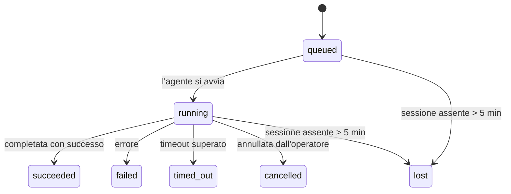

---
read_when:
    - Ispezione del lavoro in background in corso o completato di recente
    - Debug degli errori di consegna per esecuzioni di agenti scollegate
    - Comprensione di come le esecuzioni in background si relazionano a sessioni, cron e heartbeat
summary: Monitoraggio delle attività in background per esecuzioni ACP, subagenti, processi cron isolati e operazioni CLI
title: Attività in background
x-i18n:
    generated_at: "2026-04-05T13:42:30Z"
    model: gpt-5.4
    provider: openai
    source_hash: 6c95ccf4388d07e60a7bb68746b161793f4bb5ff2ba3d5ce9e51f2225dab2c4d
    source_path: automation/tasks.md
    workflow: 15
---

# Attività in background

> **Cerchi la pianificazione?** Consulta [Automation & Tasks](/automation) per scegliere il meccanismo giusto. Questa pagina descrive il **monitoraggio** del lavoro in background, non la sua pianificazione.

Le attività in background tracciano il lavoro che viene eseguito **al di fuori della sessione principale della conversazione**:
esecuzioni ACP, avvii di subagenti, esecuzioni isolate di processi cron e operazioni avviate dalla CLI.

Le attività **non** sostituiscono sessioni, processi cron o heartbeat: sono il **registro delle attività** che documenta quale lavoro scollegato è avvenuto, quando e se è andato a buon fine.

<Note>
Non tutte le esecuzioni degli agenti creano un'attività. I turni heartbeat e la normale chat interattiva non lo fanno. Tutte le esecuzioni cron, gli avvii ACP, gli avvii di subagenti e i comandi dell'agente dalla CLI lo fanno.
</Note>

## In breve

- Le attività sono **record**, non strumenti di pianificazione: cron e heartbeat decidono _quando_ viene eseguito il lavoro, le attività tracciano _cosa è successo_.
- ACP, subagenti, tutti i processi cron e le operazioni CLI creano attività. I turni heartbeat no.
- Ogni attività passa attraverso `queued → running → terminal` (`succeeded`, `failed`, `timed_out`, `cancelled` o `lost`).
- Le attività cron restano attive finché il runtime cron possiede ancora il processo; le attività CLI basate sulla chat restano attive solo finché il contesto di esecuzione proprietario è ancora attivo.
- Il completamento è guidato da push: il lavoro scollegato può notificare direttamente o riattivare la sessione richiedente/heartbeat quando termina, quindi i loop di polling dello stato di solito non sono l'approccio corretto.
- Le esecuzioni cron isolate e i completamenti dei subagenti ripuliscono, per quanto possibile, le schede/processi del browser tracciati per la loro sessione figlia prima della pulizia finale.
- La consegna cron isolata sopprime le risposte intermedie obsolete del padre mentre il lavoro dei subagenti discendenti è ancora in fase di completamento, e preferisce l'output finale del discendente quando arriva prima della consegna.
- Le notifiche di completamento vengono recapitate direttamente a un canale o accodate per il successivo heartbeat.
- `openclaw tasks list` mostra tutte le attività; `openclaw tasks audit` evidenzia i problemi.
- I record terminali vengono conservati per 7 giorni, poi eliminati automaticamente.

## Avvio rapido

```bash
# Elenca tutte le attività (prima le più recenti)
openclaw tasks list

# Filtra per runtime o stato
openclaw tasks list --runtime acp
openclaw tasks list --status running

# Mostra i dettagli di un'attività specifica (per ID, ID esecuzione o chiave sessione)
openclaw tasks show <lookup>

# Annulla un'attività in esecuzione (termina la sessione figlia)
openclaw tasks cancel <lookup>

# Modifica il criterio di notifica per un'attività
openclaw tasks notify <lookup> state_changes

# Esegui un controllo di integrità
openclaw tasks audit

# Anteprima o applicazione della manutenzione
openclaw tasks maintenance
openclaw tasks maintenance --apply

# Ispeziona lo stato di TaskFlow
openclaw tasks flow list
openclaw tasks flow show <lookup>
openclaw tasks flow cancel <lookup>
```

## Cosa crea un'attività

| Origine                | Tipo di runtime | Quando viene creato un record attività                 | Criterio di notifica predefinito |
| ---------------------- | --------------- | ------------------------------------------------------ | -------------------------------- |
| Esecuzioni ACP in background | `acp`        | Avvio di una sessione figlia ACP                       | `done_only`                      |
| Orchestrazione subagenti | `subagent`   | Avvio di un subagente tramite `sessions_spawn`         | `done_only`                      |
| Processi cron (tutti i tipi) | `cron`    | Ogni esecuzione cron (sessione principale e isolata)   | `silent`                         |
| Operazioni CLI         | `cli`           | Comandi `openclaw agent` eseguiti tramite il gateway   | `silent`                         |

Le attività cron della sessione principale usano per impostazione predefinita il criterio di notifica `silent`: creano record per il monitoraggio ma non generano notifiche. Anche le attività cron isolate usano per impostazione predefinita `silent`, ma sono più visibili perché vengono eseguite nella propria sessione.

**Cosa non crea attività:**

- Turni heartbeat — sessione principale; vedi [Heartbeat](/gateway/heartbeat)
- Normali turni di chat interattiva
- Risposte dirette `/command`

## Ciclo di vita dell'attività



| Stato       | Significato                                                                |
| ----------- | -------------------------------------------------------------------------- |
| `queued`    | Creata, in attesa che l'agente si avvii                                    |
| `running`   | Il turno dell'agente è in esecuzione attiva                                |
| `succeeded` | Completata con successo                                                     |
| `failed`    | Completata con un errore                                                    |
| `timed_out` | Ha superato il timeout configurato                                          |
| `cancelled` | Arrestata dall'operatore tramite `openclaw tasks cancel`                   |
| `lost`      | Il runtime ha perso lo stato autorevole di supporto dopo un periodo di tolleranza di 5 minuti |

Le transizioni avvengono automaticamente: quando l'esecuzione dell'agente associata termina, lo stato dell'attività viene aggiornato di conseguenza.

`lost` dipende dal runtime:

- Attività ACP: i metadati della sessione figlia ACP di supporto sono scomparsi.
- Attività di subagenti: la sessione figlia di supporto è scomparsa dall'archivio dell'agente di destinazione.
- Attività cron: il runtime cron non traccia più il processo come attivo.
- Attività CLI: le attività isolate della sessione figlia usano la sessione figlia; le attività CLI basate sulla chat usano invece il contesto di esecuzione live, quindi le righe persistenti di sessione canale/gruppo/diretta non le mantengono attive.

## Consegna e notifiche

Quando un'attività raggiunge uno stato terminale, OpenClaw ti invia una notifica. Esistono due percorsi di consegna:

**Consegna diretta** — se l'attività ha una destinazione di canale (il `requesterOrigin`), il messaggio di completamento viene inviato direttamente a quel canale (Telegram, Discord, Slack, ecc.). Per i completamenti dei subagenti, OpenClaw preserva anche l'instradamento del thread/topic associato quando disponibile e può riempire un valore `to` / account mancante dal percorso memorizzato della sessione richiedente (`lastChannel` / `lastTo` / `lastAccountId`) prima di rinunciare alla consegna diretta.

**Consegna accodata alla sessione** — se la consegna diretta fallisce o non è impostata alcuna origine, l'aggiornamento viene accodato come evento di sistema nella sessione del richiedente e appare al successivo heartbeat.

<Tip>
Il completamento di un'attività attiva immediatamente un risveglio heartbeat, così vedi rapidamente il risultato: non devi aspettare il successivo tick heartbeat pianificato.
</Tip>

Questo significa che il flusso di lavoro abituale è basato su push: avvia una volta il lavoro scollegato, poi lascia che il runtime ti riattivi o notifichi al completamento. Interroga lo stato delle attività solo quando hai bisogno di debug, intervento o di un controllo esplicito.

### Criteri di notifica

Controlla quanto vuoi sapere di ciascuna attività:

| Criterio              | Cosa viene recapitato                                                     |
| --------------------- | ------------------------------------------------------------------------- |
| `done_only` (predefinito) | Solo lo stato terminale (`succeeded`, `failed`, ecc.) — **questo è il criterio predefinito** |
| `state_changes`       | Ogni transizione di stato e aggiornamento di avanzamento                  |
| `silent`              | Nulla                                                                     |

Modifica il criterio mentre un'attività è in esecuzione:

```bash
openclaw tasks notify <lookup> state_changes
```

## Riferimento CLI

### `tasks list`

```bash
openclaw tasks list [--runtime <acp|subagent|cron|cli>] [--status <status>] [--json]
```

Colonne di output: ID attività, Tipo, Stato, Consegna, ID esecuzione, Sessione figlia, Riepilogo.

### `tasks show`

```bash
openclaw tasks show <lookup>
```

Il token di lookup accetta un ID attività, un ID esecuzione o una chiave sessione. Mostra il record completo, inclusi tempi, stato della consegna, errore e riepilogo terminale.

### `tasks cancel`

```bash
openclaw tasks cancel <lookup>
```

Per le attività ACP e di subagenti, questo termina la sessione figlia. Lo stato passa a `cancelled` e viene inviata una notifica di consegna.

### `tasks notify`

```bash
openclaw tasks notify <lookup> <done_only|state_changes|silent>
```

### `tasks audit`

```bash
openclaw tasks audit [--json]
```

Evidenzia i problemi operativi. I risultati appaiono anche in `openclaw status` quando vengono rilevati problemi.

| Riscontro                  | Gravità | Trigger                                               |
| -------------------------- | ------- | ----------------------------------------------------- |
| `stale_queued`             | warn    | In coda da più di 10 minuti                           |
| `stale_running`            | error   | In esecuzione da più di 30 minuti                     |
| `lost`                     | error   | La proprietà dell'attività supportata dal runtime è scomparsa |
| `delivery_failed`          | warn    | La consegna è fallita e il criterio di notifica non è `silent` |
| `missing_cleanup`          | warn    | Attività terminale senza timestamp di pulizia         |
| `inconsistent_timestamps`  | warn    | Violazione della sequenza temporale (ad esempio conclusa prima di iniziare) |

### `tasks maintenance`

```bash
openclaw tasks maintenance [--json]
openclaw tasks maintenance --apply [--json]
```

Usa questo comando per visualizzare in anteprima o applicare la riconciliazione, la marcatura della pulizia e l'eliminazione per le attività e lo stato di Task Flow.

La riconciliazione dipende dal runtime:

- Le attività ACP/subagenti controllano la loro sessione figlia di supporto.
- Le attività cron controllano se il runtime cron possiede ancora il processo.
- Le attività CLI basate sulla chat controllano il contesto di esecuzione live proprietario, non solo la riga della sessione chat.

Anche la pulizia al completamento dipende dal runtime:

- Il completamento dei subagenti chiude, per quanto possibile, le schede/processi del browser tracciati per la sessione figlia prima che prosegua la pulizia dell'annuncio.
- Il completamento cron isolato chiude, per quanto possibile, le schede/processi del browser tracciati per la sessione cron prima che l'esecuzione venga completamente smantellata.
- La consegna cron isolata attende il completamento del follow-up dei subagenti discendenti quando necessario e sopprime il testo di conferma obsoleto del padre invece di annunciarlo.
- La consegna del completamento dei subagenti preferisce il testo dell'assistente visibile più recente; se è vuoto, usa come fallback il testo `tool`/`toolResult` più recente sanificato, e le esecuzioni di sole chiamate di strumenti terminate per timeout possono essere ridotte a un breve riepilogo del progresso parziale.
- Gli errori di pulizia non nascondono il reale esito dell'attività.

### `tasks flow list|show|cancel`

```bash
openclaw tasks flow list [--status <status>] [--json]
openclaw tasks flow show <lookup> [--json]
openclaw tasks flow cancel <lookup>
```

Usa questi comandi quando ciò che ti interessa è il Task Flow di orchestrazione, piuttosto che un singolo record di attività in background.

## Bacheca attività in chat (`/tasks`)

Usa `/tasks` in qualsiasi sessione chat per vedere le attività in background collegate a quella sessione. La bacheca mostra attività attive e completate di recente con runtime, stato, tempi e dettagli di avanzamento o errore.

Quando la sessione corrente non ha attività collegate visibili, `/tasks` ripiega sui conteggi attività locali dell'agente così ottieni comunque una panoramica senza esporre dettagli di altre sessioni.

Per il registro completo dell'operatore, usa la CLI: `openclaw tasks list`.

## Integrazione con lo stato (pressione delle attività)

`openclaw status` include un riepilogo immediato delle attività:

```
Tasks: 3 queued · 2 running · 1 issues
```

Il riepilogo riporta:

- **active** — numero di `queued` + `running`
- **failures** — numero di `failed` + `timed_out` + `lost`
- **byRuntime** — suddivisione per `acp`, `subagent`, `cron`, `cli`

Sia `/status` sia lo strumento `session_status` usano uno snapshot delle attività consapevole della pulizia: le attività attive hanno la priorità, le righe completate obsolete vengono nascoste e gli errori recenti emergono solo quando non resta alcun lavoro attivo. Questo mantiene la scheda di stato focalizzata su ciò che conta in questo momento.

## Archiviazione e manutenzione

### Dove si trovano le attività

I record delle attività persistono in SQLite in:

```
$OPENCLAW_STATE_DIR/tasks/runs.sqlite
```

Il registro viene caricato in memoria all'avvio del gateway e sincronizza le scritture in SQLite per garantire la persistenza tra i riavvii.

### Manutenzione automatica

Uno sweeper viene eseguito ogni **60 secondi** e gestisce tre aspetti:

1. **Riconciliazione** — controlla se le attività attive hanno ancora un supporto runtime autorevole. Le attività ACP/subagenti usano lo stato della sessione figlia, le attività cron usano la proprietà del processo attivo e le attività CLI basate sulla chat usano il contesto di esecuzione proprietario. Se quello stato di supporto manca per più di 5 minuti, l'attività viene contrassegnata come `lost`.
2. **Marcatura della pulizia** — imposta un timestamp `cleanupAfter` sulle attività terminali (`endedAt` + 7 giorni).
3. **Eliminazione** — cancella i record oltre la loro data `cleanupAfter`.

**Conservazione**: i record delle attività terminali vengono conservati per **7 giorni**, poi eliminati automaticamente. Non è necessaria alcuna configurazione.

## Come le attività si relazionano ad altri sistemi

### Attività e Task Flow

[Task Flow](/automation/taskflow) è il livello di orchestrazione dei flussi sopra le attività in background. Un singolo flusso può coordinare più attività durante il suo ciclo di vita usando modalità di sincronizzazione gestite o rispecchiate. Usa `openclaw tasks` per ispezionare i singoli record attività e `openclaw tasks flow` per ispezionare il flusso di orchestrazione.

Consulta [Task Flow](/automation/taskflow) per i dettagli.

### Attività e cron

Una **definizione** di processo cron si trova in `~/.openclaw/cron/jobs.json`. **Ogni** esecuzione cron crea un record attività, sia nella sessione principale sia in modalità isolata. Le attività cron della sessione principale usano per impostazione predefinita il criterio di notifica `silent`, quindi tracciano senza generare notifiche.

Consulta [Scheduled Tasks](/automation/cron-jobs).

### Attività e heartbeat

Le esecuzioni heartbeat sono turni della sessione principale: non creano record attività. Quando un'attività si completa, può attivare un risveglio heartbeat così vedi rapidamente il risultato.

Consulta [Heartbeat](/gateway/heartbeat).

### Attività e sessioni

Un'attività può fare riferimento a una `childSessionKey` (dove viene eseguito il lavoro) e a una `requesterSessionKey` (chi l'ha avviata). Le sessioni sono il contesto della conversazione; le attività sono il tracciamento delle attività sopra quel contesto.

### Attività ed esecuzioni degli agenti

Il `runId` di un'attività collega l'esecuzione dell'agente che sta svolgendo il lavoro. Gli eventi del ciclo di vita dell'agente (avvio, fine, errore) aggiornano automaticamente lo stato dell'attività: non è necessario gestire manualmente il ciclo di vita.

## Correlati

- [Automation & Tasks](/automation) — tutti i meccanismi di automazione in un colpo d'occhio
- [Task Flow](/automation/taskflow) — orchestrazione dei flussi sopra le attività
- [Scheduled Tasks](/automation/cron-jobs) — pianificazione del lavoro in background
- [Heartbeat](/gateway/heartbeat) — turni periodici della sessione principale
- [CLI: Tasks](/cli/index#tasks) — riferimento ai comandi CLI
