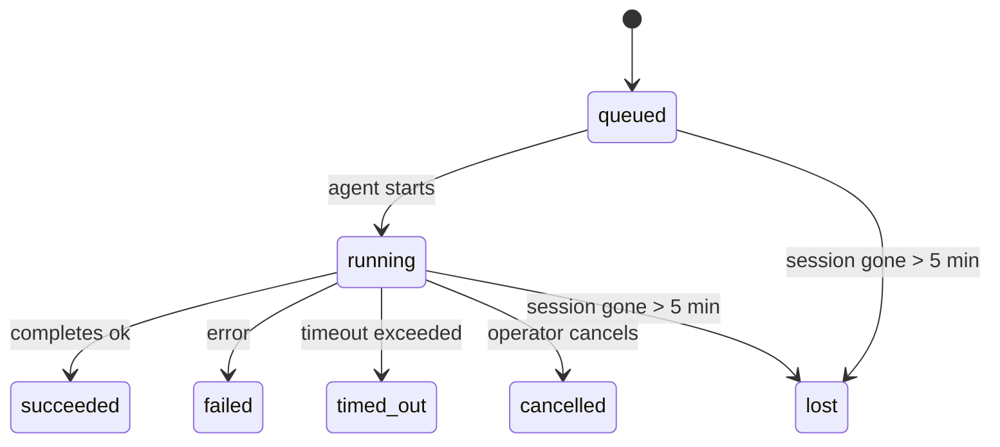

---
read_when:
    - Ispezione delle attività in background in corso o completate di recente
    - Risoluzione dei problemi degli errori di recapito per le esecuzioni distaccate degli agenti
    - Comprendere il rapporto tra le esecuzioni in secondo piano, le sessioni, Cron e Heartbeat
sidebarTitle: Background tasks
summary: Monitoraggio delle attività in background per esecuzioni ACP, sottoagenti, job Cron isolati e operazioni CLI
title: Attività in background
x-i18n:
    generated_at: "2026-05-07T13:13:35Z"
    model: gpt-5.5
    provider: openai
    source_hash: a91a04ef6142e488d2fbc459d2c663afb93816a58fe9f52e0a51420703ea2d4d
    source_path: automation/tasks.md
    workflow: 16
---

<Note>
Cerchi la pianificazione? Consulta [Automazione e attività](/it/automation) per scegliere il meccanismo giusto. Questa pagina è il registro delle attività per il lavoro in background, non lo scheduler.
</Note>

Le attività in background tracciano il lavoro che viene eseguito **fuori dalla tua sessione di conversazione principale**: esecuzioni ACP, avvii di sottoagenti, esecuzioni isolate di job Cron e operazioni avviate dalla CLI.

Le attività **non** sostituiscono sessioni, job Cron o heartbeat: sono il **registro delle attività** che documenta quale lavoro scollegato è avvenuto, quando e se è riuscito.

<Note>
Non ogni esecuzione di agente crea un'attività. I turni Heartbeat e la normale chat interattiva non lo fanno. Tutte le esecuzioni Cron, gli avvii ACP, gli avvii di sottoagenti e i comandi agente della CLI sì.
</Note>

## TL;DR

- Le attività sono **record**, non scheduler: Cron e Heartbeat decidono _quando_ viene eseguito il lavoro, le attività tracciano _cosa è successo_.
- ACP, sottoagenti, tutti i job Cron e le operazioni CLI creano attività. I turni Heartbeat non lo fanno.
- Ogni attività passa attraverso `queued → running → terminal` (succeeded, failed, timed_out, cancelled o lost).
- Le attività Cron restano attive finché il runtime Cron possiede ancora il job; se lo stato del runtime in memoria è sparito, la manutenzione delle attività controlla prima la cronologia persistente delle esecuzioni Cron prima di contrassegnare un'attività come persa.
- Il completamento è guidato da push: il lavoro scollegato può notificare direttamente o risvegliare la sessione/Heartbeat del richiedente quando termina, quindi i loop di polling dello stato di solito sono la forma sbagliata.
- Le esecuzioni Cron isolate e i completamenti dei sottoagenti tentano al meglio di ripulire le schede/processi del browser tracciati per la loro sessione figlia prima della contabilità finale della pulizia.
- La consegna Cron isolata sopprime le risposte parent intermedie obsolete mentre il lavoro dei sottoagenti discendenti è ancora in fase di svuotamento, e preferisce l'output finale del discendente quando arriva prima della consegna.
- Le notifiche di completamento vengono consegnate direttamente a un canale o accodate per il prossimo Heartbeat.
- `openclaw tasks list` mostra tutte le attività; `openclaw tasks audit` evidenzia i problemi.
- I record terminali vengono conservati per 7 giorni, poi eliminati automaticamente.

## Avvio rapido

<Tabs>
  <Tab title="Elenca e filtra">
    ```bash
    # List all tasks (newest first)
    openclaw tasks list

    # Filter by runtime or status
    openclaw tasks list --runtime acp
    openclaw tasks list --status running
    ```

  </Tab>
  <Tab title="Ispeziona">
    ```bash
    # Show details for a specific task (by ID, run ID, or session key)
    openclaw tasks show <lookup>
    ```
  </Tab>
  <Tab title="Annulla e notifica">
    ```bash
    # Cancel a running task (kills the child session)
    openclaw tasks cancel <lookup>

    # Change notification policy for a task
    openclaw tasks notify <lookup> state_changes
    ```

  </Tab>
  <Tab title="Audit e manutenzione">
    ```bash
    # Run a health audit
    openclaw tasks audit

    # Preview or apply maintenance
    openclaw tasks maintenance
    openclaw tasks maintenance --apply
    ```

  </Tab>
  <Tab title="Flusso attività">
    ```bash
    # Inspect TaskFlow state
    openclaw tasks flow list
    openclaw tasks flow show <lookup>
    openclaw tasks flow cancel <lookup>
    ```
  </Tab>
</Tabs>

## Cosa crea un'attività

| Origine                | Tipo di runtime | Quando viene creato un record di attività              | Criterio di notifica predefinito |
| ---------------------- | ------------ | ------------------------------------------------------ | --------------------- |
| Esecuzioni ACP in background | `acp`        | Avvio di una sessione ACP figlia                       | `done_only`           |
| Orchestrazione dei sottoagenti | `subagent`   | Avvio di un sottoagente tramite `sessions_spawn`       | `done_only`           |
| Job Cron (tutti i tipi) | `cron`       | Ogni esecuzione Cron (sessione principale e isolata)   | `silent`              |
| Operazioni CLI         | `cli`        | Comandi `openclaw agent` eseguiti tramite il Gateway   | `silent`              |
| Job multimediali dell'agente | `cli`        | Esecuzioni `music_generate`/`video_generate` basate su sessione | `silent`              |

<AccordionGroup>
  <Accordion title="Impostazioni predefinite di notifica per Cron e media">
    Le attività Cron della sessione principale usano il criterio di notifica `silent` per impostazione predefinita: creano record per il tracciamento ma non generano notifiche. Anche le attività Cron isolate usano `silent` per impostazione predefinita, ma sono più visibili perché vengono eseguite nella propria sessione.

    Anche le esecuzioni `music_generate` e `video_generate` basate su sessione usano il criterio di notifica `silent`. Creano comunque record di attività, ma il completamento viene restituito alla sessione agente originale come risveglio interno, così l'agente può scrivere il messaggio di follow-up e allegare da sé il contenuto multimediale terminato. I completamenti di gruppo/canale seguono il normale criterio di risposta visibile, quindi l'agente usa lo strumento messaggio quando la consegna di origine lo richiede. Se l'agente di completamento non riesce a produrre evidenza di consegna tramite strumento messaggio in una route solo strumenti, OpenClaw invia il fallback di completamento direttamente al canale originale invece di lasciare privato il contenuto multimediale.

  </Accordion>
  <Accordion title="Protezione per video_generate concorrenti">
    Mentre un'attività `video_generate` basata su sessione è ancora attiva, lo strumento agisce anche come protezione: chiamate `video_generate` ripetute nella stessa sessione restituiscono lo stato dell'attività attiva invece di avviare una seconda generazione concorrente. Usa `action: "status"` quando vuoi una ricerca esplicita di avanzamento/stato dal lato agente.
  </Accordion>
  <Accordion title="Cosa non crea attività">
    - Turni Heartbeat: sessione principale; consulta [Heartbeat](/it/gateway/heartbeat)
    - Normali turni di chat interattiva
    - Risposte dirette `/command`

  </Accordion>
</AccordionGroup>

## Ciclo di vita delle attività



| Stato       | Cosa significa                                                            |
| ----------- | -------------------------------------------------------------------------- |
| `queued`    | Creata, in attesa che l'agente si avvii                                    |
| `running`   | Il turno dell'agente è in esecuzione attiva                                |
| `succeeded` | Completata correttamente                                                   |
| `failed`    | Completata con un errore                                                   |
| `timed_out` | Ha superato il timeout configurato                                         |
| `cancelled` | Fermata dall'operatore tramite `openclaw tasks cancel`                     |
| `lost`      | Il runtime ha perso lo stato di supporto autorevole dopo un periodo di tolleranza di 5 minuti |

Le transizioni avvengono automaticamente: quando l'esecuzione dell'agente associata termina, lo stato dell'attività viene aggiornato di conseguenza.

Il completamento dell'esecuzione dell'agente è autorevole per i record di attività attivi. Un'esecuzione scollegata riuscita viene finalizzata come `succeeded`, gli errori ordinari di esecuzione vengono finalizzati come `failed` e gli esiti di timeout o interruzione vengono finalizzati come `timed_out`. Se un operatore ha già annullato l'attività, oppure il runtime ha già registrato uno stato terminale più forte come `failed`, `timed_out` o `lost`, un segnale di successo successivo non declassa quello stato terminale.

`lost` è consapevole del runtime:

- Attività ACP: i metadati della sessione ACP figlia di supporto sono scomparsi.
- Attività di sottoagenti: la sessione figlia di supporto è scomparsa dallo store dell'agente di destinazione.
- Attività Cron: il runtime Cron non traccia più il job come attivo e la cronologia persistente delle esecuzioni Cron non mostra un risultato terminale per quell'esecuzione. L'audit CLI offline non considera autorevole il proprio stato vuoto del runtime Cron in-process.
- Attività CLI: le attività con un ID esecuzione/ID origine usano il contesto di esecuzione live, quindi righe persistenti di sessioni figlie o sessioni chat non le mantengono vive dopo la scomparsa dell'esecuzione posseduta dal Gateway. Le attività CLI legacy senza identità di esecuzione ripiegano ancora sulla sessione figlia. Anche le esecuzioni `openclaw agent` supportate dal Gateway vengono finalizzate dal loro risultato di esecuzione, quindi le esecuzioni completate non restano attive finché lo sweeper le contrassegna come `lost`.

## Consegna e notifiche

Quando un'attività raggiunge uno stato terminale, OpenClaw ti invia una notifica. Esistono due percorsi di consegna:

**Consegna diretta**: se l'attività ha una destinazione canale (il `requesterOrigin`), il messaggio di completamento va direttamente a quel canale (Telegram, Discord, Slack, ecc.). Per i completamenti dei sottoagenti, OpenClaw preserva anche il routing di thread/topic associato quando disponibile e può compilare un `to` / account mancante dalla route salvata della sessione richiedente (`lastChannel` / `lastTo` / `lastAccountId`) prima di rinunciare alla consegna diretta.

**Consegna accodata alla sessione**: se la consegna diretta fallisce o non è impostata alcuna origine, l'aggiornamento viene accodato come evento di sistema nella sessione del richiedente e appare al prossimo Heartbeat.

<Tip>
Il completamento dell'attività attiva un risveglio Heartbeat immediato, così vedi rapidamente il risultato: non devi attendere il prossimo tick Heartbeat pianificato.
</Tip>

Questo significa che il flusso di lavoro abituale è basato su push: avvia una volta il lavoro scollegato, poi lascia che il runtime ti risvegli o notifichi al completamento. Esegui il polling dello stato dell'attività solo quando hai bisogno di debug, intervento o audit esplicito.

### Criteri di notifica

Controlla quanto senti su ogni attività:

| Criterio              | Cosa viene consegnato                                                  |
| --------------------- | ----------------------------------------------------------------------- |
| `done_only` (predefinito) | Solo stato terminale (succeeded, failed, ecc.): **questa è l'impostazione predefinita** |
| `state_changes`       | Ogni transizione di stato e aggiornamento di avanzamento                |
| `silent`              | Nulla                                                                   |

Modifica il criterio mentre un'attività è in esecuzione:

```bash
openclaw tasks notify <lookup> state_changes
```

## Riferimento CLI

<AccordionGroup>
  <Accordion title="tasks list">
    ```bash
    openclaw tasks list [--runtime <acp|subagent|cron|cli>] [--status <status>] [--json]
    ```

    Colonne di output: ID attività, Tipo, Stato, Consegna, ID esecuzione, Sessione figlia, Riepilogo.

  </Accordion>
  <Accordion title="tasks show">
    ```bash
    openclaw tasks show <lookup>
    ```

    Il token di ricerca accetta un ID attività, ID esecuzione o chiave di sessione. Mostra il record completo, inclusi tempi, stato di consegna, errore e riepilogo terminale.

  </Accordion>
  <Accordion title="tasks cancel">
    ```bash
    openclaw tasks cancel <lookup>
    ```

    Per le attività ACP e dei sottoagenti, questo termina la sessione figlia. Per le attività tracciate dalla CLI, l'annullamento viene registrato nel registro delle attività (non esiste un handle separato del runtime figlio). Lo stato passa a `cancelled` e viene inviata una notifica di consegna quando applicabile.

  </Accordion>
  <Accordion title="tasks notify">
    ```bash
    openclaw tasks notify <lookup> <done_only|state_changes|silent>
    ```
  </Accordion>
  <Accordion title="tasks audit">
    ```bash
    openclaw tasks audit [--json]
    ```

    Evidenzia problemi operativi. I risultati appaiono anche in `openclaw status` quando vengono rilevati problemi.

    | Risultato                 | Gravità    | Attivazione                                                                                                                      |
    | ------------------------- | ---------- | -------------------------------------------------------------------------------------------------------------------------------- |
    | `stale_queued`            | warn       | In coda da più di 10 minuti                                                                                                      |
    | `stale_running`           | error      | In esecuzione da più di 30 minuti                                                                                                |
    | `lost`                    | warn/error | La proprietà dell’attività supportata dal runtime è scomparsa; le attività perse conservate avvisano fino a `cleanupAfter`, poi diventano errori |
    | `delivery_failed`         | warn       | Consegna non riuscita e il criterio di notifica non è `silent`                                                                   |
    | `missing_cleanup`         | warn       | Attività terminale senza timestamp di pulizia                                                                                    |
    | `inconsistent_timestamps` | warn       | Violazione della sequenza temporale (per esempio terminata prima di essere avviata)                                              |

  </Accordion>
  <Accordion title="tasks maintenance">
    ```bash
    openclaw tasks maintenance [--json]
    openclaw tasks maintenance --apply [--json]
    ```

    Usa questo comando per visualizzare in anteprima o applicare la riconciliazione, l’apposizione dei timestamp di pulizia e la rimozione per le attività e lo stato di Task Flow.

    La riconciliazione è consapevole del runtime:

    - Le attività ACP/subagent controllano la sessione figlia sottostante.
    - Le attività subagent la cui sessione figlia ha una tombstone di ripristino dopo riavvio vengono contrassegnate come perse invece di essere trattate come sessioni sottostanti recuperabili.
    - Le attività Cron controllano se il runtime cron possiede ancora il job, quindi recuperano lo stato terminale dai log di esecuzione cron persistiti/dallo stato del job prima di ricadere su `lost`. Solo il processo Gateway è autorevole per l’insieme in memoria dei job attivi cron; l’audit CLI offline usa la cronologia durevole ma non contrassegna un’attività cron come persa solo perché quel Set locale è vuoto.
    - Le attività CLI con identità di esecuzione controllano il contesto di esecuzione live proprietario, non solo le righe di sessione figlia o sessione chat.

    Anche la pulizia al completamento è consapevole del runtime:

    - Il completamento di subagent tenta al meglio di chiudere le schede/processi del browser tracciati per la sessione figlia prima che la pulizia dell’annuncio continui.
    - Il completamento di cron isolato tenta al meglio di chiudere le schede/processi del browser tracciati per la sessione cron prima che l’esecuzione venga smontata completamente.
    - La consegna cron isolata attende, quando necessario, il follow-up di subagent discendenti e sopprime il testo di conferma del genitore obsoleto invece di annunciarlo.
    - La consegna del completamento di subagent preferisce l’ultimo testo visibile dell’assistente; se è vuoto, ricade sull’ultimo testo tool/toolResult sanificato, e le esecuzioni di chiamate tool solo con timeout possono collassare in un breve riepilogo di avanzamento parziale. Le esecuzioni terminali non riuscite annunciano lo stato di errore senza riprodurre il testo di risposta acquisito.
    - Gli errori di pulizia non mascherano l’esito reale dell’attività.

  </Accordion>
  <Accordion title="tasks flow list | show | cancel">
    ```bash
    openclaw tasks flow list [--status <status>] [--json]
    openclaw tasks flow show <lookup> [--json]
    openclaw tasks flow cancel <lookup>
    ```

    Usa questi comandi quando il Task Flow orchestrante è ciò che ti interessa, invece del record di una singola attività in background.

  </Accordion>
</AccordionGroup>

## Scheda attività chat (`/tasks`)

Usa `/tasks` in qualsiasi sessione chat per vedere le attività in background collegate a quella sessione. La scheda mostra le attività attive e completate di recente con runtime, stato, tempi e dettagli di avanzamento o errore.

Quando la sessione corrente non ha attività collegate visibili, `/tasks` ricade sui conteggi delle attività locali dell’agente, così ottieni comunque una panoramica senza esporre dettagli di altre sessioni.

Per il registro operatore completo, usa la CLI: `openclaw tasks list`.

## Integrazione dello stato (pressione attività)

`openclaw status` include un riepilogo immediato delle attività:

```
Tasks: 3 queued · 2 running · 1 issues
```

Il riepilogo riporta:

- **active** - conteggio di `queued` + `running`
- **failures** - conteggio di `failed` + `timed_out` + `lost`
- **byRuntime** - suddivisione per `acp`, `subagent`, `cron`, `cli`

Sia `/status` sia lo strumento `session_status` usano uno snapshot delle attività consapevole della pulizia: le attività attive sono preferite, le righe completate obsolete sono nascoste e gli errori recenti emergono solo quando non rimane alcun lavoro attivo. Questo mantiene la scheda di stato concentrata su ciò che conta ora.

## Archiviazione e manutenzione

### Dove risiedono le attività

I record delle attività persistono in SQLite in:

```
$OPENCLAW_STATE_DIR/tasks/runs.sqlite
```

Il registro viene caricato in memoria all’avvio del gateway e sincronizza le scritture su SQLite per garantire la durabilità tra i riavvii.
Il Gateway mantiene limitato il write-ahead log di SQLite usando la soglia di autocheckpoint predefinita di SQLite più checkpoint `TRUNCATE` periodici e allo spegnimento.

### Manutenzione automatica

Uno sweeper viene eseguito ogni **60 secondi** e gestisce quattro cose:

<Steps>
  <Step title="Reconciliation">
    Controlla se le attività attive hanno ancora un supporto runtime autorevole. Le attività ACP/subagent usano lo stato della sessione figlia, le attività cron usano la proprietà dei job attivi e le attività CLI con identità di esecuzione usano il contesto di esecuzione proprietario. Se quello stato sottostante manca da più di 5 minuti, l’attività viene contrassegnata come `lost`.
  </Step>
  <Step title="ACP session repair">
    Chiude le sessioni ACP one-shot terminali o orfane possedute dal genitore, e chiude le sessioni ACP persistenti terminali obsolete o orfane solo quando non rimane alcun binding di conversazione attivo.
  </Step>
  <Step title="Cleanup stamping">
    Imposta un timestamp `cleanupAfter` sulle attività terminali (endedAt + 7 giorni). Durante la retention, le attività perse compaiono ancora nell’audit come avvisi; dopo la scadenza di `cleanupAfter` o quando i metadati di pulizia mancano, sono errori.
  </Step>
  <Step title="Pruning">
    Elimina i record oltre la loro data `cleanupAfter`.
  </Step>
</Steps>

<Note>
**Retention:** i record delle attività terminali vengono conservati per **7 giorni**, poi rimossi automaticamente. Non è richiesta alcuna configurazione.
</Note>

## Come le attività si collegano ad altri sistemi

<AccordionGroup>
  <Accordion title="Tasks and Task Flow">
    [Task Flow](/it/automation/taskflow) è il livello di orchestrazione dei flussi sopra le attività in background. Un singolo flusso può coordinare più attività durante il suo ciclo di vita usando modalità di sincronizzazione gestite o rispecchiate. Usa `openclaw tasks` per ispezionare i singoli record di attività e `openclaw tasks flow` per ispezionare il flusso orchestrante.

    Vedi [Task Flow](/it/automation/taskflow) per i dettagli.

  </Accordion>
  <Accordion title="Tasks and cron">
    Una **definizione** di job cron risiede in `~/.openclaw/cron/jobs.json`; lo stato di esecuzione runtime risiede accanto ad essa in `~/.openclaw/cron/jobs-state.json`. **Ogni** esecuzione cron crea un record di attività, sia in sessione principale sia isolata. Le attività cron in sessione principale usano per impostazione predefinita il criterio di notifica `silent`, così vengono tracciate senza generare notifiche.

    Vedi [Cron Jobs](/it/automation/cron-jobs).

  </Accordion>
  <Accordion title="Tasks and heartbeat">
    Le esecuzioni Heartbeat sono turni della sessione principale: non creano record di attività. Quando un’attività viene completata, può attivare un risveglio heartbeat così vedi rapidamente il risultato.

    Vedi [Heartbeat](/it/gateway/heartbeat).

  </Accordion>
  <Accordion title="Tasks and sessions">
    Un’attività può fare riferimento a una `childSessionKey` (dove viene eseguito il lavoro) e a una `requesterSessionKey` (chi l’ha avviata). Le sessioni sono contesto di conversazione; le attività sono tracciamento dell’attività sopra di esso.
  </Accordion>
  <Accordion title="Tasks and agent runs">
    Il `runId` di un’attività si collega all’esecuzione dell’agente che sta svolgendo il lavoro. Gli eventi del ciclo di vita dell’agente (avvio, fine, errore) aggiornano automaticamente lo stato dell’attività: non devi gestire manualmente il ciclo di vita.
  </Accordion>
</AccordionGroup>

## Correlati

- [Automation & Tasks](/it/automation) - tutti i meccanismi di automazione in sintesi
- [CLI: Tasks](/it/cli/tasks) - riferimento dei comandi CLI
- [Heartbeat](/it/gateway/heartbeat) - turni periodici della sessione principale
- [Scheduled Tasks](/it/automation/cron-jobs) - pianificazione del lavoro in background
- [Task Flow](/it/automation/taskflow) - orchestrazione dei flussi sopra le attività
