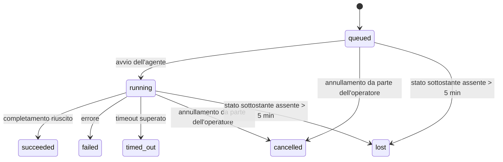

---
read_when:
    - Ispezione delle attività in background in corso o completate di recente
    - Debug degli errori di consegna per le esecuzioni distaccate degli agenti
    - Comprendere come le esecuzioni in background si relazionano alle sessioni, a Cron e a Heartbeat
sidebarTitle: Background tasks
summary: Monitoraggio delle attività in background per esecuzioni ACP, subagenti, esecuzioni cron e operazioni CLI
title: Attività in background
x-i18n:
    generated_at: "2026-07-12T06:47:09Z"
    model: gpt-5.6
    postprocess_version: locale-links-v1
    provider: openai
    source_hash: 0a945e8103c5df5a64785f326a9d0b08784ac32a2ca6fa3d4c399d75fc54be2b
    source_path: automation/tasks.md
    workflow: 16
---

<Note>
Cerchi la pianificazione? Consulta [Automazione](/it/automation) per scegliere il meccanismo appropriato. Questa pagina è il registro delle attività per il lavoro in background, non lo strumento di pianificazione.
</Note>

Le attività in background tengono traccia del lavoro eseguito **al di fuori della sessione di conversazione principale**: esecuzioni ACP, avvii di subagenti, esecuzioni di processi Cron e operazioni avviate dalla CLI.

Le attività **non** sostituiscono le sessioni, i processi Cron o gli Heartbeat: sono il **registro delle attività** che annota quale lavoro separato è stato eseguito, quando e se è riuscito.

<Note>
Non ogni esecuzione dell'agente crea un'attività. I turni Heartbeat e la normale chat interattiva non lo fanno. Tutte le esecuzioni Cron, gli avvii ACP, gli avvii di subagenti e i comandi dell'agente CLI inoltrati dal Gateway lo fanno.
</Note>

## In breve

- Le attività sono **registrazioni**, non strumenti di pianificazione: Cron e Heartbeat decidono _quando_ eseguire il lavoro, mentre le attività tengono traccia di _ciò che è accaduto_.
- ACP, i subagenti, tutti i processi Cron e le operazioni CLI creano attività. I turni Heartbeat non lo fanno.
- Ogni attività attraversa gli stati `queued → running → terminal` (succeeded, failed, timed_out, cancelled o lost).
- Le attività Cron rimangono attive finché il runtime Cron mantiene la titolarità del processo; se lo stato del runtime in memoria non è più disponibile, la manutenzione delle attività controlla prima la cronologia persistente delle esecuzioni Cron e solo dopo contrassegna un'attività come persa.
- Il completamento è basato su notifiche push: al termine, il lavoro separato può inviare direttamente una notifica oppure riattivare la sessione o l'Heartbeat del richiedente, quindi i cicli di polling dello stato sono generalmente un approccio inadeguato.
- Le esecuzioni Cron isolate e i completamenti dei subagenti tentano, senza garanzia, di chiudere le schede e i processi del browser monitorati per la rispettiva sessione figlia prima della registrazione finale delle operazioni di pulizia.
- La consegna delle esecuzioni Cron isolate elimina le risposte intermedie obsolete del genitore mentre il lavoro dei subagenti discendenti è ancora in fase di completamento e preferisce l'output finale dei discendenti quando questo arriva prima della consegna.
- Le notifiche di completamento vengono recapitate direttamente a un canale o messe in coda per il successivo Heartbeat.
- `openclaw tasks list` mostra tutte le attività; `openclaw tasks audit` evidenzia i problemi.
- Le registrazioni terminali vengono conservate per 7 giorni (quelle con stato `lost` per 24 ore), quindi eliminate automaticamente.

## Avvio rapido

<Tabs>
  <Tab title="Elencare e filtrare">
    ```bash
    # Elenca tutte le attività (dalla più recente)
    openclaw tasks list

    # Filtra per runtime o stato
    openclaw tasks list --runtime acp
    openclaw tasks list --status running
    ```

  </Tab>
  <Tab title="Esaminare">
    ```bash
    # Mostra i dettagli di un'attività specifica (per ID attività, ID esecuzione o chiave di sessione)
    openclaw tasks show <lookup>
    ```
  </Tab>
  <Tab title="Annullare e notificare">
    ```bash
    # Annulla un'attività in esecuzione (termina la sessione figlia)
    openclaw tasks cancel <lookup>

    # Modifica i criteri di notifica di un'attività
    openclaw tasks notify <lookup> state_changes
    ```

  </Tab>
  <Tab title="Controllo e manutenzione">
    ```bash
    # Esegue un controllo dello stato operativo
    openclaw tasks audit

    # Mostra un'anteprima della manutenzione o la applica
    openclaw tasks maintenance
    openclaw tasks maintenance --apply
    ```

  </Tab>
  <Tab title="Flusso delle attività">
    ```bash
    # Esamina lo stato di TaskFlow
    openclaw tasks flow list
    openclaw tasks flow show <lookup>
    openclaw tasks flow cancel <lookup>
    ```
  </Tab>
</Tabs>

## Cosa crea un'attività

| Origine                 | Tipo di runtime | Quando viene creata una registrazione dell'attività                           | Criterio di notifica predefinito |
| ----------------------- | --------------- | ----------------------------------------------------------------------------- | -------------------------------- |
| Esecuzioni ACP in background | `acp`     | All'avvio di una sessione ACP figlia                                           | `done_only`                      |
| Orchestrazione dei subagenti | `subagent` | All'avvio di un subagente tramite `sessions_spawn`                           | `done_only`                      |
| Processi Cron (tutti i tipi) | `cron`     | A ogni esecuzione Cron (nella sessione principale e isolata)                  | `silent`                         |
| Operazioni CLI          | `cli`           | Per i comandi `openclaw agent` eseguiti tramite il Gateway                    | `silent`                         |
| Processi multimediali dell'agente | `cli` | Per le esecuzioni `image_generate`/`music_generate`/`video_generate` basate su sessione | `silent`                 |

<AccordionGroup>
  <Accordion title="Impostazioni predefinite delle notifiche per Cron e contenuti multimediali">
    Le attività Cron (nella sessione principale e isolate) usano il criterio di notifica `silent`: creano registrazioni per il monitoraggio, ma non generano notifiche proprie; il percorso di consegna è gestito da Cron.

    Anche le esecuzioni `image_generate`, `music_generate` e `video_generate` basate su sessione usano il criterio di notifica `silent`. Creano comunque registrazioni delle attività, ma il completamento viene restituito alla sessione originale dell'agente come riattivazione interna, affinché l'agente possa scrivere il messaggio di seguito e allegare autonomamente i contenuti multimediali completati. L'agente richiedente segue il normale contratto per le risposte visibili: risposta finale automatica, se configurata, oppure `message(action="send")` seguito da `NO_REPLY` quando la sessione richiede risposte tramite lo strumento di messaggistica. Se la sessione richiedente non è più attiva o la sua riattivazione attiva non riesce, e l'agente di completamento non include alcuni o tutti i contenuti multimediali generati, OpenClaw invia direttamente alla destinazione del canale originale un ripiego idempotente contenente solo i contenuti mancanti.

  </Accordion>
  <Accordion title="Protezione per la generazione simultanea di contenuti multimediali">
    Finché un'attività di generazione multimediale basata su sessione è ancora attiva, `image_generate`, `music_generate` e `video_generate` impediscono i tentativi ripetuti accidentali: ripetere la chiamata per la stessa richiesta o lo stesso prompt restituisce lo stato dell'attività attiva corrispondente anziché avviare un duplicato, mentre un prompt diverso può avviare una propria attività. Usa `action: "status"` quando desideri una consultazione esplicita dell'avanzamento o dello stato dal lato dell'agente.
  </Accordion>
  <Accordion title="Cosa non crea attività">
    - Turni Heartbeat nella sessione principale; consulta [Heartbeat](/it/gateway/heartbeat)
    - Normali turni di chat interattiva
    - Risposte dirette a `/command`

  </Accordion>
</AccordionGroup>

## Ciclo di vita delle attività



| Stato       | Significato                                                                 |
| ----------- | --------------------------------------------------------------------------- |
| `queued`    | Creata, in attesa dell'avvio dell'agente                                    |
| `running`   | Il turno dell'agente è attualmente in esecuzione                            |
| `succeeded` | Completata correttamente                                                     |
| `failed`    | Completata con un errore                                                     |
| `timed_out` | Ha superato il timeout configurato                                          |
| `cancelled` | Interrotta dall'operatore tramite `openclaw tasks cancel` oppure esecuzione interrotta |
| `lost`      | Il runtime ha perso lo stato sottostante autorevole dopo un periodo di tolleranza di 5 minuti |

Le transizioni avvengono automaticamente: gli eventi del ciclo di vita dell'esecuzione dell'agente (avvio, fine, errore) aggiornano lo stato dell'attività; non è necessario gestirlo manualmente.

Il completamento dell'esecuzione dell'agente è autorevole per le registrazioni delle attività attive. Un'esecuzione separata riuscita termina con lo stato `succeeded`, gli errori ordinari di esecuzione terminano con `failed`, i timeout con `timed_out` e gli esiti di annullamento o interruzione con `cancelled`. Quando un'attività raggiunge uno stato terminale, i successivi segnali del ciclo di vita non ne peggiorano lo stato: un'attività annullata dall'operatore o già nello stato `failed`/`timed_out`/`lost` conserva tale stato anche se successivamente arriva un segnale di riuscita.

Lo stato `lost` dipende dal runtime:

- Attività ACP: solo un turno ACP attivo nel processo del Gateway dimostra che l'esecuzione è attiva; i soli metadati persistenti della sessione non sono sufficienti. Il controllo CLI offline rimane prudente e non recupera mai le attività ACP.
- Attività dei subagenti: la sessione figlia sottostante è scomparsa dall'archivio dell'agente di destinazione oppure contiene una registrazione di recupero dopo il riavvio.
- Attività Cron: il runtime Cron non monitora più il processo come attivo e la cronologia persistente delle esecuzioni Cron non mostra un risultato terminale per quell'esecuzione. Il controllo CLI offline non considera autorevole il proprio stato vuoto del runtime Cron interno al processo.
- Attività CLI: le attività con un ID esecuzione/ID origine usano il contesto di esecuzione attivo, quindi le righe residue della sessione figlia o della sessione di chat non le mantengono attive dopo la scomparsa dell'esecuzione gestita dal Gateway. Le attività CLI precedenti prive di identità dell'esecuzione continuano a ripiegare sulla sessione figlia. Anche le esecuzioni `openclaw agent` basate sul Gateway vengono finalizzate in base al risultato dell'esecuzione, quindi quelle completate non rimangono attive finché il processo di pulizia non le contrassegna come `lost`.

## Consegna e notifiche

Quando un'attività raggiunge uno stato terminale, OpenClaw invia una notifica. Esistono due percorsi di consegna:

**Consegna diretta**: se l'attività ha una destinazione di canale (`requesterOrigin`), il messaggio di completamento viene inviato direttamente a tale canale (Discord, Slack, Telegram e così via). I completamenti delle attività di gruppo e di canale vengono invece instradati tramite la sessione richiedente, affinché l'agente genitore possa scrivere la risposta visibile. Per i completamenti dei subagenti, OpenClaw conserva inoltre l'instradamento associato al thread o all'argomento, se disponibile, e può ricavare dalla rotta memorizzata della sessione richiedente (`lastChannel` / `lastTo` / `lastAccountId`) un valore `to` o un account mancante prima di rinunciare alla consegna diretta.

**Consegna in coda nella sessione**: se la consegna diretta non riesce o non è impostata alcuna origine, l'aggiornamento viene accodato come evento di sistema nella sessione del richiedente e viene mostrato al successivo Heartbeat.

<Tip>
I completamenti delle attività accodati nella sessione attivano immediatamente un Heartbeat, quindi il risultato viene visualizzato rapidamente: non è necessario attendere il successivo ciclo Heartbeat pianificato.
</Tip>

Ciò significa che il flusso di lavoro abituale è basato su notifiche push: avvia una sola volta il lavoro separato, quindi lascia che il runtime ti riattivi o ti notifichi al completamento. Controlla ripetutamente lo stato dell'attività solo quando devi eseguire il debug, intervenire o effettuare un controllo esplicito.

### Criteri di notifica

Controlla quante informazioni ricevere per ogni attività:

| Criterio                  | Cosa viene recapitato                                        |
| ------------------------- | ------------------------------------------------------------ |
| `done_only` (predefinito) | Solo lo stato terminale (succeeded, failed e così via)       |
| `state_changes`           | Ogni transizione di stato e aggiornamento dell'avanzamento   |
| `silent`                  | Nulla (impostazione predefinita per attività Cron, CLI e multimediali) |

Modifica il criterio mentre un'attività è in esecuzione:

```bash
openclaw tasks notify <lookup> state_changes
```

## Riferimento CLI

<AccordionGroup>
  <Accordion title="tasks list">
    ```bash
    openclaw tasks list [--runtime <acp|subagent|cron|cli>] [--status <status>] [--json]
    ```

    Colonne dell'output: attività, tipo, stato, consegna, esecuzione, sessione figlia, riepilogo. Il comando semplice `openclaw tasks` si comporta come `openclaw tasks list`.

  </Accordion>
  <Accordion title="tasks show">
    ```bash
    openclaw tasks show <lookup> [--json]
    ```

    Il token di ricerca accetta un ID attività, un ID esecuzione o una chiave di sessione. Mostra la registrazione completa, inclusi i tempi, lo stato della consegna, l'errore e il riepilogo terminale.

  </Accordion>
  <Accordion title="tasks cancel">
    ```bash
    openclaw tasks cancel <lookup>
    ```

    Per le attività ACP e dei subagenti, questo comando termina la sessione figlia; gli annullamenti ACP e Cron vengono instradati tramite il Gateway in esecuzione (`tasks.cancel`). Per le attività monitorate dalla CLI, l'annullamento viene registrato nel registro delle attività (non esiste un handle separato per il runtime figlio). Lo stato passa a `cancelled` e, quando applicabile, viene inviata una notifica di consegna.

  </Accordion>
  <Accordion title="tasks notify">
    ```bash
    openclaw tasks notify <lookup> <done_only|state_changes|silent>
    ```
  </Accordion>
  <Accordion title="tasks audit">
    ```bash
    openclaw tasks audit [--severity <warn|error>] [--code <name>] [--limit <n>] [--json]
    ```

    Evidenzia in un unico rapporto i problemi operativi relativi alle attività **e** ai TaskFlow. I risultati vengono mostrati anche in `openclaw status` quando vengono rilevati problemi.

    Risultati relativi alle attività:

    | Risultato                 | Gravità      | Condizione                                                                                                                          |
    | ------------------------- | ------------- | ----------------------------------------------------------------------------------------------------------------------------------- |
    | `stale_queued`            | avviso        | In coda da più di 10 minuti                                                                                                         |
    | `stale_running`           | errore        | In esecuzione da più di 30 minuti                                                                                                   |
    | `lost`                    | avviso/errore | La proprietà dell'attività supportata dal runtime è scomparsa; le attività perse conservate generano avvisi fino a `cleanupAfter`, quindi diventano errori |
    | `delivery_failed`         | avviso        | La consegna non è riuscita e la politica di notifica non è `silent`                                                                 |
    | `missing_cleanup`         | avviso        | Attività terminata senza timestamp di pulizia                                                                                       |
    | `inconsistent_timestamps` | avviso        | Violazione della sequenza temporale (ad esempio, conclusione precedente all'avvio)                                                   |

    Risultati di TaskFlow:

    | Risultato              | Gravità      | Condizione                                                                                       |
    | ---------------------- | ------------- | ------------------------------------------------------------------------------------------------ |
    | `restore_failed`       | errore        | Ripristino del registro dei flussi da SQLite non riuscito                                         |
    | `stale_running`        | errore        | Il flusso in esecuzione non è avanzato da più di 30 minuti                                        |
    | `stale_waiting`        | avviso        | Il flusso in attesa non è avanzato da più di 30 minuti                                            |
    | `stale_blocked`        | avviso        | Il flusso bloccato non è avanzato da più di 30 minuti                                             |
    | `cancel_stuck`         | avviso        | Annullamento richiesto più di 5 minuti fa, nessuna attività figlia attiva, ma il flusso non è ancora terminato |
    | `missing_linked_tasks` | avviso/errore | Flusso gestito obsoleto senza attività collegate né stato di attesa                               |
    | `blocked_task_missing` | avviso        | Il flusso bloccato fa riferimento all'ID di un'attività che non esiste più                        |

  </Accordion>
  <Accordion title="manutenzione delle attività">
    ```bash
    openclaw tasks maintenance [--json]
    openclaw tasks maintenance --apply [--json]
    ```

    Utilizzalo per visualizzare in anteprima o applicare la riconciliazione, l'impostazione dei timestamp di pulizia e l'eliminazione per le attività, lo stato di TaskFlow e le righe obsolete del registro delle sessioni di esecuzione Cron.

    La riconciliazione tiene conto del runtime:

    - Le attività ACP richiedono un turno attivo nel processo nel Gateway; le attività dei sottoagenti verificano la sessione figlia sottostante.
    - Le attività dei sottoagenti la cui sessione figlia presenta una lapide di ripristino dopo il riavvio vengono contrassegnate come perse anziché essere considerate sessioni sottostanti recuperabili.
    - Le attività Cron verificano se il runtime Cron possiede ancora il processo, quindi recuperano lo stato terminale dai log persistenti delle esecuzioni Cron o dallo stato del processo prima di ricorrere a `lost`. Solo il processo Gateway è autorevole per l'insieme in memoria dei processi Cron attivi; il controllo CLI offline utilizza la cronologia persistente, ma non contrassegna un'attività Cron come persa solo perché tale insieme locale è vuoto.
    - Le attività CLI con un'identità di esecuzione verificano il contesto di esecuzione attivo proprietario, non soltanto le righe della sessione figlia o della sessione di chat.

    Anche la pulizia al completamento tiene conto del runtime:

    - Al completamento di un sottoagente, il sistema tenta di chiudere le schede e i processi del browser monitorati per la sessione figlia prima che prosegua la pulizia dell'annuncio.
    - Al completamento di un'esecuzione Cron isolata, il sistema tenta di chiudere le schede e i processi del browser monitorati per la sessione Cron prima che l'esecuzione venga completamente arrestata.
    - La consegna Cron isolata attende, quando necessario, il completamento delle azioni successive dei sottoagenti discendenti e sopprime il testo obsoleto di conferma del genitore anziché annunciarlo.
    - La consegna al completamento di un sottoagente utilizza soltanto il testo più recente e visibile dell'assistente della sessione figlia. L'output di tool/toolResult non viene promosso a testo del risultato della sessione figlia. Le esecuzioni terminate con errore annunciano lo stato di errore senza riprodurre il testo della risposta acquisito.
    - Gli errori di pulizia non nascondono l'esito reale dell'attività.

    Quando si applica la manutenzione, OpenClaw rimuove anche le righe obsolete `cron:<jobId>:run:<runId>` del registro delle sessioni più vecchie di 7 giorni, preservando quelle relative ai processi Cron attualmente in esecuzione e lasciando inalterate le righe delle sessioni non Cron.

  </Accordion>
  <Accordion title="tasks flow list | show | cancel">
    ```bash
    openclaw tasks flow list [--status <status>] [--json]
    openclaw tasks flow show <lookup> [--json]
    openclaw tasks flow cancel <lookup>
    ```

    Il token di ricerca del flusso accetta un ID del flusso o una chiave del proprietario. Utilizza questi comandi quando l'elemento di interesse è il [Flusso di attività](/it/automation/taskflow) di orchestrazione anziché il singolo record di un'attività in background.

  </Accordion>
</AccordionGroup>

## Pannello delle attività della chat (`/tasks`)

Utilizza `/tasks` in qualsiasi sessione di chat per visualizzare le attività in background collegate a tale sessione. Il pannello mostra fino a cinque attività attive e completate di recente, con dettagli su runtime, stato, tempistiche e avanzamento o errore.

Quando la sessione corrente non presenta attività collegate visibili, `/tasks` mostra in alternativa i conteggi delle attività locali dell'agente, offrendo comunque una panoramica senza divulgare dettagli di altre sessioni.

Per il registro completo dell'operatore, utilizza la CLI: `openclaw tasks list`.

### Interfaccia di controllo

L'interfaccia web di controllo dispone di una pagina **Attività** nella barra laterale, con le attività in background attive e recenti aggiornate in tempo reale. Utilizzala per esaminare l'avanzamento, aprire le sessioni collegate, aggiornare il registro o annullare le attività in coda e in esecuzione.

I riquadri della chat includono inoltre un pannello comprimibile **Attività in background** limitato all'agente del riquadro: mostra attività e sottoagenti in esecuzione con un controllo di arresto, una sezione delle attività completate e collegamenti Visualizza trascrizione alle sessioni figlie di ciascuna attività. Aprilo tramite il pulsante di attivazione dell'attività nell'intestazione del riquadro oppure tramite il pulsante mobile dell'attività nella chat a riquadro singolo.

## Integrazione dello stato (carico delle attività)

`openclaw status` include una riga riepilogativa delle attività:

```
Attività    2 attive · 1 in coda · 1 in esecuzione · 1 problema · controllo senza problemi · 6 monitorate
```

Il riepilogo conteggia il lavoro attivo (`queued` + `running`), gli errori (`failed` + `timed_out` + `lost`), i risultati del controllo e il totale dei record monitorati; il payload JSON suddivide inoltre i conteggi per runtime (`acp`, `subagent`, `cron`, `cli`).

Sia `/status` sia lo strumento `session_status` utilizzano un'istantanea delle attività che tiene conto della pulizia: vengono privilegiate le attività attive, le righe scadute vengono nascoste e le attività terminate vengono visualizzate soltanto per un breve intervallo recente (5 minuti), mettendo in evidenza gli errori quando non rimane alcun lavoro attivo. In questo modo, la scheda di stato rimane concentrata su ciò che conta al momento.

## Archiviazione e manutenzione

### Dove risiedono le attività

I record delle attività e lo stato di consegna persistono nel database di stato SQLite condiviso di OpenClaw:

```
~/.openclaw/state/openclaw.sqlite   (tabelle: task_runs, task_delivery_state, flow_runs)
```

Imposta `OPENCLAW_STATE_DIR` per spostare altrove l'intera radice dello stato (impostazione predefinita: `~/.openclaw`); anche il percorso del database condiviso verrà spostato.

Il registro viene caricato in memoria al primo utilizzo e ogni scrittura viene salvata in SQLite, pertanto i record persistono dopo i riavvii del Gateway. La crescita del WAL rimane limitata grazie alla soglia predefinita di autocheckpoint di SQLite e ai checkpoint periodici `PASSIVE`; i checkpoint durante l'arresto e la manutenzione esplicita utilizzano `TRUNCATE`, in modo che le normali chiusure recuperino lo spazio del WAL senza costringere il processo di pulizia in background ad attendere i lettori attivi.

Gli archivi di supporto precedenti provenienti da installazioni meno recenti (`tasks/runs.sqlite`, `flows/registry.sqlite`) vengono importati nel database condiviso da `openclaw doctor`.

### Manutenzione automatica

Un processo di pulizia viene eseguito ogni **60 secondi** (il primo passaggio avviene circa 5 secondi dopo l'avvio del Gateway) e gestisce quattro operazioni:

<Steps>
  <Step title="Riconciliazione">
    Verifica se le attività attive dispongono ancora di un supporto autorevole nel runtime. Le attività ACP richiedono un turno attivo nel processo, le attività dei sottoagenti utilizzano lo stato della sessione figlia, le attività Cron utilizzano la proprietà del processo attivo insieme alla cronologia persistente delle esecuzioni e le attività CLI con un'identità di esecuzione utilizzano il contesto di esecuzione proprietario. Se lo stato sottostante manca da più di 5 minuti (30 minuti per le attività native dei sottoagenti prive di sessione figlia), l'attività viene contrassegnata come `lost`.
  </Step>
  <Step title="Riparazione delle sessioni ACP">
    Chiude le sessioni ACP monouso di proprietà del genitore che sono terminate o orfane e chiude le sessioni ACP persistenti obsolete, terminate o orfane soltanto quando non rimane alcuna associazione attiva con una conversazione.
  </Step>
  <Step title="Impostazione del timestamp di pulizia">
    Imposta un timestamp `cleanupAfter` sulle attività terminate (ora di terminazione + periodo di conservazione). Durante il periodo di conservazione, le attività perse continuano a comparire nel controllo come avvisi; dopo la scadenza di `cleanupAfter` o quando mancano i metadati di pulizia, diventano errori.
  </Step>
  <Step title="Eliminazione">
    Elimina i record successivi alla rispettiva data `cleanupAfter`.
  </Step>
</Steps>

<Note>
**Conservazione:** i record delle attività terminate vengono conservati per **7 giorni** (i record `lost` per **24 ore**), quindi eliminati automaticamente. Non è necessaria alcuna configurazione.
</Note>

## Relazione tra le attività e gli altri sistemi

<AccordionGroup>
  <Accordion title="Attività e Flusso di attività">
    Il [Flusso di attività](/it/automation/taskflow) è il livello di orchestrazione dei flussi sopra le attività in background. Un singolo flusso può coordinare più attività durante il proprio ciclo di vita utilizzando modalità di sincronizzazione gestite o replicate. Utilizza `openclaw tasks` per esaminare i singoli record delle attività e `openclaw tasks flow` per esaminare il flusso di orchestrazione.

  </Accordion>
  <Accordion title="Attività e Cron">
    Le definizioni dei processi Cron, lo stato di esecuzione del runtime e la cronologia delle esecuzioni risiedono nel database di stato SQLite condiviso di OpenClaw. **Ogni** esecuzione Cron crea un record dell'attività, sia nella sessione principale sia in una sessione isolata, con la politica di notifica `silent`; in questo modo le esecuzioni Cron vengono monitorate senza generare notifiche autonome delle attività.

    Consulta [Processi Cron](/it/automation/cron-jobs).

  </Accordion>
  <Accordion title="Attività e Heartbeat">
    Le esecuzioni Heartbeat sono turni della sessione principale e non creano record delle attività. Quando un'attività viene completata, può attivare un risveglio Heartbeat affinché il risultato venga visualizzato tempestivamente.

    Consulta [Heartbeat](/it/gateway/heartbeat).

  </Accordion>
  <Accordion title="Attività e sessioni">
    Un'attività può fare riferimento a una `childSessionKey` (dove viene eseguito il lavoro) e a una `requesterSessionKey` (chi l'ha avviata). Il relativo `agentId` identifica l'agente che esegue il lavoro, mentre i campi del richiedente e del proprietario conservano il contesto di avvio e controllo. Le sessioni rappresentano il contesto della conversazione; le attività aggiungono a tale contesto il monitoraggio delle operazioni.
  </Accordion>
  <Accordion title="Attività ed esecuzioni dell'agente">
    Il `runId` di un'attività rimanda all'esecuzione dell'agente che svolge il lavoro. Gli eventi del ciclo di vita dell'agente (avvio, conclusione, errore) aggiornano automaticamente lo stato dell'attività: non è necessario gestire manualmente il ciclo di vita.
  </Accordion>
</AccordionGroup>

## Correlati

- [Automazione](/it/automation) - panoramica di tutti i meccanismi di automazione
- [CLI: attività](/it/cli/tasks) - riferimento dei comandi CLI
- [Heartbeat](/it/gateway/heartbeat) - turni periodici della sessione principale
- [Attività pianificate](/it/automation/cron-jobs) - pianificazione del lavoro in background
- [Flusso di attività](/it/automation/taskflow) - orchestrazione dei flussi sopra le attività
