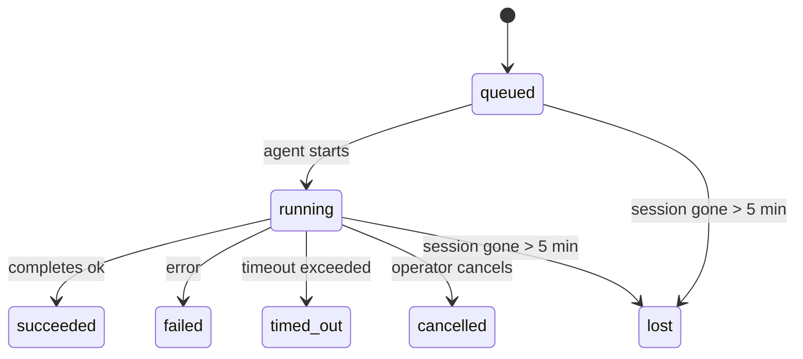

---
read_when:
    - Ispezione delle attività in background in corso o completate di recente
    - Debug degli errori di recapito per le esecuzioni di agenti scollegate
    - Comprendere come le esecuzioni in secondo piano si rapportano alle sessioni, a Cron e a Heartbeat
sidebarTitle: Background tasks
summary: Monitoraggio delle attività in background per esecuzioni ACP, subagenti, job Cron isolati e operazioni CLI
title: Attività in background
x-i18n:
    generated_at: "2026-05-06T08:40:01Z"
    model: gpt-5.5
    provider: openai
    source_hash: 055e16b4f53dbd089cc72eea7fe80bdaee5451dc56fa6e88a742f98e566bb57a
    source_path: automation/tasks.md
    workflow: 16
---

<Note>
Cerchi la pianificazione? Consulta [Automazione e attività](/it/automation) per scegliere il meccanismo giusto. Questa pagina è il registro delle attività per il lavoro in background, non lo scheduler.
</Note>

Le attività in background tracciano il lavoro eseguito **fuori dalla sessione di conversazione principale**: esecuzioni ACP, creazione di subagent, esecuzioni isolate di cron job e operazioni avviate dalla CLI.

Le attività **non** sostituiscono sessioni, cron job o Heartbeat: sono il **registro delle attività** che registra quale lavoro scollegato è avvenuto, quando e se è riuscito.

<Note>
Non ogni esecuzione di un agente crea un'attività. I turni Heartbeat e la normale chat interattiva non lo fanno. Tutte le esecuzioni cron, le creazioni ACP, le creazioni di subagent e i comandi agente della CLI sì.
</Note>

## TL;DR

- Le attività sono **record**, non scheduler: cron e Heartbeat decidono _quando_ il lavoro viene eseguito, le attività tracciano _che cosa è successo_.
- ACP, subagent, tutti i cron job e le operazioni CLI creano attività. I turni Heartbeat no.
- Ogni attività passa attraverso `queued → running → terminal` (succeeded, failed, timed_out, cancelled o lost).
- Le attività cron restano attive finché il runtime cron possiede ancora il job; se lo
  stato runtime in memoria non esiste più, la manutenzione delle attività controlla prima la cronologia durevole delle
  esecuzioni cron prima di contrassegnare un'attività come lost.
- Il completamento è guidato da push: il lavoro scollegato può notificare direttamente o riattivare la
  sessione/Heartbeat del richiedente quando termina, quindi i loop di polling dello stato sono
  di solito la forma sbagliata.
- Le esecuzioni cron isolate e i completamenti dei subagent puliscono al meglio le schede/processi del browser tracciati per la loro sessione figlia prima della contabilità finale di pulizia.
- La consegna cron isolata sopprime le risposte intermedie obsolete del genitore mentre il lavoro dei subagent discendenti è ancora in fase di svuotamento, e preferisce l'output finale del discendente quando arriva prima della consegna.
- Le notifiche di completamento vengono consegnate direttamente a un canale o messe in coda per il prossimo Heartbeat.
- `openclaw tasks list` mostra tutte le attività; `openclaw tasks audit` evidenzia i problemi.
- I record terminali vengono conservati per 7 giorni, poi eliminati automaticamente.

## Avvio rapido

<Tabs>
  <Tab title="Elenca e filtra">
    ```bash
    # List all tasks (newest first)
    openclaw tasks list

    # Filter by runtime or status
    openclaw tasks list --runtime acp
    openclaw tasks list --status running
    ```

  </Tab>
  <Tab title="Ispeziona">
    ```bash
    # Show details for a specific task (by ID, run ID, or session key)
    openclaw tasks show <lookup>
    ```
  </Tab>
  <Tab title="Annulla e notifica">
    ```bash
    # Cancel a running task (kills the child session)
    openclaw tasks cancel <lookup>

    # Change notification policy for a task
    openclaw tasks notify <lookup> state_changes
    ```

  </Tab>
  <Tab title="Audit e manutenzione">
    ```bash
    # Run a health audit
    openclaw tasks audit

    # Preview or apply maintenance
    openclaw tasks maintenance
    openclaw tasks maintenance --apply
    ```

  </Tab>
  <Tab title="Flusso attività">
    ```bash
    # Inspect TaskFlow state
    openclaw tasks flow list
    openclaw tasks flow show <lookup>
    openclaw tasks flow cancel <lookup>
    ```
  </Tab>
</Tabs>

## Che cosa crea un'attività

| Origine                | Tipo di runtime | Quando viene creato un record attività                  | Policy di notifica predefinita |
| ---------------------- | ------------ | ------------------------------------------------------ | --------------------- |
| Esecuzioni in background ACP | `acp`        | Creazione di una sessione ACP figlia                    | `done_only`           |
| Orchestrazione subagent | `subagent`   | Creazione di un subagent tramite `sessions_spawn`       | `done_only`           |
| Cron job (tutti i tipi) | `cron`       | Ogni esecuzione cron (sessione principale e isolata)    | `silent`              |
| Operazioni CLI         | `cli`        | Comandi `openclaw agent` eseguiti tramite il Gateway    | `silent`              |
| Job multimediali dell'agente | `cli`        | Esecuzioni `music_generate`/`video_generate` basate su sessione | `silent`              |

<AccordionGroup>
  <Accordion title="Impostazioni predefinite di notifica per cron e media">
    Le attività cron della sessione principale usano per impostazione predefinita la policy di notifica `silent`: creano record per il tracciamento ma non generano notifiche. Anche le attività cron isolate hanno come predefinita `silent`, ma sono più visibili perché vengono eseguite nella propria sessione.

    Anche le esecuzioni `music_generate` e `video_generate` basate su sessione usano la policy di notifica `silent`. Creano comunque record attività, ma il completamento viene restituito alla sessione agente originale come riattivazione interna, così l'agente può scrivere il messaggio di follow-up e allegare direttamente il media terminato. I completamenti di gruppo/canale seguono la normale policy di risposta visibile, quindi l'agente usa lo strumento di messaggistica quando la consegna di origine lo richiede. Se l'agente di completamento non produce prova di consegna tramite strumento di messaggistica in un percorso solo strumenti, OpenClaw invia il fallback di completamento direttamente al canale originale invece di lasciare il media privato.

  </Accordion>
  <Accordion title="Guardrail per video_generate concorrente">
    Mentre un'attività `video_generate` basata su sessione è ancora attiva, lo strumento funge anche da guardrail: chiamate ripetute a `video_generate` nella stessa sessione restituiscono lo stato dell'attività attiva invece di avviare una seconda generazione concorrente. Usa `action: "status"` quando vuoi una ricerca esplicita di avanzamento/stato dal lato agente.
  </Accordion>
  <Accordion title="Che cosa non crea attività">
    - Turni Heartbeat: sessione principale; vedi [Heartbeat](/it/gateway/heartbeat)
    - Normali turni di chat interattiva
    - Risposte dirette `/command`

  </Accordion>
</AccordionGroup>

## Ciclo di vita dell'attività



| Stato       | Che cosa significa                                                        |
| ----------- | -------------------------------------------------------------------------- |
| `queued`    | Creato, in attesa che l'agente si avvii                                   |
| `running`   | Il turno dell'agente è in esecuzione attiva                               |
| `succeeded` | Completato correttamente                                                   |
| `failed`    | Completato con un errore                                                   |
| `timed_out` | Ha superato il timeout configurato                                         |
| `cancelled` | Interrotto dall'operatore tramite `openclaw tasks cancel`                  |
| `lost`      | Il runtime ha perso lo stato di supporto autorevole dopo un periodo di tolleranza di 5 minuti |

Le transizioni avvengono automaticamente: quando l'esecuzione dell'agente associata termina, lo stato dell'attività viene aggiornato di conseguenza.

Il completamento dell'esecuzione dell'agente è autorevole per i record attività attivi. Un'esecuzione scollegata riuscita viene finalizzata come `succeeded`, gli errori ordinari di esecuzione vengono finalizzati come `failed` e gli esiti di timeout o interruzione vengono finalizzati come `timed_out`. Se un operatore ha già annullato l'attività, o il runtime ha già registrato uno stato terminale più forte come `failed`, `timed_out` o `lost`, un successivo segnale di successo non degrada quello stato terminale.

`lost` è consapevole del runtime:

- Attività ACP: i metadati della sessione figlia ACP di supporto sono scomparsi.
- Attività subagent: la sessione figlia di supporto è scomparsa dallo store dell'agente di destinazione.
- Attività cron: il runtime cron non traccia più il job come attivo e la cronologia durevole
  delle esecuzioni cron non mostra un risultato terminale per quell'esecuzione. L'audit CLI
  offline non tratta il proprio stato runtime cron in-process vuoto come autorevole.
- Attività CLI: le attività con sessione figlia isolata usano la sessione figlia; le attività CLI
  basate su chat usano invece il contesto di esecuzione live, quindi le righe persistenti di
  sessione canale/gruppo/diretta non le mantengono attive. Anche le esecuzioni `openclaw agent`
  basate su Gateway vengono finalizzate dal loro risultato di esecuzione, quindi le esecuzioni completate
  non restano attive finché lo sweeper le contrassegna come `lost`.

## Consegna e notifiche

Quando un'attività raggiunge uno stato terminale, OpenClaw ti notifica. Esistono due percorsi di consegna:

**Consegna diretta**: se l'attività ha un target di canale (il `requesterOrigin`), il messaggio di completamento va direttamente a quel canale (Telegram, Discord, Slack, ecc.). Per i completamenti dei subagent, OpenClaw conserva anche l'instradamento associato di thread/topic quando disponibile e può compilare un `to` / account mancante dalla route salvata della sessione richiedente (`lastChannel` / `lastTo` / `lastAccountId`) prima di rinunciare alla consegna diretta.

**Consegna accodata nella sessione**: se la consegna diretta fallisce o non è impostata alcuna origine, l'aggiornamento viene accodato come evento di sistema nella sessione del richiedente e riemerge al prossimo Heartbeat.

<Tip>
Il completamento dell'attività attiva una riattivazione immediata di Heartbeat, così vedi rapidamente il risultato: non devi attendere il prossimo tick Heartbeat pianificato.
</Tip>

Ciò significa che il flusso di lavoro usuale è basato su push: avvia una volta il lavoro scollegato, poi lascia che il runtime ti riattivi o ti notifichi al completamento. Esegui il polling dello stato dell'attività solo quando hai bisogno di debug, intervento o audit esplicito.

### Policy di notifica

Controlla quanto vuoi essere informato su ogni attività:

| Policy                | Che cosa viene consegnato                                               |
| --------------------- | ----------------------------------------------------------------------- |
| `done_only` (predefinita) | Solo stato terminale (succeeded, failed, ecc.): **questa è l'impostazione predefinita** |
| `state_changes`       | Ogni transizione di stato e aggiornamento di avanzamento                 |
| `silent`              | Nulla                                                                    |

Modifica la policy mentre un'attività è in esecuzione:

```bash
openclaw tasks notify <lookup> state_changes
```

## Riferimento CLI

<AccordionGroup>
  <Accordion title="tasks list">
    ```bash
    openclaw tasks list [--runtime <acp|subagent|cron|cli>] [--status <status>] [--json]
    ```

    Colonne di output: ID attività, Tipo, Stato, Consegna, ID esecuzione, Sessione figlia, Riepilogo.

  </Accordion>
  <Accordion title="tasks show">
    ```bash
    openclaw tasks show <lookup>
    ```

    Il token di ricerca accetta un ID attività, ID esecuzione o chiave di sessione. Mostra il record completo, inclusi tempi, stato di consegna, errore e riepilogo terminale.

  </Accordion>
  <Accordion title="tasks cancel">
    ```bash
    openclaw tasks cancel <lookup>
    ```

    Per attività ACP e subagent, questo termina la sessione figlia. Per le attività tracciate dalla CLI, l'annullamento viene registrato nel registro attività (non esiste un handle runtime figlio separato). Lo stato passa a `cancelled` e, quando applicabile, viene inviata una notifica di consegna.

  </Accordion>
  <Accordion title="tasks notify">
    ```bash
    openclaw tasks notify <lookup> <done_only|state_changes|silent>
    ```
  </Accordion>
  <Accordion title="tasks audit">
    ```bash
    openclaw tasks audit [--json]
    ```

    Evidenzia problemi operativi. I risultati appaiono anche in `openclaw status` quando vengono rilevati problemi.

    | Riscontro                 | Gravità    | Attivatore                                                                                                      |
    | ------------------------- | ---------- | ------------------------------------------------------------------------------------------------------------ |
    | `stale_queued`            | warn       | In coda da più di 10 minuti                                                                              |
    | `stale_running`           | error      | In esecuzione da più di 30 minuti                                                                             |
    | `lost`                    | warn/error | La proprietà dell'attività supportata dal runtime è scomparsa; le attività perse mantenute generano avvisi fino a `cleanupAfter`, poi diventano errori |
    | `delivery_failed`         | warn       | La consegna non è riuscita e la policy di notifica non è `silent`                                                            |
    | `missing_cleanup`         | warn       | Attività terminale senza timestamp di pulizia                                                                      |
    | `inconsistent_timestamps` | warn       | Violazione della sequenza temporale (per esempio terminata prima di essere avviata)                                                        |

  </Accordion>
  <Accordion title="tasks maintenance">
    ```bash
    openclaw tasks maintenance [--json]
    openclaw tasks maintenance --apply [--json]
    ```

    Usalo per visualizzare in anteprima o applicare riconciliazione, marcatura della pulizia e pruning per le attività e lo stato di Task Flow.

    La riconciliazione è consapevole del runtime:

    - Le attività ACP/subagent controllano la sessione figlia di supporto.
    - Le attività subagent la cui sessione figlia ha una tombstone di recupero dopo il riavvio vengono contrassegnate come perse invece di essere trattate come sessioni di supporto recuperabili.
    - Le attività Cron controllano se il runtime cron possiede ancora il job, poi recuperano lo stato terminale dai log di esecuzione cron persistiti/dallo stato del job prima di ricadere su `lost`. Solo il processo Gateway è autorevole per l'insieme in memoria dei job cron attivi; l'audit CLI offline usa la cronologia durevole ma non contrassegna un'attività cron come persa solo perché quel Set locale è vuoto.
    - Le attività CLI supportate dalla chat controllano il contesto di esecuzione live proprietario, non solo la riga della sessione chat.

    Anche la pulizia al completamento è consapevole del runtime:

    - Il completamento subagent chiude con il massimo impegno possibile le schede del browser/i processi tracciati per la sessione figlia prima che la pulizia dell'annuncio continui.
    - Il completamento cron isolato chiude con il massimo impegno possibile le schede del browser/i processi tracciati per la sessione cron prima che l'esecuzione venga completamente smantellata.
    - La consegna cron isolata attende, quando necessario, il follow-up del subagent discendente e sopprime il testo di conferma del genitore obsoleto invece di annunciarlo.
    - La consegna del completamento subagent preferisce l'ultimo testo visibile dell'assistente; se è vuoto, ricade sull'ultimo testo tool/toolResult sanificato, e le esecuzioni con sole chiamate tool scadute per timeout possono ridursi a un breve riepilogo di avanzamento parziale. Le esecuzioni terminali non riuscite annunciano lo stato di errore senza riprodurre il testo della risposta catturata.
    - Gli errori di pulizia non mascherano il risultato reale dell'attività.

  </Accordion>
  <Accordion title="tasks flow list | show | cancel">
    ```bash
    openclaw tasks flow list [--status <status>] [--json]
    openclaw tasks flow show <lookup> [--json]
    openclaw tasks flow cancel <lookup>
    ```

    Usa questi comandi quando ciò che ti interessa è il Task Flow di orchestrazione, invece di un singolo record di attività in background.

  </Accordion>
</AccordionGroup>

## Bacheca delle attività chat (`/tasks`)

Usa `/tasks` in qualsiasi sessione chat per vedere le attività in background collegate a quella sessione. La bacheca mostra le attività attive e completate di recente con runtime, stato, tempistiche e dettagli di avanzamento o errore.

Quando la sessione corrente non ha attività collegate visibili, `/tasks` ricade sui conteggi delle attività locali dell'agente, così ottieni comunque una panoramica senza esporre dettagli di altre sessioni.

Per il registro operativo completo, usa la CLI: `openclaw tasks list`.

## Integrazione dello stato (pressione delle attività)

`openclaw status` include un riepilogo immediato delle attività:

```
Tasks: 3 queued · 2 running · 1 issues
```

Il riepilogo riporta:

- **attive** - conteggio di `queued` + `running`
- **errori** - conteggio di `failed` + `timed_out` + `lost`
- **byRuntime** - suddivisione per `acp`, `subagent`, `cron`, `cli`

Sia `/status` sia lo strumento `session_status` usano uno snapshot delle attività consapevole della pulizia: le attività attive sono preferite, le righe completate obsolete vengono nascoste e gli errori recenti emergono solo quando non resta alcun lavoro attivo. Questo mantiene la scheda di stato focalizzata su ciò che conta in questo momento.

## Archiviazione e manutenzione

### Dove vivono le attività

I record delle attività persistono in SQLite in:

```
$OPENCLAW_STATE_DIR/tasks/runs.sqlite
```

Il registro viene caricato in memoria all'avvio del Gateway e sincronizza le scritture su SQLite per garantire durabilità tra i riavvii.
Il Gateway mantiene limitato il log write-ahead di SQLite usando la soglia predefinita di autocheckpoint di SQLite più checkpoint periodici e di arresto `TRUNCATE`.

### Manutenzione automatica

Uno sweeper viene eseguito ogni **60 secondi** e gestisce quattro cose:

<Steps>
  <Step title="Reconciliation">
    Controlla se le attività attive hanno ancora un supporto autorevole del runtime. Le attività ACP/subagent usano lo stato della sessione figlia, le attività cron usano la proprietà dei job attivi e le attività CLI supportate dalla chat usano il contesto di esecuzione proprietario. Se quello stato di supporto scompare per più di 5 minuti, l'attività viene contrassegnata come `lost`.
  </Step>
  <Step title="ACP session repair">
    Chiude le sessioni ACP one-shot terminali o orfane possedute dal genitore, e chiude le sessioni ACP persistenti terminali obsolete o orfane solo quando non rimane alcun binding di conversazione attivo.
  </Step>
  <Step title="Cleanup stamping">
    Imposta un timestamp `cleanupAfter` sulle attività terminali (endedAt + 7 giorni). Durante la conservazione, le attività perse appaiono ancora nell'audit come avvisi; dopo la scadenza di `cleanupAfter` o quando i metadati di pulizia mancano, sono errori.
  </Step>
  <Step title="Pruning">
    Elimina i record oltre la loro data `cleanupAfter`.
  </Step>
</Steps>

<Note>
**Conservazione:** i record delle attività terminali vengono mantenuti per **7 giorni**, poi eliminati automaticamente. Non è necessaria alcuna configurazione.
</Note>

## Come le attività si collegano ad altri sistemi

<AccordionGroup>
  <Accordion title="Tasks and Task Flow">
    [Task Flow](/it/automation/taskflow) è il livello di orchestrazione dei flussi sopra le attività in background. Un singolo flusso può coordinare più attività durante il proprio ciclo di vita usando modalità di sincronizzazione gestite o mirror. Usa `openclaw tasks` per ispezionare i singoli record di attività e `openclaw tasks flow` per ispezionare il flusso di orchestrazione.

    Vedi [Task Flow](/it/automation/taskflow) per i dettagli.

  </Accordion>
  <Accordion title="Tasks and cron">
    Una **definizione** di job cron vive in `~/.openclaw/cron/jobs.json`; lo stato di esecuzione runtime vive accanto ad essa in `~/.openclaw/cron/jobs-state.json`. **Ogni** esecuzione cron crea un record di attività, sia in sessione principale sia isolata. Le attività cron in sessione principale usano per impostazione predefinita la policy di notifica `silent`, così vengono tracciate senza generare notifiche.

    Vedi [Cron Jobs](/it/automation/cron-jobs).

  </Accordion>
  <Accordion title="Tasks and heartbeat">
    Le esecuzioni Heartbeat sono turni della sessione principale: non creano record di attività. Quando un'attività viene completata, può attivare un risveglio Heartbeat così vedi prontamente il risultato.

    Vedi [Heartbeat](/it/gateway/heartbeat).

  </Accordion>
  <Accordion title="Tasks and sessions">
    Un'attività può fare riferimento a una `childSessionKey` (dove viene eseguito il lavoro) e a una `requesterSessionKey` (chi l'ha avviata). Le sessioni sono il contesto della conversazione; le attività sono il tracciamento dell'attività sopra quel livello.
  </Accordion>
  <Accordion title="Tasks and agent runs">
    Il `runId` di un'attività si collega all'esecuzione dell'agente che svolge il lavoro. Gli eventi del ciclo di vita dell'agente (avvio, fine, errore) aggiornano automaticamente lo stato dell'attività: non è necessario gestire manualmente il ciclo di vita.
  </Accordion>
</AccordionGroup>

## Correlati

- [Automazione e attività](/it/automation) - tutti i meccanismi di automazione in sintesi
- [CLI: Attività](/it/cli/tasks) - riferimento dei comandi CLI
- [Heartbeat](/it/gateway/heartbeat) - turni periodici della sessione principale
- [Attività pianificate](/it/automation/cron-jobs) - pianificazione del lavoro in background
- [Task Flow](/it/automation/taskflow) - orchestrazione dei flussi sopra le attività
