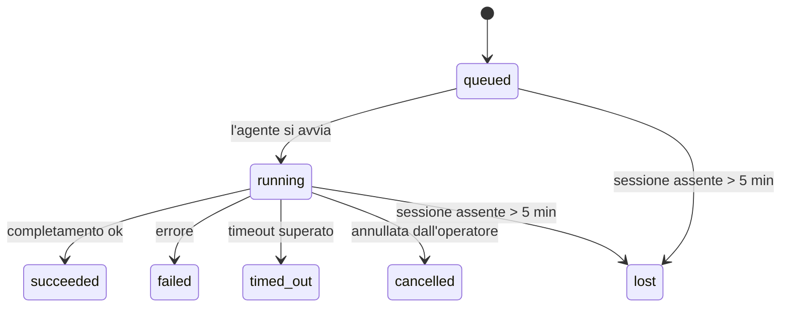

---
read_when:
    - Ispezione delle attività in background in corso o completate di recente
    - Debug dei fallimenti di consegna per le esecuzioni di agenti scollegate
    - Comprendere come le esecuzioni in background si relazionano a sessioni, Cron e Heartbeat
summary: Tracciamento delle attività in background per le esecuzioni ACP, i subagenti, i processi Cron isolati e le operazioni CLI
title: Attività in background
x-i18n:
    generated_at: "2026-04-23T08:23:11Z"
    model: gpt-5.4
    provider: openai
    source_hash: 5cd0b0db6c20cc677aa5cc50c42e09043d4354e026ca33c020d804761c331413
    source_path: automation/tasks.md
    workflow: 15
---

# Attività in background

> **Cerchi la pianificazione?** Consulta [Automazione e attività](/it/automation) per scegliere il meccanismo giusto. Questa pagina tratta il **tracciamento** del lavoro in background, non la sua pianificazione.

Le attività in background tracciano il lavoro eseguito **al di fuori della tua sessione di conversazione principale**:
esecuzioni ACP, avvii di subagenti, esecuzioni isolate di processi Cron e operazioni avviate dalla CLI.

Le attività **non** sostituiscono sessioni, processi Cron o Heartbeat — sono il **registro delle attività** che annota quale lavoro scollegato è avvenuto, quando e se è andato a buon fine.

<Note>
Non tutte le esecuzioni degli agenti creano un'attività. I turni Heartbeat e la normale chat interattiva no. Tutte le esecuzioni Cron, gli avvii ACP, gli avvii di subagenti e i comandi agente della CLI sì.
</Note>

## In breve

- Le attività sono **record**, non pianificatori — Cron e Heartbeat decidono _quando_ viene eseguito il lavoro, le attività tracciano _cosa è successo_.
- ACP, subagenti, tutti i processi Cron e le operazioni CLI creano attività. I turni Heartbeat no.
- Ogni attività passa attraverso `queued → running → terminal` (succeeded, failed, timed_out, cancelled o lost).
- Le attività Cron restano attive finché il runtime Cron possiede ancora il job; le attività CLI supportate dalla chat restano attive solo finché il relativo contesto di esecuzione è ancora attivo.
- Il completamento è guidato da push: il lavoro scollegato può notificare direttamente o riattivare la sessione/Heartbeat del richiedente quando termina, quindi i loop di polling dello stato di solito non sono l'approccio giusto.
- Le esecuzioni Cron isolate e i completamenti dei subagenti puliscono, per quanto possibile, le schede/processi del browser tracciati per la loro sessione figlia prima della pulizia finale.
- La consegna delle esecuzioni Cron isolate sopprime le risposte intermedie obsolete del genitore mentre il lavoro dei subagenti discendenti è ancora in smaltimento, e preferisce l'output finale del discendente se arriva prima della consegna.
- Le notifiche di completamento vengono recapitate direttamente a un canale o messe in coda per il prossimo Heartbeat.
- `openclaw tasks list` mostra tutte le attività; `openclaw tasks audit` evidenzia i problemi.
- I record terminali vengono conservati per 7 giorni, poi eliminati automaticamente.

## Avvio rapido

```bash
# Elenca tutte le attività (prima le più recenti)
openclaw tasks list

# Filtra per runtime o stato
openclaw tasks list --runtime acp
openclaw tasks list --status running

# Mostra i dettagli di un'attività specifica (per ID, run ID o chiave sessione)
openclaw tasks show <lookup>

# Annulla un'attività in esecuzione (termina la sessione figlia)
openclaw tasks cancel <lookup>

# Cambia la policy di notifica per un'attività
openclaw tasks notify <lookup> state_changes

# Esegui un audit di integrità
openclaw tasks audit

# Anteprima o applicazione della manutenzione
openclaw tasks maintenance
openclaw tasks maintenance --apply

# Ispeziona lo stato di TaskFlow
openclaw tasks flow list
openclaw tasks flow show <lookup>
openclaw tasks flow cancel <lookup>
```

## Cosa crea un'attività

| Origine                | Tipo di runtime | Quando viene creato un record di attività                  | Policy di notifica predefinita |
| ---------------------- | --------------- | ---------------------------------------------------------- | ------------------------------ |
| Esecuzioni ACP in background | `acp`           | Avvio di una sessione ACP figlia                           | `done_only`                    |
| Orchestrazione di subagenti | `subagent`      | Avvio di un subagente tramite `sessions_spawn`             | `done_only`                    |
| Processi Cron (tutti i tipi) | `cron`          | Ogni esecuzione Cron (sessione principale e isolata)       | `silent`                       |
| Operazioni CLI         | `cli`           | Comandi `openclaw agent` eseguiti tramite il Gateway       | `silent`                       |
| Job multimediali dell'agente | `cli`           | Esecuzioni `video_generate` supportate da sessione         | `silent`                       |

Le attività Cron della sessione principale usano per impostazione predefinita la policy di notifica `silent` — creano record per il tracciamento ma non generano notifiche. Anche le attività Cron isolate usano per impostazione predefinita `silent`, ma sono più visibili perché vengono eseguite in una propria sessione.

Anche le esecuzioni `video_generate` supportate da sessione usano la policy di notifica `silent`. Creano comunque record di attività, ma il completamento viene restituito alla sessione agente originale come riattivazione interna, così l'agente può scrivere il messaggio di follow-up e allegare direttamente il video completato. Se abiliti `tools.media.asyncCompletion.directSend`, i completamenti asincroni di `music_generate` e `video_generate` provano prima il recapito diretto al canale, per poi ripiegare sul percorso di riattivazione della sessione richiedente.

Mentre un'attività `video_generate` supportata da sessione è ancora attiva, lo strumento funge anche da protezione: chiamate ripetute a `video_generate` nella stessa sessione restituiscono lo stato dell'attività attiva invece di avviare una seconda generazione concorrente. Usa `action: "status"` quando vuoi una ricerca esplicita di avanzamento/stato dal lato agente.

**Cosa non crea attività:**

- Turni Heartbeat — sessione principale; vedi [Heartbeat](/it/gateway/heartbeat)
- Normali turni di chat interattiva
- Risposte dirette a `/command`

## Ciclo di vita dell'attività



| Stato       | Cosa significa                                                             |
| ----------- | -------------------------------------------------------------------------- |
| `queued`    | Creata, in attesa che l'agente si avvii                                    |
| `running`   | Il turno dell'agente è in esecuzione attiva                                |
| `succeeded` | Completata con successo                                                    |
| `failed`    | Completata con un errore                                                   |
| `timed_out` | Ha superato il timeout configurato                                         |
| `cancelled` | Interrotta dall'operatore tramite `openclaw tasks cancel`                  |
| `lost`      | Il runtime ha perso lo stato autorevole di supporto dopo un periodo di tolleranza di 5 minuti |

Le transizioni avvengono automaticamente — quando l'esecuzione dell'agente associata termina, lo stato dell'attività viene aggiornato di conseguenza.

`lost` dipende dal runtime:

- Attività ACP: i metadati della sessione figlia ACP di supporto sono scomparsi.
- Attività dei subagenti: la sessione figlia di supporto è scomparsa dall'archivio dell'agente di destinazione.
- Attività Cron: il runtime Cron non tiene più traccia del job come attivo.
- Attività CLI: le attività isolate della sessione figlia usano la sessione figlia; le attività CLI supportate dalla chat usano invece il contesto di esecuzione live, quindi righe persistenti di sessione canale/gruppo/diretta non le mantengono attive.

## Consegna e notifiche

Quando un'attività raggiunge uno stato terminale, OpenClaw ti invia una notifica. Ci sono due percorsi di consegna:

**Consegna diretta** — se l'attività ha una destinazione di canale (la `requesterOrigin`), il messaggio di completamento viene inviato direttamente a quel canale (Telegram, Discord, Slack, ecc.). Per i completamenti dei subagenti, OpenClaw conserva anche l'instradamento verso thread/topic associati quando disponibile e può colmare un `to` / account mancante dalla route memorizzata della sessione richiedente (`lastChannel` / `lastTo` / `lastAccountId`) prima di rinunciare alla consegna diretta.

**Consegna in coda alla sessione** — se la consegna diretta fallisce o non è impostata alcuna origine, l'aggiornamento viene messo in coda come evento di sistema nella sessione del richiedente e appare al prossimo Heartbeat.

<Tip>
Il completamento dell'attività attiva un risveglio immediato di Heartbeat così vedi rapidamente il risultato — non devi aspettare il prossimo tick Heartbeat pianificato.
</Tip>

Questo significa che il normale flusso di lavoro è basato su push: avvia una volta il lavoro scollegato, poi lascia che il runtime ti riattivi o notifichi il completamento. Interroga lo stato dell'attività solo quando ti servono debug, interventi o un audit esplicito.

### Policy di notifica

Controlla quante informazioni ricevi per ogni attività:

| Policy                | Cosa viene consegnato                                                     |
| --------------------- | ------------------------------------------------------------------------- |
| `done_only` (predefinita) | Solo lo stato terminale (succeeded, failed, ecc.) — **questa è la predefinita** |
| `state_changes`       | Ogni transizione di stato e aggiornamento di avanzamento                  |
| `silent`              | Nulla                                                                     |

Cambia la policy mentre un'attività è in esecuzione:

```bash
openclaw tasks notify <lookup> state_changes
```

## Riferimento CLI

### `tasks list`

```bash
openclaw tasks list [--runtime <acp|subagent|cron|cli>] [--status <status>] [--json]
```

Colonne dell'output: ID attività, tipo, stato, consegna, Run ID, sessione figlia, riepilogo.

### `tasks show`

```bash
openclaw tasks show <lookup>
```

Il token di lookup accetta un ID attività, un run ID o una chiave sessione. Mostra il record completo inclusi tempi, stato della consegna, errore e riepilogo terminale.

### `tasks cancel`

```bash
openclaw tasks cancel <lookup>
```

Per le attività ACP e dei subagenti, questo termina la sessione figlia. Per le attività tracciate dalla CLI, l'annullamento viene registrato nel registro delle attività (non esiste un handle di runtime figlio separato). Lo stato passa a `cancelled` e viene inviata una notifica di consegna quando applicabile.

### `tasks notify`

```bash
openclaw tasks notify <lookup> <done_only|state_changes|silent>
```

### `tasks audit`

```bash
openclaw tasks audit [--json]
```

Evidenzia problemi operativi. I risultati compaiono anche in `openclaw status` quando vengono rilevati problemi.

| Risultato                  | Gravità | Attivazione                                           |
| -------------------------- | ------- | ----------------------------------------------------- |
| `stale_queued`             | warn    | In coda da più di 10 minuti                           |
| `stale_running`            | error   | In esecuzione da più di 30 minuti                     |
| `lost`                     | error   | La proprietà dell'attività supportata dal runtime è scomparsa |
| `delivery_failed`          | warn    | La consegna è fallita e la policy di notifica non è `silent` |
| `missing_cleanup`          | warn    | Attività terminale senza timestamp di pulizia         |
| `inconsistent_timestamps`  | warn    | Violazione della timeline (ad esempio terminata prima di iniziare) |

### `tasks maintenance`

```bash
openclaw tasks maintenance [--json]
openclaw tasks maintenance --apply [--json]
```

Usalo per vedere in anteprima o applicare riconciliazione, marcatura della pulizia ed eliminazione per le attività e lo stato di TaskFlow.

La riconciliazione dipende dal runtime:

- Le attività ACP/subagent controllano la loro sessione figlia di supporto.
- Le attività Cron verificano se il runtime Cron possiede ancora il job.
- Le attività CLI supportate dalla chat verificano il contesto di esecuzione live proprietario, non solo la riga della sessione chat.

Anche la pulizia al completamento dipende dal runtime:

- Il completamento dei subagenti chiude, per quanto possibile, schede/processi del browser tracciati per la sessione figlia prima che continui la pulizia dell'annuncio.
- Il completamento Cron isolato chiude, per quanto possibile, schede/processi del browser tracciati per la sessione Cron prima che l'esecuzione venga completamente smantellata.
- La consegna Cron isolata attende, quando necessario, il follow-up dei subagenti discendenti e sopprime il testo di conferma obsoleto del genitore invece di annunciarlo.
- La consegna del completamento dei subagenti preferisce l'ultimo testo visibile dell'assistente; se questo è vuoto ripiega sull'ultimo testo sanificato di tool/toolResult, e le esecuzioni con sole chiamate tool terminate per timeout possono essere ridotte a un breve riepilogo del progresso parziale. Le esecuzioni terminali fallite annunciano lo stato di errore senza riprodurre il testo di risposta catturato.
- I fallimenti della pulizia non mascherano il reale esito dell'attività.

### `tasks flow list|show|cancel`

```bash
openclaw tasks flow list [--status <status>] [--json]
openclaw tasks flow show <lookup> [--json]
openclaw tasks flow cancel <lookup>
```

Usa questi comandi quando ciò che ti interessa è il TaskFlow di orchestrazione anziché il singolo record di attività in background.

## Bacheca attività in chat (`/tasks`)

Usa `/tasks` in qualsiasi sessione di chat per vedere le attività in background collegate a quella sessione. La bacheca mostra
attività attive e completate di recente con runtime, stato, tempi e dettagli su avanzamento o errore.

Quando la sessione corrente non ha attività collegate visibili, `/tasks` torna ai conteggi delle attività locali dell'agente
così ottieni comunque una panoramica senza esporre dettagli di altre sessioni.

Per il registro operativo completo, usa la CLI: `openclaw tasks list`.

## Integrazione dello stato (pressione delle attività)

`openclaw status` include un riepilogo delle attività visibile a colpo d'occhio:

```
Tasks: 3 queued · 2 running · 1 issues
```

Il riepilogo riporta:

- **active** — conteggio di `queued` + `running`
- **failures** — conteggio di `failed` + `timed_out` + `lost`
- **byRuntime** — suddivisione per `acp`, `subagent`, `cron`, `cli`

Sia `/status` sia lo strumento `session_status` usano uno snapshot delle attività consapevole della pulizia: vengono
privilegiate le attività attive, le righe completate obsolete vengono nascoste e i guasti recenti emergono solo quando non
rimane alcun lavoro attivo. Questo mantiene la scheda di stato concentrata su ciò che conta in questo momento.

## Archiviazione e manutenzione

### Dove risiedono le attività

I record delle attività persistono in SQLite in:

```
$OPENCLAW_STATE_DIR/tasks/runs.sqlite
```

Il registro viene caricato in memoria all'avvio del Gateway e sincronizza le scritture su SQLite per garantire la durabilità attraverso i riavvii.

### Manutenzione automatica

Uno sweeper viene eseguito ogni **60 secondi** e gestisce tre aspetti:

1. **Riconciliazione** — controlla se le attività attive hanno ancora un supporto runtime autorevole. Le attività ACP/subagent usano lo stato della sessione figlia, le attività Cron usano la proprietà del job attivo e le attività CLI supportate dalla chat usano il contesto di esecuzione proprietario. Se questo stato di supporto manca per più di 5 minuti, l'attività viene contrassegnata come `lost`.
2. **Marcatura della pulizia** — imposta un timestamp `cleanupAfter` sulle attività terminali (`endedAt + 7 days`).
3. **Eliminazione** — elimina i record oltre la data `cleanupAfter`.

**Conservazione**: i record delle attività terminali vengono conservati per **7 giorni**, poi eliminati automaticamente. Non serve alcuna configurazione.

## Come le attività si relazionano ad altri sistemi

### Attività e TaskFlow

[TaskFlow](/it/automation/taskflow) è il livello di orchestrazione dei flussi sopra le attività in background. Un singolo flusso può coordinare più attività nel corso della sua vita usando modalità di sincronizzazione gestite o specchiate. Usa `openclaw tasks` per ispezionare i singoli record di attività e `openclaw tasks flow` per ispezionare il flusso di orchestrazione.

Vedi [TaskFlow](/it/automation/taskflow) per i dettagli.

### Attività e Cron

Una **definizione** di job Cron risiede in `~/.openclaw/cron/jobs.json`; lo stato di esecuzione runtime risiede accanto in `~/.openclaw/cron/jobs-state.json`. **Ogni** esecuzione Cron crea un record di attività — sia nella sessione principale sia in modalità isolata. Le attività Cron della sessione principale usano per impostazione predefinita la policy di notifica `silent`, così vengono tracciate senza generare notifiche.

Vedi [Processi Cron](/it/automation/cron-jobs).

### Attività e Heartbeat

Le esecuzioni Heartbeat sono turni della sessione principale — non creano record di attività. Quando un'attività viene completata, può attivare un risveglio Heartbeat così vedi rapidamente il risultato.

Vedi [Heartbeat](/it/gateway/heartbeat).

### Attività e sessioni

Un'attività può fare riferimento a una `childSessionKey` (dove viene eseguito il lavoro) e a una `requesterSessionKey` (chi l'ha avviata). Le sessioni sono il contesto della conversazione; le attività sono il tracciamento delle attività sopra tale contesto.

### Attività ed esecuzioni degli agenti

Il `runId` di un'attività collega l'esecuzione dell'agente che svolge il lavoro. Gli eventi del ciclo di vita dell'agente (avvio, fine, errore) aggiornano automaticamente lo stato dell'attività — non devi gestire manualmente il ciclo di vita.

## Correlati

- [Automazione e attività](/it/automation) — tutti i meccanismi di automazione in sintesi
- [TaskFlow](/it/automation/taskflow) — orchestrazione dei flussi sopra le attività
- [Attività pianificate](/it/automation/cron-jobs) — pianificazione del lavoro in background
- [Heartbeat](/it/gateway/heartbeat) — turni periodici della sessione principale
- [CLI: Tasks](/it/cli/tasks) — riferimento ai comandi CLI
