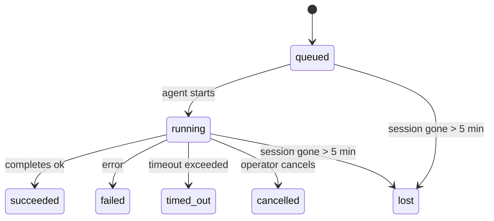

---
read_when:
    - Ispezione delle attività in background in corso o completate di recente
    - Debug degli errori di recapito per le esecuzioni di agenti scollegate
    - Comprendere come le esecuzioni in background si rapportano a sessioni, Cron e Heartbeat
sidebarTitle: Background tasks
summary: Tracciamento delle attività in background per esecuzioni ACP, subagenti, attività Cron isolate e operazioni CLI
title: Attività in secondo piano
x-i18n:
    generated_at: "2026-04-30T16:28:02Z"
    model: gpt-5.5
    provider: openai
    source_hash: 999653c9360323d5135e33193c76458cba8c288227de46a6217f1ccbed2a6d34
    source_path: automation/tasks.md
    workflow: 16
---

<Note>
Cerchi la pianificazione? Consulta [Automazione e attività](/it/automation) per scegliere il meccanismo giusto. Questa pagina è il registro delle attività per il lavoro in background, non il pianificatore.
</Note>

Le attività in background tracciano il lavoro eseguito **fuori dalla sessione di conversazione principale**: esecuzioni ACP, generazione di sottoagenti, esecuzioni isolate di cron job e operazioni avviate dalla CLI.

Le attività **non** sostituiscono sessioni, cron job o heartbeat: sono il **registro delle attività** che registra quale lavoro scollegato è avvenuto, quando e se è riuscito.

<Note>
Non ogni esecuzione dell'agente crea un'attività. I turni Heartbeat e la normale chat interattiva non lo fanno. Tutte le esecuzioni Cron, le generazioni ACP, le generazioni di sottoagenti e i comandi agente della CLI sì.
</Note>

## TL;DR

- Le attività sono **record**, non pianificatori: Cron e Heartbeat decidono _quando_ viene eseguito il lavoro, le attività tracciano _cosa è successo_.
- ACP, sottoagenti, tutti i cron job e le operazioni CLI creano attività. I turni Heartbeat no.
- Ogni attività passa attraverso `queued → running → terminal` (succeeded, failed, timed_out, cancelled o lost).
- Le attività Cron restano attive finché il runtime Cron possiede ancora il job; se lo stato runtime in memoria è scomparso, la manutenzione delle attività controlla prima la cronologia durevole delle esecuzioni Cron prima di contrassegnare un'attività come persa.
- Il completamento è basato su push: il lavoro scollegato può notificare direttamente o risvegliare la sessione/Heartbeat richiedente al termine, quindi i cicli di polling dello stato di solito sono la forma sbagliata.
- Le esecuzioni Cron isolate e i completamenti dei sottoagenti tentano al meglio di ripulire schede/processi del browser tracciati per la sessione figlia prima della contabilità finale di pulizia.
- La consegna Cron isolata sopprime le risposte provvisorie obsolete del genitore mentre il lavoro dei sottoagenti discendenti è ancora in fase di svuotamento, e preferisce l'output finale del discendente quando arriva prima della consegna.
- Le notifiche di completamento vengono consegnate direttamente a un canale o accodate per il prossimo Heartbeat.
- `openclaw tasks list` mostra tutte le attività; `openclaw tasks audit` evidenzia i problemi.
- I record terminali vengono conservati per 7 giorni, poi eliminati automaticamente.

## Avvio rapido

<Tabs>
  <Tab title="Elenca e filtra">
    ```bash
    # List all tasks (newest first)
    openclaw tasks list

    # Filter by runtime or status
    openclaw tasks list --runtime acp
    openclaw tasks list --status running
    ```

  </Tab>
  <Tab title="Ispeziona">
    ```bash
    # Show details for a specific task (by ID, run ID, or session key)
    openclaw tasks show <lookup>
    ```
  </Tab>
  <Tab title="Annulla e notifica">
    ```bash
    # Cancel a running task (kills the child session)
    openclaw tasks cancel <lookup>

    # Change notification policy for a task
    openclaw tasks notify <lookup> state_changes
    ```

  </Tab>
  <Tab title="Audit e manutenzione">
    ```bash
    # Run a health audit
    openclaw tasks audit

    # Preview or apply maintenance
    openclaw tasks maintenance
    openclaw tasks maintenance --apply
    ```

  </Tab>
  <Tab title="Flusso attività">
    ```bash
    # Inspect TaskFlow state
    openclaw tasks flow list
    openclaw tasks flow show <lookup>
    openclaw tasks flow cancel <lookup>
    ```
  </Tab>
</Tabs>

## Cosa crea un'attività

| Origine                | Tipo di runtime | Quando viene creato un record attività                 | Criterio di notifica predefinito |
| ---------------------- | --------------- | ------------------------------------------------------ | -------------------------------- |
| Esecuzioni ACP in background | `acp`        | Generazione di una sessione figlia ACP                 | `done_only`                      |
| Orchestrazione di sottoagenti | `subagent`   | Generazione di un sottoagente tramite `sessions_spawn` | `done_only`                      |
| Cron job (tutti i tipi) | `cron`          | Ogni esecuzione Cron (sessione principale e isolata)   | `silent`                         |
| Operazioni CLI         | `cli`           | Comandi `openclaw agent` eseguiti tramite il gateway   | `silent`                         |
| Job multimediali agente | `cli`           | Esecuzioni `video_generate` basate su sessione         | `silent`                         |

<AccordionGroup>
  <Accordion title="Impostazioni predefinite di notifica per Cron e contenuti multimediali">
    Le attività Cron della sessione principale usano il criterio di notifica `silent` per impostazione predefinita: creano record per il tracciamento ma non generano notifiche. Anche le attività Cron isolate hanno `silent` come impostazione predefinita, ma sono più visibili perché vengono eseguite nella propria sessione.

    Anche le esecuzioni `video_generate` basate su sessione usano il criterio di notifica `silent`. Creano comunque record attività, ma il completamento viene restituito alla sessione agente originale come risveglio interno, così l'agente può scrivere il messaggio di follow-up e allegare da solo il video completato. Se attivi `tools.media.asyncCompletion.directSend`, i completamenti asincroni di `music_generate` e `video_generate` tentano prima la consegna diretta al canale prima di ripiegare sul percorso di risveglio della sessione richiedente.

  </Accordion>
  <Accordion title="Protezione per video_generate concorrenti">
    Mentre un'attività `video_generate` basata su sessione è ancora attiva, lo strumento agisce anche come protezione: chiamate ripetute a `video_generate` nella stessa sessione restituiscono lo stato dell'attività attiva invece di avviare una seconda generazione concorrente. Usa `action: "status"` quando vuoi una ricerca esplicita di avanzamento/stato dal lato agente.
  </Accordion>
  <Accordion title="Cosa non crea attività">
    - Turni Heartbeat: sessione principale; vedi [Heartbeat](/it/gateway/heartbeat)
    - Normali turni di chat interattiva
    - Risposte dirette `/command`

  </Accordion>
</AccordionGroup>

## Ciclo di vita dell'attività



| Stato       | Cosa significa                                                            |
| ----------- | -------------------------------------------------------------------------- |
| `queued`    | Creata, in attesa dell'avvio dell'agente                                   |
| `running`   | Il turno dell'agente è in esecuzione attiva                                |
| `succeeded` | Completata correttamente                                                   |
| `failed`    | Completata con un errore                                                    |
| `timed_out` | Ha superato il timeout configurato                                          |
| `cancelled` | Fermata dall'operatore tramite `openclaw tasks cancel`                      |
| `lost`      | Il runtime ha perso lo stato di supporto autorevole dopo un periodo di tolleranza di 5 minuti |

Le transizioni avvengono automaticamente: quando l'esecuzione dell'agente associata termina, lo stato dell'attività viene aggiornato di conseguenza.

Il completamento dell'esecuzione dell'agente è autorevole per i record attività attivi. Un'esecuzione scollegata riuscita viene finalizzata come `succeeded`, gli errori ordinari di esecuzione come `failed` e gli esiti di timeout o interruzione come `timed_out`. Se un operatore ha già annullato l'attività, o il runtime ha già registrato uno stato terminale più forte come `failed`, `timed_out` o `lost`, un segnale di successo successivo non declassa quello stato terminale.

`lost` è consapevole del runtime:

- Attività ACP: i metadati della sessione figlia ACP di supporto sono scomparsi.
- Attività di sottoagenti: la sessione figlia di supporto è scomparsa dall'archivio dell'agente di destinazione.
- Attività Cron: il runtime Cron non traccia più il job come attivo e la cronologia durevole delle esecuzioni Cron non mostra un risultato terminale per quell'esecuzione. L'audit CLI offline non tratta il proprio stato runtime Cron in-process vuoto come autorità.
- Attività CLI: le attività con sessione figlia isolata usano la sessione figlia; le attività CLI basate su chat usano invece il contesto di esecuzione live, quindi righe persistenti di sessioni canale/gruppo/dirette non le mantengono attive. Anche le esecuzioni `openclaw agent` basate su Gateway vengono finalizzate dal risultato della loro esecuzione, quindi le esecuzioni completate non restano attive finché lo sweeper non le contrassegna come `lost`.

## Consegna e notifiche

Quando un'attività raggiunge uno stato terminale, OpenClaw ti avvisa. Esistono due percorsi di consegna:

**Consegna diretta**: se l'attività ha una destinazione di canale (il `requesterOrigin`), il messaggio di completamento va direttamente a quel canale (Telegram, Discord, Slack, ecc.). Per i completamenti dei sottoagenti, OpenClaw preserva anche l'instradamento vincolato di thread/topic quando disponibile e può riempire un `to` / account mancante dalla route memorizzata della sessione richiedente (`lastChannel` / `lastTo` / `lastAccountId`) prima di rinunciare alla consegna diretta.

**Consegna accodata alla sessione**: se la consegna diretta fallisce o non è impostata alcuna origine, l'aggiornamento viene accodato come evento di sistema nella sessione del richiedente e appare al prossimo Heartbeat.

<Tip>
Il completamento dell'attività attiva un risveglio Heartbeat immediato, così vedi rapidamente il risultato: non devi aspettare il prossimo tick Heartbeat pianificato.
</Tip>

Questo significa che il flusso di lavoro abituale è basato su push: avvia il lavoro scollegato una volta, poi lascia che il runtime ti risvegli o ti notifichi al completamento. Esegui il polling dello stato dell'attività solo quando ti servono debug, intervento o un audit esplicito.

### Criteri di notifica

Controlla quanto vuoi essere informato su ogni attività:

| Criterio              | Cosa viene consegnato                                                  |
| --------------------- | ----------------------------------------------------------------------- |
| `done_only` (predefinito) | Solo stato terminale (succeeded, failed, ecc.): **questo è il predefinito** |
| `state_changes`       | Ogni transizione di stato e aggiornamento di avanzamento                |
| `silent`              | Nulla                                                                   |

Modifica il criterio mentre un'attività è in esecuzione:

```bash
openclaw tasks notify <lookup> state_changes
```

## Riferimento CLI

<AccordionGroup>
  <Accordion title="tasks list">
    ```bash
    openclaw tasks list [--runtime <acp|subagent|cron|cli>] [--status <status>] [--json]
    ```

    Colonne di output: ID attività, Tipo, Stato, Consegna, ID esecuzione, Sessione figlia, Riepilogo.

  </Accordion>
  <Accordion title="tasks show">
    ```bash
    openclaw tasks show <lookup>
    ```

    Il token di ricerca accetta un ID attività, un ID esecuzione o una chiave di sessione. Mostra il record completo, inclusi tempi, stato di consegna, errore e riepilogo terminale.

  </Accordion>
  <Accordion title="tasks cancel">
    ```bash
    openclaw tasks cancel <lookup>
    ```

    Per le attività ACP e di sottoagenti, questo termina la sessione figlia. Per le attività tracciate dalla CLI, l'annullamento viene registrato nel registro delle attività (non esiste un handle runtime figlio separato). Lo stato passa a `cancelled` e viene inviata una notifica di consegna quando applicabile.

  </Accordion>
  <Accordion title="tasks notify">
    ```bash
    openclaw tasks notify <lookup> <done_only|state_changes|silent>
    ```
  </Accordion>
  <Accordion title="tasks audit">
    ```bash
    openclaw tasks audit [--json]
    ```

    Evidenzia problemi operativi. I risultati compaiono anche in `openclaw status` quando vengono rilevati problemi.

    | Rilevamento               | Gravità    | Attivazione                                                                                                |
    | ------------------------- | ---------- | ------------------------------------------------------------------------------------------------------------ |
    | `stale_queued`            | warn       | In coda da più di 10 minuti                                                                                 |
    | `stale_running`           | error      | In esecuzione da più di 30 minuti                                                                            |
    | `lost`                    | warn/error | La proprietà del task supportata dal runtime è scomparsa; i task persi mantenuti avvisano fino a `cleanupAfter`, poi diventano errori |
    | `delivery_failed`         | warn       | La consegna non è riuscita e la policy di notifica non è `silent`                                            |
    | `missing_cleanup`         | warn       | Task terminale senza timestamp di cleanup                                                                    |
    | `inconsistent_timestamps` | warn       | Violazione della timeline (per esempio terminato prima dell'avvio)                                           |

  </Accordion>
  <Accordion title="manutenzione task">
    ```bash
    openclaw tasks maintenance [--json]
    openclaw tasks maintenance --apply [--json]
    ```

    Usalo per visualizzare in anteprima o applicare riconciliazione, marcatura del cleanup e pruning per i task e lo stato di Task Flow.

    La riconciliazione è consapevole del runtime:

    - I task ACP/subagent controllano la sessione figlia sottostante.
    - I task subagent la cui sessione figlia ha una tombstone di recupero da riavvio vengono contrassegnati come persi invece di essere trattati come sessioni sottostanti recuperabili.
    - I task Cron controllano se il runtime cron possiede ancora il job, poi recuperano lo stato terminale dai log persistiti delle esecuzioni cron/dallo stato del job prima di ricadere su `lost`. Solo il processo Gateway è autoritativo per il set in memoria dei job cron attivi; l'audit CLI offline usa la cronologia durevole ma non contrassegna un task cron come perso solo perché quel Set locale è vuoto.
    - I task CLI supportati da chat controllano il contesto di esecuzione live proprietario, non solo la riga della sessione chat.

    Anche il cleanup di completamento è consapevole del runtime:

    - Il completamento del subagent chiude best-effort le schede/processi del browser tracciati per la sessione figlia prima che il cleanup dell'annuncio continui.
    - Il completamento cron isolato chiude best-effort le schede/processi del browser tracciati per la sessione cron prima che l'esecuzione venga smantellata completamente.
    - La consegna cron isolata attende il follow-up del subagent discendente quando necessario e sopprime il testo di conferma obsoleto del genitore invece di annunciarlo.
    - La consegna del completamento subagent preferisce l'ultimo testo assistant visibile; se è vuoto ricade sull'ultimo testo tool/toolResult sanificato, e le esecuzioni di chiamate tool con solo timeout possono ridursi a un breve riepilogo di avanzamento parziale. Le esecuzioni terminali non riuscite annunciano lo stato di errore senza riprodurre il testo di risposta acquisito.
    - Gli errori di cleanup non mascherano il vero esito del task.

  </Accordion>
  <Accordion title="tasks flow list | show | cancel">
    ```bash
    openclaw tasks flow list [--status <status>] [--json]
    openclaw tasks flow show <lookup> [--json]
    openclaw tasks flow cancel <lookup>
    ```

    Usali quando il Task Flow orchestrante è ciò che ti interessa, invece del record di un singolo task in background.

  </Accordion>
</AccordionGroup>

## Bacheca dei task in chat (`/tasks`)

Usa `/tasks` in qualsiasi sessione chat per vedere i task in background collegati a quella sessione. La bacheca mostra i task attivi e completati di recente con runtime, stato, tempistiche e dettagli di avanzamento o errore.

Quando la sessione corrente non ha task collegati visibili, `/tasks` ricade sui conteggi dei task locali all'agente, così ottieni comunque una panoramica senza esporre dettagli di altre sessioni.

Per il registro operatore completo, usa la CLI: `openclaw tasks list`.

## Integrazione dello stato (pressione dei task)

`openclaw status` include un riepilogo dei task a colpo d'occhio:

```
Tasks: 3 queued · 2 running · 1 issues
```

Il riepilogo riporta:

- **active** — conteggio di `queued` + `running`
- **failures** — conteggio di `failed` + `timed_out` + `lost`
- **byRuntime** — dettaglio per `acp`, `subagent`, `cron`, `cli`

Sia `/status` sia il tool `session_status` usano uno snapshot dei task consapevole del cleanup: i task attivi sono preferiti, le righe completate obsolete sono nascoste e gli errori recenti emergono solo quando non resta lavoro attivo. Questo mantiene la scheda di stato concentrata su ciò che conta in questo momento.

## Archiviazione e manutenzione

### Dove risiedono i task

I record dei task persistono in SQLite in:

```
$OPENCLAW_STATE_DIR/tasks/runs.sqlite
```

Il registro viene caricato in memoria all'avvio del Gateway e sincronizza le scritture su SQLite per la durabilità tra riavvii.
Il Gateway mantiene limitato il log write-ahead di SQLite usando la soglia predefinita di autocheckpoint di SQLite più checkpoint `TRUNCATE` periodici e allo spegnimento.

### Manutenzione automatica

Uno sweeper viene eseguito ogni **60 secondi** e gestisce quattro cose:

<Steps>
  <Step title="Riconciliazione">
    Controlla se i task attivi hanno ancora un supporto runtime autoritativo. I task ACP/subagent usano lo stato della sessione figlia, i task cron usano la proprietà dei job attivi e i task CLI supportati da chat usano il contesto di esecuzione proprietario. Se quello stato sottostante manca per più di 5 minuti, il task viene contrassegnato come `lost`.
  </Step>
  <Step title="Riparazione sessione ACP">
    Chiude le sessioni ACP one-shot terminali o orfane di proprietà del genitore, e chiude le sessioni ACP persistenti terminali obsolete o orfane solo quando non resta alcun binding di conversazione attivo.
  </Step>
  <Step title="Marcatura cleanup">
    Imposta un timestamp `cleanupAfter` sui task terminali (endedAt + 7 giorni). Durante la retention, i task persi compaiono ancora nell'audit come avvisi; dopo la scadenza di `cleanupAfter` o quando i metadati di cleanup mancano, sono errori.
  </Step>
  <Step title="Pruning">
    Elimina i record oltre la loro data `cleanupAfter`.
  </Step>
</Steps>

<Note>
**Retention:** i record dei task terminali vengono conservati per **7 giorni**, poi eliminati automaticamente. Non serve alcuna configurazione.
</Note>

## Come i task si relazionano ad altri sistemi

<AccordionGroup>
  <Accordion title="Task e Task Flow">
    [Task Flow](/it/automation/taskflow) è il livello di orchestrazione dei flussi sopra i task in background. Un singolo flusso può coordinare più task nel corso della sua durata usando modalità di sincronizzazione gestite o mirrorate. Usa `openclaw tasks` per ispezionare i record dei singoli task e `openclaw tasks flow` per ispezionare il flusso orchestrante.

    Consulta [Task Flow](/it/automation/taskflow) per i dettagli.

  </Accordion>
  <Accordion title="Task e cron">
    Una **definizione** di job cron risiede in `~/.openclaw/cron/jobs.json`; lo stato di esecuzione runtime risiede accanto in `~/.openclaw/cron/jobs-state.json`. **Ogni** esecuzione cron crea un record task, sia main-session sia isolato. I task cron main-session usano per impostazione predefinita la policy di notifica `silent`, così vengono tracciati senza generare notifiche.

    Consulta [Cron Jobs](/it/automation/cron-jobs).

  </Accordion>
  <Accordion title="Task e Heartbeat">
    Le esecuzioni Heartbeat sono turni main-session: non creano record task. Quando un task si completa, può attivare un risveglio Heartbeat così vedi il risultato prontamente.

    Consulta [Heartbeat](/it/gateway/heartbeat).

  </Accordion>
  <Accordion title="Task e sessioni">
    Un task può fare riferimento a una `childSessionKey` (dove viene eseguito il lavoro) e a una `requesterSessionKey` (chi lo ha avviato). Le sessioni sono contesto di conversazione; i task sono tracciamento dell'attività sopra quel contesto.
  </Accordion>
  <Accordion title="Task ed esecuzioni agente">
    Il `runId` di un task collega all'esecuzione agente che svolge il lavoro. Gli eventi del ciclo di vita dell'agente (avvio, fine, errore) aggiornano automaticamente lo stato del task: non devi gestire manualmente il ciclo di vita.
  </Accordion>
</AccordionGroup>

## Correlati

- [Automation & Tasks](/it/automation) — tutti i meccanismi di automazione a colpo d'occhio
- [CLI: Tasks](/it/cli/tasks) — riferimento dei comandi CLI
- [Heartbeat](/it/gateway/heartbeat) — turni main-session periodici
- [Scheduled Tasks](/it/automation/cron-jobs) — pianificazione del lavoro in background
- [Task Flow](/it/automation/taskflow) — orchestrazione dei flussi sopra i task
