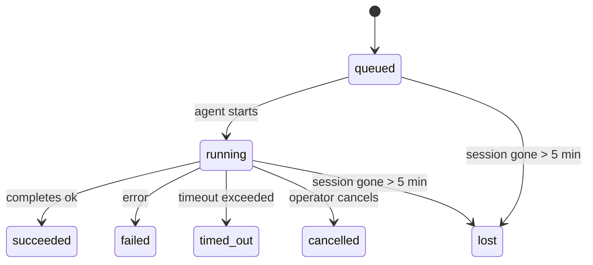

---
read_when:
    - Ispezione delle attività in background in corso o completate di recente
    - Debug dei fallimenti di consegna per esecuzioni di agenti scollegate
    - Comprendere come le esecuzioni in background si collegano a sessioni, Cron e Heartbeat
summary: Monitoraggio delle attività in background per esecuzioni ACP, sottoagenti, processi Cron isolati e operazioni CLI
title: Attività in background
x-i18n:
    generated_at: "2026-04-24T08:28:59Z"
    model: gpt-5.4
    provider: openai
    source_hash: 10f16268ab5cce8c3dfd26c54d8d913c0ac0f9bfb4856ed1bb28b085ddb78528
    source_path: automation/tasks.md
    workflow: 15
---

> **Cerchi la pianificazione?** Consulta [Automazione e Task](/it/automation) per scegliere il meccanismo giusto. Questa pagina copre il **monitoraggio** del lavoro in background, non la sua pianificazione.

Le attività in background tracciano il lavoro che viene eseguito **al di fuori della sessione principale della conversazione**:
esecuzioni ACP, avvii di sottoagenti, esecuzioni di processi Cron isolati e operazioni avviate dalla CLI.

Le attività **non** sostituiscono sessioni, processi Cron o Heartbeat — sono il **registro delle attività** che annota quale lavoro scollegato è avvenuto, quando e se è andato a buon fine.

<Note>
Non ogni esecuzione di agente crea un'attività. I turni Heartbeat e la normale chat interattiva non lo fanno. Tutte le esecuzioni Cron, gli avvii ACP, gli avvii di sottoagenti e i comandi agente della CLI sì.
</Note>

## In breve

- Le attività sono **record**, non pianificatori — Cron e Heartbeat decidono _quando_ il lavoro viene eseguito, le attività tracciano _cosa è successo_.
- ACP, sottoagenti, tutti i processi Cron e le operazioni CLI creano attività. I turni Heartbeat no.
- Ogni attività passa attraverso `queued → running → terminal` (succeeded, failed, timed_out, cancelled o lost).
- Le attività Cron restano attive finché il runtime Cron possiede ancora il processo; le attività CLI supportate dalla chat restano attive solo finché il relativo contesto di esecuzione è ancora attivo.
- Il completamento è guidato da notifiche push: il lavoro scollegato può notificare direttamente o risvegliare la sessione/Heartbeat del richiedente quando termina, quindi i cicli di polling dello stato di solito non sono l'approccio giusto.
- Le esecuzioni Cron isolate e i completamenti dei sottoagenti ripuliscono al meglio schede/processi del browser tracciati per la loro sessione figlia prima della pulizia finale di bookkeeping.
- La consegna Cron isolata sopprime le risposte intermedie obsolete del padre mentre il lavoro dei sottoagenti discendenti è ancora in fase di svuotamento, e preferisce l'output finale del discendente quando arriva prima della consegna.
- Le notifiche di completamento vengono consegnate direttamente a un canale o accodate per il prossimo Heartbeat.
- `openclaw tasks list` mostra tutte le attività; `openclaw tasks audit` evidenzia i problemi.
- I record terminali vengono conservati per 7 giorni, poi eliminati automaticamente.

## Avvio rapido

```bash
# Elenca tutte le attività (prima le più recenti)
openclaw tasks list

# Filtra per runtime o stato
openclaw tasks list --runtime acp
openclaw tasks list --status running

# Mostra i dettagli di un'attività specifica (per ID, ID esecuzione o chiave sessione)
openclaw tasks show <lookup>

# Annulla un'attività in esecuzione (termina la sessione figlia)
openclaw tasks cancel <lookup>

# Cambia il criterio di notifica per un'attività
openclaw tasks notify <lookup> state_changes

# Esegui un audit di integrità
openclaw tasks audit

# Anteprima o applicazione della manutenzione
openclaw tasks maintenance
openclaw tasks maintenance --apply

# Ispeziona lo stato di TaskFlow
openclaw tasks flow list
openclaw tasks flow show <lookup>
openclaw tasks flow cancel <lookup>
```

## Cosa crea un'attività

| Origine                | Tipo di runtime | Quando viene creato un record attività                 | Criterio di notifica predefinito |
| ---------------------- | --------------- | ------------------------------------------------------ | -------------------------------- |
| Esecuzioni ACP in background | `acp`      | Avvio di una sessione ACP figlia                       | `done_only`                      |
| Orchestrazione di sottoagenti | `subagent` | Avvio di un sottoagente tramite `sessions_spawn`     | `done_only`                      |
| Processi Cron (tutti i tipi) | `cron`     | Ogni esecuzione Cron (sessione principale e isolata)  | `silent`                         |
| Operazioni CLI         | `cli`           | Comandi `openclaw agent` che passano tramite il Gateway | `silent`                       |
| Processi media dell'agente | `cli`       | Esecuzioni `video_generate` supportate da sessione     | `silent`                         |

Le attività Cron della sessione principale usano per impostazione predefinita il criterio di notifica `silent` — creano record per il monitoraggio ma non generano notifiche. Anche le attività Cron isolate usano per impostazione predefinita `silent`, ma sono più visibili perché vengono eseguite nella propria sessione.

Anche le esecuzioni `video_generate` supportate da sessione usano il criterio di notifica `silent`. Creano comunque record attività, ma il completamento viene restituito alla sessione agente originale come risveglio interno, così l'agente può scrivere il messaggio di follow-up e allegare direttamente il video completato. Se attivi `tools.media.asyncCompletion.directSend`, i completamenti asincroni di `music_generate` e `video_generate` tentano prima la consegna diretta al canale, prima di ripiegare sul percorso di risveglio della sessione richiedente.

Mentre un'attività `video_generate` supportata da sessione è ancora attiva, lo strumento funge anche da guardrail: chiamate ripetute a `video_generate` nella stessa sessione restituiscono lo stato dell'attività attiva invece di avviare una seconda generazione concorrente. Usa `action: "status"` quando vuoi una ricerca esplicita di avanzamento/stato dal lato agente.

**Cosa non crea attività:**

- Turni Heartbeat — sessione principale; vedi [Heartbeat](/it/gateway/heartbeat)
- Normali turni di chat interattiva
- Risposte dirette `/command`

## Ciclo di vita dell'attività



| Stato       | Cosa significa                                                            |
| ----------- | ------------------------------------------------------------------------- |
| `queued`    | Creata, in attesa che l'agente inizi                                      |
| `running`   | Il turno dell'agente è in esecuzione attiva                               |
| `succeeded` | Completata con successo                                                    |
| `failed`    | Completata con un errore                                                   |
| `timed_out` | Ha superato il timeout configurato                                         |
| `cancelled` | Interrotta dall'operatore tramite `openclaw tasks cancel`                 |
| `lost`      | Il runtime ha perso lo stato autorevole di supporto dopo un periodo di tolleranza di 5 minuti |

Le transizioni avvengono automaticamente — quando l'esecuzione dell'agente associata termina, lo stato dell'attività viene aggiornato di conseguenza.

`lost` è consapevole del runtime:

- Attività ACP: i metadati della sessione figlia ACP di supporto sono scomparsi.
- Attività di sottoagente: la sessione figlia di supporto è scomparsa dall'archivio agenti di destinazione.
- Attività Cron: il runtime Cron non tiene più traccia del processo come attivo.
- Attività CLI: le attività isolate della sessione figlia usano la sessione figlia; le attività CLI supportate dalla chat usano invece il contesto di esecuzione live, quindi le righe persistenti di sessione canale/gruppo/diretta non le mantengono attive.

## Consegna e notifiche

Quando un'attività raggiunge uno stato terminale, OpenClaw ti avvisa. Esistono due percorsi di consegna:

**Consegna diretta** — se l'attività ha una destinazione di canale (`requesterOrigin`), il messaggio di completamento viene inviato direttamente a quel canale (Telegram, Discord, Slack, ecc.). Per i completamenti dei sottoagenti, OpenClaw conserva anche il routing thread/topic associato quando disponibile e può compilare un `to` / account mancante dal percorso memorizzato nella sessione del richiedente (`lastChannel` / `lastTo` / `lastAccountId`) prima di rinunciare alla consegna diretta.

**Consegna accodata alla sessione** — se la consegna diretta fallisce o non è impostata alcuna origine, l'aggiornamento viene accodato come evento di sistema nella sessione del richiedente e appare al successivo Heartbeat.

<Tip>
Il completamento dell'attività attiva un risveglio Heartbeat immediato così puoi vedere rapidamente il risultato — non devi aspettare il successivo tick Heartbeat pianificato.
</Tip>

Questo significa che il normale flusso di lavoro è basato su push: avvia una volta il lavoro scollegato, poi lascia che il runtime ti risvegli o ti notifichi al completamento. Interroga lo stato dell'attività solo quando hai bisogno di debug, intervento o di un audit esplicito.

### Criteri di notifica

Controlla quanto vuoi sapere di ogni attività:

| Criterio              | Cosa viene consegnato                                                     |
| --------------------- | ------------------------------------------------------------------------- |
| `done_only` (predefinito) | Solo lo stato terminale (succeeded, failed, ecc.) — **questo è il valore predefinito** |
| `state_changes`       | Ogni transizione di stato e aggiornamento di avanzamento                  |
| `silent`              | Nulla                                                                     |

Cambia il criterio mentre un'attività è in esecuzione:

```bash
openclaw tasks notify <lookup> state_changes
```

## Riferimento CLI

### `tasks list`

```bash
openclaw tasks list [--runtime <acp|subagent|cron|cli>] [--status <status>] [--json]
```

Colonne di output: ID attività, tipo, stato, consegna, ID esecuzione, sessione figlia, riepilogo.

### `tasks show`

```bash
openclaw tasks show <lookup>
```

Il token di ricerca accetta un ID attività, un ID esecuzione o una chiave sessione. Mostra il record completo, inclusi tempi, stato della consegna, errore e riepilogo terminale.

### `tasks cancel`

```bash
openclaw tasks cancel <lookup>
```

Per le attività ACP e di sottoagente, questo termina la sessione figlia. Per le attività tracciate dalla CLI, l'annullamento viene registrato nel registro attività (non esiste un handle runtime figlio separato). Lo stato passa a `cancelled` e viene inviata una notifica di consegna quando applicabile.

### `tasks notify`

```bash
openclaw tasks notify <lookup> <done_only|state_changes|silent>
```

### `tasks audit`

```bash
openclaw tasks audit [--json]
```

Evidenzia i problemi operativi. I risultati compaiono anche in `openclaw status` quando vengono rilevati problemi.

| Risultato                 | Gravità | Attivazione                                           |
| ------------------------- | ------- | ----------------------------------------------------- |
| `stale_queued`            | warn    | In coda da più di 10 minuti                           |
| `stale_running`           | error   | In esecuzione da più di 30 minuti                     |
| `lost`                    | error   | La proprietà dell'attività supportata dal runtime è scomparsa |
| `delivery_failed`         | warn    | La consegna non è riuscita e il criterio di notifica non è `silent` |
| `missing_cleanup`         | warn    | Attività terminale senza timestamp di pulizia         |
| `inconsistent_timestamps` | warn    | Violazione della timeline (ad esempio, terminata prima di iniziare) |

### `tasks maintenance`

```bash
openclaw tasks maintenance [--json]
openclaw tasks maintenance --apply [--json]
```

Usa questo comando per visualizzare in anteprima o applicare la riconciliazione, l'apposizione dei timestamp di pulizia e la rimozione per le attività e per lo stato di Task Flow.

La riconciliazione è consapevole del runtime:

- Le attività ACP/sottoagente controllano la loro sessione figlia di supporto.
- Le attività Cron controllano se il runtime Cron possiede ancora il processo.
- Le attività CLI supportate dalla chat controllano il relativo contesto di esecuzione live, non solo la riga della sessione di chat.

Anche la pulizia al completamento è consapevole del runtime:

- Il completamento del sottoagente chiude al meglio schede/processi del browser tracciati per la sessione figlia prima che continui la pulizia dell'annuncio.
- Il completamento Cron isolato chiude al meglio schede/processi del browser tracciati per la sessione Cron prima che l'esecuzione venga completamente smantellata.
- La consegna Cron isolata attende, quando necessario, il follow-up dei sottoagenti discendenti e sopprime il testo di conferma del padre ormai obsoleto invece di annunciarlo.
- La consegna del completamento del sottoagente preferisce il testo più recente visibile dell'assistente; se è vuoto, ripiega sul testo più recente e sanificato di tool/toolResult, e le esecuzioni di sole chiamate di tool andate in timeout possono ridursi a un breve riepilogo del progresso parziale. Le esecuzioni terminali fallite annunciano lo stato di errore senza riprodurre il testo della risposta catturata.
- I fallimenti di pulizia non mascherano il reale esito dell'attività.

### `tasks flow list|show|cancel`

```bash
openclaw tasks flow list [--status <status>] [--json]
openclaw tasks flow show <lookup> [--json]
openclaw tasks flow cancel <lookup>
```

Usa questi comandi quando l'elemento che ti interessa è il TaskFlow di orchestrazione piuttosto che un singolo record di attività in background.

## Bacheca attività in chat (`/tasks`)

Usa `/tasks` in qualsiasi sessione di chat per vedere le attività in background collegate a quella sessione. La bacheca mostra attività attive e completate di recente con runtime, stato, tempi e dettagli di avanzamento o errore.

Quando la sessione corrente non ha attività collegate visibili, `/tasks` ripiega sui conteggi delle attività locali dell'agente
così ottieni comunque una panoramica senza esporre dettagli di altre sessioni.

Per il registro completo dell'operatore, usa la CLI: `openclaw tasks list`.

## Integrazione con lo stato (pressione delle attività)

`openclaw status` include un riepilogo immediato delle attività:

```
Tasks: 3 queued · 2 running · 1 issues
```

Il riepilogo riporta:

- **active** — conteggio di `queued` + `running`
- **failures** — conteggio di `failed` + `timed_out` + `lost`
- **byRuntime** — suddivisione per `acp`, `subagent`, `cron`, `cli`

Sia `/status` sia lo strumento `session_status` usano un'istantanea delle attività consapevole della pulizia: le attività attive hanno la priorità, le righe completate obsolete vengono nascoste e gli errori recenti emergono solo quando non rimane alcun lavoro attivo.
Questo mantiene la scheda di stato focalizzata su ciò che conta in questo momento.

## Archiviazione e manutenzione

### Dove si trovano le attività

I record delle attività vengono conservati in SQLite in:

```
$OPENCLAW_STATE_DIR/tasks/runs.sqlite
```

Il registro viene caricato in memoria all'avvio del Gateway e sincronizza le scritture su SQLite per garantire la persistenza tra i riavvii.

### Manutenzione automatica

Uno sweeper viene eseguito ogni **60 secondi** e gestisce tre aspetti:

1. **Riconciliazione** — controlla se le attività attive hanno ancora un supporto runtime autorevole. Le attività ACP/sottoagente usano lo stato della sessione figlia, le attività Cron usano la proprietà del processo attivo e le attività CLI supportate dalla chat usano il relativo contesto di esecuzione. Se questo stato di supporto manca per più di 5 minuti, l'attività viene contrassegnata come `lost`.
2. **Apposizione dei timestamp di pulizia** — imposta un timestamp `cleanupAfter` sulle attività terminali (`endedAt` + 7 giorni).
3. **Rimozione** — elimina i record oltre la loro data `cleanupAfter`.

**Conservazione**: i record delle attività terminali vengono mantenuti per **7 giorni**, poi eliminati automaticamente. Non è necessaria alcuna configurazione.

## Come le attività si collegano ad altri sistemi

### Attività e Task Flow

[Task Flow](/it/automation/taskflow) è il livello di orchestrazione dei flussi sopra le attività in background. Un singolo flusso può coordinare più attività nel corso del suo ciclo di vita usando modalità di sincronizzazione gestite o specchiate. Usa `openclaw tasks` per ispezionare i singoli record attività e `openclaw tasks flow` per ispezionare il flusso di orchestrazione.

Consulta [Task Flow](/it/automation/taskflow) per i dettagli.

### Attività e Cron

Una **definizione** di processo Cron si trova in `~/.openclaw/cron/jobs.json`; lo stato di esecuzione runtime si trova accanto in `~/.openclaw/cron/jobs-state.json`. **Ogni** esecuzione Cron crea un record attività — sia per la sessione principale sia per quelle isolate. Le attività Cron della sessione principale usano per impostazione predefinita il criterio di notifica `silent`, così tracciano l'esecuzione senza generare notifiche.

Consulta [Processi Cron](/it/automation/cron-jobs).

### Attività e Heartbeat

Le esecuzioni Heartbeat sono turni della sessione principale — non creano record attività. Quando un'attività viene completata, può attivare un risveglio Heartbeat così vedi subito il risultato.

Consulta [Heartbeat](/it/gateway/heartbeat).

### Attività e sessioni

Un'attività può fare riferimento a una `childSessionKey` (dove viene eseguito il lavoro) e a una `requesterSessionKey` (chi l'ha avviata). Le sessioni sono il contesto della conversazione; le attività sono il monitoraggio dell'attività sopra quel contesto.

### Attività ed esecuzioni dell'agente

Il `runId` di un'attività è collegato all'esecuzione dell'agente che svolge il lavoro. Gli eventi del ciclo di vita dell'agente (avvio, fine, errore) aggiornano automaticamente lo stato dell'attività — non è necessario gestire manualmente il ciclo di vita.

## Correlati

- [Automazione e Task](/it/automation) — tutti i meccanismi di automazione in sintesi
- [Task Flow](/it/automation/taskflow) — orchestrazione dei flussi sopra le attività
- [Task pianificati](/it/automation/cron-jobs) — pianificazione del lavoro in background
- [Heartbeat](/it/gateway/heartbeat) — turni periodici della sessione principale
- [CLI: Tasks](/it/cli/tasks) — riferimento ai comandi CLI
