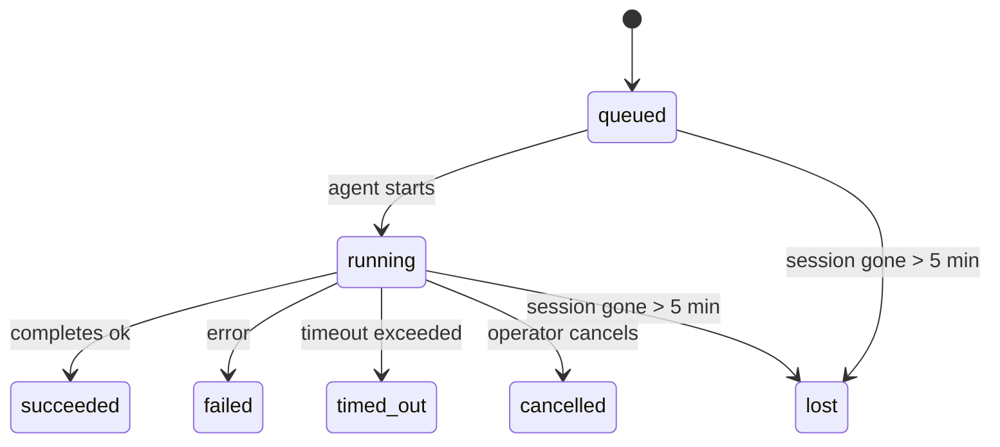

---
read_when:
    - Ispezione del lavoro in background in corso o completato di recente
    - Debug delle consegne non riuscite per le esecuzioni dell'agente scollegate
    - Comprendere come le esecuzioni in background si collegano a sessioni, Cron e Heartbeat
summary: Tracciamento delle attività in background per le esecuzioni ACP, i subagenti, i processi Cron isolati e le operazioni CLI
title: Attività in background
x-i18n:
    generated_at: "2026-04-21T19:20:40Z"
    model: gpt-5.4
    provider: openai
    source_hash: a4cd666b3eaffde8df0b5e1533eb337e44a0824824af6f8a240f18a89f71b402
    source_path: automation/tasks.md
    workflow: 15
---

# Attività in background

> **Cerchi la pianificazione?** Consulta [Automazione e attività](/it/automation) per scegliere il meccanismo giusto. Questa pagina riguarda il **monitoraggio** del lavoro in background, non la sua pianificazione.

Le attività in background monitorano il lavoro che viene eseguito **al di fuori della sessione principale della conversazione**:
esecuzioni ACP, avvii di subagenti, esecuzioni di processi Cron isolati e operazioni avviate dalla CLI.

Le attività **non** sostituiscono sessioni, processi Cron o heartbeat — sono il **registro delle attività** che annota quale lavoro scollegato è avvenuto, quando e se è andato a buon fine.

<Note>
Non tutte le esecuzioni dell'agente creano un'attività. I turni Heartbeat e la normale chat interattiva no. Tutte le esecuzioni Cron, gli avvii ACP, gli avvii di subagenti e i comandi agente della CLI sì.
</Note>

## In breve

- Le attività sono **record**, non pianificatori — Cron e Heartbeat decidono _quando_ viene eseguito il lavoro, le attività monitorano _cosa è successo_.
- ACP, subagenti, tutti i processi Cron e le operazioni CLI creano attività. I turni Heartbeat no.
- Ogni attività passa attraverso `queued → running → terminal` (succeeded, failed, timed_out, cancelled oppure lost).
- Le attività Cron restano attive finché il runtime Cron possiede ancora il processo; le attività CLI supportate dalla chat restano attive solo finché il contesto di esecuzione proprietario è ancora attivo.
- Il completamento è guidato da push: il lavoro scollegato può notificare direttamente o riattivare la sessione/Heartbeat richiedente quando termina, quindi i cicli di polling dello stato di solito non sono l'approccio corretto.
- Le esecuzioni Cron isolate e i completamenti dei subagenti puliscono al meglio schede/processi del browser tracciati per la loro sessione figlia prima della pulizia finale di registrazione.
- La consegna Cron isolata sopprime le risposte intermedie obsolete del padre mentre il lavoro dei subagenti discendenti è ancora in fase di completamento e preferisce l'output finale del discendente quando arriva prima della consegna.
- Le notifiche di completamento vengono recapitate direttamente a un canale oppure accodate per il prossimo Heartbeat.
- `openclaw tasks list` mostra tutte le attività; `openclaw tasks audit` evidenzia i problemi.
- I record terminali vengono conservati per 7 giorni, poi eliminati automaticamente.

## Avvio rapido

```bash
# Elenca tutte le attività (prima le più recenti)
openclaw tasks list

# Filtra per runtime o stato
openclaw tasks list --runtime acp
openclaw tasks list --status running

# Mostra i dettagli di un'attività specifica (per ID, ID esecuzione o chiave sessione)
openclaw tasks show <lookup>

# Annulla un'attività in esecuzione (termina la sessione figlia)
openclaw tasks cancel <lookup>

# Modifica la politica di notifica per un'attività
openclaw tasks notify <lookup> state_changes

# Esegui un audit di integrità
openclaw tasks audit

# Anteprima o applica la manutenzione
openclaw tasks maintenance
openclaw tasks maintenance --apply

# Ispeziona lo stato di TaskFlow
openclaw tasks flow list
openclaw tasks flow show <lookup>
openclaw tasks flow cancel <lookup>
```

## Cosa crea un'attività

| Origine                | Tipo di runtime | Quando viene creato un record attività                 | Politica di notifica predefinita |
| ---------------------- | --------------- | ------------------------------------------------------ | -------------------------------- |
| Esecuzioni in background ACP | `acp`     | Avvio di una sessione ACP figlia                       | `done_only`                      |
| Orchestrazione di subagenti | `subagent` | Avvio di un subagente tramite `sessions_spawn`        | `done_only`                      |
| Processi Cron (tutti i tipi) | `cron`   | Ogni esecuzione Cron (sessione principale e isolata)   | `silent`                         |
| Operazioni CLI         | `cli`           | Comandi `openclaw agent` eseguiti tramite il gateway   | `silent`                         |
| Processi media dell'agente | `cli`      | Esecuzioni `video_generate` supportate da sessione     | `silent`                         |

Le attività Cron della sessione principale usano per impostazione predefinita la politica di notifica `silent` — creano record per il monitoraggio ma non generano notifiche. Anche le attività Cron isolate usano per impostazione predefinita `silent`, ma sono più visibili perché vengono eseguite nella propria sessione.

Anche le esecuzioni `video_generate` supportate da sessione usano la politica di notifica `silent`. Creano comunque record attività, ma il completamento viene restituito alla sessione agente originale come riattivazione interna, così l'agente può scrivere il messaggio di follow-up e allegare direttamente il video completato. Se abiliti `tools.media.asyncCompletion.directSend`, i completamenti asincroni di `music_generate` e `video_generate` provano prima la consegna diretta al canale, per poi ripiegare sul percorso di riattivazione della sessione richiedente.

Mentre un'attività `video_generate` supportata da sessione è ancora attiva, lo strumento agisce anche da guardrail: chiamate ripetute a `video_generate` nella stessa sessione restituiscono lo stato dell'attività attiva invece di avviare una seconda generazione concorrente. Usa `action: "status"` quando vuoi una ricerca esplicita di avanzamento/stato dal lato agente.

**Cosa non crea attività:**

- Turni Heartbeat — sessione principale; vedi [Heartbeat](/it/gateway/heartbeat)
- Normali turni di chat interattiva
- Risposte dirette a `/command`

## Ciclo di vita dell'attività



| Stato       | Significato                                                                 |
| ----------- | --------------------------------------------------------------------------- |
| `queued`    | Creata, in attesa che l'agente si avvii                                     |
| `running`   | Il turno dell'agente è in esecuzione attiva                                 |
| `succeeded` | Completata con successo                                                     |
| `failed`    | Completata con un errore                                                    |
| `timed_out` | Ha superato il timeout configurato                                          |
| `cancelled` | Arrestata dall'operatore tramite `openclaw tasks cancel`                    |
| `lost`      | Il runtime ha perso lo stato autorevole di supporto dopo un periodo di tolleranza di 5 minuti |

Le transizioni avvengono automaticamente — quando termina l'esecuzione dell'agente associata, lo stato dell'attività viene aggiornato in modo corrispondente.

`lost` dipende dal runtime:

- Attività ACP: i metadati della sessione figlia ACP di supporto sono scomparsi.
- Attività di subagenti: la sessione figlia di supporto è scomparsa dall'archivio dell'agente di destinazione.
- Attività Cron: il runtime Cron non tiene più traccia del processo come attivo.
- Attività CLI: le attività isolate della sessione figlia usano la sessione figlia; le attività CLI supportate dalla chat usano invece il contesto di esecuzione live, quindi righe persistenti di sessione canale/gruppo/diretta non le mantengono attive.

## Consegna e notifiche

Quando un'attività raggiunge uno stato terminale, OpenClaw ti avvisa. Esistono due percorsi di consegna:

**Consegna diretta** — se l'attività ha una destinazione canale (la `requesterOrigin`), il messaggio di completamento va direttamente a quel canale (Telegram, Discord, Slack, ecc.). Per i completamenti dei subagenti, OpenClaw preserva anche l'instradamento al thread/topic associato quando disponibile e può compilare `to` / account mancanti dal percorso memorizzato della sessione richiedente (`lastChannel` / `lastTo` / `lastAccountId`) prima di rinunciare alla consegna diretta.

**Consegna accodata alla sessione** — se la consegna diretta fallisce o non è impostata alcuna origine, l'aggiornamento viene accodato come evento di sistema nella sessione del richiedente e compare al prossimo heartbeat.

<Tip>
Il completamento dell'attività attiva un risveglio Heartbeat immediato così puoi vedere rapidamente il risultato — non devi attendere il prossimo tick Heartbeat pianificato.
</Tip>

Questo significa che il flusso di lavoro abituale è basato su push: avvia il lavoro scollegato una sola volta, poi lascia che il runtime ti riattivi o notifichi al completamento. Interroga lo stato delle attività solo quando ti servono debug, intervento o un audit esplicito.

### Politiche di notifica

Controlla quanto vuoi sapere su ogni attività:

| Politica              | Cosa viene consegnato                                                    |
| --------------------- | ------------------------------------------------------------------------ |
| `done_only` (predefinita) | Solo lo stato terminale (succeeded, failed, ecc.) — **questa è l'impostazione predefinita** |
| `state_changes`       | Ogni transizione di stato e aggiornamento di avanzamento                 |
| `silent`              | Nulla                                                                    |

Modifica la politica mentre un'attività è in esecuzione:

```bash
openclaw tasks notify <lookup> state_changes
```

## Riferimento CLI

### `tasks list`

```bash
openclaw tasks list [--runtime <acp|subagent|cron|cli>] [--status <status>] [--json]
```

Colonne di output: ID attività, Tipo, Stato, Consegna, ID esecuzione, Sessione figlia, Riepilogo.

### `tasks show`

```bash
openclaw tasks show <lookup>
```

Il token di ricerca accetta un ID attività, un ID esecuzione o una chiave sessione. Mostra il record completo, inclusi tempi, stato della consegna, errore e riepilogo terminale.

### `tasks cancel`

```bash
openclaw tasks cancel <lookup>
```

Per le attività ACP e dei subagenti, questo termina la sessione figlia. Per le attività monitorate dalla CLI, l'annullamento viene registrato nel registro delle attività (non esiste un handle runtime figlio separato). Lo stato passa a `cancelled` e, se applicabile, viene inviata una notifica di consegna.

### `tasks notify`

```bash
openclaw tasks notify <lookup> <done_only|state_changes|silent>
```

### `tasks audit`

```bash
openclaw tasks audit [--json]
```

Evidenzia problemi operativi. I risultati compaiono anche in `openclaw status` quando vengono rilevati problemi.

| Problema                  | Gravità | Attivazione                                           |
| ------------------------- | ------- | ----------------------------------------------------- |
| `stale_queued`            | warn    | In coda da più di 10 minuti                           |
| `stale_running`           | error   | In esecuzione da più di 30 minuti                     |
| `lost`                    | error   | La proprietà dell'attività supportata dal runtime è scomparsa |
| `delivery_failed`         | warn    | La consegna è fallita e la politica di notifica non è `silent` |
| `missing_cleanup`         | warn    | Attività terminale senza timestamp di pulizia         |
| `inconsistent_timestamps` | warn    | Violazione della timeline (per esempio terminata prima di iniziare) |

### `tasks maintenance`

```bash
openclaw tasks maintenance [--json]
openclaw tasks maintenance --apply [--json]
```

Usa questo comando per visualizzare in anteprima o applicare riconciliazione, marcatura della pulizia ed eliminazione per attività e stato di Task Flow.

La riconciliazione dipende dal runtime:

- Le attività ACP/subagent controllano la loro sessione figlia di supporto.
- Le attività Cron controllano se il runtime Cron possiede ancora il processo.
- Le attività CLI supportate dalla chat controllano il contesto di esecuzione live proprietario, non solo la riga della sessione chat.

Anche la pulizia al completamento dipende dal runtime:

- Il completamento dei subagenti chiude al meglio schede/processi del browser tracciati per la sessione figlia prima che continui la pulizia dell'annuncio.
- Il completamento Cron isolato chiude al meglio schede/processi del browser tracciati per la sessione Cron prima che l'esecuzione venga completamente smantellata.
- La consegna Cron isolata attende, quando necessario, il follow-up dei subagenti discendenti in corso e sopprime il testo di conferma obsoleto del padre invece di annunciarlo.
- La consegna del completamento dei subagenti preferisce il testo assistente visibile più recente; se è vuoto ripiega sul testo più recente di tool/toolResult ripulito, e le esecuzioni di sole chiamate a strumenti terminate per timeout possono essere ridotte a un breve riepilogo del progresso parziale. Le esecuzioni terminali non riuscite annunciano lo stato di errore senza riprodurre il testo della risposta acquisita.
- I fallimenti della pulizia non nascondono il reale esito dell'attività.

### `tasks flow list|show|cancel`

```bash
openclaw tasks flow list [--status <status>] [--json]
openclaw tasks flow show <lookup> [--json]
openclaw tasks flow cancel <lookup>
```

Usa questi comandi quando ciò che ti interessa è il TaskFlow di orchestrazione piuttosto che un singolo record di attività in background.

## Bacheca attività della chat (`/tasks`)

Usa `/tasks` in qualsiasi sessione di chat per vedere le attività in background collegate a quella sessione. La bacheca mostra attività attive e completate di recente con runtime, stato, tempi e dettagli su avanzamento o errore.

Quando la sessione corrente non ha attività collegate visibili, `/tasks` usa come fallback i conteggi delle attività locali dell'agente
così continui ad avere una panoramica senza esporre dettagli di altre sessioni.

Per il registro operativo completo, usa la CLI: `openclaw tasks list`.

## Integrazione dello stato (pressione delle attività)

`openclaw status` include un riepilogo immediato delle attività:

```
Tasks: 3 queued · 2 running · 1 issues
```

Il riepilogo riporta:

- **active** — conteggio di `queued` + `running`
- **failures** — conteggio di `failed` + `timed_out` + `lost`
- **byRuntime** — suddivisione per `acp`, `subagent`, `cron`, `cli`

Sia `/status` sia lo strumento `session_status` usano un'istantanea delle attività consapevole della pulizia: vengono
privilegiate le attività attive, le righe completate obsolete vengono nascoste e gli errori recenti emergono solo quando non rimane
alcun lavoro attivo. In questo modo la scheda di stato resta concentrata su ciò che conta in questo momento.

## Archiviazione e manutenzione

### Dove risiedono le attività

I record delle attività vengono mantenuti in SQLite in:

```
$OPENCLAW_STATE_DIR/tasks/runs.sqlite
```

Il registro viene caricato in memoria all'avvio del gateway e sincronizza le scritture su SQLite per garantire la persistenza tra i riavvii.

### Manutenzione automatica

Uno sweeper viene eseguito ogni **60 secondi** e gestisce tre aspetti:

1. **Riconciliazione** — verifica se le attività attive hanno ancora un supporto runtime autorevole. Le attività ACP/subagent usano lo stato della sessione figlia, le attività Cron usano la proprietà del processo attivo e le attività CLI supportate dalla chat usano il contesto di esecuzione proprietario. Se questo stato di supporto scompare per più di 5 minuti, l'attività viene contrassegnata come `lost`.
2. **Marcatura della pulizia** — imposta un timestamp `cleanupAfter` sulle attività terminali (`endedAt + 7 days`).
3. **Eliminazione** — rimuove i record oltre la loro data `cleanupAfter`.

**Conservazione**: i record delle attività terminali vengono mantenuti per **7 giorni**, poi eliminati automaticamente. Non è necessaria alcuna configurazione.

## Come le attività si collegano ad altri sistemi

### Attività e Task Flow

[Task Flow](/it/automation/taskflow) è il livello di orchestrazione dei flussi sopra le attività in background. Un singolo flusso può coordinare più attività nel corso del suo ciclo di vita usando modalità di sincronizzazione gestite o mirror. Usa `openclaw tasks` per ispezionare i singoli record delle attività e `openclaw tasks flow` per ispezionare il flusso di orchestrazione.

Consulta [Task Flow](/it/automation/taskflow) per i dettagli.

### Attività e Cron

Una **definizione** di processo Cron si trova in `~/.openclaw/cron/jobs.json`; lo stato di esecuzione runtime si trova accanto in `~/.openclaw/cron/jobs-state.json`. **Ogni** esecuzione Cron crea un record attività — sia della sessione principale sia isolata. Le attività Cron della sessione principale usano per impostazione predefinita la politica di notifica `silent`, così vengono monitorate senza generare notifiche.

Consulta [Processi Cron](/it/automation/cron-jobs).

### Attività e Heartbeat

Le esecuzioni Heartbeat sono turni della sessione principale — non creano record attività. Quando un'attività viene completata, può attivare un risveglio Heartbeat così puoi vedere rapidamente il risultato.

Consulta [Heartbeat](/it/gateway/heartbeat).

### Attività e sessioni

Un'attività può fare riferimento a una `childSessionKey` (dove viene eseguito il lavoro) e a una `requesterSessionKey` (chi l'ha avviata). Le sessioni sono il contesto della conversazione; le attività sono il monitoraggio dell'attività sopra tale contesto.

### Attività ed esecuzioni dell'agente

Il `runId` di un'attività collega l'esecuzione dell'agente che svolge il lavoro. Gli eventi del ciclo di vita dell'agente (avvio, fine, errore) aggiornano automaticamente lo stato dell'attività — non è necessario gestire manualmente il ciclo di vita.

## Correlati

- [Automazione e attività](/it/automation) — tutti i meccanismi di automazione in sintesi
- [Task Flow](/it/automation/taskflow) — orchestrazione dei flussi sopra le attività
- [Attività pianificate](/it/automation/cron-jobs) — pianificazione del lavoro in background
- [Heartbeat](/it/gateway/heartbeat) — turni periodici della sessione principale
- [CLI: Tasks](/cli/index#tasks) — riferimento dei comandi CLI
