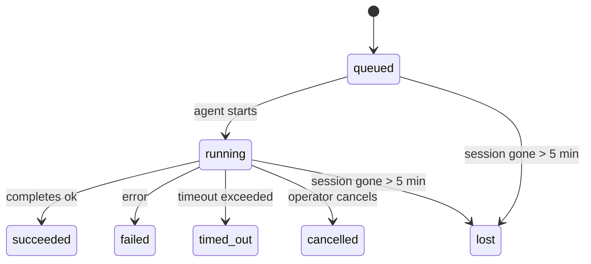

---
read_when:
    - Esaminare le attività in background in corso o completate di recente
    - Debug dei problemi di recapito per le esecuzioni di agenti scollegati
    - Comprendere come le esecuzioni in background sono correlate a sessioni, Cron e Heartbeat
sidebarTitle: Background tasks
summary: Monitoraggio delle attività in background per esecuzioni ACP, sottoagenti, job Cron isolati e operazioni CLI
title: Attività in background
x-i18n:
    generated_at: "2026-05-01T08:28:25Z"
    model: gpt-5.5
    provider: openai
    source_hash: 8782987a79989264ae3bd1ca4b16755bdfb7e295e4f77933bf3a38c136d837f4
    source_path: automation/tasks.md
    workflow: 16
---

<Note>
Cerchi la pianificazione? Consulta [Automazione e attività](/it/automation) per scegliere il meccanismo giusto. Questa pagina è il registro delle attività per il lavoro in background, non il pianificatore.
</Note>

Le attività in background tracciano il lavoro che viene eseguito **fuori dalla sessione di conversazione principale**: esecuzioni ACP, avvii di subagenti, esecuzioni isolate di job Cron e operazioni avviate dalla CLI.

Le attività **non** sostituiscono sessioni, job Cron o Heartbeat — sono il **registro delle attività** che registra quale lavoro disaccoppiato è avvenuto, quando e se è riuscito.

<Note>
Non ogni esecuzione dell'agente crea un'attività. I turni Heartbeat e la normale chat interattiva no. Tutte le esecuzioni Cron, gli avvii ACP, gli avvii di subagenti e i comandi agente della CLI sì.
</Note>

## In breve

- Le attività sono **record**, non pianificatori — Cron e Heartbeat decidono _quando_ viene eseguito il lavoro, le attività tracciano _cosa è successo_.
- ACP, subagenti, tutti i job Cron e le operazioni CLI creano attività. I turni Heartbeat no.
- Ogni attività attraversa `queued → running → terminal` (succeeded, failed, timed_out, cancelled o lost).
- Le attività Cron restano attive mentre il runtime Cron possiede ancora il job; se lo
  stato del runtime in memoria è sparito, la manutenzione delle attività controlla prima la cronologia
  durevole delle esecuzioni Cron prima di marcare un'attività come persa.
- Il completamento è guidato da notifiche push: il lavoro disaccoppiato può notificare direttamente o risvegliare la
  sessione/Heartbeat del richiedente quando termina, quindi i cicli di polling dello stato sono
  di solito il modello sbagliato.
- Le esecuzioni Cron isolate e i completamenti dei subagenti tentano, per quanto possibile, di ripulire le schede del browser/i processi tracciati per la loro sessione figlia prima della registrazione finale della pulizia.
- La consegna Cron isolata sopprime le risposte intermedie obsolete del genitore mentre il lavoro dei subagenti discendenti si sta ancora completando, e preferisce l'output finale del discendente quando arriva prima della consegna.
- Le notifiche di completamento vengono consegnate direttamente a un canale o accodate per il prossimo Heartbeat.
- `openclaw tasks list` mostra tutte le attività; `openclaw tasks audit` evidenzia i problemi.
- I record terminali vengono conservati per 7 giorni, poi eliminati automaticamente.

## Avvio rapido

<Tabs>
  <Tab title="Elenca e filtra">
    ```bash
    # List all tasks (newest first)
    openclaw tasks list

    # Filter by runtime or status
    openclaw tasks list --runtime acp
    openclaw tasks list --status running
    ```

  </Tab>
  <Tab title="Ispeziona">
    ```bash
    # Show details for a specific task (by ID, run ID, or session key)
    openclaw tasks show <lookup>
    ```
  </Tab>
  <Tab title="Annulla e notifica">
    ```bash
    # Cancel a running task (kills the child session)
    openclaw tasks cancel <lookup>

    # Change notification policy for a task
    openclaw tasks notify <lookup> state_changes
    ```

  </Tab>
  <Tab title="Audit e manutenzione">
    ```bash
    # Run a health audit
    openclaw tasks audit

    # Preview or apply maintenance
    openclaw tasks maintenance
    openclaw tasks maintenance --apply
    ```

  </Tab>
  <Tab title="Flusso delle attività">
    ```bash
    # Inspect TaskFlow state
    openclaw tasks flow list
    openclaw tasks flow show <lookup>
    openclaw tasks flow cancel <lookup>
    ```
  </Tab>
</Tabs>

## Cosa crea un'attività

| Origine                | Tipo di runtime | Quando viene creato un record dell'attività            | Criterio di notifica predefinito |
| ---------------------- | ------------ | ------------------------------------------------------ | --------------------- |
| Esecuzioni ACP in background | `acp`        | Avvio di una sessione ACP figlia                       | `done_only`           |
| Orchestrazione dei subagenti | `subagent`   | Avvio di un subagente tramite `sessions_spawn`         | `done_only`           |
| Job Cron (tutti i tipi) | `cron`       | Ogni esecuzione Cron (sessione principale e isolata)   | `silent`              |
| Operazioni CLI         | `cli`        | Comandi `openclaw agent` eseguiti tramite il Gateway   | `silent`              |
| Job multimediali dell'agente | `cli`        | Esecuzioni `music_generate`/`video_generate` supportate da sessione | `silent`              |

<AccordionGroup>
  <Accordion title="Valori predefiniti di notifica per Cron e contenuti multimediali">
    Le attività Cron della sessione principale usano per impostazione predefinita il criterio di notifica `silent` — creano record per il tracciamento ma non generano notifiche. Anche le attività Cron isolate hanno `silent` come valore predefinito, ma sono più visibili perché vengono eseguite nella propria sessione.

    Anche le esecuzioni `music_generate` e `video_generate` supportate da sessione usano il criterio di notifica `silent`. Creano comunque record di attività, ma il completamento viene restituito alla sessione originale dell'agente come risveglio interno, così l'agente può scrivere il messaggio di follow-up e allegare autonomamente il contenuto multimediale finito. Se abiliti `tools.media.asyncCompletion.directSend`, i completamenti asincroni di `video_generate` possono provare prima la consegna diretta al canale; i completamenti asincroni di `music_generate` restano sul percorso di risveglio della sessione richiedente.

  </Accordion>
  <Accordion title="Protezione per video_generate concorrenti">
    Mentre un'attività `video_generate` supportata da sessione è ancora attiva, lo strumento agisce anche come protezione: chiamate `video_generate` ripetute nella stessa sessione restituiscono lo stato dell'attività attiva invece di avviare una seconda generazione concorrente. Usa `action: "status"` quando vuoi una consultazione esplicita di avanzamento/stato dal lato agente.
  </Accordion>
  <Accordion title="Cosa non crea attività">
    - Turni Heartbeat — sessione principale; vedi [Heartbeat](/it/gateway/heartbeat)
    - Normali turni di chat interattiva
    - Risposte dirette a `/command`

  </Accordion>
</AccordionGroup>

## Ciclo di vita delle attività



| Stato       | Cosa significa                                                            |
| ----------- | -------------------------------------------------------------------------- |
| `queued`    | Creata, in attesa che l'agente si avvii                                    |
| `running`   | Il turno dell'agente è in esecuzione attiva                                |
| `succeeded` | Completata correttamente                                                   |
| `failed`    | Completata con un errore                                                   |
| `timed_out` | Ha superato il timeout configurato                                         |
| `cancelled` | Arrestata dall'operatore tramite `openclaw tasks cancel`                   |
| `lost`      | Il runtime ha perso lo stato di supporto autorevole dopo un periodo di tolleranza di 5 minuti |

Le transizioni avvengono automaticamente — quando l'esecuzione dell'agente associata termina, lo stato dell'attività viene aggiornato di conseguenza.

Il completamento dell'esecuzione dell'agente è autorevole per i record di attività attivi. Un'esecuzione disaccoppiata riuscita finalizza come `succeeded`, gli errori ordinari dell'esecuzione finalizzano come `failed` e gli esiti di timeout o interruzione finalizzano come `timed_out`. Se un operatore ha già annullato l'attività, o il runtime ha già registrato uno stato terminale più forte come `failed`, `timed_out` o `lost`, un successivo segnale di successo non declassa quello stato terminale.

`lost` tiene conto del runtime:

- Attività ACP: i metadati di supporto della sessione ACP figlia sono scomparsi.
- Attività dei subagenti: la sessione figlia di supporto è scomparsa dallo store dell'agente di destinazione.
- Attività Cron: il runtime Cron non traccia più il job come attivo e la cronologia durevole
  delle esecuzioni Cron non mostra un risultato terminale per quell'esecuzione. L'audit CLI
  offline non considera come autorevole il proprio stato vuoto del runtime Cron nel processo.
- Attività CLI: le attività con sessione figlia isolata usano la sessione figlia; le attività CLI supportate dalla chat
  usano invece il contesto di esecuzione attivo, quindi le righe di sessione
  canale/gruppo/diretta persistenti non le mantengono in vita. Anche le esecuzioni
  `openclaw agent` supportate dal Gateway finalizzano dal risultato della loro esecuzione, quindi le esecuzioni completate
  non restano attive finché il processo di pulizia le marca come `lost`.

## Consegna e notifiche

Quando un'attività raggiunge uno stato terminale, OpenClaw ti avvisa. Esistono due percorsi di consegna:

**Consegna diretta** — se l'attività ha una destinazione di canale (il `requesterOrigin`), il messaggio di completamento va direttamente a quel canale (Telegram, Discord, Slack, ecc.). Per i completamenti dei subagenti, OpenClaw preserva anche il routing di thread/argomento vincolato quando disponibile e può completare un `to` / account mancante dalla route memorizzata nella sessione del richiedente (`lastChannel` / `lastTo` / `lastAccountId`) prima di rinunciare alla consegna diretta.

**Consegna accodata alla sessione** — se la consegna diretta fallisce o non è impostata alcuna origine, l'aggiornamento viene accodato come evento di sistema nella sessione del richiedente e compare al successivo Heartbeat.

<Tip>
Il completamento dell'attività attiva un risveglio Heartbeat immediato, così vedi rapidamente il risultato — non devi aspettare la prossima esecuzione Heartbeat pianificata.
</Tip>

Questo significa che il flusso di lavoro consueto è basato su notifiche push: avvia una volta il lavoro disaccoppiato, poi lascia che il runtime ti risvegli o ti notifichi al completamento. Consulta periodicamente lo stato dell'attività solo quando ti servono debug, intervento o un audit esplicito.

### Criteri di notifica

Controlla quante notifiche ricevi per ogni attività:

| Criterio              | Cosa viene consegnato                                                  |
| --------------------- | ----------------------------------------------------------------------- |
| `done_only` (predefinito) | Solo lo stato terminale (succeeded, failed, ecc.) — **questo è il valore predefinito** |
| `state_changes`       | Ogni transizione di stato e aggiornamento di avanzamento                |
| `silent`              | Nulla                                                                   |

Cambia il criterio mentre un'attività è in esecuzione:

```bash
openclaw tasks notify <lookup> state_changes
```

## Riferimento CLI

<AccordionGroup>
  <Accordion title="tasks list">
    ```bash
    openclaw tasks list [--runtime <acp|subagent|cron|cli>] [--status <status>] [--json]
    ```

    Colonne di output: ID attività, Tipo, Stato, Consegna, ID esecuzione, Sessione figlia, Riepilogo.

  </Accordion>
  <Accordion title="tasks show">
    ```bash
    openclaw tasks show <lookup>
    ```

    Il token di ricerca accetta un ID attività, un ID esecuzione o una chiave di sessione. Mostra il record completo, inclusi tempi, stato di consegna, errore e riepilogo terminale.

  </Accordion>
  <Accordion title="tasks cancel">
    ```bash
    openclaw tasks cancel <lookup>
    ```

    Per le attività ACP e dei subagenti, questo termina la sessione figlia. Per le attività tracciate dalla CLI, l'annullamento viene registrato nel registro delle attività (non esiste un handle di runtime figlio separato). Lo stato passa a `cancelled` e, quando applicabile, viene inviata una notifica di consegna.

  </Accordion>
  <Accordion title="tasks notify">
    ```bash
    openclaw tasks notify <lookup> <done_only|state_changes|silent>
    ```
  </Accordion>
  <Accordion title="tasks audit">
    ```bash
    openclaw tasks audit [--json]
    ```

    Evidenzia problemi operativi. Le segnalazioni compaiono anche in `openclaw status` quando vengono rilevati problemi.

    | Rilevamento              | Gravità    | Condizione di attivazione                                                                                                  |
    | ------------------------- | ---------- | -------------------------------------------------------------------------------------------------------------------------- |
    | `stale_queued`            | warn       | In coda da più di 10 minuti                                                                                                |
    | `stale_running`           | error      | In esecuzione da più di 30 minuti                                                                                          |
    | `lost`                    | warn/error | La proprietà dell'attività supportata dal runtime è scomparsa; le attività perse mantenute generano avvisi fino a `cleanupAfter`, poi diventano errori |
    | `delivery_failed`         | warn       | La consegna non è riuscita e la policy di notifica non è `silent`                                                          |
    | `missing_cleanup`         | warn       | Attività terminale senza timestamp di cleanup                                                                               |
    | `inconsistent_timestamps` | warn       | Violazione della cronologia (ad esempio terminata prima di iniziare)                                                       |

  </Accordion>
  <Accordion title="manutenzione delle attività">
    ```bash
    openclaw tasks maintenance [--json]
    openclaw tasks maintenance --apply [--json]
    ```

    Usalo per visualizzare in anteprima o applicare riconciliazione, marcatura del cleanup e potatura per le attività e lo stato di Task Flow.

    La riconciliazione è consapevole del runtime:

    - Le attività ACP/subagent controllano la sessione figlia di supporto.
    - Le attività subagent la cui sessione figlia ha una tombstone di ripristino dopo riavvio vengono contrassegnate come perse invece di essere trattate come sessioni di supporto recuperabili.
    - Le attività Cron controllano se il runtime cron possiede ancora il job, poi recuperano lo stato terminale dai log persistiti delle esecuzioni cron/dallo stato del job prima di ricadere su `lost`. Solo il processo Gateway è autorevole per l'insieme in memoria dei job cron attivi; l'audit CLI offline usa la cronologia durevole ma non contrassegna un'attività cron come persa solo perché quel Set locale è vuoto.
    - Le attività CLI supportate dalla chat controllano il contesto dell'esecuzione live proprietaria, non solo la riga della sessione chat.

    Anche il cleanup di completamento è consapevole del runtime:

    - Il completamento subagent chiude con approccio best-effort le schede del browser/i processi tracciati per la sessione figlia prima che il cleanup dell'annuncio continui.
    - Il completamento cron isolato chiude con approccio best-effort le schede del browser/i processi tracciati per la sessione cron prima che l'esecuzione venga completamente smantellata.
    - La consegna cron isolata attende, quando necessario, il follow-up del subagent discendente e sopprime il testo obsoleto di riconoscimento del genitore invece di annunciarlo.
    - La consegna di completamento subagent preferisce l'ultimo testo assistente visibile; se è vuoto, ricade sull'ultimo testo tool/toolResult sanificato, e le esecuzioni con chiamata tool terminate solo per timeout possono comprimersi in un breve riepilogo di avanzamento parziale. Le esecuzioni terminali non riuscite annunciano lo stato di errore senza riprodurre il testo della risposta catturata.
    - Gli errori di cleanup non mascherano il vero esito dell'attività.

  </Accordion>
  <Accordion title="elenco | mostra | annulla flusso attività">
    ```bash
    openclaw tasks flow list [--status <status>] [--json]
    openclaw tasks flow show <lookup> [--json]
    openclaw tasks flow cancel <lookup>
    ```

    Usali quando ciò che ti interessa è il Task Flow orchestrante invece di un singolo record di attività in background.

  </Accordion>
</AccordionGroup>

## Bacheca attività chat (`/tasks`)

Usa `/tasks` in qualsiasi sessione chat per vedere le attività in background collegate a quella sessione. La bacheca mostra le attività attive e completate di recente con runtime, stato, tempistiche e dettaglio di avanzamento o errore.

Quando la sessione corrente non ha attività collegate visibili, `/tasks` ricade sui conteggi delle attività locali dell'agente, così ottieni comunque una panoramica senza esporre dettagli di altre sessioni.

Per il registro operatore completo, usa la CLI: `openclaw tasks list`.

## Integrazione dello stato (pressione delle attività)

`openclaw status` include un riepilogo immediato delle attività:

```
Tasks: 3 queued · 2 running · 1 issues
```

Il riepilogo riporta:

- **active** — conteggio di `queued` + `running`
- **failures** — conteggio di `failed` + `timed_out` + `lost`
- **byRuntime** — suddivisione per `acp`, `subagent`, `cron`, `cli`

Sia `/status` sia lo strumento `session_status` usano uno snapshot delle attività consapevole del cleanup: le attività attive sono preferite, le righe completate obsolete sono nascoste e gli errori recenti emergono solo quando non resta alcun lavoro attivo. Questo mantiene la scheda di stato concentrata su ciò che conta in questo momento.

## Archiviazione e manutenzione

### Dove risiedono le attività

I record delle attività persistono in SQLite in:

```
$OPENCLAW_STATE_DIR/tasks/runs.sqlite
```

Il registro viene caricato in memoria all'avvio del Gateway e sincronizza le scritture su SQLite per garantire durevolezza tra i riavvii.
Il Gateway mantiene limitato il write-ahead log di SQLite usando la soglia di autocheckpoint predefinita di SQLite più checkpoint `TRUNCATE` periodici e allo spegnimento.

### Manutenzione automatica

Uno sweeper viene eseguito ogni **60 secondi** e gestisce quattro cose:

<Steps>
  <Step title="Riconciliazione">
    Controlla se le attività attive hanno ancora un supporto runtime autorevole. Le attività ACP/subagent usano lo stato della sessione figlia, le attività cron usano la proprietà dei job attivi e le attività CLI supportate dalla chat usano il contesto dell'esecuzione proprietaria. Se quello stato di supporto scompare per più di 5 minuti, l'attività viene contrassegnata come `lost`.
  </Step>
  <Step title="Riparazione sessione ACP">
    Chiude le sessioni ACP one-shot terminali o orfane possedute dal genitore, e chiude le sessioni ACP persistenti terminali obsolete o orfane solo quando non rimane alcun binding di conversazione attivo.
  </Step>
  <Step title="Marcatura del cleanup">
    Imposta un timestamp `cleanupAfter` sulle attività terminali (endedAt + 7 giorni). Durante la conservazione, le attività perse compaiono ancora nell'audit come avvisi; dopo la scadenza di `cleanupAfter` o quando i metadati di cleanup sono mancanti, sono errori.
  </Step>
  <Step title="Potatura">
    Elimina i record oltre la loro data `cleanupAfter`.
  </Step>
</Steps>

<Note>
**Conservazione:** i record delle attività terminali vengono conservati per **7 giorni**, poi potati automaticamente. Non serve alcuna configurazione.
</Note>

## Come le attività si relazionano con altri sistemi

<AccordionGroup>
  <Accordion title="Attività e Task Flow">
    [Task Flow](/it/automation/taskflow) è il livello di orchestrazione dei flussi sopra le attività in background. Un singolo flusso può coordinare più attività nel corso della sua durata usando modalità di sincronizzazione gestite o specchiate. Usa `openclaw tasks` per ispezionare i singoli record di attività e `openclaw tasks flow` per ispezionare il flusso orchestrante.

    Consulta [Task Flow](/it/automation/taskflow) per i dettagli.

  </Accordion>
  <Accordion title="Attività e cron">
    Una **definizione** di job cron risiede in `~/.openclaw/cron/jobs.json`; lo stato di esecuzione runtime risiede accanto a essa in `~/.openclaw/cron/jobs-state.json`. **Ogni** esecuzione cron crea un record di attività, sia main-session sia isolata. Le attività cron main-session usano per impostazione predefinita la policy di notifica `silent`, così vengono tracciate senza generare notifiche.

    Consulta [Cron Jobs](/it/automation/cron-jobs).

  </Accordion>
  <Accordion title="Attività e heartbeat">
    Le esecuzioni Heartbeat sono turni main-session: non creano record di attività. Quando un'attività viene completata, può attivare un risveglio Heartbeat così vedi subito il risultato.

    Consulta [Heartbeat](/it/gateway/heartbeat).

  </Accordion>
  <Accordion title="Attività e sessioni">
    Un'attività può fare riferimento a una `childSessionKey` (dove il lavoro viene eseguito) e a una `requesterSessionKey` (chi l'ha avviata). Le sessioni sono contesto di conversazione; le attività sono tracciamento dell'attività sopra tale contesto.
  </Accordion>
  <Accordion title="Attività ed esecuzioni agente">
    Il `runId` di un'attività collega all'esecuzione agente che svolge il lavoro. Gli eventi del ciclo di vita dell'agente (inizio, fine, errore) aggiornano automaticamente lo stato dell'attività: non devi gestire manualmente il ciclo di vita.
  </Accordion>
</AccordionGroup>

## Correlati

- [Automazione e attività](/it/automation) — tutti i meccanismi di automazione in sintesi
- [CLI: attività](/it/cli/tasks) — riferimento dei comandi CLI
- [Heartbeat](/it/gateway/heartbeat) — turni main-session periodici
- [Attività pianificate](/it/automation/cron-jobs) — pianificazione del lavoro in background
- [Task Flow](/it/automation/taskflow) — orchestrazione dei flussi sopra le attività
