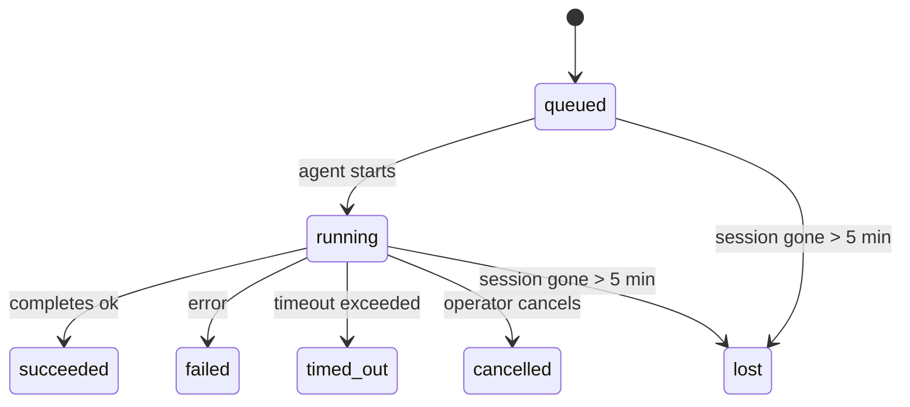

---
read_when:
    - Ispezione delle attività in background in corso o completate di recente
    - Debug degli errori di recapito per le esecuzioni di agenti distaccate
    - Comprendere il rapporto tra esecuzioni in background, sessioni, Cron e Heartbeat
sidebarTitle: Background tasks
summary: Monitoraggio delle attività in secondo piano per le esecuzioni ACP, i subagenti, le attività Cron isolate e le operazioni CLI
title: Attività in background
x-i18n:
    generated_at: "2026-05-10T19:21:12Z"
    model: gpt-5.5
    provider: openai
    source_hash: 5764a89634f90181d826ff3990ec8dac9538239074934d30fd446c1eb4564869
    source_path: automation/tasks.md
    workflow: 16
---

<Note>
Cerchi la pianificazione? Consulta [Automazione e attività](/it/automation) per scegliere il meccanismo corretto. Questa pagina è il registro delle attività per il lavoro in background, non lo scheduler.
</Note>

Le attività in background tracciano il lavoro eseguito **fuori dalla tua sessione di conversazione principale**: esecuzioni ACP, avvii di subagent, esecuzioni isolate di processi Cron e operazioni avviate dalla CLI.

Le attività **non** sostituiscono sessioni, processi Cron o Heartbeat: sono il **registro delle attività** che registra quale lavoro distaccato è avvenuto, quando e se è riuscito.

<Note>
Non ogni esecuzione di agente crea un'attività. I turni Heartbeat e la normale chat interattiva non lo fanno. Tutte le esecuzioni Cron, gli avvii ACP, gli avvii di subagent e i comandi agente della CLI lo fanno.
</Note>

## TL;DR

- Le attività sono **record**, non scheduler: Cron e Heartbeat decidono _quando_ viene eseguito il lavoro, le attività tracciano _cosa è successo_.
- ACP, subagent, tutti i processi Cron e le operazioni CLI creano attività. I turni Heartbeat no.
- Ogni attività passa attraverso `queued → running → terminal` (succeeded, failed, timed_out, cancelled o lost).
- Le attività Cron restano attive finché il runtime Cron possiede ancora il processo; se lo
  stato runtime in memoria è scomparso, la manutenzione delle attività controlla prima la cronologia
  durevole delle esecuzioni Cron prima di contrassegnare un'attività come persa.
- Il completamento è guidato da push: il lavoro distaccato può notificare direttamente o risvegliare la
  sessione/Heartbeat richiedente quando termina, quindi i loop di polling dello stato sono
  di solito la forma sbagliata.
- Le esecuzioni Cron isolate e i completamenti dei subagent tentano, al meglio, di ripulire schede/processi del browser tracciati per la loro sessione figlia prima della contabilità finale di pulizia.
- La consegna Cron isolata sopprime le risposte intermedie obsolete del genitore mentre il lavoro dei subagent discendenti è ancora in esaurimento, e preferisce l'output finale del discendente quando arriva prima della consegna.
- Le notifiche di completamento vengono consegnate direttamente a un canale o accodate per il prossimo Heartbeat.
- `openclaw tasks list` mostra tutte le attività; `openclaw tasks audit` evidenzia i problemi.
- I record terminali vengono conservati per 7 giorni, poi eliminati automaticamente.

## Avvio rapido

<Tabs>
  <Tab title="List and filter">
    ```bash
    # List all tasks (newest first)
    openclaw tasks list

    # Filter by runtime or status
    openclaw tasks list --runtime acp
    openclaw tasks list --status running
    ```

  </Tab>
  <Tab title="Inspect">
    ```bash
    # Show details for a specific task (by ID, run ID, or session key)
    openclaw tasks show <lookup>
    ```
  </Tab>
  <Tab title="Cancel and notify">
    ```bash
    # Cancel a running task (kills the child session)
    openclaw tasks cancel <lookup>

    # Change notification policy for a task
    openclaw tasks notify <lookup> state_changes
    ```

  </Tab>
  <Tab title="Audit and maintenance">
    ```bash
    # Run a health audit
    openclaw tasks audit

    # Preview or apply maintenance
    openclaw tasks maintenance
    openclaw tasks maintenance --apply
    ```

  </Tab>
  <Tab title="Task flow">
    ```bash
    # Inspect TaskFlow state
    openclaw tasks flow list
    openclaw tasks flow show <lookup>
    openclaw tasks flow cancel <lookup>
    ```
  </Tab>
</Tabs>

## Cosa crea un'attività

| Origine                | Tipo runtime | Quando viene creato un record attività                 | Criterio di notifica predefinito |
| ---------------------- | ------------ | ------------------------------------------------------ | -------------------------------- |
| Esecuzioni ACP in background | `acp`        | Avvio di una sessione ACP figlia                       | `done_only`                      |
| Orchestrazione subagent | `subagent`   | Avvio di un subagent tramite `sessions_spawn`          | `done_only`                      |
| Processi Cron (tutti i tipi) | `cron`       | Ogni esecuzione Cron (sessione principale e isolata)   | `silent`                         |
| Operazioni CLI        | `cli`        | Comandi `openclaw agent` eseguiti tramite il Gateway   | `silent`                         |
| Processi multimediali agente | `cli`        | Esecuzioni `music_generate`/`video_generate` basate su sessione | `silent`                         |

<AccordionGroup>
  <Accordion title="Notify defaults for cron and media">
    Le attività Cron della sessione principale usano il criterio di notifica `silent` per impostazione predefinita: creano record per il tracciamento ma non generano notifiche. Anche le attività Cron isolate hanno come valore predefinito `silent`, ma sono più visibili perché vengono eseguite nella propria sessione.

    Anche le esecuzioni `music_generate` e `video_generate` basate su sessione usano il criterio di notifica `silent`. Creano comunque record attività, ma il completamento viene restituito alla sessione agente originale come risveglio interno, così l'agente può scrivere il messaggio di follow-up e allegare autonomamente il contenuto multimediale completato. I completamenti di gruppo/canale seguono il normale criterio di risposta visibile, quindi l'agente usa lo strumento messaggi quando la consegna di origine lo richiede. Se l'agente di completamento non riesce a produrre evidenza di consegna tramite strumento messaggi in un percorso solo strumenti, OpenClaw invia il fallback di completamento direttamente al canale originale invece di lasciare privato il contenuto multimediale.

  </Accordion>
  <Accordion title="Concurrent video_generate guardrail">
    Mentre un'attività `video_generate` basata su sessione è ancora attiva, lo strumento agisce anche come protezione: chiamate `video_generate` ripetute nella stessa sessione restituiscono lo stato dell'attività attiva invece di avviare una seconda generazione concorrente. Usa `action: "status"` quando vuoi una ricerca esplicita di avanzamento/stato dal lato agente.
  </Accordion>
  <Accordion title="What does not create tasks">
    - Turni Heartbeat: sessione principale; consulta [Heartbeat](/it/gateway/heartbeat)
    - Normali turni di chat interattiva
    - Risposte dirette `/command`

  </Accordion>
</AccordionGroup>

## Ciclo di vita dell'attività



| Stato       | Cosa significa                                                            |
| ----------- | -------------------------------------------------------------------------- |
| `queued`    | Creata, in attesa dell'avvio dell'agente                                   |
| `running`   | Il turno dell'agente è in esecuzione attiva                                |
| `succeeded` | Completata correttamente                                                   |
| `failed`    | Completata con un errore                                                    |
| `timed_out` | Ha superato il timeout configurato                                         |
| `cancelled` | Fermata dall'operatore tramite `openclaw tasks cancel`                     |
| `lost`      | Il runtime ha perso lo stato di supporto autorevole dopo un periodo di tolleranza di 5 minuti |

Le transizioni avvengono automaticamente: quando l'esecuzione dell'agente associata termina, lo stato dell'attività viene aggiornato di conseguenza.

Il completamento dell'esecuzione agente è autorevole per i record attività attivi. Un'esecuzione distaccata riuscita viene finalizzata come `succeeded`, gli errori ordinari di esecuzione come `failed` e gli esiti di timeout o interruzione come `timed_out`. Se un operatore ha già annullato l'attività, o il runtime ha già registrato uno stato terminale più forte come `failed`, `timed_out` o `lost`, un segnale di successo successivo non declassa quello stato terminale.

`lost` è consapevole del runtime:

- Attività ACP: i metadati della sessione ACP figlia di supporto sono scomparsi.
- Attività subagent: la sessione figlia di supporto è scomparsa dallo store dell'agente di destinazione.
- Attività Cron: il runtime Cron non traccia più il processo come attivo e la cronologia
  durevole delle esecuzioni Cron non mostra un risultato terminale per quell'esecuzione. L'audit CLI
  offline non considera autorevole il proprio stato runtime Cron in-process vuoto.
- Attività CLI: le attività con un id esecuzione/id origine usano il contesto di esecuzione live, quindi
  righe persistenti di sessione figlia o sessione chat non le mantengono attive dopo la
  scomparsa dell'esecuzione posseduta dal Gateway. Le attività CLI legacy senza identità di esecuzione ripiegano ancora
  sulla sessione figlia. Anche le esecuzioni `openclaw agent` basate su Gateway vengono finalizzate
  dal loro risultato di esecuzione, quindi le esecuzioni completate non restano attive finché lo sweeper
  non le contrassegna come `lost`.

## Consegna e notifiche

Quando un'attività raggiunge uno stato terminale, OpenClaw ti notifica. Esistono due percorsi di consegna:

**Consegna diretta**: se l'attività ha una destinazione canale (il `requesterOrigin`), il messaggio di completamento arriva direttamente a quel canale (Telegram, Discord, Slack, ecc.). I completamenti delle attività di gruppo e canale vengono invece instradati tramite la sessione richiedente così l'agente genitore può scrivere la risposta visibile. Per i completamenti dei subagent, OpenClaw preserva anche l'instradamento thread/topic associato quando disponibile e può compilare un `to` / account mancante dalla route memorizzata della sessione richiedente (`lastChannel` / `lastTo` / `lastAccountId`) prima di rinunciare alla consegna diretta.

**Consegna accodata in sessione**: se la consegna diretta fallisce o non è impostata alcuna origine, l'aggiornamento viene accodato come evento di sistema nella sessione del richiedente e appare al prossimo Heartbeat.

<Tip>
Il completamento dell'attività attiva un risveglio Heartbeat immediato, così vedi rapidamente il risultato: non devi attendere il prossimo tick Heartbeat pianificato.
</Tip>

Questo significa che il flusso di lavoro abituale è basato su push: avvia una volta il lavoro distaccato, poi lascia che il runtime ti risvegli o notifichi al completamento. Interroga lo stato dell'attività solo quando hai bisogno di debug, intervento o audit esplicito.

### Criteri di notifica

Controlla quanto vuoi essere informato su ogni attività:

| Criterio              | Cosa viene consegnato                                                 |
| --------------------- | --------------------------------------------------------------------- |
| `done_only` (predefinito) | Solo stato terminale (succeeded, failed, ecc.) - **questo è il predefinito** |
| `state_changes`       | Ogni transizione di stato e aggiornamento di avanzamento              |
| `silent`              | Nulla                                                                 |

Modifica il criterio mentre un'attività è in esecuzione:

```bash
openclaw tasks notify <lookup> state_changes
```

## Riferimento CLI

<AccordionGroup>
  <Accordion title="tasks list">
    ```bash
    openclaw tasks list [--runtime <acp|subagent|cron|cli>] [--status <status>] [--json]
    ```

    Colonne di output: ID attività, Tipo, Stato, Consegna, ID esecuzione, Sessione figlia, Riepilogo.

  </Accordion>
  <Accordion title="tasks show">
    ```bash
    openclaw tasks show <lookup>
    ```

    Il token di ricerca accetta un ID attività, ID esecuzione o chiave sessione. Mostra il record completo, inclusi tempi, stato di consegna, errore e riepilogo terminale.

  </Accordion>
  <Accordion title="tasks cancel">
    ```bash
    openclaw tasks cancel <lookup>
    ```

    Per le attività ACP e subagent, questo termina la sessione figlia. Per le attività tracciate dalla CLI, l'annullamento viene registrato nel registro attività (non esiste un handle runtime figlio separato). Lo stato passa a `cancelled` e, quando applicabile, viene inviata una notifica di consegna.

  </Accordion>
  <Accordion title="tasks notify">
    ```bash
    openclaw tasks notify <lookup> <done_only|state_changes|silent>
    ```
  </Accordion>
  <Accordion title="tasks audit">
    ```bash
    openclaw tasks audit [--json]
    ```

    Evidenzia problemi operativi. I risultati appaiono anche in `openclaw status` quando vengono rilevati problemi.

    | Riscontro                 | Gravità    | Attivazione                                                                                                  |
    | ------------------------- | ---------- | ------------------------------------------------------------------------------------------------------------ |
    | `stale_queued`            | warn       | In coda da più di 10 minuti                                                                                  |
    | `stale_running`           | error      | In esecuzione da più di 30 minuti                                                                            |
    | `lost`                    | warn/error | La proprietà dell'attività supportata dal runtime è scomparsa; le attività perse mantenute avvisano fino a `cleanupAfter`, poi diventano errori |
    | `delivery_failed`         | warn       | La consegna non è riuscita e la policy di notifica non è `silent`                                            |
    | `missing_cleanup`         | warn       | Attività terminale senza timestamp di pulizia                                                                |
    | `inconsistent_timestamps` | warn       | Violazione della sequenza temporale (per esempio terminata prima dell'avvio)                                 |

  </Accordion>
  <Accordion title="manutenzione delle attività">
    ```bash
    openclaw tasks maintenance [--json]
    openclaw tasks maintenance --apply [--json]
    ```

    Usalo per visualizzare in anteprima o applicare riconciliazione, marcatura della pulizia e potatura per attività, stato di Task Flow e righe obsolete del registro delle sessioni delle esecuzioni cron.

    La riconciliazione è consapevole del runtime:

    - Le attività ACP/subagent controllano la sessione figlia di supporto.
    - Le attività subagent la cui sessione figlia ha una tombstone di ripristino dopo riavvio vengono contrassegnate come perse invece di essere trattate come sessioni di supporto recuperabili.
    - Le attività Cron controllano se il runtime cron possiede ancora il job, poi recuperano lo stato terminale dai log di esecuzione cron persistiti/dallo stato del job prima di ripiegare su `lost`. Solo il processo Gateway è autorevole per il set in memoria dei job cron attivi; l'audit CLI offline usa la cronologia durevole ma non contrassegna un'attività cron come persa solo perché quel Set locale è vuoto.
    - Le attività CLI con identità di esecuzione controllano il contesto di esecuzione live proprietario, non solo le righe di sessione figlia o sessione chat.

    Anche la pulizia del completamento è consapevole del runtime:

    - Il completamento del subagent chiude, al meglio possibile, le schede/processi del browser tracciati per la sessione figlia prima che la pulizia dell'annuncio continui.
    - Il completamento del cron isolato chiude, al meglio possibile, le schede/processi del browser tracciati per la sessione cron prima che l'esecuzione venga completamente smontata.
    - La consegna del cron isolato attende, quando necessario, il follow-up del subagent discendente e sopprime il testo di conferma obsoleto del genitore invece di annunciarlo.
    - La consegna del completamento del subagent preferisce il testo assistente visibile più recente; se è vuoto, ripiega sul testo tool/toolResult più recente sanificato, e le esecuzioni di chiamate tool concluse solo per timeout possono comprimersi in un breve riepilogo di avanzamento parziale. Le esecuzioni terminali non riuscite annunciano lo stato di errore senza riprodurre il testo di risposta catturato.
    - Gli errori di pulizia non mascherano il risultato reale dell'attività.

    Quando applica la manutenzione, OpenClaw rimuove anche le righe obsolete del registro delle sessioni `cron:<jobId>:run:<uuid>` più vecchie di 7 giorni, preservando le righe per i job cron attualmente in esecuzione e lasciando intatte le righe di sessione non cron.

  </Accordion>
  <Accordion title="tasks flow list | show | cancel">
    ```bash
    openclaw tasks flow list [--status <status>] [--json]
    openclaw tasks flow show <lookup> [--json]
    openclaw tasks flow cancel <lookup>
    ```

    Usali quando ciò che ti interessa è il Task Flow orchestratore invece di un singolo record di attività in background.

  </Accordion>
</AccordionGroup>

## Bacheca attività della chat (`/tasks`)

Usa `/tasks` in qualsiasi sessione chat per vedere le attività in background collegate a quella sessione. La bacheca mostra le attività attive e completate di recente con runtime, stato, tempi e dettagli di avanzamento o errore.

Quando la sessione corrente non ha attività collegate visibili, `/tasks` ripiega sui conteggi delle attività locali dell'agente, così ottieni comunque una panoramica senza esporre dettagli di altre sessioni.

Per il registro operatore completo, usa la CLI: `openclaw tasks list`.

## Integrazione dello stato (pressione delle attività)

`openclaw status` include un riepilogo delle attività a colpo d'occhio:

```
Tasks: 3 queued · 2 running · 1 issues
```

Il riepilogo riporta:

- **active** - conteggio di `queued` + `running`
- **failures** - conteggio di `failed` + `timed_out` + `lost`
- **byRuntime** - suddivisione per `acp`, `subagent`, `cron`, `cli`

Sia `/status` sia il tool `session_status` usano uno snapshot delle attività consapevole della pulizia: le attività attive sono preferite, le righe completate obsolete sono nascoste e gli errori recenti emergono solo quando non rimane alcun lavoro attivo. Questo mantiene la scheda di stato concentrata su ciò che conta in questo momento.

## Archiviazione e manutenzione

### Dove risiedono le attività

I record delle attività persistono in SQLite in:

```
$OPENCLAW_STATE_DIR/tasks/runs.sqlite
```

Il registro viene caricato in memoria all'avvio del gateway e sincronizza le scritture su SQLite per garantire la durabilità tra i riavvii.
Il Gateway mantiene limitato il log write-ahead di SQLite usando la soglia predefinita di
autocheckpoint di SQLite più checkpoint `TRUNCATE` periodici e all'arresto.

### Manutenzione automatica

Uno sweeper viene eseguito ogni **60 secondi** e gestisce quattro aspetti:

<Steps>
  <Step title="Riconciliazione">
    Controlla se le attività attive hanno ancora un supporto runtime autorevole. Le attività ACP/subagent usano lo stato della sessione figlia, le attività cron usano la proprietà del job attivo e le attività CLI con identità di esecuzione usano il contesto di esecuzione proprietario. Se quello stato di supporto manca per più di 5 minuti, l'attività viene contrassegnata come `lost`.
  </Step>
  <Step title="Riparazione delle sessioni ACP">
    Chiude le sessioni ACP one-shot terminali o orfane di proprietà del genitore, e chiude le sessioni ACP persistenti terminali obsolete o orfane solo quando non rimane alcun binding di conversazione attivo.
  </Step>
  <Step title="Marcatura della pulizia">
    Imposta un timestamp `cleanupAfter` sulle attività terminali (endedAt + 7 giorni). Durante la conservazione, le attività perse appaiono ancora nell'audit come avvisi; dopo la scadenza di `cleanupAfter` o quando i metadati di pulizia mancano, sono errori.
  </Step>
  <Step title="Potatura">
    Elimina i record oltre la loro data `cleanupAfter`.
  </Step>
</Steps>

<Note>
**Conservazione:** i record delle attività terminali sono mantenuti per **7 giorni**, poi potati automaticamente. Non serve alcuna configurazione.
</Note>

## Come le attività si relazionano ad altri sistemi

<AccordionGroup>
  <Accordion title="Attività e Task Flow">
    [Task Flow](/it/automation/taskflow) è il livello di orchestrazione dei flussi sopra le attività in background. Un singolo flusso può coordinare più attività nel corso del suo ciclo di vita usando modalità di sincronizzazione gestite o rispecchiate. Usa `openclaw tasks` per ispezionare i record delle singole attività e `openclaw tasks flow` per ispezionare il flusso orchestratore.

    Consulta [Task Flow](/it/automation/taskflow) per i dettagli.

  </Accordion>
  <Accordion title="Attività e cron">
    Una **definizione** di job cron risiede in `~/.openclaw/cron/jobs.json`; lo stato di esecuzione runtime risiede accanto a essa in `~/.openclaw/cron/jobs-state.json`. **Ogni** esecuzione cron crea un record di attività, sia main-session sia isolata. Le attività cron main-session usano per impostazione predefinita la policy di notifica `silent`, così vengono tracciate senza generare notifiche.

    Consulta [Cron Jobs](/it/automation/cron-jobs).

  </Accordion>
  <Accordion title="Attività e heartbeat">
    Le esecuzioni Heartbeat sono turni main-session: non creano record di attività. Quando un'attività viene completata, può attivare una riattivazione Heartbeat così vedi subito il risultato.

    Consulta [Heartbeat](/it/gateway/heartbeat).

  </Accordion>
  <Accordion title="Attività e sessioni">
    Un'attività può fare riferimento a una `childSessionKey` (dove viene eseguito il lavoro) e a una `requesterSessionKey` (chi l'ha avviata). Le sessioni sono contesto di conversazione; le attività sono il tracciamento dell'attività sopra quel contesto.
  </Accordion>
  <Accordion title="Attività ed esecuzioni agente">
    Il `runId` di un'attività collega all'esecuzione dell'agente che svolge il lavoro. Gli eventi del ciclo di vita dell'agente (avvio, fine, errore) aggiornano automaticamente lo stato dell'attività: non devi gestire manualmente il ciclo di vita.
  </Accordion>
</AccordionGroup>

## Correlati

- [Automazione e attività](/it/automation) - tutti i meccanismi di automazione a colpo d'occhio
- [CLI: attività](/it/cli/tasks) - riferimento dei comandi CLI
- [Heartbeat](/it/gateway/heartbeat) - turni main-session periodici
- [Attività pianificate](/it/automation/cron-jobs) - pianificazione del lavoro in background
- [Task Flow](/it/automation/taskflow) - orchestrazione dei flussi sopra le attività
