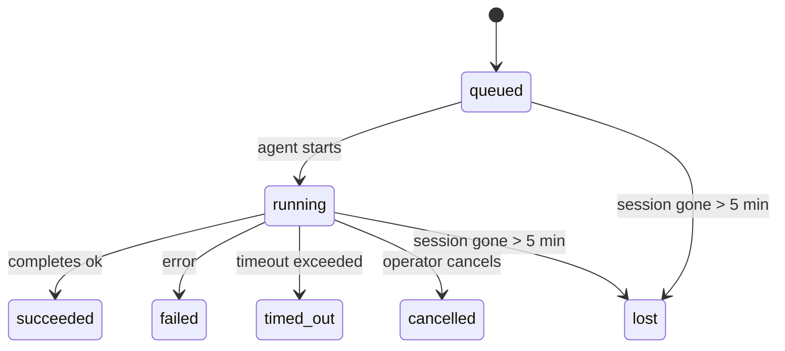

---
read_when:
    - Ispezione dei lavori in background in corso o completati di recente
    - Debug degli errori di consegna per le esecuzioni distaccate degli agenti
    - Comprendere come le esecuzioni in background sono correlate a sessioni, Cron e Heartbeat
sidebarTitle: Background tasks
summary: Monitoraggio delle attività in secondo piano per esecuzioni ACP, subagenti, processi Cron isolati e operazioni CLI
title: Attività in background
x-i18n:
    generated_at: "2026-05-05T06:16:19Z"
    model: gpt-5.5
    provider: openai
    source_hash: bafd959feaf2e220820ec56bf1ef144207d05757418e9971ebf427844cf30c46
    source_path: automation/tasks.md
    workflow: 16
---

<Note>
Cerchi la pianificazione? Consulta [Automazione e attività](/it/automation) per scegliere il meccanismo giusto. Questa pagina è il registro delle attività per il lavoro in background, non lo scheduler.
</Note>

Le attività in background tracciano il lavoro eseguito **fuori dalla tua sessione di conversazione principale**: esecuzioni ACP, avvii di subagent, esecuzioni di job cron isolati e operazioni avviate dalla CLI.

Le attività **non** sostituiscono sessioni, job cron o heartbeat: sono il **registro delle attività** che annota quale lavoro scollegato è stato eseguito, quando e se è riuscito.

<Note>
Non ogni esecuzione dell'agente crea un'attività. I turni Heartbeat e la normale chat interattiva non lo fanno. Tutte le esecuzioni cron, gli avvii ACP, gli avvii di subagent e i comandi agente CLI lo fanno.
</Note>

## In breve

- Le attività sono **record**, non scheduler: cron e Heartbeat decidono _quando_ viene eseguito il lavoro, le attività tracciano _che cosa è successo_.
- ACP, subagent, tutti i job cron e le operazioni CLI creano attività. I turni Heartbeat no.
- Ogni attività passa attraverso `queued → running → terminal` (succeeded, failed, timed_out, cancelled o lost).
- Le attività cron restano attive mentre il runtime cron possiede ancora il job; se lo stato del runtime in memoria non è più disponibile, la manutenzione delle attività controlla prima la cronologia durevole delle esecuzioni cron prima di contrassegnare un'attività come persa.
- Il completamento è guidato da push: il lavoro scollegato può notificare direttamente o risvegliare la sessione/Heartbeat del richiedente al termine, quindi i cicli di polling dello stato sono di solito la forma sbagliata.
- Le esecuzioni cron isolate e i completamenti dei subagent tentano al meglio di ripulire schede/processi del browser tracciati per la loro sessione figlia prima della contabilità finale di cleanup.
- La consegna cron isolata sopprime le risposte parent intermedie obsolete mentre il lavoro dei subagent discendenti è ancora in scaricamento, e preferisce l'output finale del discendente quando arriva prima della consegna.
- Le notifiche di completamento vengono consegnate direttamente a un canale o accodate per il prossimo Heartbeat.
- `openclaw tasks list` mostra tutte le attività; `openclaw tasks audit` mette in evidenza i problemi.
- I record terminali vengono mantenuti per 7 giorni, poi eliminati automaticamente.

## Avvio rapido

<Tabs>
  <Tab title="Elenca e filtra">
    ```bash
    # List all tasks (newest first)
    openclaw tasks list

    # Filter by runtime or status
    openclaw tasks list --runtime acp
    openclaw tasks list --status running
    ```

  </Tab>
  <Tab title="Ispeziona">
    ```bash
    # Show details for a specific task (by ID, run ID, or session key)
    openclaw tasks show <lookup>
    ```
  </Tab>
  <Tab title="Annulla e notifica">
    ```bash
    # Cancel a running task (kills the child session)
    openclaw tasks cancel <lookup>

    # Change notification policy for a task
    openclaw tasks notify <lookup> state_changes
    ```

  </Tab>
  <Tab title="Audit e manutenzione">
    ```bash
    # Run a health audit
    openclaw tasks audit

    # Preview or apply maintenance
    openclaw tasks maintenance
    openclaw tasks maintenance --apply
    ```

  </Tab>
  <Tab title="Flusso delle attività">
    ```bash
    # Inspect TaskFlow state
    openclaw tasks flow list
    openclaw tasks flow show <lookup>
    openclaw tasks flow cancel <lookup>
    ```
  </Tab>
</Tabs>

## Che cosa crea un'attività

| Origine                | Tipo di runtime | Quando viene creato un record di attività              | Criterio di notifica predefinito |
| ---------------------- | ------------ | ------------------------------------------------------ | --------------------- |
| Esecuzioni in background ACP | `acp`        | Avvio di una sessione ACP figlia                       | `done_only`           |
| Orchestrazione subagent | `subagent`   | Avvio di un subagent tramite `sessions_spawn`          | `done_only`           |
| Job cron (tutti i tipi) | `cron`       | Ogni esecuzione cron (sessione principale e isolata)   | `silent`              |
| Operazioni CLI         | `cli`        | Comandi `openclaw agent` eseguiti tramite il Gateway   | `silent`              |
| Job multimediali dell'agente | `cli`        | Esecuzioni `music_generate`/`video_generate` supportate da sessione | `silent`              |

<AccordionGroup>
  <Accordion title="Valori predefiniti di notifica per cron e media">
    Le attività cron della sessione principale usano il criterio di notifica `silent` per impostazione predefinita: creano record per il tracciamento ma non generano notifiche. Anche le attività cron isolate usano `silent` per impostazione predefinita, ma sono più visibili perché vengono eseguite nella propria sessione.

    Anche le esecuzioni `music_generate` e `video_generate` supportate da sessione usano il criterio di notifica `silent`. Creano comunque record di attività, ma il completamento viene restituito alla sessione agente originale come risveglio interno, così l'agente può scrivere il messaggio di follow-up e allegare autonomamente il media completato. I completamenti di gruppo/canale seguono il normale criterio di risposta visibile, quindi l'agente usa lo strumento messaggi quando la consegna sorgente lo richiede. Se l'agente di completamento non riesce a produrre prove di consegna tramite strumento messaggi in un percorso solo strumenti, OpenClaw invia il fallback di completamento direttamente al canale originale invece di lasciare il media privato.

  </Accordion>
  <Accordion title="Protezione per video_generate concorrente">
    Mentre un'attività `video_generate` supportata da sessione è ancora attiva, lo strumento agisce anche da protezione: chiamate `video_generate` ripetute nella stessa sessione restituiscono lo stato dell'attività attiva invece di avviare una seconda generazione concorrente. Usa `action: "status"` quando vuoi una consultazione esplicita di avanzamento/stato dal lato agente.
  </Accordion>
  <Accordion title="Che cosa non crea attività">
    - Turni Heartbeat: sessione principale; vedi [Heartbeat](/it/gateway/heartbeat)
    - Normali turni di chat interattiva
    - Risposte dirette a `/command`

  </Accordion>
</AccordionGroup>

## Ciclo di vita dell'attività



| Stato       | Che cosa significa                                                        |
| ----------- | -------------------------------------------------------------------------- |
| `queued`    | Creato, in attesa che l'agente inizi                                      |
| `running`   | Il turno dell'agente è in esecuzione attiva                               |
| `succeeded` | Completato correttamente                                                  |
| `failed`    | Completato con un errore                                                   |
| `timed_out` | Ha superato il timeout configurato                                         |
| `cancelled` | Interrotto dall'operatore tramite `openclaw tasks cancel`                 |
| `lost`      | Il runtime ha perso lo stato di supporto autorevole dopo un periodo di tolleranza di 5 minuti |

Le transizioni avvengono automaticamente: quando l'esecuzione dell'agente associata termina, lo stato dell'attività viene aggiornato di conseguenza.

Il completamento dell'esecuzione dell'agente è autorevole per i record di attività attivi. Un'esecuzione scollegata riuscita viene finalizzata come `succeeded`, gli errori ordinari di esecuzione come `failed` e gli esiti di timeout o interruzione come `timed_out`. Se un operatore ha già annullato l'attività, o il runtime ha già registrato uno stato terminale più forte come `failed`, `timed_out` o `lost`, un segnale di successo successivo non declassa quello stato terminale.

`lost` è consapevole del runtime:

- Attività ACP: i metadati della sessione ACP figlia di supporto sono scomparsi.
- Attività subagent: la sessione figlia di supporto è scomparsa dallo store dell'agente di destinazione.
- Attività cron: il runtime cron non traccia più il job come attivo e la cronologia durevole delle esecuzioni cron non mostra un risultato terminale per quell'esecuzione. L'audit CLI offline non considera autorevole il proprio stato cron in-process vuoto.
- Attività CLI: le attività con sessione figlia isolata usano la sessione figlia; le attività CLI supportate da chat usano invece il contesto di esecuzione live, quindi le righe persistenti di sessione canale/gruppo/diretta non le mantengono attive. Anche le esecuzioni `openclaw agent` supportate da Gateway vengono finalizzate dal loro risultato di esecuzione, quindi le esecuzioni completate non restano attive finché lo sweeper non le contrassegna come `lost`.

## Consegna e notifiche

Quando un'attività raggiunge uno stato terminale, OpenClaw ti notifica. Ci sono due percorsi di consegna:

**Consegna diretta**: se l'attività ha un target di canale (il `requesterOrigin`), il messaggio di completamento va direttamente a quel canale (Telegram, Discord, Slack, ecc.). Per i completamenti dei subagent, OpenClaw conserva anche il routing vincolato di thread/topic quando disponibile e può compilare un `to` / account mancante dalla route memorizzata della sessione del richiedente (`lastChannel` / `lastTo` / `lastAccountId`) prima di rinunciare alla consegna diretta.

**Consegna accodata nella sessione**: se la consegna diretta fallisce o non è impostata alcuna origine, l'aggiornamento viene accodato come evento di sistema nella sessione del richiedente e appare al prossimo Heartbeat.

<Tip>
Il completamento dell'attività attiva un risveglio Heartbeat immediato, così vedi rapidamente il risultato: non devi attendere il prossimo tick Heartbeat pianificato.
</Tip>

Ciò significa che il workflow usuale è basato su push: avvia una volta il lavoro scollegato, poi lascia che il runtime ti risvegli o ti notifichi al completamento. Esegui il polling dello stato dell'attività solo quando ti servono debug, intervento o un audit esplicito.

### Criteri di notifica

Controlla quanto vuoi ricevere per ogni attività:

| Criterio              | Che cosa viene consegnato                                             |
| --------------------- | ----------------------------------------------------------------------- |
| `done_only` (predefinito) | Solo stato terminale (succeeded, failed, ecc.): **questo è il valore predefinito** |
| `state_changes`       | Ogni transizione di stato e aggiornamento di avanzamento              |
| `silent`              | Niente                                                                  |

Modifica il criterio mentre un'attività è in esecuzione:

```bash
openclaw tasks notify <lookup> state_changes
```

## Riferimento CLI

<AccordionGroup>
  <Accordion title="tasks list">
    ```bash
    openclaw tasks list [--runtime <acp|subagent|cron|cli>] [--status <status>] [--json]
    ```

    Colonne di output: ID attività, Tipo, Stato, Consegna, ID esecuzione, Sessione figlia, Riepilogo.

  </Accordion>
  <Accordion title="tasks show">
    ```bash
    openclaw tasks show <lookup>
    ```

    Il token di lookup accetta un ID attività, un ID esecuzione o una chiave di sessione. Mostra il record completo, inclusi tempistiche, stato di consegna, errore e riepilogo terminale.

  </Accordion>
  <Accordion title="tasks cancel">
    ```bash
    openclaw tasks cancel <lookup>
    ```

    Per le attività ACP e subagent, questo termina la sessione figlia. Per le attività tracciate dalla CLI, l'annullamento viene registrato nel registro delle attività (non esiste un handle runtime figlio separato). Lo stato passa a `cancelled` e, se applicabile, viene inviata una notifica di consegna.

  </Accordion>
  <Accordion title="tasks notify">
    ```bash
    openclaw tasks notify <lookup> <done_only|state_changes|silent>
    ```
  </Accordion>
  <Accordion title="tasks audit">
    ```bash
    openclaw tasks audit [--json]
    ```

    Mette in evidenza problemi operativi. I risultati appaiono anche in `openclaw status` quando vengono rilevati problemi.

    | Riscontro                 | Gravità    | Attivatore                                                                                                   |
    | ------------------------- | ---------- | ------------------------------------------------------------------------------------------------------------ |
    | `stale_queued`            | avviso     | In coda da più di 10 minuti                                                                                  |
    | `stale_running`           | errore     | In esecuzione da più di 30 minuti                                                                            |
    | `lost`                    | avviso/errore | La proprietà dell'attività supportata dal runtime è scomparsa; le attività perse mantenute generano avvisi fino a `cleanupAfter`, poi diventano errori |
    | `delivery_failed`         | avviso     | La consegna non è riuscita e la policy di notifica non è `silent`                                            |
    | `missing_cleanup`         | avviso     | Attività terminale senza timestamp di pulizia                                                                |
    | `inconsistent_timestamps` | avviso     | Violazione della sequenza temporale (per esempio terminata prima dell'avvio)                                 |

  </Accordion>
  <Accordion title="manutenzione delle attività">
    ```bash
    openclaw tasks maintenance [--json]
    openclaw tasks maintenance --apply [--json]
    ```

    Usalo per visualizzare in anteprima o applicare riconciliazione, marcatura della pulizia e potatura per le attività e lo stato di Task Flow.

    La riconciliazione è consapevole del runtime:

    - Le attività ACP/subagent controllano la sessione figlia di supporto.
    - Le attività subagent la cui sessione figlia ha una tombstone di ripristino dopo riavvio vengono contrassegnate come perse invece di essere trattate come sessioni di supporto recuperabili.
    - Le attività Cron controllano se il runtime cron possiede ancora il job, poi recuperano lo stato terminale dai log di esecuzione cron persistiti/dallo stato del job prima di ripiegare su `lost`. Solo il processo Gateway è autorevole per l'insieme in memoria dei job cron attivi; l'audit CLI offline usa la cronologia durevole ma non contrassegna un'attività cron come persa solo perché quel Set locale è vuoto.
    - Le attività CLI supportate da chat controllano il contesto di esecuzione live proprietario, non solo la riga della sessione chat.

    Anche la pulizia al completamento è consapevole del runtime:

    - Il completamento subagent chiude, al meglio, le schede del browser/i processi tracciati per la sessione figlia prima che la pulizia dell'annuncio continui.
    - Il completamento cron isolato chiude, al meglio, le schede del browser/i processi tracciati per la sessione cron prima che l'esecuzione venga completamente smantellata.
    - La consegna cron isolata attende il follow-up del subagent discendente quando necessario e sopprime il testo obsoleto di conferma del genitore invece di annunciarlo.
    - La consegna del completamento subagent preferisce il testo più recente visibile dell'assistente; se è vuoto, ripiega sul testo più recente sanitizzato di tool/toolResult, e le esecuzioni di chiamate tool terminate solo per timeout possono essere condensate in un breve riepilogo di progresso parziale. Le esecuzioni terminali non riuscite annunciano lo stato di errore senza riprodurre il testo di risposta catturato.
    - Gli errori di pulizia non mascherano il vero esito dell'attività.

  </Accordion>
  <Accordion title="tasks flow list | show | cancel">
    ```bash
    openclaw tasks flow list [--status <status>] [--json]
    openclaw tasks flow show <lookup> [--json]
    openclaw tasks flow cancel <lookup>
    ```

    Usali quando ciò che ti interessa è il Task Flow orchestrante invece di un singolo record di attività in background.

  </Accordion>
</AccordionGroup>

## Bacheca attività della chat (`/tasks`)

Usa `/tasks` in qualsiasi sessione chat per vedere le attività in background collegate a quella sessione. La bacheca mostra le attività attive e completate di recente con runtime, stato, tempistiche e dettagli di avanzamento o errore.

Quando la sessione corrente non ha attività collegate visibili, `/tasks` ripiega sui conteggi delle attività locali dell'agente, così ottieni comunque una panoramica senza esporre dettagli di altre sessioni.

Per il registro operativo completo, usa la CLI: `openclaw tasks list`.

## Integrazione dello stato (pressione delle attività)

`openclaw status` include un riepilogo immediato delle attività:

```
Tasks: 3 queued · 2 running · 1 issues
```

Il riepilogo riporta:

- **active** — conteggio di `queued` + `running`
- **failures** — conteggio di `failed` + `timed_out` + `lost`
- **byRuntime** — suddivisione per `acp`, `subagent`, `cron`, `cli`

Sia `/status` sia il tool `session_status` usano uno snapshot delle attività consapevole della pulizia: le attività attive hanno priorità, le righe completate obsolete sono nascoste e gli errori recenti emergono solo quando non resta lavoro attivo. Questo mantiene la scheda di stato concentrata su ciò che conta in questo momento.

## Archiviazione e manutenzione

### Dove risiedono le attività

I record delle attività persistono in SQLite in:

```
$OPENCLAW_STATE_DIR/tasks/runs.sqlite
```

Il registro viene caricato in memoria all'avvio del gateway e sincronizza le scritture su SQLite per garantire la durabilità tra i riavvii.
Il Gateway mantiene limitato il write-ahead log di SQLite usando la soglia predefinita di
autocheckpoint di SQLite più checkpoint `TRUNCATE` periodici e allo spegnimento.

### Manutenzione automatica

Uno sweeper viene eseguito ogni **60 secondi** e gestisce quattro cose:

<Steps>
  <Step title="Riconciliazione">
    Controlla se le attività attive hanno ancora un supporto runtime autorevole. Le attività ACP/subagent usano lo stato della sessione figlia, le attività cron usano la proprietà dei job attivi e le attività CLI supportate da chat usano il contesto di esecuzione proprietario. Se quello stato di supporto manca da più di 5 minuti, l'attività viene contrassegnata come `lost`.
  </Step>
  <Step title="Riparazione della sessione ACP">
    Chiude le sessioni ACP one-shot terminali o orfane possedute dal genitore, e chiude le sessioni ACP persistenti terminali obsolete o orfane solo quando non rimane alcun binding di conversazione attivo.
  </Step>
  <Step title="Marcatura della pulizia">
    Imposta un timestamp `cleanupAfter` sulle attività terminali (endedAt + 7 giorni). Durante la conservazione, le attività perse appaiono ancora nell'audit come avvisi; dopo la scadenza di `cleanupAfter` o quando mancano i metadati di pulizia, sono errori.
  </Step>
  <Step title="Potatura">
    Elimina i record oltre la loro data `cleanupAfter`.
  </Step>
</Steps>

<Note>
**Conservazione:** i record delle attività terminali vengono conservati per **7 giorni**, poi potati automaticamente. Nessuna configurazione necessaria.
</Note>

## Come le attività si collegano ad altri sistemi

<AccordionGroup>
  <Accordion title="Attività e Task Flow">
    [Task Flow](/it/automation/taskflow) è il livello di orchestrazione dei flussi sopra le attività in background. Un singolo flusso può coordinare più attività nel corso della sua durata usando modalità sync gestite o specchiate. Usa `openclaw tasks` per ispezionare i singoli record delle attività e `openclaw tasks flow` per ispezionare il flusso orchestrante.

    Vedi [Task Flow](/it/automation/taskflow) per i dettagli.

  </Accordion>
  <Accordion title="Attività e cron">
    Una **definizione** di job cron risiede in `~/.openclaw/cron/jobs.json`; lo stato di esecuzione runtime risiede accanto a essa in `~/.openclaw/cron/jobs-state.json`. **Ogni** esecuzione cron crea un record di attività, sia main-session sia isolato. Le attività cron main-session hanno come predefinita la policy di notifica `silent`, così tracciano senza generare notifiche.

    Vedi [Cron Jobs](/it/automation/cron-jobs).

  </Accordion>
  <Accordion title="Attività e Heartbeat">
    Le esecuzioni Heartbeat sono turni main-session: non creano record di attività. Quando un'attività si completa, può attivare un risveglio Heartbeat così vedi subito il risultato.

    Vedi [Heartbeat](/it/gateway/heartbeat).

  </Accordion>
  <Accordion title="Attività e sessioni">
    Un'attività può fare riferimento a una `childSessionKey` (dove viene eseguito il lavoro) e a una `requesterSessionKey` (chi l'ha avviata). Le sessioni sono il contesto di conversazione; le attività sono tracciamento dell'attività sopra quel contesto.
  </Accordion>
  <Accordion title="Attività ed esecuzioni dell'agente">
    Il `runId` di un'attività collega all'esecuzione dell'agente che svolge il lavoro. Gli eventi del ciclo di vita dell'agente (avvio, fine, errore) aggiornano automaticamente lo stato dell'attività: non devi gestire manualmente il ciclo di vita.
  </Accordion>
</AccordionGroup>

## Correlati

- [Automazione e attività](/it/automation) — tutti i meccanismi di automazione in sintesi
- [CLI: Attività](/it/cli/tasks) — riferimento dei comandi CLI
- [Heartbeat](/it/gateway/heartbeat) — turni main-session periodici
- [Attività pianificate](/it/automation/cron-jobs) — pianificazione del lavoro in background
- [Task Flow](/it/automation/taskflow) — orchestrazione dei flussi sopra le attività
