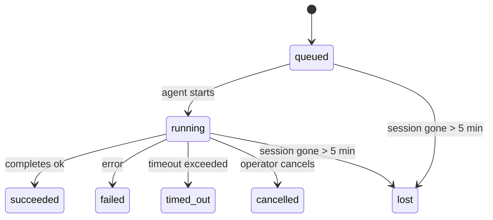

---
read_when:
    - Ispezione del lavoro in background in corso o completato di recente
    - Debugging dei problemi di recapito per le esecuzioni scollegate dell’agente
    - Comprendere come le esecuzioni in background si collegano alle sessioni, a Cron e a Heartbeat
sidebarTitle: Background tasks
summary: Tracciamento delle attività in background per le esecuzioni di ACP, i sottoagenti, i processi Cron isolati e le operazioni della CLI
title: Attività in background
x-i18n:
    generated_at: "2026-04-26T11:22:56Z"
    model: gpt-5.4
    provider: openai
    source_hash: 46952a378babdee9f43102bfa71dbd35b6ca7ecb142ffce3785eeb479e19d6b6
    source_path: automation/tasks.md
    workflow: 15
---

<Note>
Cerchi la pianificazione? Consulta [Automazione e attività](/it/automation) per scegliere il meccanismo giusto. Questa pagina riguarda il **monitoraggio** del lavoro in background, non la sua pianificazione.
</Note>

Le attività in background tengono traccia del lavoro che viene eseguito **al di fuori della sessione principale di conversazione**: esecuzioni ACP, avvii di sottoagenti, esecuzioni isolate di processi Cron e operazioni avviate dalla CLI.

Le attività **non** sostituiscono le sessioni, i processi Cron o gli heartbeat — sono il **registro delle attività** che annota quale lavoro scollegato è avvenuto, quando e se è andato a buon fine.

<Note>
Non ogni esecuzione dell’agente crea un’attività. I turni di Heartbeat e la normale chat interattiva non lo fanno. Tutte le esecuzioni Cron, gli avvii ACP, gli avvii di sottoagenti e i comandi agente della CLI invece sì.
</Note>

## In breve

- Le attività sono **record**, non scheduler — Cron e Heartbeat decidono _quando_ viene eseguito il lavoro, le attività tengono traccia di _cosa è successo_.
- ACP, sottoagenti, tutti i processi Cron e le operazioni della CLI creano attività. I turni di Heartbeat no.
- Ogni attività passa attraverso `queued → running → terminal` (succeeded, failed, timed_out, cancelled o lost).
- Le attività Cron restano attive finché il runtime Cron possiede ancora il processo; se lo stato del runtime in memoria non è più disponibile, la manutenzione delle attività controlla prima la cronologia persistente delle esecuzioni Cron prima di contrassegnare un’attività come lost.
- Il completamento è guidato da push: il lavoro scollegato può notificare direttamente o riattivare la sessione/Heartbeat richiedente quando termina, quindi i loop di polling dello stato di solito non sono l’approccio corretto.
- Le esecuzioni Cron isolate e i completamenti dei sottoagenti eseguono, nel limite del possibile, la pulizia di schede/processi del browser tracciati per la loro sessione figlia prima della pulizia finale di bookkeeping.
- La consegna delle esecuzioni Cron isolate sopprime le risposte intermedie obsolete del padre mentre il lavoro dei sottoagenti discendenti è ancora in fase di svuotamento, e preferisce l’output finale del discendente quando arriva prima della consegna.
- Le notifiche di completamento vengono recapitate direttamente a un canale o accodate per il prossimo Heartbeat.
- `openclaw tasks list` mostra tutte le attività; `openclaw tasks audit` evidenzia i problemi.
- I record terminali vengono conservati per 7 giorni, poi eliminati automaticamente.

## Avvio rapido

<Tabs>
  <Tab title="Elencare e filtrare">
    ```bash
    # Elenca tutte le attività (dalla più recente)
    openclaw tasks list

    # Filtra per runtime o stato
    openclaw tasks list --runtime acp
    openclaw tasks list --status running
    ```

  </Tab>
  <Tab title="Ispezionare">
    ```bash
    # Mostra i dettagli di un'attività specifica (per ID, run ID o chiave sessione)
    openclaw tasks show <lookup>
    ```
  </Tab>
  <Tab title="Annullare e notificare">
    ```bash
    # Annulla un'attività in esecuzione (termina la sessione figlia)
    openclaw tasks cancel <lookup>

    # Cambia il criterio di notifica per un'attività
    openclaw tasks notify <lookup> state_changes
    ```

  </Tab>
  <Tab title="Audit e manutenzione">
    ```bash
    # Esegui un audit di integrità
    openclaw tasks audit

    # Anteprima o applica la manutenzione
    openclaw tasks maintenance
    openclaw tasks maintenance --apply
    ```

  </Tab>
  <Tab title="Flusso attività">
    ```bash
    # Ispeziona lo stato di TaskFlow
    openclaw tasks flow list
    openclaw tasks flow show <lookup>
    openclaw tasks flow cancel <lookup>
    ```
  </Tab>
</Tabs>

## Cosa crea un’attività

| Origine                | Tipo di runtime | Quando viene creato un record attività                  | Criterio di notifica predefinito |
| ---------------------- | --------------- | ------------------------------------------------------- | -------------------------------- |
| Esecuzioni ACP in background | `acp`     | Avvio di una sessione figlia ACP                        | `done_only`                      |
| Orchestrazione di sottoagenti | `subagent` | Avvio di un sottoagente tramite `sessions_spawn`      | `done_only`                      |
| Processi Cron (tutti i tipi) | `cron`   | Ogni esecuzione Cron (sessione principale e isolata)    | `silent`                         |
| Operazioni CLI         | `cli`           | Comandi `openclaw agent` eseguiti tramite il Gateway    | `silent`                         |
| Attività multimediali dell’agente | `cli` | Esecuzioni `video_generate` associate a una sessione | `silent`                         |

<AccordionGroup>
  <Accordion title="Valori predefiniti di notifica per Cron e contenuti multimediali">
    Le attività Cron della sessione principale usano per impostazione predefinita il criterio di notifica `silent` — creano record per il monitoraggio ma non generano notifiche. Anche le attività Cron isolate usano per impostazione predefinita `silent`, ma sono più visibili perché vengono eseguite nella propria sessione.

    Anche le esecuzioni `video_generate` associate a una sessione usano il criterio di notifica `silent`. Creano comunque record attività, ma il completamento viene restituito alla sessione agente originale come riattivazione interna, così l’agente può scrivere il messaggio di follow-up e allegare direttamente il video completato. Se abiliti `tools.media.asyncCompletion.directSend`, i completamenti asincroni di `music_generate` e `video_generate` provano prima il recapito diretto al canale, prima di ripiegare sul percorso di riattivazione della sessione richiedente.

  </Accordion>
  <Accordion title="Vincolo di protezione per `video_generate` concorrente">
    Mentre un’attività `video_generate` associata a una sessione è ancora attiva, lo strumento funge anche da vincolo di protezione: chiamate ripetute a `video_generate` nella stessa sessione restituiscono lo stato dell’attività attiva invece di avviare una seconda generazione concorrente. Usa `action: "status"` quando vuoi una ricerca esplicita di avanzamento/stato dal lato dell’agente.
  </Accordion>
  <Accordion title="Cosa non crea attività">
    - Turni di Heartbeat — sessione principale; vedi [Heartbeat](/it/gateway/heartbeat)
    - Normali turni di chat interattiva
    - Risposte dirette a `/command`

  </Accordion>
</AccordionGroup>

## Ciclo di vita delle attività



| Stato       | Cosa significa                                                            |
| ----------- | ------------------------------------------------------------------------- |
| `queued`    | Creata, in attesa che l’agente inizi                                      |
| `running`   | Il turno dell’agente è in esecuzione attiva                               |
| `succeeded` | Completata con successo                                                   |
| `failed`    | Completata con un errore                                                  |
| `timed_out` | Ha superato il timeout configurato                                        |
| `cancelled` | Interrotta dall’operatore tramite `openclaw tasks cancel`                 |
| `lost`      | Il runtime ha perso lo stato autorevole di supporto dopo un periodo di grazia di 5 minuti |

Le transizioni avvengono automaticamente — quando termina l’esecuzione dell’agente associata, lo stato dell’attività viene aggiornato di conseguenza.

Il completamento dell’esecuzione dell’agente è autorevole per i record di attività attive. Un’esecuzione scollegata completata con successo viene finalizzata come `succeeded`, i normali errori di esecuzione vengono finalizzati come `failed` e gli esiti per timeout o interruzione vengono finalizzati come `timed_out`. Se un operatore ha già annullato l’attività, oppure il runtime ha già registrato uno stato terminale più forte come `failed`, `timed_out` o `lost`, un successivo segnale di successo non retrocede quello stato terminale.

`lost` dipende dal runtime:

- Attività ACP: i metadati della sessione figlia ACP di supporto sono scomparsi.
- Attività di sottoagenti: la sessione figlia di supporto è scomparsa dallo store dell’agente di destinazione.
- Attività Cron: il runtime Cron non tiene più traccia del processo come attivo e la cronologia persistente delle esecuzioni Cron non mostra un risultato terminale per quell’esecuzione. L’audit CLI offline non considera il proprio stato vuoto del runtime Cron in-process come autorevole.
- Attività CLI: le attività isolate della sessione figlia usano la sessione figlia; le attività CLI associate alla chat usano invece il contesto di esecuzione live, quindi righe persistenti di sessione canale/gruppo/diretta non le mantengono attive. Le esecuzioni `openclaw agent` supportate da Gateway vengono inoltre finalizzate dal loro risultato di esecuzione, quindi le esecuzioni completate non restano attive finché lo sweeper non le contrassegna come `lost`.

## Recapito e notifiche

Quando un’attività raggiunge uno stato terminale, OpenClaw ti avvisa. Esistono due percorsi di recapito:

**Recapito diretto** — se l’attività ha una destinazione di canale (la `requesterOrigin`), il messaggio di completamento viene inviato direttamente a quel canale (Telegram, Discord, Slack, ecc.). Per i completamenti dei sottoagenti, OpenClaw preserva anche il routing associato di thread/topic quando disponibile e può completare un `to` / account mancante dalla route memorizzata della sessione richiedente (`lastChannel` / `lastTo` / `lastAccountId`) prima di rinunciare al recapito diretto.

**Recapito accodato alla sessione** — se il recapito diretto fallisce o non è impostata alcuna origine, l’aggiornamento viene accodato come evento di sistema nella sessione del richiedente e compare al prossimo heartbeat.

<Tip>
Il completamento dell’attività attiva una riattivazione immediata di Heartbeat così puoi vedere rapidamente il risultato — non devi aspettare il prossimo tick pianificato di Heartbeat.
</Tip>

Ciò significa che il flusso di lavoro usuale è basato su push: avvia il lavoro scollegato una volta, poi lascia che il runtime ti riattivi o ti notifichi al completamento. Esegui il polling dello stato dell’attività solo quando ti serve per debugging, intervento o un audit esplicito.

### Criteri di notifica

Controlla quanto vuoi essere informato su ogni attività:

| Criterio              | Cosa viene recapitato                                                     |
| --------------------- | ------------------------------------------------------------------------- |
| `done_only` (predefinito) | Solo lo stato terminale (succeeded, failed, ecc.) — **questo è il valore predefinito** |
| `state_changes`       | Ogni transizione di stato e aggiornamento di avanzamento                  |
| `silent`              | Nulla                                                                     |

Cambia il criterio mentre un’attività è in esecuzione:

```bash
openclaw tasks notify <lookup> state_changes
```

## Riferimento CLI

<AccordionGroup>
  <Accordion title="tasks list">
    ```bash
    openclaw tasks list [--runtime <acp|subagent|cron|cli>] [--status <status>] [--json]
    ```

    Colonne di output: ID attività, Tipo, Stato, Recapito, ID esecuzione, Sessione figlia, Riepilogo.

  </Accordion>
  <Accordion title="tasks show">
    ```bash
    openclaw tasks show <lookup>
    ```

    Il token di ricerca accetta un ID attività, un ID esecuzione o una chiave sessione. Mostra il record completo, inclusi tempi, stato di recapito, errore e riepilogo terminale.

  </Accordion>
  <Accordion title="tasks cancel">
    ```bash
    openclaw tasks cancel <lookup>
    ```

    Per le attività ACP e di sottoagenti, questo termina la sessione figlia. Per le attività monitorate dalla CLI, l’annullamento viene registrato nel registro delle attività (non esiste un handle runtime figlio separato). Lo stato passa a `cancelled` e viene inviata una notifica di recapito quando applicabile.

  </Accordion>
  <Accordion title="tasks notify">
    ```bash
    openclaw tasks notify <lookup> <done_only|state_changes|silent>
    ```
  </Accordion>
  <Accordion title="tasks audit">
    ```bash
    openclaw tasks audit [--json]
    ```

    Evidenzia i problemi operativi. I risultati compaiono anche in `openclaw status` quando vengono rilevati problemi.

    | Rilevamento               | Gravità   | Trigger                                                                                                           |
    | ------------------------ | --------- | ----------------------------------------------------------------------------------------------------------------- |
    | `stale_queued`           | warn      | In coda da più di 10 minuti                                                                                       |
    | `stale_running`          | error     | In esecuzione da più di 30 minuti                                                                                 |
    | `lost`                   | warn/error | La proprietà dell’attività supportata dal runtime è scomparsa; le attività lost conservate generano avvisi fino a `cleanupAfter`, poi diventano errori |
    | `delivery_failed`        | warn      | Il recapito non è riuscito e il criterio di notifica non è `silent`                                               |
    | `missing_cleanup`        | warn      | Attività terminale senza timestamp di pulizia                                                                     |
    | `inconsistent_timestamps` | warn     | Violazione della timeline (ad esempio terminata prima di iniziare)                                                |

  </Accordion>
  <Accordion title="tasks maintenance">
    ```bash
    openclaw tasks maintenance [--json]
    openclaw tasks maintenance --apply [--json]
    ```

    Usa questo comando per visualizzare in anteprima o applicare riconciliazione, marcatura della pulizia ed eliminazione per le attività e lo stato di TaskFlow.

    La riconciliazione è consapevole del runtime:

    - Le attività ACP/subagent controllano la loro sessione figlia di supporto.
    - Le attività Cron controllano se il runtime Cron possiede ancora il processo, quindi recuperano lo stato terminale dai log persistenti delle esecuzioni Cron/dallo stato del processo prima di ripiegare su `lost`. Solo il processo Gateway è autorevole per l’insieme in memoria dei processi Cron attivi; l’audit CLI offline usa la cronologia persistente ma non contrassegna un’attività Cron come lost solo perché quel `Set` locale è vuoto.
    - Le attività CLI associate alla chat controllano il contesto di esecuzione live proprietario, non solo la riga della sessione chat.

    Anche la pulizia del completamento è consapevole del runtime:

    - Il completamento dei sottoagenti chiude nel limite del possibile le schede/processi del browser tracciati per la sessione figlia prima che continui la pulizia dell’annuncio.
    - Il completamento Cron isolato chiude nel limite del possibile le schede/processi del browser tracciati per la sessione Cron prima che l’esecuzione venga completamente smantellata.
    - Il recapito Cron isolato attende, quando necessario, il follow-up dei sottoagenti discendenti e sopprime il testo obsoleto di conferma del padre invece di annunciarlo.
    - Il recapito del completamento dei sottoagenti preferisce il testo visibile più recente dell’assistente; se è vuoto, ripiega sul testo più recente e sanificato di tool/toolResult, e le esecuzioni di sole chiamate tool terminate per timeout possono ridursi a un breve riepilogo dell’avanzamento parziale. Le esecuzioni terminali non riuscite annunciano lo stato di errore senza riprodurre il testo della risposta acquisita.
    - I fallimenti di pulizia non mascherano il reale esito dell’attività.

  </Accordion>
  <Accordion title="tasks flow list | show | cancel">
    ```bash
    openclaw tasks flow list [--status <status>] [--json]
    openclaw tasks flow show <lookup> [--json]
    openclaw tasks flow cancel <lookup>
    ```

    Usa questi comandi quando ciò che ti interessa è il TaskFlow di orchestrazione piuttosto che un singolo record di attività in background.

  </Accordion>
</AccordionGroup>

## Bacheca attività della chat (`/tasks`)

Usa `/tasks` in qualsiasi sessione di chat per vedere le attività in background collegate a quella sessione. La bacheca mostra attività attive e completate di recente con runtime, stato, tempi e dettagli su avanzamento o errore.

Quando la sessione corrente non ha attività collegate visibili, `/tasks` ripiega sui conteggi delle attività locali dell’agente così ottieni comunque una panoramica senza esporre dettagli di altre sessioni.

Per il registro completo dell’operatore, usa la CLI: `openclaw tasks list`.

## Integrazione con lo stato (pressione delle attività)

`openclaw status` include un riepilogo rapido delle attività:

```
Tasks: 3 queued · 2 running · 1 issues
```

Il riepilogo riporta:

- **active** — conteggio di `queued` + `running`
- **failures** — conteggio di `failed` + `timed_out` + `lost`
- **byRuntime** — suddivisione per `acp`, `subagent`, `cron`, `cli`

Sia `/status` sia lo strumento `session_status` usano un’istantanea delle attività consapevole della pulizia: vengono privilegiate le attività attive, le righe completate obsolete vengono nascoste e i fallimenti recenti emergono solo quando non rimane lavoro attivo. Questo mantiene la scheda di stato focalizzata su ciò che conta in questo momento.

## Archiviazione e manutenzione

### Dove si trovano le attività

I record delle attività vengono conservati in SQLite in:

```
$OPENCLAW_STATE_DIR/tasks/runs.sqlite
```

Il registro viene caricato in memoria all’avvio del Gateway e sincronizza le scritture su SQLite per garantire durabilità attraverso i riavvii.

### Manutenzione automatica

Uno sweeper viene eseguito ogni **60 secondi** e gestisce tre aspetti:

<Steps>
  <Step title="Riconciliazione">
    Controlla se le attività attive hanno ancora un supporto runtime autorevole. Le attività ACP/subagent usano lo stato della sessione figlia, le attività Cron usano la proprietà del processo attivo e le attività CLI associate alla chat usano il contesto di esecuzione proprietario. Se quello stato di supporto non è disponibile per più di 5 minuti, l’attività viene contrassegnata come `lost`.
  </Step>
  <Step title="Marcatura della pulizia">
    Imposta un timestamp `cleanupAfter` sulle attività terminali (`endedAt` + 7 giorni). Durante il periodo di conservazione, le attività lost compaiono ancora nell’audit come avvisi; dopo la scadenza di `cleanupAfter` o quando i metadati di pulizia mancano, diventano errori.
  </Step>
  <Step title="Eliminazione">
    Elimina i record oltre la loro data `cleanupAfter`.
  </Step>
</Steps>

<Note>
**Conservazione:** i record delle attività terminali vengono mantenuti per **7 giorni**, poi eliminati automaticamente. Non è necessaria alcuna configurazione.
</Note>

## Come le attività si collegano ad altri sistemi

<AccordionGroup>
  <Accordion title="Attività e Task Flow">
    [Task Flow](/it/automation/taskflow) è il livello di orchestrazione dei flussi sopra le attività in background. Un singolo flusso può coordinare più attività nel corso della sua durata usando modalità di sincronizzazione gestite o mirror. Usa `openclaw tasks` per ispezionare i singoli record attività e `openclaw tasks flow` per ispezionare il flusso di orchestrazione.

    Consulta [Task Flow](/it/automation/taskflow) per i dettagli.

  </Accordion>
  <Accordion title="Attività e Cron">
    Una **definizione** di processo Cron si trova in `~/.openclaw/cron/jobs.json`; lo stato di esecuzione runtime si trova accanto in `~/.openclaw/cron/jobs-state.json`. **Ogni** esecuzione Cron crea un record attività — sia della sessione principale sia isolata. Le attività Cron della sessione principale usano per impostazione predefinita il criterio di notifica `silent` così vengono tracciate senza generare notifiche.

    Consulta [Processi Cron](/it/automation/cron-jobs).

  </Accordion>
  <Accordion title="Attività e Heartbeat">
    Le esecuzioni di Heartbeat sono turni della sessione principale — non creano record attività. Quando un’attività viene completata, può attivare una riattivazione di Heartbeat così vedi prontamente il risultato.

    Consulta [Heartbeat](/it/gateway/heartbeat).

  </Accordion>
  <Accordion title="Attività e sessioni">
    Un’attività può fare riferimento a un `childSessionKey` (dove viene eseguito il lavoro) e a un `requesterSessionKey` (chi l’ha avviata). Le sessioni sono il contesto della conversazione; le attività sono il monitoraggio delle attività al di sopra di quel contesto.
  </Accordion>
  <Accordion title="Attività ed esecuzioni dell’agente">
    Il `runId` di un’attività collega l’attività all’esecuzione dell’agente che svolge il lavoro. Gli eventi del ciclo di vita dell’agente (inizio, fine, errore) aggiornano automaticamente lo stato dell’attività — non devi gestire manualmente il ciclo di vita.
  </Accordion>
</AccordionGroup>

## Correlati

- [Automazione e attività](/it/automation) — tutti i meccanismi di automazione in sintesi
- [CLI: Tasks](/it/cli/tasks) — riferimento dei comandi CLI
- [Heartbeat](/it/gateway/heartbeat) — turni periodici della sessione principale
- [Attività pianificate](/it/automation/cron-jobs) — pianificazione del lavoro in background
- [Task Flow](/it/automation/taskflow) — orchestrazione dei flussi sopra le attività
