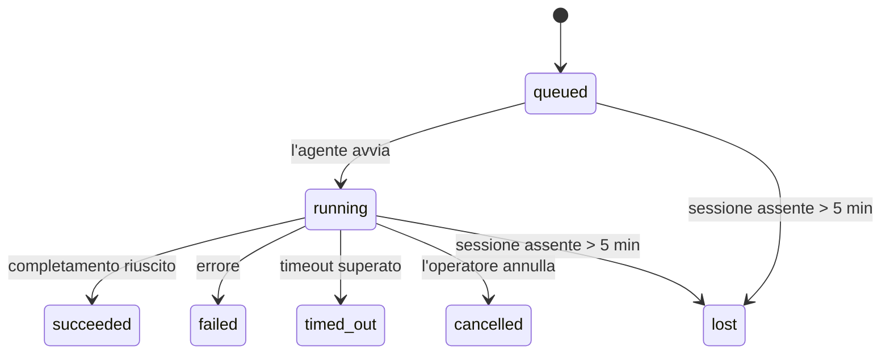

---
read_when:
    - Ispezione del lavoro in background in corso o completato di recente
    - Debug delle errori di consegna per esecuzioni di agenti scollegati
    - Comprendere come le esecuzioni in background si relazionano a sessioni, cron e heartbeat
summary: Monitoraggio delle attività in background per esecuzioni ACP, subagenti, processi cron isolati e operazioni CLI
title: Attività in background
x-i18n:
    generated_at: "2026-04-10T08:13:31Z"
    model: gpt-5.4
    provider: openai
    source_hash: d7b5ba41f1025e0089986342ce85698bc62f676439c3ccf03f3ed146beb1b1ac
    source_path: automation/tasks.md
    workflow: 15
---

# Attività in background

> **Cerchi la pianificazione?** Vedi [Automation & Tasks](/it/automation) per scegliere il meccanismo giusto. Questa pagina copre il **monitoraggio** del lavoro in background, non la sua pianificazione.

Le attività in background tengono traccia del lavoro che viene eseguito **al di fuori della sessione principale della conversazione**:
esecuzioni ACP, avvii di subagenti, esecuzioni isolate di processi cron e operazioni avviate dalla CLI.

Le attività **non** sostituiscono sessioni, processi cron o heartbeat — sono il **registro delle attività** che annota quale lavoro scollegato è avvenuto, quando e se è andato a buon fine.

<Note>
Non tutte le esecuzioni dell'agente creano un'attività. I turni heartbeat e la normale chat interattiva no. Tutte le esecuzioni cron, gli avvii ACP, gli avvii di subagenti e i comandi agente della CLI sì.
</Note>

## In breve

- Le attività sono **record**, non scheduler — cron e heartbeat decidono _quando_ viene eseguito il lavoro, le attività tengono traccia di _cosa è successo_.
- ACP, subagenti, tutti i processi cron e le operazioni CLI creano attività. I turni heartbeat no.
- Ogni attività passa attraverso `queued → running → terminal` (`succeeded`, `failed`, `timed_out`, `cancelled` o `lost`).
- Le attività cron restano attive finché il runtime cron possiede ancora il processo; le attività CLI supportate dalla chat restano attive solo finché il relativo contesto di esecuzione è ancora attivo.
- Il completamento è guidato da push: il lavoro scollegato può notificare direttamente o risvegliare la sessione/heartbeat del richiedente quando termina, quindi i cicli di polling dello stato di solito non sono l'approccio corretto.
- Le esecuzioni cron isolate e i completamenti dei subagenti eseguono, per quanto possibile, la pulizia delle schede/processi del browser tracciati per la loro sessione figlia prima della contabilità finale di pulizia.
- Il recapito cron isolato sopprime le risposte intermedie obsolete del padre mentre il lavoro del subagente discendente è ancora in fase di completamento, e preferisce l'output finale discendente quando arriva prima del recapito.
- Le notifiche di completamento vengono recapitate direttamente a un canale o accodate per il prossimo heartbeat.
- `openclaw tasks list` mostra tutte le attività; `openclaw tasks audit` evidenzia i problemi.
- I record terminali vengono conservati per 7 giorni, poi eliminati automaticamente.

## Avvio rapido

```bash
# Elenca tutte le attività (prima le più recenti)
openclaw tasks list

# Filtra per runtime o stato
openclaw tasks list --runtime acp
openclaw tasks list --status running

# Mostra i dettagli di un'attività specifica (per ID, run ID o chiave sessione)
openclaw tasks show <lookup>

# Annulla un'attività in esecuzione (termina la sessione figlia)
openclaw tasks cancel <lookup>

# Cambia il criterio di notifica per un'attività
openclaw tasks notify <lookup> state_changes

# Esegui un audit di integrità
openclaw tasks audit

# Anteprima o applicazione della manutenzione
openclaw tasks maintenance
openclaw tasks maintenance --apply

# Ispeziona lo stato di TaskFlow
openclaw tasks flow list
openclaw tasks flow show <lookup>
openclaw tasks flow cancel <lookup>
```

## Cosa crea un'attività

| Origine                | Tipo di runtime | Quando viene creato un record attività                 | Criterio di notifica predefinito |
| ---------------------- | --------------- | ------------------------------------------------------ | -------------------------------- |
| Esecuzioni ACP in background | `acp`      | Avvio di una sessione ACP figlia                       | `done_only`                      |
| Orchestrazione di subagenti | `subagent` | Avvio di un subagente tramite `sessions_spawn`         | `done_only`                      |
| Processi cron (tutti i tipi) | `cron`    | Ogni esecuzione cron (sessione principale e isolata)   | `silent`                         |
| Operazioni CLI         | `cli`           | Comandi `openclaw agent` eseguiti tramite il gateway   | `silent`                         |
| Processi media dell'agente | `cli`      | Esecuzioni `video_generate` supportate dalla sessione  | `silent`                         |

Le attività cron della sessione principale usano per impostazione predefinita il criterio di notifica `silent` — creano record per il monitoraggio ma non generano notifiche. Anche le attività cron isolate usano per impostazione predefinita `silent`, ma sono più visibili perché vengono eseguite nella propria sessione.

Anche le esecuzioni `video_generate` supportate dalla sessione usano il criterio di notifica `silent`. Continuano a creare record attività, ma il completamento viene restituito alla sessione agente originale come risveglio interno, così l'agente può scrivere il messaggio di follow-up e allegare direttamente il video completato. Se scegli `tools.media.asyncCompletion.directSend`, i completamenti asincroni di `music_generate` e `video_generate` tentano prima il recapito diretto al canale, per poi ripiegare sul percorso di risveglio della sessione richiedente.

Mentre un'attività `video_generate` supportata dalla sessione è ancora attiva, lo strumento funge anche da guardrail: chiamate ripetute a `video_generate` nella stessa sessione restituiscono lo stato dell'attività attiva invece di avviare una seconda generazione concorrente. Usa `action: "status"` quando vuoi una ricerca esplicita di avanzamento/stato dal lato agente.

**Cosa non crea attività:**

- Turni heartbeat — sessione principale; vedi [Heartbeat](/it/gateway/heartbeat)
- Turni di chat interattiva normali
- Risposte dirette a `/command`

## Ciclo di vita dell'attività



| Stato       | Significato                                                                |
| ----------- | -------------------------------------------------------------------------- |
| `queued`    | Creata, in attesa che l'agente si avvii                                    |
| `running`   | Il turno dell'agente è attivamente in esecuzione                           |
| `succeeded` | Completata con successo                                                    |
| `failed`    | Completata con un errore                                                   |
| `timed_out` | Ha superato il timeout configurato                                         |
| `cancelled` | Arrestata dall'operatore tramite `openclaw tasks cancel`                   |
| `lost`      | Il runtime ha perso lo stato di supporto autorevole dopo un periodo di tolleranza di 5 minuti |

Le transizioni avvengono automaticamente — quando termina l'esecuzione dell'agente associata, lo stato dell'attività si aggiorna di conseguenza.

`lost` dipende dal runtime:

- Attività ACP: i metadati della sessione figlia ACP di supporto sono scomparsi.
- Attività di subagenti: la sessione figlia di supporto è scomparsa dallo store dell'agente di destinazione.
- Attività cron: il runtime cron non tiene più traccia del processo come attivo.
- Attività CLI: le attività isolate della sessione figlia usano la sessione figlia; le attività CLI supportate dalla chat usano invece il contesto di esecuzione live, quindi righe persistenti di sessione di canale/gruppo/diretta non le mantengono attive.

## Recapito e notifiche

Quando un'attività raggiunge uno stato terminale, OpenClaw ti notifica. Esistono due percorsi di recapito:

**Recapito diretto** — se l'attività ha una destinazione di canale (`requesterOrigin`), il messaggio di completamento viene inviato direttamente a quel canale (Telegram, Discord, Slack, ecc.). Per i completamenti dei subagenti, OpenClaw preserva anche l'instradamento di thread/topic associato quando disponibile e può riempire un valore `to` / account mancante dalla route memorizzata della sessione richiedente (`lastChannel` / `lastTo` / `lastAccountId`) prima di rinunciare al recapito diretto.

**Recapito in coda alla sessione** — se il recapito diretto fallisce o non è impostata alcuna origine, l'aggiornamento viene accodato come evento di sistema nella sessione del richiedente e appare al heartbeat successivo.

<Tip>
Il completamento dell'attività attiva un risveglio heartbeat immediato, così vedi rapidamente il risultato — non devi aspettare il successivo tick heartbeat pianificato.
</Tip>

Questo significa che il normale flusso di lavoro è basato su push: avvia una sola volta il lavoro scollegato, poi lascia che il runtime ti risvegli o ti notifichi il completamento. Esegui il polling dello stato dell'attività solo quando ti serve debug, intervento o un audit esplicito.

### Criteri di notifica

Controlla quante informazioni ricevi per ogni attività:

| Criterio              | Cosa viene recapitato                                                     |
| --------------------- | ------------------------------------------------------------------------- |
| `done_only` (predefinito) | Solo lo stato terminale (`succeeded`, `failed`, ecc.) — **questo è il valore predefinito** |
| `state_changes`       | Ogni transizione di stato e aggiornamento di avanzamento                  |
| `silent`              | Nulla                                                                     |

Cambia il criterio mentre un'attività è in esecuzione:

```bash
openclaw tasks notify <lookup> state_changes
```

## Riferimento CLI

### `tasks list`

```bash
openclaw tasks list [--runtime <acp|subagent|cron|cli>] [--status <status>] [--json]
```

Colonne di output: ID attività, tipo, stato, recapito, Run ID, sessione figlia, riepilogo.

### `tasks show`

```bash
openclaw tasks show <lookup>
```

Il token di ricerca accetta un ID attività, un run ID o una chiave sessione. Mostra il record completo, inclusi tempi, stato del recapito, errore e riepilogo terminale.

### `tasks cancel`

```bash
openclaw tasks cancel <lookup>
```

Per le attività ACP e dei subagenti, questo termina la sessione figlia. Per le attività tracciate dalla CLI, l'annullamento viene registrato nel registro delle attività (non esiste un handle di runtime figlio separato). Lo stato passa a `cancelled` e, se applicabile, viene inviata una notifica di recapito.

### `tasks notify`

```bash
openclaw tasks notify <lookup> <done_only|state_changes|silent>
```

### `tasks audit`

```bash
openclaw tasks audit [--json]
```

Evidenzia problemi operativi. I risultati compaiono anche in `openclaw status` quando vengono rilevati problemi.

| Risultato                  | Gravità | Trigger                                              |
| -------------------------- | ------- | ---------------------------------------------------- |
| `stale_queued`             | warn    | In coda da più di 10 minuti                          |
| `stale_running`            | error   | In esecuzione da più di 30 minuti                    |
| `lost`                     | error   | La proprietà del task supportata dal runtime è scomparsa |
| `delivery_failed`          | warn    | Il recapito è fallito e il criterio di notifica non è `silent` |
| `missing_cleanup`          | warn    | Attività terminale senza timestamp di pulizia        |
| `inconsistent_timestamps`  | warn    | Violazione della timeline (ad esempio, terminata prima di iniziare) |

### `tasks maintenance`

```bash
openclaw tasks maintenance [--json]
openclaw tasks maintenance --apply [--json]
```

Usa questo comando per vedere in anteprima o applicare riconciliazione, marcatura della pulizia ed eliminazione per le attività e lo stato di Task Flow.

La riconciliazione dipende dal runtime:

- Le attività ACP/subagenti controllano la sessione figlia di supporto.
- Le attività cron controllano se il runtime cron possiede ancora il processo.
- Le attività CLI supportate dalla chat controllano il contesto di esecuzione live proprietario, non solo la riga della sessione chat.

Anche la pulizia al completamento dipende dal runtime:

- Il completamento dei subagenti chiude, per quanto possibile, le schede/processi del browser tracciati per la sessione figlia prima che continui la pulizia dell'annuncio.
- Il completamento cron isolato chiude, per quanto possibile, le schede/processi del browser tracciati per la sessione cron prima che l'esecuzione venga completamente smantellata.
- Il recapito cron isolato attende il follow-up del subagente discendente quando necessario e sopprime il testo di conferma del padre ormai obsoleto invece di annunciarlo.
- Il recapito del completamento dei subagenti preferisce l'ultimo testo visibile dell'assistente; se è vuoto, ripiega sull'ultimo testo `tool`/`toolResult` sanificato, e le esecuzioni basate solo su chiamate di strumenti andate in timeout possono ridursi a un breve riepilogo del progresso parziale.
- I fallimenti della pulizia non mascherano il reale esito dell'attività.

### `tasks flow list|show|cancel`

```bash
openclaw tasks flow list [--status <status>] [--json]
openclaw tasks flow show <lookup> [--json]
openclaw tasks flow cancel <lookup>
```

Usa questi comandi quando l'elemento che ti interessa è il Task Flow di orchestrazione piuttosto che un singolo record di attività in background.

## Bacheca attività chat (`/tasks`)

Usa `/tasks` in qualsiasi sessione chat per vedere le attività in background collegate a quella sessione. La bacheca mostra
attività attive e completate di recente con runtime, stato, tempi e dettagli di avanzamento o errore.

Quando la sessione corrente non ha attività collegate visibili, `/tasks` ripiega sui conteggi delle attività locali dell'agente
così hai comunque una panoramica senza esporre dettagli di altre sessioni.

Per il registro operativo completo, usa la CLI: `openclaw tasks list`.

## Integrazione dello stato (pressione delle attività)

`openclaw status` include un riepilogo delle attività immediatamente consultabile:

```
Tasks: 3 queued · 2 running · 1 issues
```

Il riepilogo riporta:

- **active** — numero di `queued` + `running`
- **failures** — numero di `failed` + `timed_out` + `lost`
- **byRuntime** — suddivisione per `acp`, `subagent`, `cron`, `cli`

Sia `/status` sia lo strumento `session_status` usano uno snapshot delle attività consapevole della pulizia: vengono privilegiate le attività attive,
le righe completate obsolete vengono nascoste e gli errori recenti emergono solo quando non resta alcun lavoro attivo.
In questo modo la scheda di stato resta focalizzata su ciò che conta in questo momento.

## Archiviazione e manutenzione

### Dove risiedono le attività

I record delle attività vengono mantenuti in SQLite in:

```
$OPENCLAW_STATE_DIR/tasks/runs.sqlite
```

Il registro viene caricato in memoria all'avvio del gateway e sincronizza le scritture su SQLite per garantire la persistenza attraverso i riavvii.

### Manutenzione automatica

Un processo di sweep viene eseguito ogni **60 secondi** e gestisce tre aspetti:

1. **Riconciliazione** — verifica se le attività attive hanno ancora un supporto autorevole nel runtime. Le attività ACP/subagenti usano lo stato della sessione figlia, le attività cron usano la proprietà del job attivo e le attività CLI supportate dalla chat usano il contesto di esecuzione proprietario. Se quello stato di supporto manca per più di 5 minuti, l'attività viene contrassegnata come `lost`.
2. **Marcatura della pulizia** — imposta un timestamp `cleanupAfter` sulle attività terminali (`endedAt` + 7 giorni).
3. **Eliminazione** — elimina i record che hanno superato la data `cleanupAfter`.

**Conservazione**: i record delle attività terminali vengono mantenuti per **7 giorni**, poi eliminati automaticamente. Non è necessaria alcuna configurazione.

## Come le attività si relazionano ad altri sistemi

### Attività e Task Flow

[Task Flow](/it/automation/taskflow) è il livello di orchestrazione dei flussi sopra le attività in background. Un singolo flusso può coordinare più attività nel corso del suo ciclo di vita usando modalità di sincronizzazione gestite o mirror. Usa `openclaw tasks` per ispezionare i singoli record delle attività e `openclaw tasks flow` per ispezionare il flusso di orchestrazione.

Vedi [Task Flow](/it/automation/taskflow) per i dettagli.

### Attività e cron

Una **definizione** di job cron risiede in `~/.openclaw/cron/jobs.json`. **Ogni** esecuzione cron crea un record attività — sia per la sessione principale sia per quelle isolate. Le attività cron della sessione principale usano per impostazione predefinita il criterio di notifica `silent`, così vengono tracciate senza generare notifiche.

Vedi [Cron Jobs](/it/automation/cron-jobs).

### Attività e heartbeat

Le esecuzioni heartbeat sono turni della sessione principale — non creano record attività. Quando un'attività termina, può attivare un risveglio heartbeat così vedi il risultato rapidamente.

Vedi [Heartbeat](/it/gateway/heartbeat).

### Attività e sessioni

Un'attività può fare riferimento a una `childSessionKey` (dove viene eseguito il lavoro) e a una `requesterSessionKey` (chi l'ha avviata). Le sessioni sono il contesto della conversazione; le attività sono il tracciamento dell'attività costruito sopra quel contesto.

### Attività ed esecuzioni dell'agente

Il `runId` di un'attività collega l'esecuzione dell'agente che sta svolgendo il lavoro. Gli eventi del ciclo di vita dell'agente (avvio, fine, errore) aggiornano automaticamente lo stato dell'attività — non devi gestire manualmente il ciclo di vita.

## Correlati

- [Automation & Tasks](/it/automation) — tutti i meccanismi di automazione in sintesi
- [Task Flow](/it/automation/taskflow) — orchestrazione dei flussi sopra le attività
- [Scheduled Tasks](/it/automation/cron-jobs) — pianificazione del lavoro in background
- [Heartbeat](/it/gateway/heartbeat) — turni periodici della sessione principale
- [CLI: Tasks](/cli/index#tasks) — riferimento dei comandi CLI
