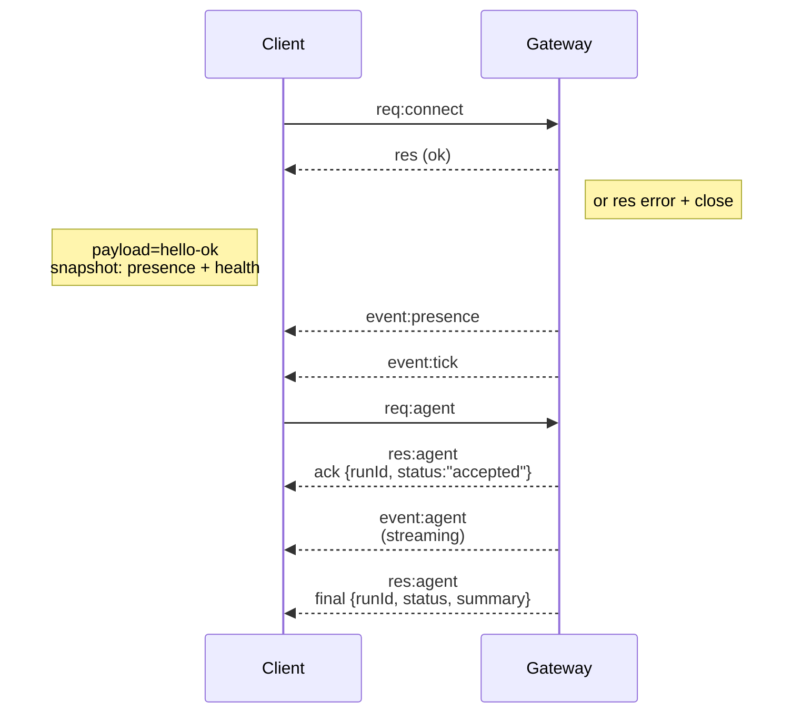

---
read_when:
    - Stai lavorando sul protocollo del gateway, sui client o sui trasporti
summary: Architettura del gateway WebSocket, componenti e flussi client
title: Architettura del Gateway
x-i18n:
    generated_at: "2026-04-05T13:49:20Z"
    model: gpt-5.4
    provider: openai
    source_hash: 2b12a2a29e94334c6d10787ac85c34b5b046f9a14f3dd53be453368ca4a7547d
    source_path: concepts/architecture.md
    workflow: 15
---

# Architettura del Gateway

## Panoramica

- Un singolo **Gateway** a lunga esecuzione gestisce tutte le superfici di messaggistica (WhatsApp tramite
  Baileys, Telegram tramite grammY, Slack, Discord, Signal, iMessage, WebChat).
- I client del piano di controllo (app macOS, CLI, interfaccia web, automazioni) si connettono al
  Gateway tramite **WebSocket** sull'host bind configurato (predefinito
  `127.0.0.1:18789`).
- Anche i **nodi** (macOS/iOS/Android/headless) si connettono tramite **WebSocket**, ma
  dichiarano `role: node` con capacità/comandi espliciti.
- Un Gateway per host; è l'unico punto che apre una sessione WhatsApp.
- Il **canvas host** è servito dal server HTTP del Gateway in:
  - `/__openclaw__/canvas/` (HTML/CSS/JS modificabili dall'agente)
  - `/__openclaw__/a2ui/` (host A2UI)
    Usa la stessa porta del Gateway (predefinita `18789`).

## Componenti e flussi

### Gateway (daemon)

- Mantiene le connessioni ai provider.
- Espone un'API WS tipizzata (richieste, risposte, eventi push del server).
- Valida i frame in ingresso rispetto a JSON Schema.
- Emette eventi come `agent`, `chat`, `presence`, `health`, `heartbeat`, `cron`.

### Client (app macOS / CLI / amministrazione web)

- Una connessione WS per client.
- Invia richieste (`health`, `status`, `send`, `agent`, `system-presence`).
- Si sottoscrive agli eventi (`tick`, `agent`, `presence`, `shutdown`).

### Nodi (macOS / iOS / Android / headless)

- Si connettono allo **stesso server WS** con `role: node`.
- Forniscono un'identità del dispositivo in `connect`; l'abbinamento è **basato sul dispositivo** (role `node`) e
  l'approvazione risiede nell'archivio di abbinamento dei dispositivi.
- Espongono comandi come `canvas.*`, `camera.*`, `screen.record`, `location.get`.

Dettagli del protocollo:

- [Protocollo Gateway](/gateway/protocol)

### WebChat

- Interfaccia statica che usa l'API WS del Gateway per la cronologia della chat e gli invii.
- Nelle configurazioni remote, si connette attraverso lo stesso tunnel SSH/Tailscale degli altri
  client.

## Ciclo di vita della connessione (singolo client)



## Protocollo wire (riepilogo)

- Trasporto: WebSocket, frame di testo con payload JSON.
- Il primo frame **deve** essere `connect`.
- Dopo l'handshake:
  - Richieste: `{type:"req", id, method, params}` → `{type:"res", id, ok, payload|error}`
  - Eventi: `{type:"event", event, payload, seq?, stateVersion?}`
- `hello-ok.features.methods` / `events` sono metadati di individuazione, non un
  dump generato di ogni route helper richiamabile.
- L'autenticazione con secret condiviso usa `connect.params.auth.token` oppure
  `connect.params.auth.password`, a seconda della modalità di autenticazione del gateway configurata.
- Le modalità che trasportano identità, come Tailscale Serve
  (`gateway.auth.allowTailscale: true`) o bind non-loopback
  `gateway.auth.mode: "trusted-proxy"`, soddisfano l'autenticazione tramite gli header della richiesta
  invece di `connect.params.auth.*`.
- L'ingresso privato `gateway.auth.mode: "none"` disabilita completamente l'autenticazione con secret condiviso;
  mantieni questa modalità disattivata su ingressi pubblici/non attendibili.
- Le chiavi di idempotenza sono richieste per i metodi con effetti collaterali (`send`, `agent`) per
  ritentare in sicurezza; il server mantiene una cache deduplicata a breve durata.
- I nodi devono includere `role: "node"` più capacità/comandi/autorizzazioni in `connect`.

## Abbinamento + attendibilità locale

- Tutti i client WS (operatori + nodi) includono una **identità del dispositivo** in `connect`.
- I nuovi ID dispositivo richiedono approvazione dell'abbinamento; il Gateway emette un **token del dispositivo**
  per le connessioni successive.
- Le connessioni dirette local loopback possono essere approvate automaticamente per mantenere fluida
  l'esperienza UX sullo stesso host.
- OpenClaw ha anche un percorso ristretto di self-connect backend/container-local per
  flussi helper attendibili con secret condiviso.
- Le connessioni tailnet e LAN, incluse le bind tailnet sullo stesso host, richiedono comunque
  approvazione esplicita dell'abbinamento.
- Tutte le connessioni devono firmare il nonce `connect.challenge`.
- Il payload della firma `v3` associa anche `platform` + `deviceFamily`; il gateway
  fissa i metadati abbinati alla riconnessione e richiede un nuovo abbinamento di riparazione in caso di
  modifiche ai metadati.
- Le connessioni **non locali** richiedono comunque approvazione esplicita.
- L'autenticazione del Gateway (`gateway.auth.*`) si applica comunque a **tutte** le connessioni, locali o
  remote.

Dettagli: [Protocollo Gateway](/gateway/protocol), [Abbinamento](/it/channels/pairing),
[Sicurezza](/gateway/security).

## Tipizzazione del protocollo e generazione del codice

- Gli schemi TypeBox definiscono il protocollo.
- JSON Schema viene generato a partire da questi schemi.
- I modelli Swift vengono generati da JSON Schema.

## Accesso remoto

- Preferito: Tailscale o VPN.
- Alternativa: tunnel SSH

  ```bash
  ssh -N -L 18789:127.0.0.1:18789 user@host
  ```

- Lo stesso handshake + token di autenticazione si applicano attraverso il tunnel.
- TLS + pinning opzionale possono essere abilitati per WS nelle configurazioni remote.

## Istantanea operativa

- Avvio: `openclaw gateway` (in primo piano, log su stdout).
- Stato: `health` tramite WS (incluso anche in `hello-ok`).
- Supervisione: launchd/systemd per il riavvio automatico.

## Invarianti

- Esattamente un Gateway controlla una singola sessione Baileys per host.
- L'handshake è obbligatorio; qualsiasi primo frame non JSON o diverso da `connect` comporta una chiusura forzata.
- Gli eventi non vengono riprodotti; i client devono aggiornarsi in caso di gap.

## Correlati

- [Agent Loop](/concepts/agent-loop) — ciclo di esecuzione dettagliato dell'agente
- [Protocollo Gateway](/gateway/protocol) — contratto del protocollo WebSocket
- [Queue](/concepts/queue) — coda dei comandi e concorrenza
- [Sicurezza](/gateway/security) — modello di attendibilità e hardening
