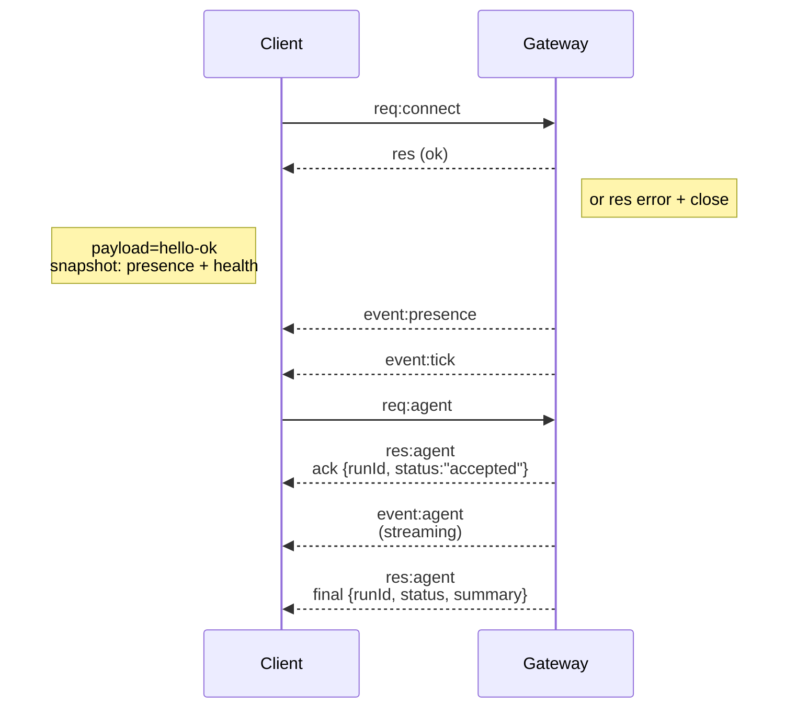

---
read_when:
    - Lavorare sul protocollo del Gateway, sui client o sui trasporti
summary: Architettura del Gateway WebSocket, componenti e flussi dei client
title: Architettura del Gateway
x-i18n:
    generated_at: "2026-07-12T06:56:13Z"
    model: gpt-5.6
    postprocess_version: locale-links-v1
    provider: openai
    source_hash: f8054bd87f738b957c24f8d6965d55365de2293d44902530a9ba778afa597cc7
    source_path: concepts/architecture.md
    workflow: 16
---

## Panoramica

- Un singolo **Gateway** a lunga esecuzione gestisce tutte le interfacce di messaggistica (WhatsApp tramite
  Baileys, Telegram tramite grammY, Slack, Discord, Signal, iMessage, WebChat).
- I client del piano di controllo (app macOS, CLI, interfaccia web, automazioni) si connettono al
  Gateway tramite **WebSocket** sull'host di associazione configurato (predefinito:
  `127.0.0.1:18789`).
- Anche i **Node** (macOS/iOS/Android/headless) si connettono tramite **WebSocket**, ma
  dichiarano `role: node` con funzionalità e comandi espliciti.
- Un Gateway per host; è l'unico componente che apre una sessione WhatsApp.
- L'**host canvas** viene servito dal server HTTP del Gateway nei percorsi:
  - `/__openclaw__/canvas/` (HTML/CSS/JS modificabili dall'agente)
  - `/__openclaw__/a2ui/` (host A2UI)

  Utilizza la stessa porta del Gateway (predefinita: `18789`).

## Componenti e flussi

### Gateway (demone)

- Mantiene le connessioni ai provider.
- Espone un'API WS tipizzata (richieste, risposte, eventi push del server).
- Convalida i frame in ingresso rispetto a JSON Schema.
- Emette eventi come `agent`, `chat`, `presence`, `health`, `heartbeat`, `cron`.

### Client (app macOS / CLI / amministrazione web)

- Una connessione WS per client.
- Inviano richieste (`health`, `status`, `send`, `agent`, `system-presence`).
- Si iscrivono agli eventi (`tick`, `agent`, `presence`, `shutdown`).

### Node (macOS / iOS / Android / headless)

- Si connettono allo **stesso server WS** con `role: node`.
- Forniscono un'identità del dispositivo in `connect`; l'associazione è **basata sul dispositivo** (ruolo `node`) e
  l'approvazione risiede nell'archivio delle associazioni dei dispositivi.
- Espongono comandi come `canvas.*`, `camera.*`, `screen.record`, `location.get`.

Dettagli del protocollo: [Protocollo del Gateway](/it/gateway/protocol)

### WebChat

- Interfaccia statica che utilizza l'API WS del Gateway per la cronologia della chat e l'invio.
- Nelle configurazioni remote, si connette tramite lo stesso tunnel SSH/Tailscale degli altri
  client.

## Ciclo di vita della connessione (singolo client)



## Protocollo di comunicazione (riepilogo)

- Trasporto: WebSocket, frame di testo con payload JSON.
- Il primo frame **deve** essere `connect`.
- Dopo l'handshake:
  - Richieste: `{type:"req", id, method, params}` → `{type:"res", id, ok, payload|error}`
  - Eventi: `{type:"event", event, payload, seq?, stateVersion?}`
- `hello-ok.features.methods` / `events` sono metadati di rilevamento, non un
  dump generato di ogni route helper richiamabile.
- L'autenticazione con segreto condiviso utilizza `connect.params.auth.token` oppure
  `connect.params.auth.password`, a seconda della modalità di autenticazione del Gateway configurata.
- Le modalità basate sull'identità, come Tailscale Serve
  (`gateway.auth.allowTailscale: true`) o `gateway.auth.mode: "trusted-proxy"`
  senza local loopback, soddisfano l'autenticazione tramite le intestazioni della richiesta
  anziché mediante `connect.params.auth.*`.
- `gateway.auth.mode: "none"` per l'ingresso privato disabilita completamente
  l'autenticazione con segreto condiviso; non utilizzare questa modalità per ingressi pubblici o non attendibili.
- Le chiavi di idempotenza sono obbligatorie per i metodi con effetti collaterali (`send`, `agent`) per
  consentire nuovi tentativi in sicurezza; il server mantiene una cache di deduplicazione di breve durata.
- I Node devono includere `role: "node"` insieme a funzionalità, comandi e autorizzazioni in `connect`.

## Associazione e attendibilità locale

- Tutti i client WS (operatori e Node) includono un'**identità del dispositivo** in `connect`.
- I nuovi ID dispositivo richiedono l'approvazione dell'associazione; il Gateway emette un **token del dispositivo**
  per le connessioni successive.
- Le connessioni dirette tramite local loopback possono essere approvate automaticamente per mantenere fluida
  l'esperienza utente sullo stesso host.
- OpenClaw dispone inoltre di un percorso ristretto di auto-connessione locale al backend/container per
  flussi helper attendibili con segreto condiviso.
- Le connessioni tramite tailnet e LAN, incluse le associazioni tailnet sullo stesso host, richiedono comunque
  l'approvazione esplicita dell'associazione.
- Tutte le connessioni devono firmare il nonce `connect.challenge`. Il payload della firma `v3`
  vincola anche `platform` e `deviceFamily`; alla riconnessione il Gateway fissa i metadati associati e
  richiede la riparazione dell'associazione in caso di modifiche ai metadati.
- Le connessioni **non locali** richiedono comunque un'approvazione esplicita.
- L'autenticazione del Gateway (`gateway.auth.*`) si applica comunque a **tutte** le connessioni, locali o
  remote.

Dettagli: [Protocollo del Gateway](/it/gateway/protocol), [Associazione](/it/channels/pairing),
[Sicurezza](/it/gateway/security).

## Tipizzazione del protocollo e generazione del codice

- Gli schemi TypeBox definiscono il protocollo.
- JSON Schema viene generato da tali schemi.
- I modelli Swift vengono generati da JSON Schema.

## Accesso remoto

- Opzione preferita: Tailscale o VPN.
- Alternativa: tunnel SSH

  ```bash
  ssh -N -L 18789:127.0.0.1:18789 user@gateway-host
  ```

- Lo stesso handshake e token di autenticazione si applicano tramite il tunnel.
- Per WS nelle configurazioni remote è possibile abilitare TLS con pinning facoltativo.

## Riepilogo operativo

- Avvio: `openclaw gateway` (in primo piano, registri su stdout).
- Stato: `health` tramite WS (incluso anche in `hello-ok`).
- Supervisione: launchd/systemd per il riavvio automatico.

## Invarianti

- Un solo Gateway controlla una singola sessione Baileys per host.
- L'handshake è obbligatorio; qualsiasi primo frame non JSON o diverso da `connect` causa la chiusura immediata.
- Gli eventi non vengono riprodotti; i client devono aggiornarsi in caso di lacune.

## Contenuti correlati

- [Ciclo dell'agente](/it/concepts/agent-loop) — ciclo dettagliato di esecuzione dell'agente
- [Protocollo del Gateway](/it/gateway/protocol) — contratto del protocollo WebSocket
- [Coda](/it/concepts/queue) — coda dei comandi e concorrenza
- [Sicurezza](/it/gateway/security) — modello di attendibilità e rafforzamento
