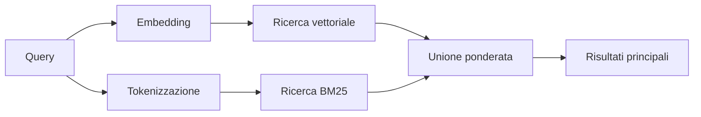

---
read_when:
    - Si desidera comprendere come funziona memory_search
    - Si desidera scegliere un provider di embedding
    - Si desidera ottimizzare la qualità della ricerca
summary: Come la ricerca in memoria trova note pertinenti usando embedding e recupero ibrido
title: Ricerca nella memoria
x-i18n:
    generated_at: "2026-07-16T14:18:26Z"
    model: gpt-5.6
    postprocess_version: locale-links-v1
    prompt_version: 32
    provider: openai
    source_hash: 2ae0830843fba28c24159d85425240051fb8caf086cd0563d3091890045dcfad
    source_path: concepts/memory-search.md
    workflow: 16
---

`memory_search` trova le note pertinenti nei file di memoria, anche quando la
formulazione differisce dal testo originale. Suddivide la memoria in piccoli frammenti e
li cerca tramite embedding, parole chiave o entrambi.

## Avvio rapido

OpenClaw utilizza gli embedding di OpenAI per impostazione predefinita. Per utilizzare un altro provider, impostarlo
esplicitamente:

```json5
{
  agents: {
    defaults: {
      memorySearch: {
        provider: "openai", // oppure "gemini", "voyage", "mistral", "bedrock", "local", "ollama", "lmstudio", "github-copilot", "openai-compatible"
      },
    },
  },
}
```

`provider` può anche fare riferimento a una voce `models.providers.<id>` personalizzata (ad
esempio `ollama-5080`), purché tale voce imposti `api` su `"ollama"` o
sull'ID di un altro provider dotato di un adattatore per gli embedding della memoria.

Per gli embedding locali senza chiave API, installare il Plugin ufficiale del provider llama.cpp
e impostare `provider: "local"`:

```bash
openclaw plugins install @openclaw/llama-cpp-provider
```

I checkout del codice sorgente richiedono comunque l'approvazione della compilazione nativa: `pnpm approve-builds`, quindi
`pnpm rebuild node-llama-cpp`.

Alcuni endpoint di embedding compatibili con OpenAI richiedono etichette `input_type`
asimmetriche, come `"query"` per le ricerche e `"document"`/`"passage"` per i
frammenti indicizzati. Impostarle con `queryInputType` e `documentInputType`; consultare il
[Riferimento alla configurazione della memoria](/it/reference/memory-config#provider-specific-config).

## Provider supportati

| Provider          | ID                  | Richiede una chiave API | Note                                      |
| ----------------- | ------------------- | ----------------------- | ----------------------------------------- |
| Bedrock           | `bedrock`           | No                      | Utilizza la catena di credenziali AWS     |
| DeepInfra         | `deepinfra`         | Sì                      | Modello predefinito `BAAI/bge-m3`          |
| Gemini            | `gemini`            | Sì                      | Supporta l'indicizzazione di immagini/audio |
| GitHub Copilot    | `github-copilot`    | No                      | Utilizza l'abbonamento a Copilot          |
| Locale            | `local`             | No                      | Modello GGUF, download automatico di ~0.6 GB |
| LM Studio         | `lmstudio`          | No                      | Server locale/self-hosted                 |
| Mistral           | `mistral`           | Sì                      |                                           |
| Ollama            | `ollama`            | No                      | Server locale/self-hosted                 |
| OpenAI            | `openai`            | Sì                      | Predefinito                               |
| Compatibile con OpenAI | `openai-compatible` | Solitamente             | Endpoint `/v1/embeddings` generico      |
| Voyage            | `voyage`            | Sì                      |                                           |

## Funzionamento della ricerca

OpenClaw esegue in parallelo due percorsi di recupero e ne unisce i risultati:



- **La ricerca vettoriale** associa significati simili ("host del gateway" corrisponde a "la
  macchina che esegue OpenClaw").
- **La ricerca per parole chiave BM25** associa termini esatti (ID, stringhe di errore, chiavi di
  configurazione).
- **La ricerca per nome file** indicizza i percorsi separatamente dal corpo delle note. I percorsi completi
  esatti, i nomi di base e le radici dei nomi file hanno priorità rispetto alle corrispondenze parziali dei percorsi,
  mentre gli estratti e i punteggi delle parole chiave nel corpo continuano a derivare dal contenuto delle note.

Se è disponibile un solo percorso, viene eseguito autonomamente.

**Modalità solo FTS.** Impostare `provider: "none"` per disabilitare intenzionalmente gli embedding
ed eseguire la ricerca solo tramite parole chiave. Lasciando `provider` non impostato o impostandolo su `"auto"`,
se non è configurata alcuna autenticazione per gli embedding, viene utilizzata anche la classificazione basata solo sulle parole chiave
senza generare errori; lo stesso vale per `provider: "local"` (il provider
GGUF/llama.cpp) in caso di errore.

**Provider esplicito non disponibile.** Se viene specificato esplicitamente un altro provider
(ad esempio `openai`, `ollama`, `gemini`) e questo diventa indisponibile al
momento della richiesta (autenticazione errata, errore di rete), `memory_search` segnala la memoria come
non disponibile anziché passare silenziosamente ai risultati basati solo su FTS. In questo modo, un
provider configurato ma non funzionante rimane visibile. Impostare `provider: "none"` per un recupero
intenzionalmente basato solo su FTS oppure correggere la configurazione del provider/dell'autenticazione per ripristinare la classificazione
semantica.

## Miglioramento della qualità della ricerca

Due funzionalità facoltative sono utili con una cronologia di note estesa.

### Decadimento temporale

Le note meno recenti perdono gradualmente peso nella classificazione, così le informazioni recenti emergono per prime.
Con l'emivita predefinita di 30 giorni, una nota del mese precedente ottiene il 50% del proprio
peso originale. `MEMORY.md` e gli altri file senza data in `memory/` sono
permanenti e non sono mai soggetti a decadimento; il decadimento si applica solo ai file `memory/YYYY-MM-DD.md` con data.

<Tip>
Abilitare questa funzionalità se l'agente dispone di mesi di note giornaliere e le informazioni obsolete
continuano a superare il contesto recente nella classificazione.
</Tip>

### MMR (diversità)

Riduce i risultati ridondanti. Se cinque note menzionano tutte la stessa configurazione del router,
MMR garantisce che i risultati principali trattino argomenti diversi invece di ripetersi.

<Tip>
Abilitare questa funzionalità se `memory_search` continua a restituire estratti quasi duplicati da
note giornaliere diverse.
</Tip>

### Abilitare entrambe

```json5
{
  agents: {
    defaults: {
      memorySearch: {
        query: {
          hybrid: {
            mmr: { enabled: true },
            temporalDecay: { enabled: true },
          },
        },
      },
    },
  },
}
```

## Memoria multimodale

Con `gemini-embedding-2-preview` è possibile indicizzare immagini e audio insieme ai file
Markdown. Questo vale solo per i file in `memorySearch.extraPaths`; le radici di
memoria predefinite (`MEMORY.md`, `memory/*.md`) rimangono limitate a Markdown. Le query di ricerca
rimangono testuali, ma vengono confrontate con contenuti visivi e audio. Consultare il
[Riferimento alla configurazione della memoria](/it/reference/memory-config#multimodal-memory-gemini)
per la configurazione.

## Ricerca nella memoria delle sessioni

Per il recupero testuale esatto dalle trascrizioni delle sessioni, utilizzare [`sessions_search`](/concepts/session-search)
e quindi aprire un risultato con `sessions_history`. La ricerca nella memoria delle sessioni rimane il complemento semantico
sperimentale.

Facoltativamente, indicizzare le trascrizioni delle sessioni affinché `memory_search` possa recuperare le
conversazioni precedenti. La funzionalità è facoltativa: impostare `experimental.sessionMemory: true` e aggiungere
`"sessions"` a `sources` (il valore predefinito di `sources` è `["memory"]`).

I risultati delle sessioni rispettano `tools.sessions.visibility`: il valore predefinito `"tree"` espone
solo la sessione corrente e le sessioni generate da essa. Per recuperare da una sessione diversa
una sessione non correlata dello stesso agente (ad esempio una sessione inviata dal Gateway
tramite un messaggio diretto), ampliare la visibilità a `"agent"`.

Quando si utilizza il backend QMD, impostare anche `memory.qmd.sessions.enabled: true` affinché
le trascrizioni vengano esportate nella raccolta QMD; `experimental.sessionMemory`
e `sources` da soli non esportano le trascrizioni in QMD. Consultare il
[riferimento alla configurazione](/it/reference/memory-config#session-memory-search-experimental).

## Risoluzione dei problemi

**Nessun risultato?** Eseguire `openclaw memory status` per controllare l'indice. Se è vuoto, eseguire
`openclaw memory index --force`.

**Solo corrispondenze per parole chiave?** Il provider di embedding potrebbe non essere configurato. Controllare
`openclaw memory status --deep`.

**Timeout degli embedding locali?** `ollama`, `lmstudio` e `local` utilizzano per impostazione predefinita un timeout
più lungo per i batch in linea. Se l'host è semplicemente lento, impostare
`agents.defaults.memorySearch.sync.embeddingBatchTimeoutSeconds` ed eseguire nuovamente
`openclaw memory index --force`.

**Testo CJK non trovato?** Ricostruire l'indice FTS con
`openclaw memory index --force`.

## Contenuti correlati

- [Panoramica della memoria](/it/concepts/memory)
- [Active Memory](/it/concepts/active-memory)
- [Motore di memoria integrato](/it/concepts/memory-builtin)
- [Riferimento alla configurazione della memoria](/it/reference/memory-config)
