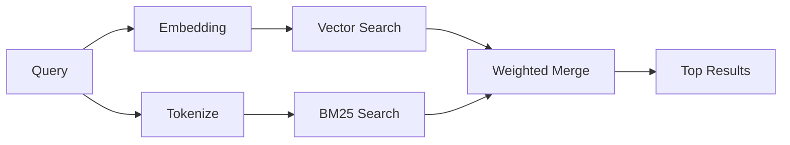

---
read_when:
    - Vuoi capire come funziona `memory_search`
    - Vuoi scegliere un provider di embedding
    - Vuoi ottimizzare la qualità della ricerca
summary: Come la ricerca nella memoria trova note pertinenti usando embeddings e recupero ibrido
title: Ricerca nella memoria
x-i18n:
    generated_at: "2026-04-10T08:13:31Z"
    model: gpt-5.4
    provider: openai
    source_hash: ca0237f4f1ee69dcbfb12e6e9527a53e368c0bf9b429e506831d4af2f3a3ac6f
    source_path: concepts/memory-search.md
    workflow: 15
---

# Ricerca nella memoria

`memory_search` trova note pertinenti dai tuoi file di memoria, anche quando la
formulazione è diversa dal testo originale. Funziona indicizzando la memoria in
piccoli blocchi e cercandoli tramite embeddings, parole chiave o entrambi.

## Avvio rapido

Se hai configurato una chiave API OpenAI, Gemini, Voyage o Mistral, la ricerca
nella memoria funziona automaticamente. Per impostare esplicitamente un provider:

```json5
{
  agents: {
    defaults: {
      memorySearch: {
        provider: "openai", // oppure "gemini", "local", "ollama", ecc.
      },
    },
  },
}
```

Per embeddings locali senza chiave API, usa `provider: "local"` (richiede
`node-llama-cpp`).

## Provider supportati

| Provider | ID        | Richiede una chiave API | Note                                                 |
| -------- | --------- | ----------------------- | ---------------------------------------------------- |
| OpenAI   | `openai`  | Sì                      | Rilevato automaticamente, veloce                     |
| Gemini   | `gemini`  | Sì                      | Supporta l'indicizzazione di immagini/audio          |
| Voyage   | `voyage`  | Sì                      | Rilevato automaticamente                             |
| Mistral  | `mistral` | Sì                      | Rilevato automaticamente                             |
| Bedrock  | `bedrock` | No                      | Rilevato automaticamente quando la catena di credenziali AWS viene risolta |
| Ollama   | `ollama`  | No                      | Locale, deve essere impostato esplicitamente         |
| Local    | `local`   | No                      | Modello GGUF, download di ~0,6 GB                    |

## Come funziona la ricerca

OpenClaw esegue due percorsi di recupero in parallelo e unisce i risultati:



- **Ricerca vettoriale** trova note con significato simile ("gateway host" corrisponde a
  "la macchina che esegue OpenClaw").
- **Ricerca per parole chiave BM25** trova corrispondenze esatte (ID, stringhe di errore, chiavi
  di configurazione).

Se è disponibile solo un percorso (nessun embeddings o nessun FTS), l'altro viene eseguito da solo.

## Migliorare la qualità della ricerca

Due funzionalità opzionali aiutano quando hai una cronologia delle note molto ampia:

### Decadimento temporale

Le note vecchie perdono gradualmente peso nel ranking, così le informazioni
recenti emergono per prime. Con l'emivita predefinita di 30 giorni, una nota
del mese scorso ottiene il 50% del suo peso originale. I file sempre validi come
`MEMORY.md` non subiscono mai decadimento.

<Tip>
Abilita il decadimento temporale se il tuo agente ha mesi di note quotidiane e
le informazioni obsolete continuano a superare nel ranking il contesto recente.
</Tip>

### MMR (diversità)

Riduce i risultati ridondanti. Se cinque note menzionano tutte la stessa
configurazione del router, MMR assicura che i risultati principali coprano temi
diversi invece di ripetersi.

<Tip>
Abilita MMR se `memory_search` continua a restituire frammenti quasi duplicati
provenienti da note quotidiane diverse.
</Tip>

### Abilita entrambi

```json5
{
  agents: {
    defaults: {
      memorySearch: {
        query: {
          hybrid: {
            mmr: { enabled: true },
            temporalDecay: { enabled: true },
          },
        },
      },
    },
  },
}
```

## Memoria multimodale

Con Gemini Embedding 2, puoi indicizzare immagini e file audio insieme al
Markdown. Le query di ricerca restano testuali, ma corrispondono a contenuti
visivi e audio. Vedi il [riferimento della configurazione della memoria](/it/reference/memory-config) per
la configurazione.

## Ricerca nella memoria di sessione

Puoi facoltativamente indicizzare le trascrizioni delle sessioni così che
`memory_search` possa richiamare conversazioni precedenti. Questa opzione è
attivabile tramite `memorySearch.experimental.sessionMemory`. Vedi il
[riferimento della configurazione](/it/reference/memory-config) per i dettagli.

## Risoluzione dei problemi

**Nessun risultato?** Esegui `openclaw memory status` per controllare l'indice. Se è vuoto, esegui
`openclaw memory index --force`.

**Solo corrispondenze per parole chiave?** Il tuo provider di embedding potrebbe non essere configurato. Controlla
`openclaw memory status --deep`.

**Testo CJK non trovato?** Ricostruisci l'indice FTS con
`openclaw memory index --force`.

## Approfondimenti

- [Memoria attiva](/it/concepts/active-memory) -- memoria del sub-agente per sessioni di chat interattive
- [Memoria](/it/concepts/memory) -- layout dei file, backend, strumenti
- [Riferimento della configurazione della memoria](/it/reference/memory-config) -- tutte le opzioni di configurazione
