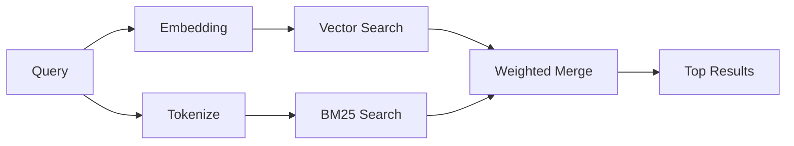

---
read_when:
    - Vuoi capire come funziona memory_search
    - Vuoi scegliere un provider di embedding
    - Vuoi ottimizzare la qualità della ricerca
summary: Come memory search trova note rilevanti usando embedding e recupero ibrido
title: Ricerca nella memory
x-i18n:
    generated_at: "2026-04-05T13:49:44Z"
    model: gpt-5.4
    provider: openai
    source_hash: 87b1cb3469c7805f95bca5e77a02919d1e06d626ad3633bbc5465f6ab9db12a2
    source_path: concepts/memory-search.md
    workflow: 15
---

# Ricerca nella memory

`memory_search` trova note rilevanti dai tuoi file di memory, anche quando la
formulazione è diversa dal testo originale. Funziona indicizzando la memory in piccoli
blocchi e cercandoli usando embedding, parole chiave o entrambi.

## Avvio rapido

Se hai configurato una chiave API OpenAI, Gemini, Voyage o Mistral, la ricerca nella memory
funziona automaticamente. Per impostare esplicitamente un provider:

```json5
{
  agents: {
    defaults: {
      memorySearch: {
        provider: "openai", // or "gemini", "local", "ollama", etc.
      },
    },
  },
}
```

Per embedding locali senza chiave API, usa `provider: "local"` (richiede
node-llama-cpp).

## Provider supportati

| Provider | ID        | Richiede chiave API | Note                          |
| -------- | --------- | ------------------- | ----------------------------- |
| OpenAI   | `openai`  | Sì                  | Rilevato automaticamente, veloce |
| Gemini   | `gemini`  | Sì                  | Supporta l'indicizzazione di immagini/audio |
| Voyage   | `voyage`  | Sì                  | Rilevato automaticamente      |
| Mistral  | `mistral` | Sì                  | Rilevato automaticamente      |
| Ollama   | `ollama`  | No                  | Locale, va impostato esplicitamente |
| Local    | `local`   | No                  | Modello GGUF, download di ~0.6 GB |

## Come funziona la ricerca

OpenClaw esegue in parallelo due percorsi di recupero e unisce i risultati:



- **Ricerca vettoriale** trova note con significato simile ("gateway host" corrisponde a
  "the machine running OpenClaw").
- **Ricerca per parole chiave BM25** trova corrispondenze esatte (ID, stringhe di errore, chiavi di
  configurazione).

Se è disponibile un solo percorso (niente embedding o niente FTS), viene eseguito solo l'altro.

## Migliorare la qualità della ricerca

Due funzionalità facoltative aiutano quando hai una grande cronologia di note:

### Decadimento temporale

Le note vecchie perdono gradualmente peso nel ranking, così le informazioni recenti emergono per prime.
Con l'half-life predefinita di 30 giorni, una nota del mese scorso ottiene il 50% del
suo peso originale. I file evergreen come `MEMORY.md` non decadono mai.

<Tip>
Abilita il decadimento temporale se il tuo agente ha mesi di note quotidiane e le
informazioni obsolete continuano a classificarsi sopra il contesto recente.
</Tip>

### MMR (diversità)

Riduce i risultati ridondanti. Se cinque note menzionano tutte la stessa configurazione del router, MMR
garantisce che i risultati principali coprano argomenti diversi invece di ripetersi.

<Tip>
Abilita MMR se `memory_search` continua a restituire snippet quasi duplicati da
diverse note quotidiane.
</Tip>

### Abilitare entrambi

```json5
{
  agents: {
    defaults: {
      memorySearch: {
        query: {
          hybrid: {
            mmr: { enabled: true },
            temporalDecay: { enabled: true },
          },
        },
      },
    },
  },
}
```

## Memory multimodale

Con Gemini Embedding 2, puoi indicizzare immagini e file audio insieme al
Markdown. Le query di ricerca restano testuali, ma trovano corrispondenze con contenuti visivi e audio. Vedi il [riferimento di configurazione della memory](/reference/memory-config) per la
configurazione.

## Ricerca nella memory della sessione

Puoi facoltativamente indicizzare le trascrizioni delle sessioni in modo che `memory_search` possa richiamare
conversazioni precedenti. Questa funzionalità è attivabile tramite
`memorySearch.experimental.sessionMemory`. Vedi il
[riferimento di configurazione](/reference/memory-config) per i dettagli.

## Risoluzione dei problemi

**Nessun risultato?** Esegui `openclaw memory status` per controllare l'indice. Se è vuoto, esegui
`openclaw memory index --force`.

**Solo corrispondenze per parole chiave?** Il tuo provider di embedding potrebbe non essere configurato. Controlla
`openclaw memory status --deep`.

**Testo CJK non trovato?** Ricostruisci l'indice FTS con
`openclaw memory index --force`.

## Approfondimenti

- [Memory](/concepts/memory) -- layout dei file, backend, strumenti
- [Riferimento di configurazione della memory](/reference/memory-config) -- tutti i parametri di configurazione
