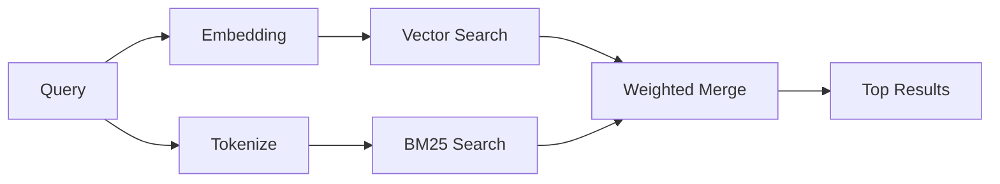

---
read_when:
    - Vuoi capire come funziona memory_search
    - Vuoi scegliere un provider di embedding
    - Vuoi ottimizzare la qualità della ricerca
summary: Come la ricerca della memoria trova note rilevanti usando embedding e recupero ibrido
title: Ricerca della memoria
x-i18n:
    generated_at: "2026-04-24T08:36:56Z"
    model: gpt-5.4
    provider: openai
    source_hash: 04db62e519a691316ce40825c082918094bcaa9c36042cc8101c6504453d238e
    source_path: concepts/memory-search.md
    workflow: 15
---

`memory_search` trova note rilevanti dai tuoi file di memoria, anche quando la
formulazione è diversa dal testo originale. Funziona indicizzando la memoria in piccoli
blocchi e cercandoli usando embedding, parole chiave o entrambi.

## Avvio rapido

Se hai un abbonamento GitHub Copilot, oppure una chiave API OpenAI, Gemini, Voyage o Mistral configurata, la ricerca della memoria funziona automaticamente. Per impostare esplicitamente un provider:

```json5
{
  agents: {
    defaults: {
      memorySearch: {
        provider: "openai", // oppure "gemini", "local", "ollama", ecc.
      },
    },
  },
}
```

Per embedding locali senza chiave API, usa `provider: "local"` (richiede
node-llama-cpp).

## Provider supportati

| Provider       | ID               | Richiede chiave API | Note                                                 |
| -------------- | ---------------- | ------------------- | ---------------------------------------------------- |
| Bedrock        | `bedrock`        | No                  | Rilevato automaticamente quando la catena credenziali AWS viene risolta |
| Gemini         | `gemini`         | Sì                  | Supporta l'indicizzazione di immagini/audio          |
| GitHub Copilot | `github-copilot` | No                  | Rilevato automaticamente, usa l'abbonamento Copilot  |
| Local          | `local`          | No                  | Modello GGUF, download di ~0,6 GB                    |
| Mistral        | `mistral`        | Sì                  | Rilevato automaticamente                             |
| Ollama         | `ollama`         | No                  | Locale, deve essere impostato esplicitamente         |
| OpenAI         | `openai`         | Sì                  | Rilevato automaticamente, veloce                     |
| Voyage         | `voyage`         | Sì                  | Rilevato automaticamente                             |

## Come funziona la ricerca

OpenClaw esegue in parallelo due percorsi di recupero e unisce i risultati:



- **Ricerca vettoriale** trova note con significato simile ("gateway host" corrisponde
  a "la macchina che esegue OpenClaw").
- **Ricerca per parole chiave BM25** trova corrispondenze esatte (ID, stringhe di errore, chiavi di configurazione).

Se è disponibile un solo percorso (nessun embedding o nessun FTS), viene eseguito solo l'altro.

Quando gli embedding non sono disponibili, OpenClaw usa comunque il ranking lessicale sui risultati FTS invece di ripiegare solo sull'ordinamento grezzo per corrispondenza esatta. Questa modalità degradata dà più peso ai blocchi con una copertura più forte dei termini della query e a percorsi file rilevanti, mantenendo utile il richiamo anche senza `sqlite-vec` o un provider di embedding.

## Migliorare la qualità della ricerca

Due funzionalità facoltative aiutano quando hai una lunga cronologia di note:

### Decadimento temporale

Le note vecchie perdono gradualmente peso nel ranking così le informazioni recenti emergono per prime.
Con l'half-life predefinita di 30 giorni, una nota del mese scorso ottiene il 50% del
suo punteggio originale. I file evergreen come `MEMORY.md` non subiscono mai decadimento.

<Tip>
Abilita il decadimento temporale se il tuo agente ha mesi di note giornaliere e le
informazioni obsolete continuano a superare il contesto recente nel ranking.
</Tip>

### MMR (diversità)

Riduce i risultati ridondanti. Se cinque note menzionano tutte la stessa configurazione del router, MMR
fa sì che i risultati principali coprano argomenti diversi invece di ripetersi.

<Tip>
Abilita MMR se `memory_search` continua a restituire frammenti quasi duplicati da
note giornaliere diverse.
</Tip>

### Abilitare entrambi

```json5
{
  agents: {
    defaults: {
      memorySearch: {
        query: {
          hybrid: {
            mmr: { enabled: true },
            temporalDecay: { enabled: true },
          },
        },
      },
    },
  },
}
```

## Memoria multimodale

Con Gemini Embedding 2, puoi indicizzare immagini e file audio insieme al
Markdown. Le query di ricerca restano testuali, ma corrispondono a contenuti visivi e audio. Consulta il [Riferimento di configurazione della memoria](/it/reference/memory-config) per
la configurazione.

## Ricerca nella memoria di sessione

Puoi facoltativamente indicizzare le trascrizioni delle sessioni così `memory_search` può richiamare
conversazioni precedenti. Questa funzionalità è opt-in tramite
`memorySearch.experimental.sessionMemory`. Consulta il
[riferimento di configurazione](/it/reference/memory-config) per i dettagli.

## Risoluzione dei problemi

**Nessun risultato?** Esegui `openclaw memory status` per controllare l'indice. Se è vuoto, esegui
`openclaw memory index --force`.

**Solo corrispondenze per parole chiave?** Il tuo provider di embedding potrebbe non essere configurato. Controlla
`openclaw memory status --deep`.

**Testo CJK non trovato?** Ricostruisci l'indice FTS con
`openclaw memory index --force`.

## Approfondimenti

- [Active Memory](/it/concepts/active-memory) -- memoria del sottoagente per sessioni di chat interattive
- [Memoria](/it/concepts/memory) -- layout dei file, backend, strumenti
- [Riferimento di configurazione della memoria](/it/reference/memory-config) -- tutte le opzioni di configurazione

## Correlati

- [Panoramica della memoria](/it/concepts/memory)
- [Active Memory](/it/concepts/active-memory)
- [Motore di memoria integrato](/it/concepts/memory-builtin)
