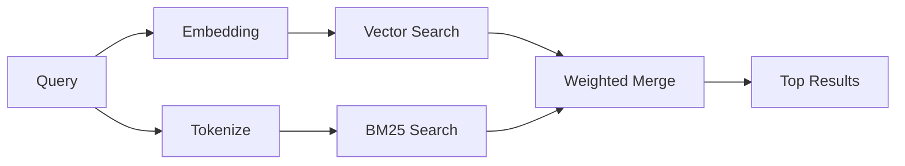

---
read_when:
    - Vuoi capire come funziona memory_search
    - Vuoi scegliere un provider di embedding
    - Vuoi ottimizzare la qualità della ricerca
summary: Come la ricerca in memoria trova note rilevanti usando embedding e recupero ibrido
title: Ricerca nella memoria
x-i18n:
    generated_at: "2026-06-27T17:25:43Z"
    model: gpt-5.5
    postprocess_version: locale-links-v1
    provider: openai
    source_hash: b0bcb8cf400100ba8b6ddbb46bdf8b2a89a8bc32a550ee6df47c874e7e9e0879
    source_path: concepts/memory-search.md
    workflow: 16
---

`memory_search` trova note pertinenti nei tuoi file di memoria, anche quando la
formulazione differisce dal testo originale. Funziona indicizzando la memoria in
piccoli blocchi e cercandoli tramite embedding, parole chiave o entrambi.

## Avvio rapido

La ricerca nella memoria usa gli embedding OpenAI per impostazione predefinita. Per usare un altro backend di embedding, imposta esplicitamente un provider:

```json5
{
  agents: {
    defaults: {
      memorySearch: {
        provider: "openai", // or "gemini", "local", "ollama", "openai-compatible", etc.
      },
    },
  },
}
```

Per configurazioni multi-endpoint con provider specifici per la memoria, `provider` può anche
essere una voce personalizzata `models.providers.<id>`, come `ollama-5080`, quando tale
provider imposta `api: "ollama"` o un altro proprietario di adattatore per embedding di memoria.

Per embedding locali senza chiave API, installa
`@openclaw/llama-cpp-provider` e imposta `provider: "local"`. I checkout del sorgente
possono comunque richiedere l’approvazione della build nativa: `pnpm approve-builds` poi
`pnpm rebuild node-llama-cpp`.

Alcuni endpoint di embedding compatibili con OpenAI richiedono etichette asimmetriche come
`input_type: "query"` per le ricerche e `input_type: "document"` o `"passage"`
per i blocchi indicizzati. Configurale con `memorySearch.queryInputType` e
`memorySearch.documentInputType`; consulta il [riferimento della configurazione della memoria](/it/reference/memory-config#provider-specific-config).

## Provider supportati

| Provider          | ID                  | Richiede chiave API | Note                          |
| ----------------- | ------------------- | ------------------- | ----------------------------- |
| Bedrock           | `bedrock`           | No                  | Usa la catena di credenziali AWS |
| DeepInfra         | `deepinfra`         | Sì                  | Predefinito: `BAAI/bge-m3`    |
| Gemini            | `gemini`            | Sì                  | Supporta l’indicizzazione di immagini/audio |
| GitHub Copilot    | `github-copilot`    | No                  | Usa l’abbonamento Copilot     |
| Local             | `local`             | No                  | Modello GGUF, download di circa 0,6 GB |
| Mistral           | `mistral`           | Sì                  |                               |
| Ollama            | `ollama`            | No                  | Locale/autogestito            |
| OpenAI            | `openai`            | Sì                  | Predefinito                   |
| OpenAI-compatible | `openai-compatible` | Di solito           | `/v1/embeddings` generico     |
| Voyage            | `voyage`            | Sì                  |                               |

## Come funziona la ricerca

OpenClaw esegue due percorsi di recupero in parallelo e unisce i risultati:



- **Ricerca vettoriale** trova note con significato simile ("gateway host" corrisponde a
  "the machine running OpenClaw").
- **Ricerca per parole chiave BM25** trova corrispondenze esatte (ID, stringhe di errore, chiavi di configurazione).

Se è disponibile un solo percorso, l’altro viene eseguito da solo. La modalità intenzionale solo FTS
(`provider: "none"`) e la selezione automatica/predefinita del provider possono comunque usare
il ranking lessicale quando gli embedding non sono disponibili.

I provider di embedding espliciti non locali sono diversi. Se imposti
`memorySearch.provider` su un provider concreto basato su remoto e quel provider
non è disponibile a runtime, `memory_search` segnala la memoria come non disponibile invece
di usare silenziosamente risultati solo FTS. Questo mantiene visibile un provider semantico
configurato ma non funzionante. Imposta `provider: "none"` per un recupero deliberatamente solo FTS, oppure correggi
la configurazione del provider/autenticazione per ripristinare il ranking semantico.

## Migliorare la qualità della ricerca

Due funzionalità opzionali aiutano quando hai una lunga cronologia di note:

### Decadimento temporale

Le note vecchie perdono gradualmente peso nel ranking, così le informazioni recenti emergono per prime.
Con l’emivita predefinita di 30 giorni, una nota del mese scorso ottiene il 50% del
suo peso originale. I file sempreverdi come `MEMORY.md` non subiscono mai decadimento.

<Tip>
Abilita il decadimento temporale se il tuo agente ha mesi di note giornaliere e le
informazioni obsolete continuano a superare il contesto recente nel ranking.
</Tip>

### MMR (diversità)

Riduce i risultati ridondanti. Se cinque note menzionano tutte la stessa configurazione del router, MMR
garantisce che i risultati principali coprano argomenti diversi invece di ripetersi.

<Tip>
Abilita MMR se `memory_search` continua a restituire snippet quasi duplicati da
note giornaliere diverse.
</Tip>

### Abilita entrambi

```json5
{
  agents: {
    defaults: {
      memorySearch: {
        query: {
          hybrid: {
            mmr: { enabled: true },
            temporalDecay: { enabled: true },
          },
        },
      },
    },
  },
}
```

## Memoria multimodale

Con Gemini Embedding 2, puoi indicizzare immagini e file audio insieme al
Markdown. Le query di ricerca rimangono testuali, ma trovano corrispondenze con contenuti visivi e audio.
Consulta il [riferimento della configurazione della memoria](/it/reference/memory-config) per la configurazione.

## Ricerca nella memoria di sessione

Puoi facoltativamente indicizzare le trascrizioni delle sessioni in modo che `memory_search` possa ricordare
conversazioni precedenti. Questa opzione è attivabile tramite
`memorySearch.experimental.sessionMemory`. Consulta il
[riferimento di configurazione](/it/reference/memory-config) per i dettagli.

## Risoluzione dei problemi

**Nessun risultato?** Esegui `openclaw memory status` per controllare l’indice. Se è vuoto, esegui
`openclaw memory index --force`.

**Solo corrispondenze per parole chiave?** Il tuo provider di embedding potrebbe non essere configurato. Controlla
`openclaw memory status --deep`.

**Timeout degli embedding locali?** `ollama`, `lmstudio` e `local` usano un timeout batch
inline più lungo per impostazione predefinita. Se l’host è semplicemente lento, imposta
`agents.defaults.memorySearch.sync.embeddingBatchTimeoutSeconds` e riesegui
`openclaw memory index --force`.

**Testo CJK non trovato?** Ricostruisci l’indice FTS con
`openclaw memory index --force`.

## Letture aggiuntive

- [Active Memory](/it/concepts/active-memory) -- memoria dei sub-agenti per sessioni di chat interattive
- [Memoria](/it/concepts/memory) -- layout dei file, backend, strumenti
- [Riferimento della configurazione della memoria](/it/reference/memory-config) -- tutte le opzioni di configurazione

## Correlati

- [Panoramica della memoria](/it/concepts/memory)
- [Active Memory](/it/concepts/active-memory)
- [Motore di memoria integrato](/it/concepts/memory-builtin)
