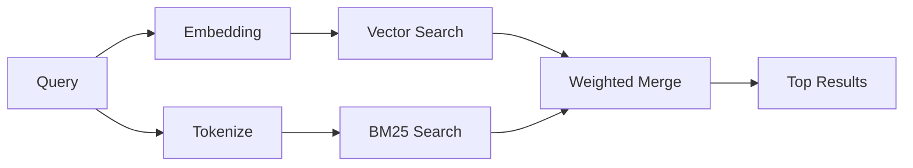

---
read_when:
    - Vuoi capire come funziona memory_search
    - Vuoi scegliere un provider di embedding
    - Vuoi ottimizzare la qualità della ricerca
summary: Come la ricerca in memoria trova note pertinenti usando rappresentazioni vettoriali e recupero ibrido
title: Ricerca nella memoria
x-i18n:
    generated_at: "2026-04-30T16:27:52Z"
    model: gpt-5.5
    provider: openai
    source_hash: 7f40bbe32453a28070ffc67f19a4c06e2fe59a24237a2aef353f4b9b8260bcf2
    source_path: concepts/memory-search.md
    workflow: 16
---

`memory_search` trova note pertinenti nei tuoi file di memoria, anche quando la
formulazione differisce dal testo originale. Funziona indicizzando la memoria in
piccoli blocchi e cercandoli usando embedding, parole chiave o entrambi.

## Avvio rapido

Se hai configurato una sottoscrizione GitHub Copilot, una chiave API OpenAI,
Gemini, Voyage o Mistral, la ricerca in memoria funziona automaticamente. Per
impostare esplicitamente un fornitore:

```json5
{
  agents: {
    defaults: {
      memorySearch: {
        provider: "openai", // or "gemini", "local", "ollama", etc.
      },
    },
  },
}
```

Per configurazioni multi-endpoint, `provider` può anche essere una voce
personalizzata `models.providers.<id>`, come `ollama-5080`, quando quel
fornitore imposta `api: "ollama"` o un altro proprietario di adapter per
embedding.

Per embedding locali senza chiave API, imposta `provider: "local"`. Le
installazioni pacchettizzate mantengono il runtime nativo `node-llama-cpp`
nell'albero runtime-deps del Plugin gestito di OpenClaw; esegui
`openclaw doctor --fix` se quell'albero deve essere riparato.

Alcuni endpoint di embedding compatibili con OpenAI richiedono etichette
asimmetriche come `input_type: "query"` per le ricerche e
`input_type: "document"` o `"passage"` per i blocchi indicizzati. Configurale
con `memorySearch.queryInputType` e `memorySearch.documentInputType`; consulta
il [riferimento di configurazione della memoria](/it/reference/memory-config#provider-specific-config).

## Fornitori supportati

| Fornitore      | ID               | Richiede chiave API | Note                                                   |
| -------------- | ---------------- | ------------------- | ------------------------------------------------------ |
| Bedrock        | `bedrock`        | No                  | Rilevato automaticamente quando la catena di credenziali AWS viene risolta |
| Gemini         | `gemini`         | Sì                  | Supporta l'indicizzazione di immagini/audio            |
| GitHub Copilot | `github-copilot` | No                  | Rilevato automaticamente, usa la sottoscrizione Copilot |
| Locale         | `local`          | No                  | Modello GGUF, download di circa 0,6 GB                 |
| Mistral        | `mistral`        | Sì                  | Rilevato automaticamente                               |
| Ollama         | `ollama`         | No                  | Locale, deve essere impostato esplicitamente           |
| OpenAI         | `openai`         | Sì                  | Rilevato automaticamente, veloce                       |
| Voyage         | `voyage`         | Sì                  | Rilevato automaticamente                               |

## Come funziona la ricerca

OpenClaw esegue due percorsi di recupero in parallelo e unisce i risultati:



- **Ricerca vettoriale** trova note con significato simile ("gateway host"
  corrisponde a "la macchina che esegue OpenClaw").
- **Ricerca per parole chiave BM25** trova corrispondenze esatte (ID, stringhe
  di errore, chiavi di configurazione).

Se è disponibile un solo percorso (nessun embedding o nessun FTS), l'altro viene
eseguito da solo.

Quando gli embedding non sono disponibili, OpenClaw usa comunque il ranking lessicale sui risultati FTS invece di ricadere solo sull'ordinamento grezzo per corrispondenza esatta. Questa modalità degradata potenzia i blocchi con una copertura più forte dei termini della query e percorsi file pertinenti, mantenendo utile il recupero anche senza `sqlite-vec` o un fornitore di embedding.

## Migliorare la qualità della ricerca

Due funzionalità opzionali aiutano quando hai una cronologia di note estesa:

### Decadimento temporale

Le note vecchie perdono gradualmente peso nel ranking, così le informazioni
recenti emergono per prime. Con l'emivita predefinita di 30 giorni, una nota del
mese scorso ottiene il 50% del suo peso originale. I file sempreverdi come
`MEMORY.md` non subiscono mai decadimento.

<Tip>
Abilita il decadimento temporale se il tuo agent ha mesi di note giornaliere e
le informazioni obsolete continuano a superare il contesto recente.
</Tip>

### MMR (diversità)

Riduce i risultati ridondanti. Se cinque note menzionano tutte la stessa
configurazione del router, MMR garantisce che i risultati principali coprano
argomenti diversi invece di ripetersi.

<Tip>
Abilita MMR se `memory_search` continua a restituire frammenti quasi duplicati
da note giornaliere diverse.
</Tip>

### Abilitarli entrambi

```json5
{
  agents: {
    defaults: {
      memorySearch: {
        query: {
          hybrid: {
            mmr: { enabled: true },
            temporalDecay: { enabled: true },
          },
        },
      },
    },
  },
}
```

## Memoria multimodale

Con Gemini Embedding 2, puoi indicizzare immagini e file audio insieme al
Markdown. Le query di ricerca restano testuali, ma trovano corrispondenze nei
contenuti visivi e audio. Consulta il [riferimento di configurazione della memoria](/it/reference/memory-config)
per la configurazione.

## Ricerca nella memoria di sessione

Puoi opzionalmente indicizzare le trascrizioni di sessione così `memory_search`
può richiamare conversazioni precedenti. È una scelta esplicita tramite
`memorySearch.experimental.sessionMemory`. Consulta il
[riferimento di configurazione](/it/reference/memory-config) per i dettagli.

## Risoluzione dei problemi

**Nessun risultato?** Esegui `openclaw memory status` per controllare l'indice.
Se è vuoto, esegui `openclaw memory index --force`.

**Solo corrispondenze per parole chiave?** Il tuo fornitore di embedding potrebbe
non essere configurato. Controlla `openclaw memory status --deep`.

**Gli embedding locali vanno in timeout?** `ollama`, `lmstudio` e `local` usano
per impostazione predefinita un timeout batch inline più lungo. Se l'host è
semplicemente lento, imposta
`agents.defaults.memorySearch.sync.embeddingBatchTimeoutSeconds` ed esegui di
nuovo `openclaw memory index --force`.

**Testo CJK non trovato?** Ricostruisci l'indice FTS con
`openclaw memory index --force`.

## Approfondimenti

- [Active Memory](/it/concepts/active-memory) -- memoria del sub-agent per sessioni di chat interattive
- [Memoria](/it/concepts/memory) -- layout dei file, backend, strumenti
- [Riferimento di configurazione della memoria](/it/reference/memory-config) -- tutte le opzioni di configurazione

## Correlati

- [Panoramica della memoria](/it/concepts/memory)
- [Active Memory](/it/concepts/active-memory)
- [Motore di memoria integrato](/it/concepts/memory-builtin)
