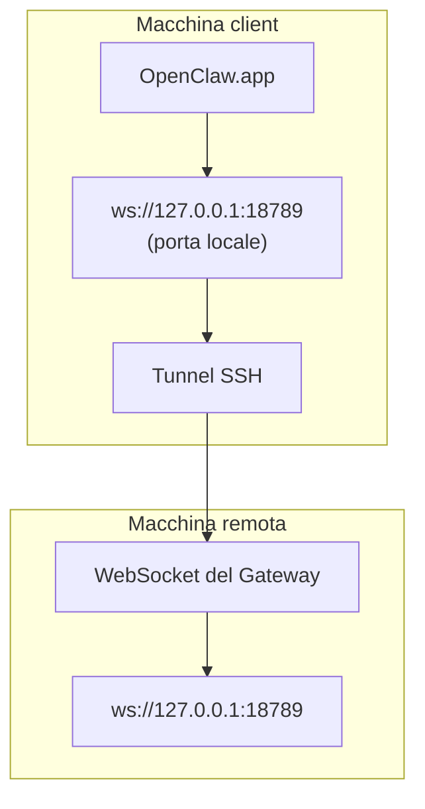

<Note>
Questo contenuto si trova ora in [Accesso remoto](/it/gateway/remote#macos-persistent-ssh-tunnel-via-launchagent). Usa quella pagina per la guida aggiornata; questa pagina rimane come destinazione di reindirizzamento.
</Note>

# Esecuzione di OpenClaw.app con un Gateway remoto

OpenClaw.app raggiunge un Gateway remoto tramite un tunnel SSH: un `LocalForward` SSH associa una porta locale alla porta WebSocket del Gateway sull'host remoto.

## Configurazione

1. Aggiungi una voce alla configurazione SSH con `LocalForward 18789 127.0.0.1:18789` (consulta [Accesso remoto](/it/gateway/remote#macos-persistent-ssh-tunnel-via-launchagent) per il blocco di configurazione completo).
2. Copia la tua chiave SSH sull'host remoto con `ssh-copy-id`.
3. Imposta `gateway.remote.token` (o `gateway.remote.password`) tramite `openclaw config set gateway.remote.token "<your-token>"`.
4. Avvia il tunnel: `ssh -N remote-gateway &`.
5. Chiudi e riapri OpenClaw.app.

Per un tunnel che rimanga attivo dopo i riavvii e si riconnetta automaticamente, usa la configurazione LaunchAgent nella pagina [Accesso remoto](/it/gateway/remote#macos-persistent-ssh-tunnel-via-launchagent) anziché eseguire manualmente `ssh -N`.

## Come funziona

| Componente                           | Funzione                                                                       |
| ------------------------------------ | ------------------------------------------------------------------------------ |
| `LocalForward 18789 127.0.0.1:18789` | Inoltra la porta locale 18789 alla porta remota 18789                          |
| `ssh -N`                             | Connessione SSH senza eseguire comandi remoti (solo inoltro delle porte)       |
| `KeepAlive`                          | Riavvia automaticamente il tunnel in caso di arresto anomalo (LaunchAgent)     |
| `RunAtLoad`                          | Avvia il tunnel quando viene caricato il LaunchAgent (LaunchAgent)             |

OpenClaw.app si connette a `ws://127.0.0.1:18789` sul client. Il tunnel inoltra tale connessione alla porta 18789 dell'host remoto su cui è in esecuzione il Gateway.

## Contenuti correlati

- [Accesso remoto](/it/gateway/remote)
- [Tailscale](/it/gateway/tailscale)
