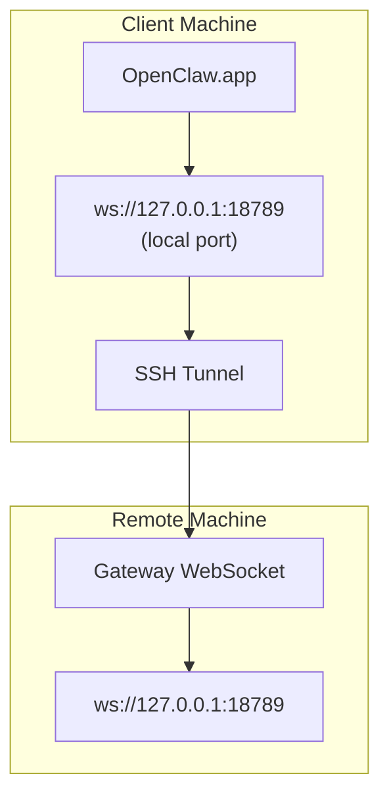

> Questo contenuto è stato unito in [Accesso remoto](/it/gateway/remote#macos-persistent-ssh-tunnel-via-launchagent). Vedi quella pagina per la guida aggiornata.

# Eseguire OpenClaw.app con un Gateway remoto

OpenClaw.app usa il tunneling SSH per connettersi a un gateway remoto. Questa guida mostra come configurarlo.

## Panoramica



## Configurazione rapida

### Passaggio 1: aggiungi la configurazione SSH

Modifica `~/.ssh/config` e aggiungi:

```ssh
Host remote-gateway
    HostName <REMOTE_IP>          # ad es. 172.27.187.184
    User <REMOTE_USER>            # ad es. jefferson
    LocalForward 18789 127.0.0.1:18789
    IdentityFile ~/.ssh/id_rsa
```

Sostituisci `<REMOTE_IP>` e `<REMOTE_USER>` con i tuoi valori.

### Passaggio 2: copia la chiave SSH

Copia la tua chiave pubblica sulla macchina remota (inserisci la password una sola volta):

```bash
ssh-copy-id -i ~/.ssh/id_rsa <REMOTE_USER>@<REMOTE_IP>
```

### Passaggio 3: configura l'autenticazione del Gateway remoto

```bash
openclaw config set gateway.remote.token "<your-token>"
```

Usa invece `gateway.remote.password` se il tuo gateway remoto usa l'autenticazione tramite password.
`OPENCLAW_GATEWAY_TOKEN` resta valido come override a livello di shell, ma la configurazione durevole
del client remoto è `gateway.remote.token` / `gateway.remote.password`.

### Passaggio 4: avvia il tunnel SSH

```bash
ssh -N remote-gateway &
```

### Passaggio 5: riavvia OpenClaw.app

```bash
# Chiudi OpenClaw.app (⌘Q), poi riaprila:
open /path/to/OpenClaw.app
```

L'app ora si connetterà al gateway remoto tramite il tunnel SSH.

---

## Avvio automatico del tunnel all'accesso

Per fare in modo che il tunnel SSH si avvii automaticamente quando accedi, crea un Launch Agent.

### Crea il file PLIST

Salvalo come `~/Library/LaunchAgents/ai.openclaw.ssh-tunnel.plist`:

```xml
<?xml version="1.0" encoding="UTF-8"?>
<!DOCTYPE plist PUBLIC "-//Apple//DTD PLIST 1.0//EN" "http://www.apple.com/DTDs/PropertyList-1.0.dtd">
<plist version="1.0">
<dict>
    <key>Label</key>
    <string>ai.openclaw.ssh-tunnel</string>
    <key>ProgramArguments</key>
    <array>
        <string>/usr/bin/ssh</string>
        <string>-N</string>
        <string>remote-gateway</string>
    </array>
    <key>KeepAlive</key>
    <true/>
    <key>RunAtLoad</key>
    <true/>
</dict>
</plist>
```

### Carica il Launch Agent

```bash
launchctl bootstrap gui/$UID ~/Library/LaunchAgents/ai.openclaw.ssh-tunnel.plist
```

Il tunnel ora:

- si avvierà automaticamente quando accedi
- verrà riavviato se si arresta in modo anomalo
- continuerà a essere eseguito in background

Nota legacy: rimuovi qualsiasi LaunchAgent `com.openclaw.ssh-tunnel` residuo, se presente.

---

## Risoluzione dei problemi

**Controlla se il tunnel è in esecuzione:**

```bash
ps aux | grep "ssh -N remote-gateway" | grep -v grep
lsof -i :18789
```

**Riavvia il tunnel:**

```bash
launchctl kickstart -k gui/$UID/ai.openclaw.ssh-tunnel
```

**Arresta il tunnel:**

```bash
launchctl bootout gui/$UID/ai.openclaw.ssh-tunnel
```

---

## Come funziona

| Componente                           | Cosa fa                                                      |
| ------------------------------------ | ------------------------------------------------------------ |
| `LocalForward 18789 127.0.0.1:18789` | Inoltra la porta locale 18789 alla porta remota 18789        |
| `ssh -N`                             | SSH senza eseguire comandi remoti (solo port forwarding)     |
| `KeepAlive`                          | Riavvia automaticamente il tunnel se si arresta in modo anomalo |
| `RunAtLoad`                          | Avvia il tunnel quando l'agente viene caricato               |

OpenClaw.app si connette a `ws://127.0.0.1:18789` sulla tua macchina client. Il tunnel SSH inoltra quella connessione alla porta 18789 sulla macchina remota dove è in esecuzione il Gateway.

## Correlati

- [Accesso remoto](/it/gateway/remote)
- [Tailscale](/it/gateway/tailscale)
