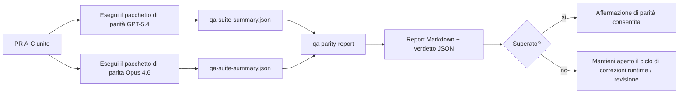

---
x-i18n:
    generated_at: "2026-04-11T15:15:56Z"
    model: gpt-5.4
    provider: openai
    source_hash: 910bcf7668becf182ef48185b43728bf2fa69629d6d50189d47d47b06f807a9e
    source_path: help/gpt54-codex-agentic-parity-maintainers.md
    workflow: 15
---

# Note per i maintainer sulla parità GPT-5.4 / Codex

Questa nota spiega come rivedere il programma di parità GPT-5.4 / Codex come quattro unità di merge senza perdere l'architettura originale a sei contratti.

## Unità di merge

### PR A: esecuzione agentica rigorosa

Comprende:

- `executionContract`
- follow-through nello stesso turno con priorità a GPT-5
- `update_plan` come tracciamento dei progressi non terminale
- stati di blocco espliciti invece di arresti silenziosi basati solo sul piano

Non comprende:

- classificazione degli errori di auth/runtime
- veridicità delle autorizzazioni
- riprogettazione di replay/continuazione
- benchmark di parità

### PR B: veridicità del runtime

Comprende:

- correttezza degli scope OAuth di Codex
- classificazione tipizzata degli errori di provider/runtime
- disponibilità veritiera di `/elevated full` e motivi del blocco

Non comprende:

- normalizzazione dello schema degli strumenti
- stato di replay/liveness
- gating dei benchmark

### PR C: correttezza dell'esecuzione

Comprende:

- compatibilità degli strumenti OpenAI/Codex di proprietà del provider
- gestione rigorosa degli schemi senza parametri
- esposizione di replay invalidi
- visibilità dello stato di attività lunghe in pausa, bloccate e abbandonate

Non comprende:

- continuazione auto-selezionata
- comportamento generico del dialetto Codex al di fuori degli hook del provider
- gating dei benchmark

### PR D: harness di parità

Comprende:

- primo pacchetto di scenari GPT-5.4 vs Opus 4.6
- documentazione della parità
- meccanismi di report di parità e gate di rilascio

Non comprende:

- modifiche al comportamento del runtime al di fuori di QA-lab
- simulazione di auth/proxy/DNS all'interno dell'harness

## Mappatura ai sei contratti originali

| Contratto originale                     | Unità di merge |
| --------------------------------------- | -------------- |
| Correttezza del trasporto/auth provider | PR B           |
| Compatibilità contratto/schema strumenti| PR C           |
| Esecuzione nello stesso turno           | PR A           |
| Veridicità delle autorizzazioni         | PR B           |
| Correttezza replay/continuazione/liveness | PR C         |
| Benchmark/gate di rilascio              | PR D           |

## Ordine di revisione

1. PR A
2. PR B
3. PR C
4. PR D

PR D è il livello di prova. Non dovrebbe essere il motivo per cui le PR di correttezza del runtime vengono ritardate.

## Cosa cercare

### PR A

- le esecuzioni GPT-5 agiscono o falliscono in modo chiuso invece di fermarsi ai commenti
- `update_plan` non sembra più di per sé un avanzamento
- il comportamento resta con priorità a GPT-5 e limitato all'ambito embedded-Pi

### PR B

- gli errori di auth/proxy/runtime non collassano più in una gestione generica del tipo “model failed”
- `/elevated full` viene descritto come disponibile solo quando è realmente disponibile
- i motivi del blocco sono visibili sia al modello sia al runtime rivolto all'utente

### PR C

- la registrazione rigorosa degli strumenti OpenAI/Codex si comporta in modo prevedibile
- gli strumenti senza parametri non falliscono i controlli rigorosi dello schema
- gli esiti di replay e compattazione preservano uno stato di liveness veritiero

### PR D

- il pacchetto di scenari è comprensibile e riproducibile
- il pacchetto include una corsia di sicurezza del replay con mutazioni, non solo flussi in sola lettura
- i report sono leggibili da esseri umani e dall'automazione
- le affermazioni di parità sono supportate da evidenze, non aneddotiche

Artefatti attesi da PR D:

- `qa-suite-report.md` / `qa-suite-summary.json` per ogni esecuzione del modello
- `qa-agentic-parity-report.md` con confronto aggregato e a livello di scenario
- `qa-agentic-parity-summary.json` con un verdetto leggibile da macchina

## Gate di rilascio

Non dichiarare parità o superiorità di GPT-5.4 rispetto a Opus 4.6 finché:

- PR A, PR B e PR C non sono state unite
- PR D non esegue in modo pulito il primo pacchetto di parità
- le suite di regressione della veridicità del runtime restano verdi
- il report di parità non mostra casi di falso successo e nessuna regressione nel comportamento di arresto

L'harness di parità non è l'unica fonte di evidenza. Mantieni esplicita questa divisione nella revisione:

- PR D possiede il confronto basato su scenari tra GPT-5.4 e Opus 4.6
- le suite deterministiche di PR B continuano a possedere le evidenze su auth/proxy/DNS e sulla veridicità dell'accesso completo

## Mappa obiettivo-evidenza

| Voce del gate di completamento            | Proprietario principale | Artefatto di revisione                                              |
| ----------------------------------------- | ----------------------- | ------------------------------------------------------------------- |
| Nessuno stallo basato solo sul piano      | PR A                    | test runtime agentici rigorosi e `approval-turn-tool-followthrough` |
| Nessun falso avanzamento o falso completamento degli strumenti | PR A + PR D | conteggio dei falsi successi di parità più dettagli del report a livello di scenario |
| Nessuna guida falsa su `/elevated full`   | PR B                    | suite deterministiche di veridicità del runtime                     |
| I fallimenti di replay/liveness restano espliciti | PR C + PR D     | suite lifecycle/replay più `compaction-retry-mutating-tool`         |
| GPT-5.4 eguaglia o supera Opus 4.6        | PR D                    | `qa-agentic-parity-report.md` e `qa-agentic-parity-summary.json`    |

## Abbreviazione per i revisori: prima vs dopo

| Problema visibile all'utente prima                        | Segnale di revisione dopo                                                                 |
| --------------------------------------------------------- | ----------------------------------------------------------------------------------------- |
| GPT-5.4 si fermava dopo la pianificazione                 | PR A mostra comportamento act-or-block invece di completamento basato solo sui commenti  |
| L'uso degli strumenti sembrava fragile con schemi rigorosi OpenAI/Codex | PR C mantiene prevedibili la registrazione degli strumenti e l'invocazione senza parametri |
| I suggerimenti `/elevated full` erano talvolta fuorvianti | PR B collega la guida alla reale capacità del runtime e ai motivi del blocco             |
| Le attività lunghe potevano sparire nell'ambiguità di replay/compattazione | PR C emette stato esplicito di pausa, blocco, abbandono e replay non valido |
| Le affermazioni di parità erano aneddotiche               | PR D produce un report più un verdetto JSON con la stessa copertura di scenari su entrambi i modelli |
