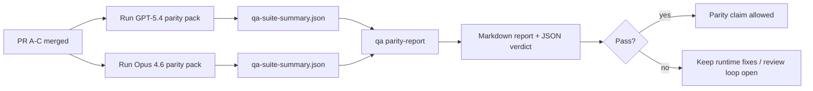

---
read_when:
    - Revisione della serie di PR sulla parità GPT-5.4 / Codex
    - Mantenere l'architettura agentica a sei contratti dietro il programma di parità
summary: Come rivedere il programma di parità GPT-5.4 / Codex come quattro unità di merge
title: Note del maintainer sulla parità GPT-5.4 / Codex
x-i18n:
    generated_at: "2026-04-24T08:43:59Z"
    model: gpt-5.4
    provider: openai
    source_hash: 803b62bf5bb6b00125f424fa733e743ecdec7f8410dec0782096f9d1ddbed6c0
    source_path: help/gpt54-codex-agentic-parity-maintainers.md
    workflow: 15
---

Questa nota spiega come rivedere il programma di parità GPT-5.4 / Codex come quattro unità di merge senza perdere l'architettura originale a sei contratti.

## Unità di merge

### PR A: esecuzione strict-agentic

È responsabile di:

- `executionContract`
- follow-through nello stesso turno con priorità a GPT-5
- `update_plan` come tracciamento di avanzamento non terminale
- stati di blocco espliciti invece di arresti silenziosi basati solo sul piano

Non è responsabile di:

- classificazione dei fallimenti auth/runtime
- veridicità dei permessi
- redesign di replay/continuazione
- benchmarking della parità

### PR B: veridicità del runtime

È responsabile di:

- correttezza degli ambiti OAuth Codex
- classificazione tipizzata dei fallimenti provider/runtime
- disponibilità veritiera di `/elevated full` e motivi di blocco

Non è responsabile di:

- normalizzazione dello schema degli strumenti
- stato di replay/liveness
- gating del benchmark

### PR C: correttezza dell'esecuzione

È responsabile di:

- compatibilità degli strumenti OpenAI/Codex gestita dal provider
- gestione rigorosa degli schemi senza parametri
- esposizione di replay-invalid
- visibilità degli stati paused, blocked e abandoned dei task lunghi

Non è responsabile di:

- continuazione autoeletta
- comportamento generico del dialetto Codex al di fuori degli hook del provider
- gating del benchmark

### PR D: harness di parità

È responsabile di:

- primo scenario pack GPT-5.4 vs Opus 4.6
- documentazione della parità
- meccanismi di report di parità e gate di release

Non è responsabile di:

- modifiche del comportamento runtime al di fuori del QA-lab
- simulazione auth/proxy/DNS dentro l'harness

## Mappatura ai sei contratti originali

| Contratto originale                      | Unità di merge |
| ---------------------------------------- | -------------- |
| Correttezza del trasporto/auth del provider | PR B        |
| Compatibilità del contratto/schema degli strumenti | PR C   |
| Esecuzione nello stesso turno            | PR A           |
| Veridicità dei permessi                  | PR B           |
| Correttezza di replay/continuazione/liveness | PR C      |
| Benchmark/gate di release                | PR D           |

## Ordine di revisione

1. PR A
2. PR B
3. PR C
4. PR D

PR D è il livello di prova. Non dovrebbe essere il motivo per cui le PR di correttezza runtime vengono ritardate.

## Cosa controllare

### PR A

- le esecuzioni GPT-5 agiscono o falliscono in modalità closed invece di fermarsi al commento
- `update_plan` non sembra più progresso di per sé
- il comportamento resta con priorità a GPT-5 e limitato a Pi embedded

### PR B

- i fallimenti auth/proxy/runtime smettono di collassare in una gestione generica “model failed”
- `/elevated full` viene descritto come disponibile solo quando lo è davvero
- i motivi di blocco sono visibili sia al modello sia al runtime esposto all'utente

### PR C

- la registrazione rigorosa degli strumenti OpenAI/Codex si comporta in modo prevedibile
- gli strumenti senza parametri non falliscono i controlli rigorosi dello schema
- gli esiti di replay e compattazione preservano uno stato di liveness veritiero

### PR D

- lo scenario pack è comprensibile e riproducibile
- il pack include una lane di sicurezza del replay mutante, non solo flussi in sola lettura
- i report sono leggibili da esseri umani e automazione
- le affermazioni di parità sono supportate da prove, non aneddotiche

Artefatti attesi da PR D:

- `qa-suite-report.md` / `qa-suite-summary.json` per ogni esecuzione del modello
- `qa-agentic-parity-report.md` con confronto aggregato e per scenario
- `qa-agentic-parity-summary.json` con un verdetto leggibile da macchina

## Gate di release

Non affermare parità o superiorità di GPT-5.4 rispetto a Opus 4.6 finché:

- PR A, PR B e PR C non sono state unite
- PR D non esegue in modo pulito il primo parity pack
- le suite di regressione della veridicità runtime restano verdi
- il report di parità non mostra casi di falso successo né regressioni nel comportamento di stop

L'harness di parità non è l'unica fonte di evidenza. Mantieni questa separazione esplicita nella revisione:

- PR D gestisce il confronto basato su scenari tra GPT-5.4 e Opus 4.6
- le suite deterministiche di PR B continuano a gestire le prove su auth/proxy/DNS e sulla veridicità dell'accesso completo

## Mappa obiettivo → evidenza

| Elemento del gate di completamento       | Responsabile principale | Artefatto di revisione                                             |
| ---------------------------------------- | ----------------------- | ------------------------------------------------------------------ |
| Nessuno stallo basato solo sul piano     | PR A                    | test runtime strict-agentic e `approval-turn-tool-followthrough`   |
| Nessun falso progresso o falso completamento degli strumenti | PR A + PR D | conteggio dei falsi successi di parità più dettagli del report a livello di scenario |
| Nessuna indicazione falsa di `/elevated full` | PR B               | suite deterministiche della veridicità runtime                     |
| I fallimenti di replay/liveness restano espliciti | PR C + PR D    | suite lifecycle/replay più `compaction-retry-mutating-tool`        |
| GPT-5.4 eguaglia o supera Opus 4.6       | PR D                    | `qa-agentic-parity-report.md` e `qa-agentic-parity-summary.json`   |

## Scorciatoia per i revisori: prima vs dopo

| Problema visibile all'utente prima                         | Segnale di revisione dopo                                                                 |
| ---------------------------------------------------------- | ------------------------------------------------------------------------------------------ |
| GPT-5.4 si fermava dopo la pianificazione                  | PR A mostra comportamento act-or-block invece di completamento basato solo sul commento   |
| L'uso degli strumenti sembrava fragile con schemi OpenAI/Codex rigorosi | PR C mantiene prevedibili registrazione degli strumenti e invocazione senza parametri |
| I suggerimenti `/elevated full` erano talvolta fuorvianti | PR B collega le indicazioni alla reale capacità runtime e ai motivi di blocco            |
| I task lunghi potevano scomparire nell'ambiguità di replay/compattazione | PR C emette stati espliciti paused, blocked, abandoned e replay-invalid          |
| Le affermazioni di parità erano aneddotiche                | PR D produce un report più un verdetto JSON con la stessa copertura di scenari su entrambi i modelli |

## Correlati

- [Parità agentica GPT-5.4 / Codex](/it/help/gpt54-codex-agentic-parity)
