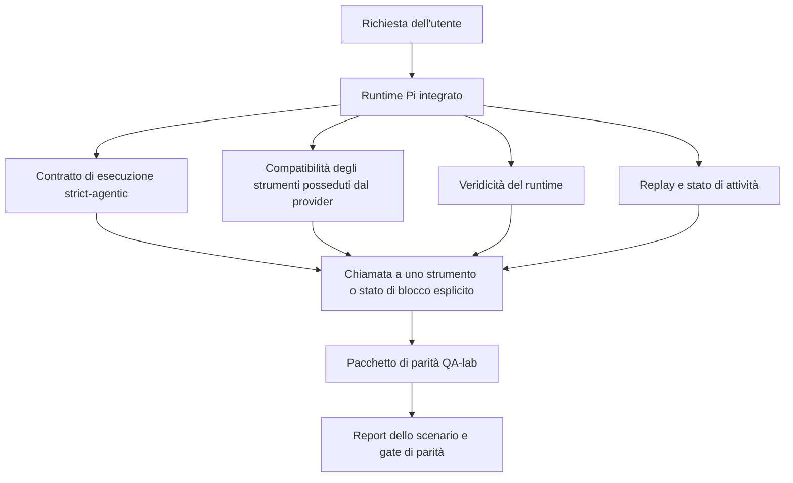
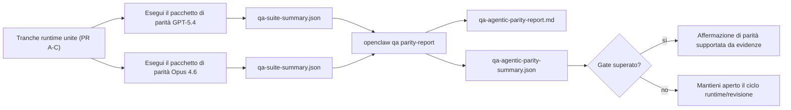

---
x-i18n:
    generated_at: "2026-04-11T15:15:56Z"
    model: gpt-5.4
    provider: openai
    source_hash: 7ee6b925b8a0f8843693cea9d50b40544657b5fb8a9e0860e2ff5badb273acb6
    source_path: help/gpt54-codex-agentic-parity.md
    workflow: 15
---

# Parità agentica GPT-5.4 / Codex in OpenClaw

OpenClaw funzionava già bene con i modelli frontier che usano strumenti, ma GPT-5.4 e i modelli in stile Codex continuavano a offrire prestazioni inferiori in alcuni aspetti pratici:

- potevano fermarsi dopo la pianificazione invece di svolgere il lavoro
- potevano usare in modo errato gli schemi degli strumenti rigidi di OpenAI/Codex
- potevano chiedere `/elevated full` anche quando l'accesso completo era impossibile
- potevano perdere lo stato delle attività di lunga durata durante il replay o la compattazione
- le affermazioni di parità rispetto a Claude Opus 4.6 si basavano su aneddoti anziché su scenari ripetibili

Questo programma di parità colma queste lacune in quattro tranche verificabili.

## Cosa è cambiato

### PR A: esecuzione strict-agentic

Questa tranche aggiunge un contratto di esecuzione `strict-agentic` opzionale per le esecuzioni GPT-5 integrate su Pi.

Quando è abilitato, OpenClaw smette di accettare i turni solo di pianificazione come completamento “abbastanza buono”. Se il modello dice soltanto cosa intende fare e non usa davvero strumenti né fa progressi, OpenClaw ritenta con un orientamento ad agire subito e poi fallisce in modo chiuso con uno stato di blocco esplicito invece di terminare silenziosamente l'attività.

Questo migliora soprattutto l'esperienza GPT-5.4 in questi casi:

- brevi follow-up “ok fallo”
- attività di codice in cui il primo passaggio è ovvio
- flussi in cui `update_plan` dovrebbe servire a tracciare i progressi invece di essere testo riempitivo

### PR B: veridicità del runtime

Questa tranche fa sì che OpenClaw dica la verità su due cose:

- perché la chiamata al provider/runtime è fallita
- se `/elevated full` è davvero disponibile

Questo significa che GPT-5.4 riceve segnali di runtime migliori per scope mancanti, errori di rinnovo dell'autenticazione, errori di autenticazione HTML 403, problemi di proxy, errori DNS o timeout e modalità di accesso completo bloccate. È meno probabile che il modello allucini la correzione sbagliata o continui a chiedere una modalità di autorizzazione che il runtime non può fornire.

### PR C: correttezza dell'esecuzione

Questa tranche migliora due tipi di correttezza:

- compatibilità degli schemi degli strumenti OpenAI/Codex posseduti dal provider
- visibilità del replay e dello stato di attività lunghe

Il lavoro sulla compatibilità degli strumenti riduce l'attrito degli schemi per la registrazione rigorosa degli strumenti OpenAI/Codex, soprattutto per gli strumenti senza parametri e per le aspettative rigide sulla radice oggetto. Il lavoro su replay/stato di attività rende le attività di lunga durata più osservabili, così che gli stati in pausa, bloccati e abbandonati siano visibili invece di scomparire in un generico testo di errore.

### PR D: harness di parità

Questa tranche aggiunge il primo pacchetto di parità QA-lab, così GPT-5.4 e Opus 4.6 possono essere esercitati sugli stessi scenari e confrontati usando evidenze condivise.

Il pacchetto di parità è il livello di prova. Di per sé non modifica il comportamento del runtime.

Dopo aver ottenuto due artefatti `qa-suite-summary.json`, genera il confronto del gate di rilascio con:

```bash
pnpm openclaw qa parity-report \
  --repo-root . \
  --candidate-summary .artifacts/qa-e2e/gpt54/qa-suite-summary.json \
  --baseline-summary .artifacts/qa-e2e/opus46/qa-suite-summary.json \
  --output-dir .artifacts/qa-e2e/parity
```

Quel comando scrive:

- un report Markdown leggibile da umani
- un verdetto JSON leggibile da macchina
- un risultato di gate esplicito `pass` / `fail`

## Perché questo migliora GPT-5.4 nella pratica

Prima di questo lavoro, GPT-5.4 su OpenClaw poteva sembrare meno agentico di Opus nelle sessioni di coding reali perché il runtime tollerava comportamenti particolarmente dannosi per i modelli in stile GPT-5:

- turni di solo commento
- attrito di schema intorno agli strumenti
- feedback vaghi sui permessi
- rotture silenziose di replay o compattazione

L'obiettivo non è fare in modo che GPT-5.4 imiti Opus. L'obiettivo è dare a GPT-5.4 un contratto di runtime che premi il progresso reale, fornisca semantiche più pulite per strumenti e permessi e trasformi le modalità di errore in stati espliciti leggibili sia da macchina sia da umani.

Questo cambia l'esperienza utente da:

- “il modello aveva un buon piano ma si è fermato”

a:

- “il modello ha agito, oppure OpenClaw ha mostrato il motivo esatto per cui non ha potuto farlo”

## Prima e dopo per gli utenti GPT-5.4

| Prima di questo programma                                                                  | Dopo PR A-D                                                                            |
| ------------------------------------------------------------------------------------------ | -------------------------------------------------------------------------------------- |
| GPT-5.4 poteva fermarsi dopo un piano ragionevole senza eseguire il passaggio successivo con strumenti | PR A trasforma “solo piano” in “agisci ora o mostra uno stato di blocco”              |
| Gli schemi rigidi degli strumenti potevano rifiutare in modi confusi strumenti senza parametri o strumenti con forma OpenAI/Codex | PR C rende più prevedibili registrazione e invocazione degli strumenti posseduti dal provider |
| La guida su `/elevated full` poteva essere vaga o errata nei runtime bloccati             | PR B offre a GPT-5.4 e all'utente indicazioni veritiere su runtime e permessi         |
| I fallimenti di replay o compattazione potevano dare l'impressione che l'attività fosse sparita in silenzio | PR C esplicita gli esiti in pausa, bloccati, abbandonati e replay-invalid             |
| “GPT-5.4 sembra peggiore di Opus” era per lo più aneddotico                               | PR D lo trasforma nello stesso pacchetto di scenari, nelle stesse metriche e in un gate pass/fail rigido |

## Architettura



## Flusso di rilascio



## Pacchetto di scenari

Il pacchetto di parità di prima ondata copre attualmente cinque scenari:

### `approval-turn-tool-followthrough`

Verifica che il modello non si fermi a “Lo farò” dopo una breve approvazione. Dovrebbe eseguire la prima azione concreta nello stesso turno.

### `model-switch-tool-continuity`

Verifica che il lavoro con uso di strumenti rimanga coerente attraverso i confini di cambio modello/runtime invece di azzerarsi in commenti o perdere il contesto di esecuzione.

### `source-docs-discovery-report`

Verifica che il modello possa leggere codice sorgente e documentazione, sintetizzare i risultati e proseguire l'attività in modo agentico invece di produrre un riepilogo superficiale e fermarsi presto.

### `image-understanding-attachment`

Verifica che le attività multimodali che coinvolgono allegati restino eseguibili e non collassino in una narrazione vaga.

### `compaction-retry-mutating-tool`

Verifica che un'attività con una reale scrittura mutativa mantenga esplicita l'insicurezza del replay invece di sembrare silenziosamente sicura per il replay se l'esecuzione si compatta, ritenta o perde lo stato della risposta sotto pressione.

## Matrice degli scenari

| Scenario                           | Cosa verifica                           | Buon comportamento di GPT-5.4                                                   | Segnale di errore                                                               |
| ---------------------------------- | --------------------------------------- | -------------------------------------------------------------------------------- | -------------------------------------------------------------------------------- |
| `approval-turn-tool-followthrough` | Turni di breve approvazione dopo un piano | Avvia subito la prima azione concreta con strumenti invece di ribadire l'intento | follow-up solo di piano, nessuna attività di strumenti o turno bloccato senza un vero blocco |
| `model-switch-tool-continuity`     | Cambio runtime/modello durante l'uso di strumenti | Preserva il contesto dell'attività e continua ad agire in modo coerente         | ritorna a commenti, perde il contesto degli strumenti o si ferma dopo il cambio |
| `source-docs-discovery-report`     | Lettura del codice sorgente + sintesi + azione | Trova le fonti, usa strumenti e produce un report utile senza bloccarsi         | riepilogo superficiale, lavoro con strumenti mancante o arresto per turno incompleto |
| `image-understanding-attachment`   | Lavoro agentico guidato da allegati     | Interpreta l'allegato, lo collega agli strumenti e continua l'attività          | narrazione vaga, allegato ignorato o nessuna azione concreta successiva         |
| `compaction-retry-mutating-tool`   | Lavoro mutativo sotto pressione di compattazione | Esegue una vera scrittura e mantiene esplicita l'insicurezza del replay dopo l'effetto collaterale | la scrittura mutativa avviene ma la sicurezza del replay è implicita, mancante o contraddittoria |

## Gate di rilascio

GPT-5.4 può essere considerato alla pari o migliore solo quando il runtime unito supera il pacchetto di parità e le regressioni di veridicità del runtime allo stesso tempo.

Risultati richiesti:

- nessuno stallo solo di pianificazione quando la successiva azione con strumenti è chiara
- nessun completamento fittizio senza esecuzione reale
- nessuna guida errata su `/elevated full`
- nessun abbandono silenzioso dovuto a replay o compattazione
- metriche del pacchetto di parità almeno forti quanto la baseline concordata di Opus 4.6

Per l'harness di prima ondata, il gate confronta:

- tasso di completamento
- tasso di arresto non intenzionale
- tasso di chiamate a strumenti valide
- conteggio dei falsi successi

Le evidenze di parità sono volutamente divise in due livelli:

- PR D dimostra con QA-lab il comportamento GPT-5.4 vs Opus 4.6 sugli stessi scenari
- le suite deterministiche di PR B dimostrano veridicità di autenticazione, proxy, DNS e `/elevated full` fuori dall'harness

## Matrice obiettivo-evidenza

| Voce del gate di completamento                          | PR responsabile | Fonte di evidenza                                                  | Segnale di superamento                                                                  |
| ------------------------------------------------------- | --------------- | ------------------------------------------------------------------ | --------------------------------------------------------------------------------------- |
| GPT-5.4 non si blocca più dopo la pianificazione        | PR A            | `approval-turn-tool-followthrough` più suite runtime di PR A       | i turni di approvazione attivano lavoro reale o uno stato di blocco esplicito         |
| GPT-5.4 non simula più progressi o falsi completamenti di strumenti | PR A + PR D     | esiti degli scenari nel report di parità e conteggio dei falsi successi | nessun risultato sospetto di successo e nessun completamento di solo commento          |
| GPT-5.4 non fornisce più falsa guida su `/elevated full` | PR B            | suite deterministiche di veridicità                                | motivi di blocco e indicazioni di accesso completo restano accurati rispetto al runtime |
| I fallimenti di replay/stato di attività restano espliciti | PR C + PR D     | suite di ciclo di vita/replay di PR C più `compaction-retry-mutating-tool` | il lavoro mutativo mantiene esplicita l'insicurezza del replay invece di scomparire silenziosamente |
| GPT-5.4 eguaglia o supera Opus 4.6 sulle metriche concordate | PR D            | `qa-agentic-parity-report.md` e `qa-agentic-parity-summary.json`   | stessa copertura degli scenari e nessuna regressione su completamento, arresti o uso valido degli strumenti |

## Come leggere il verdetto di parità

Usa il verdetto in `qa-agentic-parity-summary.json` come decisione finale leggibile da macchina per il pacchetto di parità di prima ondata.

- `pass` significa che GPT-5.4 ha coperto gli stessi scenari di Opus 4.6 e non ha avuto regressioni sulle metriche aggregate concordate.
- `fail` significa che è scattato almeno un gate rigido: completamento più debole, arresti non intenzionali peggiori, uso valido degli strumenti più debole, qualsiasi caso di falso successo o copertura degli scenari non corrispondente.
- “problema CI condiviso/base” non è di per sé un risultato di parità. Se rumore di CI esterno a PR D blocca un'esecuzione, il verdetto deve attendere un'esecuzione pulita del runtime unito invece di essere dedotto dai log dell'epoca del branch.
- La veridicità di autenticazione, proxy, DNS e `/elevated full` continua a provenire dalle suite deterministiche di PR B, quindi l'affermazione finale di rilascio richiede entrambe le cose: un verdetto di parità PR D superato e la copertura di veridicità PR B in verde.

## Chi dovrebbe abilitare `strict-agentic`

Usa `strict-agentic` quando:

- ci si aspetta che l'agente agisca immediatamente quando il passaggio successivo è ovvio
- GPT-5.4 o i modelli della famiglia Codex sono il runtime principale
- preferisci stati di blocco espliciti invece di risposte solo riepilogative “utili”

Mantieni il contratto predefinito quando:

- vuoi il comportamento esistente più permissivo
- non stai usando modelli della famiglia GPT-5
- stai testando i prompt invece dell'applicazione del runtime
