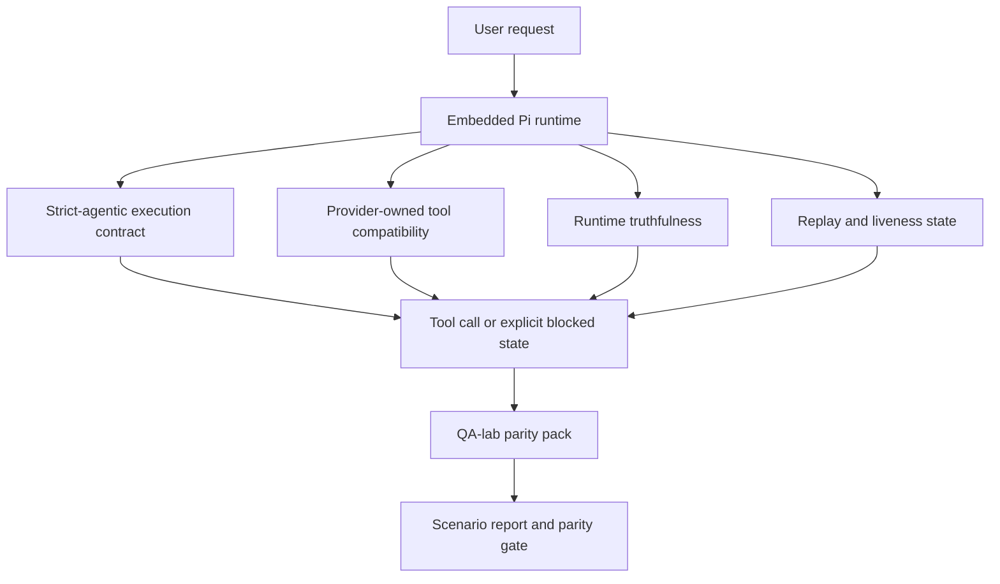
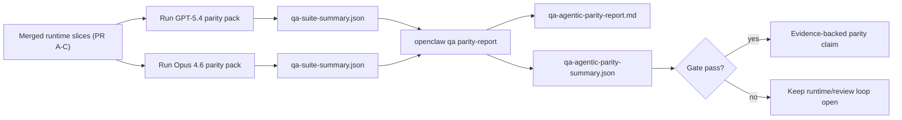

---
read_when:
    - Debug del comportamento agente di GPT-5.4 o Codex
    - Confronto del comportamento agentico di OpenClaw tra modelli frontier
    - Revisione delle correzioni strict-agentic, schema degli strumenti, elevazione e replay
summary: Come OpenClaw colma i gap di esecuzione agentica per GPT-5.4 e i modelli in stile Codex
title: Parità agentica GPT-5.4 / Codex
x-i18n:
    generated_at: "2026-04-24T08:44:07Z"
    model: gpt-5.4
    provider: openai
    source_hash: 9f8c7dcf21583e6dbac80da9ddd75f2dc9af9b80801072ade8fa14b04258d4dc
    source_path: help/gpt54-codex-agentic-parity.md
    workflow: 15
---

# Parità agentica GPT-5.4 / Codex in OpenClaw

OpenClaw funzionava già bene con i modelli frontier che usano strumenti, ma GPT-5.4 e i modelli in stile Codex continuavano a rendere meno bene in alcuni modi pratici:

- potevano fermarsi dopo la pianificazione invece di svolgere il lavoro
- potevano usare in modo errato gli schemi degli strumenti strict OpenAI/Codex
- potevano chiedere `/elevated full` anche quando l'accesso completo era impossibile
- potevano perdere lo stato delle attività di lunga durata durante replay o Compaction
- le affermazioni di parità rispetto a Claude Opus 4.6 si basavano su aneddoti invece che su scenari ripetibili

Questo programma di parità colma questi gap in quattro sezioni verificabili.

## Cosa è cambiato

### PR A: esecuzione strict-agentic

Questa sezione aggiunge un contratto di esecuzione `strict-agentic` opt-in per le esecuzioni GPT-5 Pi incorporate.

Quando è abilitato, OpenClaw smette di accettare i turni di sola pianificazione come completamento “sufficientemente buono”. Se il modello dice solo cosa intende fare e non usa realmente gli strumenti né fa progressi, OpenClaw ritenta con uno steer act-now e poi fallisce in modalità chiusa con uno stato bloccato esplicito invece di terminare silenziosamente l'attività.

Questo migliora soprattutto l'esperienza GPT-5.4 in:

- brevi follow-up “ok fallo”
- attività di codice in cui il primo passo è ovvio
- flussi in cui `update_plan` dovrebbe essere tracciamento del progresso invece che testo riempitivo

### PR B: veridicità del runtime

Questa sezione fa sì che OpenClaw dica la verità su due cose:

- perché la chiamata provider/runtime è fallita
- se `/elevated full` è effettivamente disponibile

Questo significa che GPT-5.4 riceve segnali runtime migliori per scope mancanti, errori di refresh auth, errori auth HTML 403, problemi di proxy, errori DNS o timeout e modalità full-access bloccate. È meno probabile che il modello allucini la remediation sbagliata o continui a chiedere una modalità di permesso che il runtime non può fornire.

### PR C: correttezza dell'esecuzione

Questa sezione migliora due tipi di correttezza:

- compatibilità dello schema degli strumenti OpenAI/Codex gestita dal provider
- visibilità del replay e della vitalità delle attività lunghe

Il lavoro sulla compatibilità degli strumenti riduce l'attrito dello schema per la registrazione strict degli strumenti OpenAI/Codex, soprattutto intorno agli strumenti senza parametri e alle aspettative strict di object-root. Il lavoro su replay/vitalità rende le attività di lunga durata più osservabili, così stati in pausa, bloccati e abbandonati sono visibili invece di scomparire dentro un testo di errore generico.

### PR D: harness di parità

Questa sezione aggiunge il primo parity pack qa-lab, così GPT-5.4 e Opus 4.6 possono essere esercitati sugli stessi scenari e confrontati usando prove condivise.

Il parity pack è il livello di prova. Di per sé non cambia il comportamento del runtime.

Dopo avere due artifact `qa-suite-summary.json`, genera il confronto del release gate con:

```bash
pnpm openclaw qa parity-report \
  --repo-root . \
  --candidate-summary .artifacts/qa-e2e/gpt54/qa-suite-summary.json \
  --baseline-summary .artifacts/qa-e2e/opus46/qa-suite-summary.json \
  --output-dir .artifacts/qa-e2e/parity
```

Quel comando scrive:

- un report Markdown leggibile da esseri umani
- un verdetto JSON leggibile dalla macchina
- un risultato esplicito del gate `pass` / `fail`

## Perché questo migliora GPT-5.4 nella pratica

Prima di questo lavoro, GPT-5.4 su OpenClaw poteva sembrare meno agentico di Opus nelle sessioni di coding reali perché il runtime tollerava comportamenti particolarmente dannosi per i modelli in stile GPT-5:

- turni di solo commento
- attrito di schema intorno agli strumenti
- feedback sui permessi vago
- rotture silenziose di replay o Compaction

L'obiettivo non è fare in modo che GPT-5.4 imiti Opus. L'obiettivo è dare a GPT-5.4 un contratto runtime che premi il progresso reale, fornisca semantiche più pulite per strumenti e permessi e trasformi le modalità di errore in stati espliciti leggibili sia dalla macchina sia dall'essere umano.

Questo cambia l'esperienza utente da:

- “il modello aveva un buon piano ma si è fermato”

a:

- “il modello ha agito, oppure OpenClaw ha mostrato il motivo esatto per cui non poteva farlo”

## Prima vs dopo per gli utenti GPT-5.4

| Prima di questo programma                                                                   | Dopo PR A-D                                                                              |
| ------------------------------------------------------------------------------------------- | ---------------------------------------------------------------------------------------- |
| GPT-5.4 poteva fermarsi dopo un piano ragionevole senza compiere il passo successivo con strumenti | PR A trasforma “solo piano” in “agisci ora o mostra uno stato bloccato”          |
| Gli schemi strict degli strumenti potevano rifiutare strumenti senza parametri o con forma OpenAI/Codex in modi confusi | PR C rende più prevedibili registrazione e invocazione degli strumenti gestite dal provider |
| La guida `/elevated full` poteva essere vaga o errata nei runtime bloccati                  | PR B fornisce a GPT-5.4 e all'utente suggerimenti veritieri su runtime e permessi      |
| I guasti di replay o Compaction potevano dare l'impressione che l'attività fosse sparita silenziosamente | PR C rende espliciti gli esiti in pausa, bloccati, abbandonati e replay-invalid |
| “GPT-5.4 sembra peggiore di Opus” era in gran parte aneddotico                              | PR D lo trasforma nello stesso scenario pack, nelle stesse metriche e in un gate pass/fail rigido |

## Architettura



## Flusso di release



## Scenario pack

Il parity pack della prima ondata attualmente copre cinque scenari:

### `approval-turn-tool-followthrough`

Controlla che il modello non si fermi a “farò questo” dopo una breve approvazione. Dovrebbe compiere la prima azione concreta nello stesso turno.

### `model-switch-tool-continuity`

Controlla che il lavoro con strumenti resti coerente attraverso i confini di cambio modello/runtime invece di reimpostarsi in commento o perdere il contesto di esecuzione.

### `source-docs-discovery-report`

Controlla che il modello possa leggere sorgente e documentazione, sintetizzare i risultati e continuare l'attività in modo agentico invece di produrre un riepilogo superficiale e fermarsi presto.

### `image-understanding-attachment`

Controlla che le attività multimodali che coinvolgono allegati restino azionabili e non collassino in una narrazione vaga.

### `compaction-retry-mutating-tool`

Controlla che un'attività con una vera scrittura mutante mantenga esplicita l'insicurezza del replay invece di sembrare silenziosamente replay-safe se l'esecuzione va in Compaction, ritenta o perde lo stato della risposta sotto pressione.

## Matrice degli scenari

| Scenario                           | Cosa verifica                            | Buon comportamento GPT-5.4                                                     | Segnale di errore                                                               |
| ---------------------------------- | ---------------------------------------- | ------------------------------------------------------------------------------ | ------------------------------------------------------------------------------- |
| `approval-turn-tool-followthrough` | Turni di approvazione brevi dopo un piano | Avvia immediatamente la prima azione concreta con strumenti invece di riformulare l'intento | follow-up di solo piano, nessuna attività di strumenti o turno bloccato senza un blocco reale |
| `model-switch-tool-continuity`     | Cambio runtime/modello durante l'uso di strumenti | Preserva il contesto dell'attività e continua ad agire in modo coerente | si reimposta in commento, perde il contesto degli strumenti o si ferma dopo il cambio |
| `source-docs-discovery-report`     | Lettura del sorgente + sintesi + azione  | Trova le fonti, usa gli strumenti e produce un report utile senza bloccarsi   | riepilogo superficiale, lavoro con strumenti mancante o arresto per turno incompleto |
| `image-understanding-attachment`   | Lavoro agentico guidato da allegati      | Interpreta l'allegato, lo collega agli strumenti e continua l'attività        | narrazione vaga, allegato ignorato o nessuna azione concreta successiva         |
| `compaction-retry-mutating-tool`   | Lavoro mutante sotto pressione di Compaction | Esegue una vera scrittura e mantiene esplicita l'insicurezza del replay dopo l'effetto collaterale | la scrittura mutante avviene ma la sicurezza del replay è implicita, mancante o contraddittoria |

## Release gate

GPT-5.4 può essere considerato alla pari o migliore solo quando il runtime unito supera il parity pack e le regressioni di veridicità del runtime allo stesso tempo.

Risultati richiesti:

- nessuno stallo di solo piano quando la successiva azione con strumenti è chiara
- nessun falso completamento senza esecuzione reale
- nessuna guida `/elevated full` errata
- nessun abbandono silenzioso di replay o Compaction
- metriche del parity pack almeno forti quanto la baseline Opus 4.6 concordata

Per l'harness della prima ondata, il gate confronta:

- completion rate
- unintended-stop rate
- valid-tool-call rate
- fake-success count

Le prove di parità sono intenzionalmente suddivise in due livelli:

- PR D dimostra il comportamento GPT-5.4 vs Opus 4.6 sullo stesso scenario con qa-lab
- le suite deterministiche di PR B dimostrano la veridicità di auth, proxy, DNS e `/elevated full` fuori dall'harness

## Matrice obiettivo-prova

| Voce del gate di completamento                            | PR responsabile | Fonte della prova                                                   | Segnale di superamento                                                                    |
| --------------------------------------------------------- | --------------- | ------------------------------------------------------------------- | ----------------------------------------------------------------------------------------- |
| GPT-5.4 non si blocca più dopo la pianificazione          | PR A            | `approval-turn-tool-followthrough` più suite runtime PR A           | i turni di approvazione attivano lavoro reale o uno stato bloccato esplicito            |
| GPT-5.4 non simula più progresso o completamento fittizio degli strumenti | PR A + PR D | esiti degli scenari del report di parità e fake-success count       | nessun risultato sospetto di pass e nessun completamento di solo commento                |
| GPT-5.4 non fornisce più una guida falsa su `/elevated full` | PR B         | suite deterministiche di veridicità                                 | motivi di blocco e suggerimenti di full-access restano accurati rispetto al runtime      |
| I guasti di replay/vitalità restano espliciti             | PR C + PR D     | suite di ciclo di vita/replay PR C più `compaction-retry-mutating-tool` | il lavoro mutante mantiene esplicita l'insicurezza del replay invece di sparire silenziosamente |
| GPT-5.4 uguaglia o supera Opus 4.6 sulle metriche concordate | PR D         | `qa-agentic-parity-report.md` e `qa-agentic-parity-summary.json`    | stessa copertura degli scenari e nessuna regressione su completamento, comportamento di arresto o uso valido degli strumenti |

## Come leggere il verdetto di parità

Usa il verdetto in `qa-agentic-parity-summary.json` come decisione finale leggibile dalla macchina per il parity pack della prima ondata.

- `pass` significa che GPT-5.4 ha coperto gli stessi scenari di Opus 4.6 e non è regredito sulle metriche aggregate concordate.
- `fail` significa che è scattato almeno un gate rigido: completamento più debole, arresti indesiderati peggiori, uso valido degli strumenti più debole, qualsiasi caso di fake-success o copertura degli scenari non corrispondente.
- “shared/base CI issue” non è di per sé un risultato di parità. Se rumore CI esterno a PR D blocca un'esecuzione, il verdetto dovrebbe attendere un'esecuzione pulita del runtime unito invece di essere dedotto da log dell'epoca del branch.
- La veridicità di auth, proxy, DNS e `/elevated full` continua a provenire dalle suite deterministiche di PR B, quindi l'affermazione finale di release richiede entrambe: un verdetto di parità PR D positivo e una copertura di veridicità PR B verde.

## Chi dovrebbe abilitare `strict-agentic`

Usa `strict-agentic` quando:

- ci si aspetta che l'agente agisca immediatamente quando il passo successivo è ovvio
- i modelli della famiglia GPT-5.4 o Codex sono il runtime principale
- preferisci stati bloccati espliciti invece di risposte di solo riepilogo “utili”

Mantieni il contratto predefinito quando:

- vuoi il comportamento attuale più permissivo
- non stai usando modelli della famiglia GPT-5
- stai testando prompt invece dell'applicazione del runtime

## Correlati

- [GPT-5.4 / Codex parity maintainer notes](/it/help/gpt54-codex-agentic-parity-maintainers)
