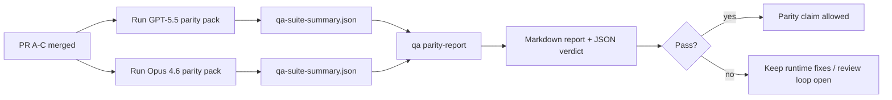

---
read_when:
    - Revisione della serie di PR sulla parità tra GPT-5.5 e Codex
    - Mantenere l'architettura agentica a sei contratti alla base del programma di parità
summary: Come revisionare il programma di parità GPT-5.5 / Codex in quattro unità di merge
title: Note per i manutentori sulla parità GPT-5.5 / Codex
x-i18n:
    generated_at: "2026-05-06T08:53:32Z"
    model: gpt-5.5
    provider: openai
    source_hash: 5752b4610f8b0d70b80d880ea10df75478b5f85ca431cdb73d3b61d745b23356
    source_path: help/gpt55-codex-agentic-parity-maintainers.md
    workflow: 16
---

Questa nota spiega come rivedere il programma di parità GPT-5.5 / Codex come quattro unità di merge senza perdere l'architettura originale a sei contratti.

## Unità di merge

### PR A: esecuzione agentica rigorosa

Possiede:

- `executionContract`
- proseguimento nello stesso turno con priorità a GPT-5
- `update_plan` come tracciamento di avanzamento non terminale
- stati bloccati espliciti invece di arresti silenziosi con solo piano

Non possiede:

- classificazione degli errori di auth/runtime
- veridicità dei permessi
- riprogettazione di replay/continuazione
- benchmarking di parità

### PR B: veridicità del runtime

Possiede:

- correttezza degli scope OAuth di Codex
- classificazione tipizzata degli errori di provider/runtime
- disponibilità veritiera di `/elevated full` e motivi di blocco

Non possiede:

- normalizzazione dello schema degli strumenti
- stato di replay/liveness
- gate di benchmark

### PR C: correttezza dell'esecuzione

Possiede:

- compatibilità degli strumenti OpenAI/Codex di proprietà del provider
- gestione dello schema rigoroso senza parametri
- emersione dei replay non validi
- visibilità dello stato di task lunghi in pausa, bloccati e abbandonati

Non possiede:

- continuazione scelta autonomamente
- comportamento generico del dialetto Codex fuori dagli hook del provider
- gate di benchmark

### PR D: harness di parità

Possiede:

- primo pacchetto di scenari GPT-5.5 vs Opus 4.6
- documentazione di parità
- report di parità e meccaniche del gate di release

Non possiede:

- modifiche al comportamento del runtime fuori da QA-lab
- simulazione auth/proxy/DNS dentro l'harness

## Mappatura sui sei contratti originali

| Contratto originale                       | Unità di merge |
| ---------------------------------------- | -------------- |
| Correttezza transport/auth del provider  | PR B           |
| Compatibilità contratto/schema strumenti | PR C           |
| Esecuzione nello stesso turno            | PR A           |
| Veridicità dei permessi                  | PR B           |
| Correttezza replay/continuazione/liveness | PR C          |
| Benchmark/gate di release                | PR D           |

## Ordine di revisione

1. PR A
2. PR B
3. PR C
4. PR D

PR D è il livello di prova. Non dovrebbe essere il motivo per cui le PR di correttezza del runtime vengono ritardate.

## Cosa cercare

### PR A

- le esecuzioni GPT-5 agiscono o falliscono in modo chiuso invece di fermarsi al commento
- `update_plan` non appare più come avanzamento di per sé
- il comportamento resta con priorità a GPT-5 e limitato al Pi integrato

### PR B

- gli errori di auth/proxy/runtime smettono di collassare in una gestione generica "modello non riuscito"
- `/elevated full` viene descritto come disponibile solo quando è effettivamente disponibile
- i motivi di blocco sono visibili sia al modello sia al runtime rivolto all'utente

### PR C

- la registrazione rigorosa degli strumenti OpenAI/Codex si comporta in modo prevedibile
- gli strumenti senza parametri non falliscono i controlli dello schema rigoroso
- gli esiti di replay e Compaction preservano uno stato di liveness veritiero

### PR D

- il pacchetto di scenari è comprensibile e riproducibile
- il pacchetto include una lane di sicurezza replay mutante, non solo flussi di sola lettura
- i report sono leggibili da esseri umani e automazione
- le affermazioni di parità sono supportate da evidenze, non aneddotiche

Artefatti attesi da PR D:

- `qa-suite-report.md` / `qa-suite-summary.json` per ogni esecuzione del modello
- `qa-agentic-parity-report.md` con confronto aggregato e a livello di scenario
- `qa-agentic-parity-summary.json` con un verdetto leggibile dalla macchina

## Gate di release

Non affermare parità o superiorità di GPT-5.5 rispetto a Opus 4.6 finché:

- PR A, PR B e PR C non sono state unite
- PR D esegue pulitamente il primo pacchetto di parità
- le suite di regressione della veridicità del runtime restano verdi
- il report di parità non mostra casi di falso successo né regressioni nel comportamento di arresto

L'harness di parità non è l'unica fonte di evidenze. Mantieni esplicita questa separazione nella revisione:

- PR D possiede il confronto basato su scenari GPT-5.5 vs Opus 4.6
- le suite deterministiche di PR B possiedono ancora le evidenze di veridicità su auth/proxy/DNS e accesso completo

## Workflow rapido di merge per maintainer

Usalo quando sei pronto a integrare una PR di parità e vuoi una sequenza ripetibile e a basso rischio.

1. Conferma che la soglia di evidenza sia soddisfatta prima del merge:
   - sintomo riproducibile o test fallito
   - causa radice verificata nel codice toccato
   - correzione nel percorso implicato
   - test di regressione o nota esplicita di verifica manuale
2. Fai triage/applica label prima del merge:
   - applica eventuali label di chiusura automatica `r:*` quando la PR non dovrebbe essere integrata
   - mantieni i candidati al merge privi di thread bloccanti non risolti
3. Valida localmente sulla superficie toccata:
   - `pnpm check:changed`
   - `pnpm test:changed` quando i test sono cambiati o la fiducia nel bug fix dipende dalla copertura dei test
4. Integra con il flusso standard dei maintainer (processo `/landpr`), poi verifica:
   - comportamento di chiusura automatica delle issue collegate
   - CI e stato post-merge su `main`
5. Dopo il merge, esegui la ricerca di duplicati per PR/issue aperte correlate e chiudi solo con un riferimento canonico.

Se manca anche solo uno degli elementi della soglia di evidenza, richiedi modifiche invece di fare merge.

## Mappa obiettivo-evidenza

| Elemento del gate di completamento        | Proprietario principale | Artefatto di revisione                                             |
| ---------------------------------------- | ----------------------- | ------------------------------------------------------------------ |
| Nessuno stallo con solo piano            | PR A                    | test runtime agentici rigorosi e `approval-turn-tool-followthrough` |
| Nessun falso avanzamento o falso completamento degli strumenti | PR A + PR D | conteggio dei falsi successi di parità più dettagli del report a livello di scenario |
| Nessuna guida falsa su `/elevated full`  | PR B                    | suite deterministiche di veridicità del runtime                    |
| Gli errori di replay/liveness restano espliciti | PR C + PR D      | suite lifecycle/replay più `compaction-retry-mutating-tool`        |
| GPT-5.5 eguaglia o supera Opus 4.6       | PR D                    | `qa-agentic-parity-report.md` e `qa-agentic-parity-summary.json`   |

## Sintesi per reviewer: prima vs dopo

| Problema visibile all'utente prima                        | Segnale di revisione dopo                                                            |
| --------------------------------------------------------- | ------------------------------------------------------------------------------------ |
| GPT-5.5 si fermava dopo la pianificazione                 | PR A mostra comportamento agisci-o-bloccati invece di completamento solo a commento  |
| L'uso degli strumenti sembrava fragile con schemi rigorosi OpenAI/Codex | PR C mantiene prevedibili registrazione degli strumenti e invocazione senza parametri |
| I suggerimenti su `/elevated full` erano talvolta fuorvianti | PR B lega la guida alla capacità effettiva del runtime e ai motivi di blocco         |
| I task lunghi potevano sparire nell'ambiguità di replay/Compaction | PR C emette stati espliciti in pausa, bloccati, abbandonati e replay-invalid         |
| Le affermazioni di parità erano aneddotiche               | PR D produce un report più un verdetto JSON con la stessa copertura di scenari su entrambi i modelli |

## Correlato

- [Parità agentica GPT-5.5 / Codex](/it/help/gpt55-codex-agentic-parity)
