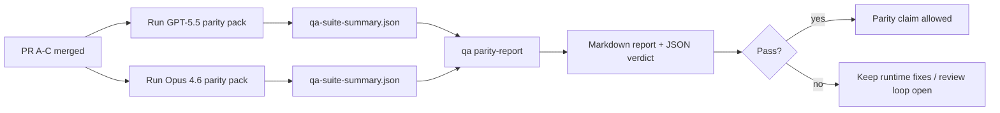

---
read_when:
    - Revisione della serie di PR sulla parità GPT-5.5 / Codex
    - Manutenzione dell'architettura agentica a sei contratti alla base del programma di parità
summary: Come esaminare il programma di parità GPT-5.5 / Codex come quattro unità di merge
title: Note del maintainer sulla parità GPT-5.5 / Codex
x-i18n:
    generated_at: "2026-04-25T18:20:34Z"
    model: gpt-5.4
    provider: openai
    source_hash: 8de69081f5985954b88583880c36388dc47116c3351c15d135b8ab3a660058e3
    source_path: help/gpt55-codex-agentic-parity-maintainers.md
    workflow: 15
---

Questa nota spiega come esaminare il programma di parità GPT-5.5 / Codex come quattro unità di merge senza perdere l'architettura originale a sei contratti.

## Unità di merge

### PR A: esecuzione agentica rigorosa

Di sua competenza:

- `executionContract`
- follow-through nello stesso turno con priorità a GPT-5
- `update_plan` come tracciamento dello stato di avanzamento non terminale
- stati bloccati espliciti invece di arresti silenziosi basati solo sul piano

Non di sua competenza:

- classificazione dei guasti di autenticazione/runtime
- veridicità dei permessi
- riprogettazione di replay/continuazione
- benchmarking di parità

### PR B: veridicità del runtime

Di sua competenza:

- correttezza dell'ambito OAuth di Codex
- classificazione tipizzata dei guasti di provider/runtime
- disponibilità veritiera di `/elevated full` e relative motivazioni di blocco

Non di sua competenza:

- normalizzazione dello schema degli strumenti
- stato di replay/liveness
- gating del benchmark

### PR C: correttezza dell'esecuzione

Di sua competenza:

- compatibilità degli strumenti OpenAI/Codex di proprietà del provider
- gestione rigorosa dello schema senza parametri
- esposizione degli stati replay-invalid
- visibilità degli stati di task lunghi in pausa, bloccati e abbandonati

Non di sua competenza:

- continuazione autoeletta
- comportamento generico del dialetto Codex al di fuori degli hook del provider
- gating del benchmark

### PR D: harness di parità

Di sua competenza:

- primo pacchetto di scenari GPT-5.5 vs Opus 4.6
- documentazione della parità
- meccaniche del report di parità e del gate di rilascio

Non di sua competenza:

- modifiche del comportamento del runtime al di fuori di QA Lab
- simulazione di auth/proxy/DNS all'interno dell'harness

## Mappatura sui sei contratti originali

| Contratto originale                      | Unità di merge |
| ---------------------------------------- | -------------- |
| Correttezza del trasporto/auth del provider      | PR B           |
| Compatibilità di contratto/schema degli strumenti       | PR C           |
| Esecuzione nello stesso turno                      | PR A           |
| Veridicità dei permessi                  | PR B           |
| Correttezza di replay/continuazione/liveness | PR C           |
| Benchmark/gate di rilascio                   | PR D           |

## Ordine di revisione

1. PR A
2. PR B
3. PR C
4. PR D

La PR D è il livello di prova. Non dovrebbe essere il motivo per cui le PR sulla correttezza del runtime vengono ritardate.

## Cosa cercare

### PR A

- le esecuzioni GPT-5 agiscono o falliscono in modo chiuso invece di fermarsi al commento
- `update_plan` non appare più come avanzamento di per sé
- il comportamento resta con priorità a GPT-5 e limitato a Pi incorporato

### PR B

- i guasti di auth/proxy/runtime non collassano più in una gestione generica “model failed”
- `/elevated full` viene descritto come disponibile solo quando lo è davvero
- le ragioni di blocco sono visibili sia al modello sia al runtime rivolto all'utente

### PR C

- la registrazione rigorosa degli strumenti OpenAI/Codex si comporta in modo prevedibile
- gli strumenti senza parametri non falliscono i controlli rigorosi dello schema
- gli esiti di replay e Compaction preservano uno stato di liveness veritiero

### PR D

- il pacchetto di scenari è comprensibile e riproducibile
- il pacchetto include una lane mutante di sicurezza del replay, non solo flussi in sola lettura
- i report sono leggibili sia dagli esseri umani sia dall'automazione
- le affermazioni di parità sono supportate da prove, non aneddotiche

Artifact attesi dalla PR D:

- `qa-suite-report.md` / `qa-suite-summary.json` per ogni esecuzione del modello
- `qa-agentic-parity-report.md` con confronto aggregato e a livello di scenario
- `qa-agentic-parity-summary.json` con un verdetto leggibile dalla macchina

## Gate di rilascio

Non affermare parità o superiorità di GPT-5.5 rispetto a Opus 4.6 finché:

- PR A, PR B e PR C non sono state unite
- la PR D non esegue pulitamente il primo pacchetto di parità
- le suite di regressione sulla veridicità del runtime restano verdi
- il report di parità non mostra casi di falso successo né regressioni nel comportamento di arresto

L'harness di parità non è l'unica fonte di prove. Mantieni esplicita questa separazione nella revisione:

- la PR D è responsabile del confronto basato su scenari tra GPT-5.5 e Opus 4.6
- le suite deterministiche della PR B restano responsabili delle prove su auth/proxy/DNS e sulla veridicità dell'accesso completo

## Flusso rapido di merge per maintainer

Usa questo flusso quando sei pronto a unire una PR di parità e vuoi una sequenza ripetibile e a basso rischio.

1. Conferma che la soglia di evidenza sia soddisfatta prima del merge:
   - sintomo riproducibile o test fallito
   - causa radice verificata nel codice toccato
   - correzione nel percorso coinvolto
   - test di regressione o nota esplicita di verifica manuale
2. Triage/etichettatura prima del merge:
   - applica eventuali etichette `r:*` di auto-chiusura quando la PR non deve essere unita
   - mantieni le candidate al merge senza thread bloccanti irrisolti
3. Convalida localmente sulla superficie toccata:
   - `pnpm check:changed`
   - `pnpm test:changed` quando i test sono cambiati o la fiducia nella correzione del bug dipende dalla copertura dei test
4. Unisci con il flusso standard del maintainer (processo `/landpr`), quindi verifica:
   - comportamento di auto-chiusura degli issue collegati
   - stato della CI e del post-merge su `main`
5. Dopo il merge, esegui una ricerca di duplicati per PR/issue aperti correlati e chiudi solo con un riferimento canonico.

Se manca anche solo uno degli elementi della soglia di evidenza, richiedi modifiche invece di unire.

## Mappa obiettivo-evidenza

| Elemento del gate di completamento                     | Responsabile principale | Artifact di revisione                                                     |
| ----------------------------------------------------- | ---------------------- | ------------------------------------------------------------------------- |
| Nessun blocco basato solo sul piano                      | PR A                   | test di runtime agentico rigoroso e `approval-turn-tool-followthrough` |
| Nessun falso avanzamento o falso completamento degli strumenti | PR A + PR D   | conteggio dei falsi successi di parità più dettagli del report a livello di scenario        |
| Nessuna falsa indicazione `/elevated full`       | PR B                   | suite deterministiche di veridicità del runtime                           |
| I guasti di replay/liveness restano espliciti | PR C + PR D           | suite lifecycle/replay più `compaction-retry-mutating-tool`       |
| GPT-5.5 eguaglia o supera Opus 4.6        | PR D                   | `qa-agentic-parity-report.md` e `qa-agentic-parity-summary.json`  |

## Scorciatoia per i revisori: prima vs dopo

| Problema visibile all'utente prima                                 | Segnale di revisione dopo                                                                     |
| ------------------------------------------------------------------ | --------------------------------------------------------------------------------------------- |
| GPT-5.5 si fermava dopo la pianificazione                              | La PR A mostra un comportamento di azione-o-blocco invece di un completamento solo commentato                  |
| L'uso degli strumenti sembrava fragile con schemi OpenAI/Codex rigorosi      | La PR C mantiene prevedibili la registrazione degli strumenti e l'invocazione senza parametri                  |
| I suggerimenti `/elevated full` a volte erano fuorvianti            | La PR B collega le indicazioni alla reale capability del runtime e alle ragioni di blocco                     |
| I task lunghi potevano sparire nell'ambiguità di replay/Compaction | La PR C emette stati espliciti di pausa, blocco, abbandono e replay-invalid                |
| Le affermazioni di parità erano aneddotiche                                | La PR D produce un report più un verdetto JSON con la stessa copertura di scenari su entrambi i modelli |

## Correlati

- [GPT-5.5 / Codex agentic parity](/it/help/gpt55-codex-agentic-parity)
