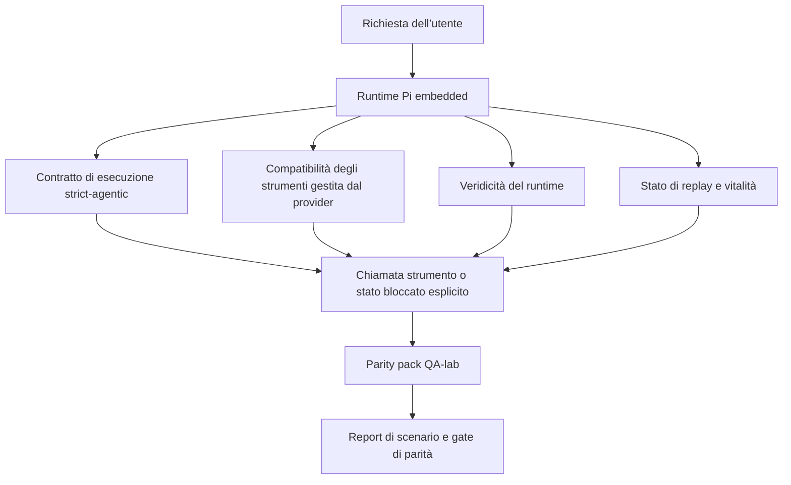
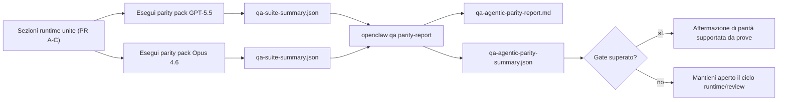

---
read_when:
    - Debug del comportamento agentico di GPT-5.5 o Codex
    - Confronto del comportamento agentico di OpenClaw tra i modelli frontier
    - Revisione delle correzioni strict-agentic, dello schema degli strumenti, dell’elevazione e del replay
summary: Come OpenClaw colma le lacune di esecuzione agentica per GPT-5.5 e i modelli in stile Codex
title: Parità agentica GPT-5.5 / Codex
x-i18n:
    generated_at: "2026-04-25T18:20:36Z"
    model: gpt-5.4
    provider: openai
    source_hash: 8a3b9375cd9e9d95855c4a1135953e00fd7a939e52fb7b75342da3bde2d83fe1
    source_path: help/gpt55-codex-agentic-parity.md
    workflow: 15
---

# Parità agentica GPT-5.5 / Codex in OpenClaw

OpenClaw funzionava già bene con i modelli frontier che usano strumenti, ma GPT-5.5 e i modelli in stile Codex continuavano a rendere meno bene in alcuni casi pratici:

- potevano fermarsi dopo la pianificazione invece di svolgere il lavoro
- potevano usare in modo errato gli schemi degli strumenti strict OpenAI/Codex
- potevano chiedere `/elevated full` anche quando l’accesso completo era impossibile
- potevano perdere lo stato delle attività a lunga esecuzione durante replay o Compaction
- le affermazioni di parità rispetto a Claude Opus 4.6 erano basate su aneddoti invece che su scenari ripetibili

Questo programma di parità colma queste lacune in quattro sezioni verificabili.

## Cosa è cambiato

### PR A: esecuzione strict-agentic

Questa sezione aggiunge un contratto di esecuzione `strict-agentic` con opt-in per le esecuzioni Pi GPT-5 embedded.

Quando è abilitato, OpenClaw smette di accettare turni di sola pianificazione come completamento “sufficientemente buono”. Se il modello si limita a dire cosa intende fare e non usa davvero strumenti né fa progressi, OpenClaw ritenta con un indirizzamento ad agire subito e poi fallisce in modo chiuso con uno stato bloccato esplicito invece di terminare silenziosamente l’attività.

Questo migliora l’esperienza GPT-5.5 soprattutto in questi casi:

- brevi follow-up “ok fallo”
- attività di codice in cui il primo passo è ovvio
- flussi in cui `update_plan` dovrebbe essere tracciamento del progresso invece di testo riempitivo

### PR B: veridicità del runtime

Questa sezione fa sì che OpenClaw dica la verità su due aspetti:

- perché la chiamata provider/runtime è fallita
- se `/elevated full` è davvero disponibile

Questo significa che GPT-5.5 riceve segnali runtime migliori per scope mancanti, errori di refresh auth, errori auth HTML 403, problemi di proxy, errori DNS o timeout e modalità full-access bloccate. Il modello ha meno probabilità di allucinare la remediation sbagliata o di continuare a chiedere una modalità di permesso che il runtime non può fornire.

### PR C: correttezza dell’esecuzione

Questa sezione migliora due tipi di correttezza:

- compatibilità dello schema degli strumenti OpenAI/Codex gestita dal provider
- visibilità di replay e vitalità delle attività lunghe

Il lavoro sulla compatibilità degli strumenti riduce l’attrito dello schema per la registrazione strict degli strumenti OpenAI/Codex, soprattutto per gli strumenti senza parametri e per le aspettative strict sull’oggetto radice. Il lavoro su replay/vitalità rende più osservabili le attività a lunga esecuzione, così gli stati in pausa, bloccati e abbandonati diventano visibili invece di scomparire in un generico testo di errore.

### PR D: harness di parità

Questa sezione aggiunge il primo parity pack QA-lab, così GPT-5.5 e Opus 4.6 possono essere esercitati sugli stessi scenari e confrontati usando prove condivise.

Il parity pack è il livello di prova. Di per sé non modifica il comportamento del runtime.

Dopo avere due artifact `qa-suite-summary.json`, genera il confronto del release gate con:

```bash
pnpm openclaw qa parity-report \
  --repo-root . \
  --candidate-summary .artifacts/qa-e2e/gpt55/qa-suite-summary.json \
  --baseline-summary .artifacts/qa-e2e/opus46/qa-suite-summary.json \
  --output-dir .artifacts/qa-e2e/parity
```

Quel comando scrive:

- un report Markdown leggibile da esseri umani
- un verdict JSON leggibile da macchina
- un risultato esplicito di gate `pass` / `fail`

## Perché questo migliora GPT-5.5 nella pratica

Prima di questo lavoro, GPT-5.5 su OpenClaw poteva sembrare meno agentico di Opus nelle sessioni di coding reali perché il runtime tollerava comportamenti particolarmente dannosi per i modelli in stile GPT-5:

- turni di solo commento
- attrito di schema intorno agli strumenti
- feedback sui permessi vago
- rotture silenziose di replay o Compaction

L’obiettivo non è fare in modo che GPT-5.5 imiti Opus. L’obiettivo è dare a GPT-5.5 un contratto di runtime che premi il progresso reale, fornisca semantiche più pulite per strumenti e permessi e trasformi i modi di guasto in stati espliciti leggibili da macchina e da esseri umani.

Questo cambia l’esperienza utente da:

- “il modello aveva un buon piano ma si è fermato”

a:

- “il modello ha agito, oppure OpenClaw ha mostrato il motivo esatto per cui non poteva farlo”

## Prima vs dopo per gli utenti GPT-5.5

| Prima di questo programma                                                                  | Dopo PR A-D                                                                             |
| ------------------------------------------------------------------------------------------ | --------------------------------------------------------------------------------------- |
| GPT-5.5 poteva fermarsi dopo un piano ragionevole senza eseguire il passo strumento successivo | PR A trasforma “solo piano” in “agisci ora o mostra uno stato bloccato”                |
| Gli schemi strict degli strumenti potevano rifiutare strumenti senza parametri o con forma OpenAI/Codex in modi confusi | PR C rende più prevedibile la registrazione e l’invocazione degli strumenti gestita dal provider |
| La guida per `/elevated full` poteva essere vaga o errata nei runtime bloccati            | PR B fornisce a GPT-5.5 e all’utente indicazioni veritiere su runtime e permessi       |
| I guasti di replay o Compaction potevano far sembrare che l’attività fosse sparita in silenzio | PR C espone in modo esplicito gli esiti in pausa, bloccati, abbandonati e replay-invalid |
| “GPT-5.5 sembra peggiore di Opus” era per lo più aneddotico                               | PR D lo trasforma nello stesso pacchetto di scenari, nelle stesse metriche e in un gate pass/fail rigido |

## Architettura



## Flusso di release



## Pacchetto di scenari

Il parity pack della prima ondata copre attualmente cinque scenari:

### `approval-turn-tool-followthrough`

Verifica che il modello non si fermi a “Lo farò” dopo una breve approvazione. Dovrebbe eseguire la prima azione concreta nello stesso turno.

### `model-switch-tool-continuity`

Verifica che il lavoro con strumenti resti coerente attraverso i confini di cambio modello/runtime invece di tornare a commentare o perdere il contesto di esecuzione.

### `source-docs-discovery-report`

Verifica che il modello possa leggere sorgente e documentazione, sintetizzare i risultati e continuare l’attività in modo agentico invece di produrre un riepilogo superficiale e fermarsi presto.

### `image-understanding-attachment`

Verifica che le attività multimodali con allegati restino azionabili e non collassino in una narrazione vaga.

### `compaction-retry-mutating-tool`

Verifica che un’attività con una vera scrittura mutante mantenga esplicita l’insicurezza del replay invece di sembrare silenziosamente sicura per il replay se l’esecuzione subisce Compaction, retry o perdita dello stato di risposta sotto pressione.

## Matrice degli scenari

| Scenario                           | Cosa verifica                            | Buon comportamento GPT-5.5                                                    | Segnale di guasto                                                              |
| ---------------------------------- | ---------------------------------------- | ----------------------------------------------------------------------------- | ------------------------------------------------------------------------------ |
| `approval-turn-tool-followthrough` | Turni di approvazione brevi dopo un piano | Avvia immediatamente la prima azione concreta con strumento invece di riformulare l’intento | follow-up di solo piano, nessuna attività strumento o turno bloccato senza un vero blocco |
| `model-switch-tool-continuity`     | Cambio runtime/modello durante uso di strumenti | Mantiene il contesto dell’attività e continua ad agire in modo coerente       | torna al commento, perde il contesto degli strumenti o si ferma dopo il cambio |
| `source-docs-discovery-report`     | Lettura dei sorgenti + sintesi + azione  | Trova le fonti, usa strumenti e produce un report utile senza bloccarsi       | riepilogo superficiale, lavoro con strumenti mancante o arresto a turno incompleto |
| `image-understanding-attachment`   | Lavoro agentico guidato da allegati      | Interpreta l’allegato, lo collega agli strumenti e continua l’attività        | narrazione vaga, allegato ignorato o nessuna azione concreta successiva        |
| `compaction-retry-mutating-tool`   | Lavoro mutante sotto pressione di Compaction | Esegue una vera scrittura e mantiene esplicita l’insicurezza del replay dopo l’effetto collaterale | la scrittura mutante avviene ma la sicurezza del replay è implicita, assente o contraddittoria |

## Gate di release

GPT-5.5 può essere considerato in parità o migliore solo quando il runtime unito supera contemporaneamente il parity pack e le regressioni di veridicità del runtime.

Risultati richiesti:

- nessuno stallo di solo piano quando l’azione strumento successiva è chiara
- nessun falso completamento senza esecuzione reale
- nessuna guida errata per `/elevated full`
- nessun abbandono silenzioso di replay o Compaction
- metriche del parity pack almeno pari alla baseline Opus 4.6 concordata

Per l’harness della prima ondata, il gate confronta:

- completion rate
- unintended-stop rate
- valid-tool-call rate
- fake-success count

Le prove di parità sono intenzionalmente divise in due livelli:

- PR D dimostra il comportamento GPT-5.5 vs Opus 4.6 sullo stesso scenario con QA-lab
- le suite deterministiche di PR B dimostrano veridicità di auth, proxy, DNS e `/elevated full` fuori dall’harness

## Matrice obiettivo-prova

| Voce del gate di completamento                          | PR proprietaria | Fonte della prova                                                   | Segnale di superamento                                                                 |
| ------------------------------------------------------- | --------------- | ------------------------------------------------------------------- | --------------------------------------------------------------------------------------- |
| GPT-5.5 non si blocca più dopo la pianificazione        | PR A            | `approval-turn-tool-followthrough` più suite runtime PR A           | i turni di approvazione attivano lavoro reale o uno stato bloccato esplicito          |
| GPT-5.5 non simula più progressi o falsi completamenti di strumenti | PR A + PR D     | esiti degli scenari nel parity report e fake-success count          | nessun risultato sospetto di pass e nessun completamento di solo commento              |
| GPT-5.5 non fornisce più falsa guida `/elevated full`   | PR B            | suite deterministiche di veridicità                                 | i motivi di blocco e gli indizi full-access restano accurati rispetto al runtime       |
| I guasti di replay/vitalità restano espliciti           | PR C + PR D     | suite lifecycle/replay PR C più `compaction-retry-mutating-tool`    | il lavoro mutante mantiene esplicita l’insicurezza del replay invece di sparire in silenzio |
| GPT-5.5 uguaglia o supera Opus 4.6 sulle metriche concordate | PR D            | `qa-agentic-parity-report.md` e `qa-agentic-parity-summary.json`    | stessa copertura degli scenari e nessuna regressione su completamento, stop o uso valido degli strumenti |

## Come leggere il verdict di parità

Usa il verdict in `qa-agentic-parity-summary.json` come decisione finale leggibile da macchina per il parity pack della prima ondata.

- `pass` significa che GPT-5.5 ha coperto gli stessi scenari di Opus 4.6 e non è regredito sulle metriche aggregate concordate.
- `fail` significa che è scattato almeno un hard gate: completamento più debole, unintended stop peggiori, uso valido degli strumenti più debole, qualsiasi caso di fake-success o copertura degli scenari non corrispondente.
- “shared/base CI issue” non è di per sé un risultato di parità. Se rumore CI esterno a PR D blocca un’esecuzione, il verdict deve aspettare un’esecuzione pulita del runtime unito invece di essere dedotto dai log dell’epoca del branch.
- La veridicità di auth, proxy, DNS e `/elevated full` continua a provenire dalle suite deterministiche di PR B, quindi l’affermazione finale di release richiede entrambe le cose: un verdict di parità PR D superato e una copertura di veridicità PR B verde.

## Chi dovrebbe abilitare `strict-agentic`

Usa `strict-agentic` quando:

- ci si aspetta che l’agente agisca immediatamente quando il passo successivo è ovvio
- i modelli della famiglia GPT-5.5 o Codex sono il runtime principale
- preferisci stati bloccati espliciti invece di risposte di solo riepilogo “utili”

Mantieni il contratto predefinito quando:

- vuoi il comportamento esistente più permissivo
- non stai usando modelli della famiglia GPT-5
- stai testando i prompt invece dell’applicazione forzata a runtime

## Correlati

- [Note per i maintainer sulla parità GPT-5.5 / Codex](/it/help/gpt55-codex-agentic-parity-maintainers)
