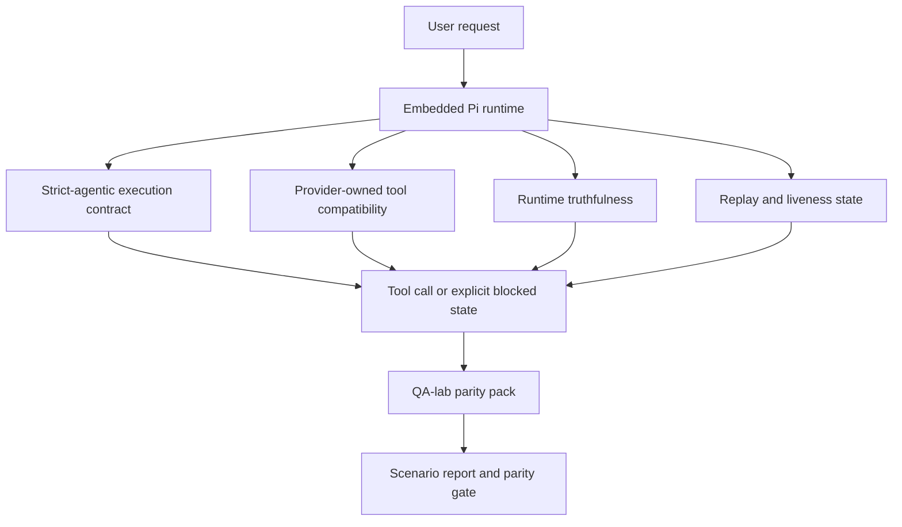
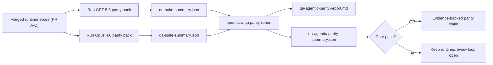

---
read_when:
    - Debug del comportamento degli agenti GPT-5.5 o Codex
    - Confronto del comportamento agentico di OpenClaw tra modelli di frontiera
    - Revisione delle correzioni per strict-agentic, lo schema degli strumenti, l’elevazione e il replay
summary: Come OpenClaw colma le lacune nell’esecuzione agentica per GPT-5.5 e i modelli in stile Codex
title: Parità agentica di GPT-5.5 / Codex
x-i18n:
    generated_at: "2026-05-06T08:53:46Z"
    model: gpt-5.5
    provider: openai
    source_hash: bbc32f418dfffe2786093fa6b42b19f92a2d382c9408dfc55dd0154d67959390
    source_path: help/gpt55-codex-agentic-parity.md
    workflow: 16
---

OpenClaw funzionava già bene con i modelli frontier che usano strumenti, ma GPT-5.5 e i modelli in stile Codex rendevano ancora meno del previsto in alcuni modi pratici:

- potevano fermarsi dopo la pianificazione invece di svolgere il lavoro
- potevano usare in modo errato gli schemi degli strumenti OpenAI/Codex rigorosi
- potevano chiedere `/elevated full` anche quando l'accesso completo era impossibile
- potevano perdere lo stato delle attività di lunga durata durante replay o compaction
- le dichiarazioni di parità rispetto a Claude Opus 4.6 erano basate su aneddoti invece che su scenari ripetibili

Questo programma di parità colma queste lacune in quattro sezioni revisionabili.

## Cosa è cambiato

### PR A: esecuzione strict-agentic

Questa sezione aggiunge un contratto di esecuzione `strict-agentic` opt-in per le esecuzioni GPT-5 incorporate in Pi.

Quando è abilitato, OpenClaw smette di accettare turni di sola pianificazione come completamento "sufficientemente buono". Se il modello dice solo cosa intende fare e non usa effettivamente strumenti né fa progressi, OpenClaw ritenta con una guida ad agire subito e poi fallisce in modo chiuso con uno stato bloccato esplicito invece di terminare silenziosamente l'attività.

Questo migliora l'esperienza con GPT-5.5 soprattutto in:

- brevi follow-up come "ok fallo"
- attività di codice in cui il primo passo è ovvio
- flussi in cui `update_plan` dovrebbe essere tracciamento dei progressi invece che testo riempitivo

### PR B: veridicità del runtime

Questa sezione fa sì che OpenClaw dica la verità su due cose:

- perché la chiamata al provider/runtime è fallita
- se `/elevated full` è effettivamente disponibile

Ciò significa che GPT-5.5 riceve segnali runtime migliori per ambito mancante, errori di aggiornamento dell'autenticazione, errori di autenticazione HTML 403, problemi di proxy, errori DNS o timeout e modalità di accesso completo bloccate. È meno probabile che il modello allucini la correzione sbagliata o continui a chiedere una modalità di permesso che il runtime non può fornire.

### PR C: correttezza dell'esecuzione

Questa sezione migliora due tipi di correttezza:

- compatibilità degli schemi degli strumenti OpenAI/Codex di proprietà del provider
- esposizione di replay e vitalità delle attività lunghe

Il lavoro di compatibilità degli strumenti riduce l'attrito degli schemi per la registrazione rigorosa degli strumenti OpenAI/Codex, in particolare attorno agli strumenti senza parametri e alle aspettative rigorose sull'oggetto radice. Il lavoro su replay/vitalità rende le attività di lunga durata più osservabili, quindi gli stati in pausa, bloccati e abbandonati sono visibili invece di sparire in un testo di errore generico.

### PR D: harness di parità

Questa sezione aggiunge il primo pacchetto di parità QA-lab, così GPT-5.5 e Opus 4.6 possono essere esercitati attraverso gli stessi scenari e confrontati usando prove condivise.

Il pacchetto di parità è il livello di prova. Di per sé non modifica il comportamento del runtime.

Dopo avere due artefatti `qa-suite-summary.json`, genera il confronto del gate di rilascio con:

```bash
pnpm openclaw qa parity-report \
  --repo-root . \
  --candidate-summary .artifacts/qa-e2e/gpt55/qa-suite-summary.json \
  --baseline-summary .artifacts/qa-e2e/opus46/qa-suite-summary.json \
  --output-dir .artifacts/qa-e2e/parity
```

Quel comando scrive:

- un report Markdown leggibile da persone
- un verdetto JSON leggibile da macchina
- un risultato di gate esplicito `pass` / `fail`

## Perché questo migliora GPT-5.5 nella pratica

Prima di questo lavoro, GPT-5.5 su OpenClaw poteva sembrare meno agentico di Opus nelle sessioni di coding reali, perché il runtime tollerava comportamenti particolarmente dannosi per i modelli in stile GPT-5:

- turni di solo commento
- attrito degli schemi attorno agli strumenti
- feedback vago sui permessi
- interruzioni silenziose di replay o compaction

L'obiettivo non è far imitare Opus a GPT-5.5. L'obiettivo è dare a GPT-5.5 un contratto runtime che premi il progresso reale, fornisca una semantica più pulita per strumenti e permessi e trasformi le modalità di errore in stati espliciti leggibili sia da macchina sia da persone.

Questo cambia l'esperienza utente da:

- "il modello aveva un buon piano ma si è fermato"

a:

- "il modello ha agito, oppure OpenClaw ha mostrato il motivo esatto per cui non poteva farlo"

## Prima e dopo per gli utenti GPT-5.5

| Prima di questo programma                                                                    | Dopo PR A-D                                                                               |
| -------------------------------------------------------------------------------------------- | ----------------------------------------------------------------------------------------- |
| GPT-5.5 poteva fermarsi dopo un piano ragionevole senza eseguire il passo successivo con uno strumento | PR A trasforma "solo piano" in "agisci ora o mostra uno stato bloccato"                   |
| Gli schemi rigorosi degli strumenti potevano rifiutare strumenti senza parametri o in formato OpenAI/Codex in modi confusi | PR C rende più prevedibili registrazione e invocazione degli strumenti di proprietà del provider |
| La guida su `/elevated full` poteva essere vaga o errata nei runtime bloccati                 | PR B fornisce a GPT-5.5 e all'utente suggerimenti veritieri su runtime e permessi         |
| Gli errori di replay o compaction potevano dare l'impressione che l'attività fosse sparita silenziosamente | PR C espone esplicitamente esiti in pausa, bloccati, abbandonati e replay non valido      |
| "GPT-5.5 sembra peggiore di Opus" era per lo più aneddotico                                  | PR D lo trasforma nello stesso pacchetto di scenari, nelle stesse metriche e in un gate pass/fail rigido |

## Architettura



## Flusso di rilascio



## Pacchetto di scenari

Il pacchetto di parità della prima fase copre attualmente cinque scenari:

### `approval-turn-tool-followthrough`

Verifica che il modello non si fermi a "Lo farò" dopo una breve approvazione. Dovrebbe compiere la prima azione concreta nello stesso turno.

### `model-switch-tool-continuity`

Verifica che il lavoro che usa strumenti rimanga coerente attraverso i confini di cambio modello/runtime, invece di reimpostarsi in commento o perdere il contesto di esecuzione.

### `source-docs-discovery-report`

Verifica che il modello possa leggere sorgenti e documentazione, sintetizzare i risultati e continuare l'attività in modo agentico invece di produrre un riepilogo superficiale e fermarsi presto.

### `image-understanding-attachment`

Verifica che le attività in modalità mista che coinvolgono allegati rimangano azionabili e non collassino in una narrazione vaga.

### `compaction-retry-mutating-tool`

Verifica che un'attività con una scrittura mutante reale mantenga esplicita la non sicurezza del replay invece di apparire silenziosamente sicura per il replay se l'esecuzione viene compattata, ritentata o perde lo stato della risposta sotto pressione.

## Matrice degli scenari

| Scenario                           | Cosa testa                              | Buon comportamento di GPT-5.5                                                   | Segnale di errore                                                               |
| ---------------------------------- | --------------------------------------- | -------------------------------------------------------------------------------- | -------------------------------------------------------------------------------- |
| `approval-turn-tool-followthrough` | Brevi turni di approvazione dopo un piano | Avvia immediatamente la prima azione concreta con uno strumento invece di ribadire l'intento | follow-up di sola pianificazione, nessuna attività con strumenti o turno bloccato senza un vero blocco |
| `model-switch-tool-continuity`     | Cambio runtime/modello durante l'uso di strumenti | Conserva il contesto dell'attività e continua ad agire in modo coerente          | si reimposta in commento, perde il contesto degli strumenti o si ferma dopo il cambio |
| `source-docs-discovery-report`     | Lettura sorgenti + sintesi + azione      | Trova fonti, usa strumenti e produce un report utile senza bloccarsi             | riepilogo superficiale, lavoro con strumenti mancante o stop a turno incompleto  |
| `image-understanding-attachment`   | Lavoro agentico guidato da allegati      | Interpreta l'allegato, lo collega agli strumenti e continua l'attività           | narrazione vaga, allegato ignorato o nessuna azione successiva concreta          |
| `compaction-retry-mutating-tool`   | Lavoro mutante sotto pressione di compaction | Esegue una scrittura reale e mantiene esplicita la non sicurezza del replay dopo l'effetto collaterale | la scrittura mutante avviene ma la sicurezza del replay è implicita, mancante o contraddittoria |

## Gate di rilascio

GPT-5.5 può essere considerato alla pari o migliore solo quando il runtime unito supera contemporaneamente il pacchetto di parità e le regressioni di veridicità del runtime.

Risultati richiesti:

- nessuno stallo di sola pianificazione quando l'azione successiva con uno strumento è chiara
- nessun completamento fittizio senza esecuzione reale
- nessuna guida errata su `/elevated full`
- nessun abbandono silenzioso di replay o compaction
- metriche del pacchetto di parità almeno forti quanto la baseline concordata di Opus 4.6

Per l'harness della prima fase, il gate confronta:

- tasso di completamento
- tasso di stop non intenzionali
- tasso di chiamate valide agli strumenti
- conteggio dei falsi successi

Le prove di parità sono intenzionalmente divise in due livelli:

- PR D dimostra con QA-lab il comportamento GPT-5.5 vs Opus 4.6 sugli stessi scenari
- le suite deterministiche di PR B dimostrano veridicità per auth, proxy, DNS e `/elevated full` fuori dall'harness

## Matrice obiettivo-prova

| Elemento del gate di completamento                       | PR proprietaria | Fonte delle prove                                                 | Segnale di superamento                                                                 |
| -------------------------------------------------------- | --------------- | ----------------------------------------------------------------- | --------------------------------------------------------------------------------------- |
| GPT-5.5 non si blocca più dopo la pianificazione          | PR A            | `approval-turn-tool-followthrough` più suite runtime di PR A      | i turni di approvazione attivano lavoro reale o uno stato bloccato esplicito            |
| GPT-5.5 non simula più progresso o completamento falso degli strumenti | PR A + PR D     | esiti degli scenari del report di parità e conteggio dei falsi successi | nessun risultato di passaggio sospetto e nessun completamento di solo commento          |
| GPT-5.5 non fornisce più indicazioni false su `/elevated full` | PR B            | suite deterministiche di veridicità                               | le ragioni di blocco e i suggerimenti di accesso completo restano accurati rispetto al runtime |
| Gli errori di replay/vitalità restano espliciti           | PR C + PR D     | suite lifecycle/replay di PR C più `compaction-retry-mutating-tool` | il lavoro mutante mantiene esplicita la non sicurezza del replay invece di sparire silenziosamente |
| GPT-5.5 eguaglia o supera Opus 4.6 sulle metriche concordate | PR D            | `qa-agentic-parity-report.md` e `qa-agentic-parity-summary.json`  | stessa copertura degli scenari e nessuna regressione su completamento, comportamento di stop o uso valido degli strumenti |

## Come leggere il verdetto di parità

Usa il verdetto in `qa-agentic-parity-summary.json` come decisione finale leggibile da macchina per il pacchetto di parità della prima fase.

- `pass` significa che GPT-5.5 ha coperto gli stessi scenari di Opus 4.6 e non ha avuto regressioni sulle metriche aggregate concordate.
- `fail` significa che è scattato almeno un controllo bloccante: completamento più debole, più interruzioni indesiderate, uso valido degli strumenti più debole, qualsiasi caso di falso successo o copertura degli scenari non corrispondente.
- "problema CI condiviso/di base" non è di per sé un risultato di parità. Se rumore CI esterno a PR D blocca un'esecuzione, il verdetto dovrebbe attendere un'esecuzione pulita del runtime integrato invece di essere dedotto dai log dell'epoca del branch.
- Autenticazione, proxy, DNS e veridicità di `/elevated full` provengono ancora dalle suite deterministiche di PR B, quindi la dichiarazione finale di rilascio richiede entrambe le cose: un verdetto di parità superato per PR D e copertura verde della veridicità di PR B.

## Chi dovrebbe abilitare `strict-agentic`

Usa `strict-agentic` quando:

- ci si aspetta che l'agente agisca immediatamente quando il passaggio successivo è ovvio
- GPT-5.5 o i modelli della famiglia Codex sono il runtime principale
- preferisci stati bloccati espliciti rispetto a risposte "utili" di sola ricapitolazione

Mantieni il contratto predefinito quando:

- vuoi il comportamento esistente più permissivo
- non stai usando modelli della famiglia GPT-5
- stai testando prompt invece dell'applicazione a livello di runtime

## Correlati

- [Note per maintainer sulla parità GPT-5.5 / Codex](/it/help/gpt55-codex-agentic-parity-maintainers)
