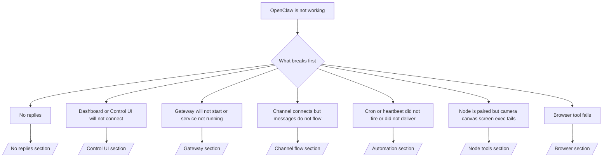

---
read_when:
    - OpenClaw non funziona e ti serve il modo più rapido per risolvere il problema
    - Vuoi un flusso di triage prima di addentrarti nei runbook dettagliati
summary: Centro di risoluzione dei problemi di OpenClaw basato innanzitutto sui sintomi
title: Risoluzione generale dei problemi
x-i18n:
    generated_at: "2026-07-12T07:10:17Z"
    model: gpt-5.6
    postprocess_version: locale-links-v1
    provider: openai
    source_hash: db50e0cdf4d11f3aa6196be445358d904a2b9c40c89243f1b124c77167f6dd85
    source_path: help/troubleshooting.md
    workflow: 16
---

Porta d’ingresso per il triage. 2 minuti per una diagnosi, quindi passa alla pagina di approfondimento.

## Primi 60 secondi

Esegui questa sequenza nell’ordine indicato:

```bash
openclaw status
openclaw status --all
openclaw gateway probe
openclaw gateway status
openclaw doctor
openclaw channels status --probe
openclaw logs --follow
```

Output corretto, una riga per ciascun comando:

- `openclaw status` mostra i canali configurati, senza errori di autenticazione.
- `openclaw status --all` produce un rapporto completo e condivisibile.
- `openclaw gateway probe` mostra `Reachable: yes`. `Capability: ...` è il
  livello di autenticazione verificato dalla sonda; `Read probe: limited - missing scope:
operator.read` indica una diagnostica limitata, non un errore di connessione.
- `openclaw gateway status` mostra `Runtime: running`, `Connectivity probe:
ok` e un valore plausibile per `Capability: ...`. Aggiungi `--require-rpc` per richiedere
  anche la verifica RPC dell’ambito di lettura.
- `openclaw doctor` non segnala errori bloccanti di configurazione o del servizio.
- `openclaw channels status --probe` restituisce lo stato attuale del trasporto per ciascun account
  (`works` / `audit ok`) quando il Gateway è raggiungibile; in caso contrario,
  usa riepiloghi basati soltanto sulla configurazione.
- `openclaw logs --follow` mostra attività regolare, senza errori irreversibili ricorrenti.

## L’assistente sembra limitato o privo di strumenti

Controlla il profilo degli strumenti effettivo:

```bash
openclaw status
openclaw status --all
openclaw doctor
```

Cause comuni:

- `tools.profile: "minimal"` consente soltanto `session_status`.
- `tools.profile: "messaging"` è ristretto ed è destinato agli agenti che gestiscono soltanto chat.
- `tools.profile: "coding"` è il valore predefinito per le nuove configurazioni locali (attività su repository, file,
  shell e runtime).
- `tools.profile: "full"` rimuove le restrizioni del profilo; riservalo agli agenti attendibili
  controllati dall’operatore.
- Il valore `agents.list[].tools` per singolo agente restringe o amplia il profilo radice
  per uno specifico agente.

Modifica il profilo, riavvia o ricarica il Gateway, quindi ricontrolla con
`openclaw status --all`. Tabella completa dei profili e dei gruppi: [Profili degli strumenti](/it/gateway/config-tools#tool-profiles).

## Errore 429 di Anthropic con contesto lungo

`HTTP 429: rate_limit_error: Extra usage is required for long context requests`
→ [Errore 429 di Anthropic: utilizzo aggiuntivo richiesto per il contesto lungo](/it/gateway/troubleshooting#anthropic-429-extra-usage-required-for-long-context).

## Il backend locale compatibile con OpenAI funziona direttamente ma non in OpenClaw

Il backend `/v1` locale o self-hosted risponde alle sonde dirette
`/v1/chat/completions`, ma non funziona con `openclaw infer model run` o durante i normali turni dell’agente:

1. Se l’errore indica che `messages[].content` deve essere una stringa, imposta
   `models.providers.<provider>.models[].compat.requiresStringContent: true`.
2. Se continua a non funzionare soltanto durante i turni dell’agente OpenClaw, imposta
   `models.providers.<provider>.models[].compat.supportsTools: false` e riprova.
3. Se le piccole chiamate dirette funzionano, ma prompt OpenClaw più grandi causano l’arresto anomalo del backend,
   si tratta di un limite del modello o del server a monte, non di un errore di OpenClaw. Prosegui in
   [Il backend locale compatibile con OpenAI supera le sonde dirette, ma le esecuzioni dell’agente non riescono](/it/gateway/troubleshooting#local-openai-compatible-backend-passes-direct-probes-but-agent-runs-fail).

## L’installazione del Plugin non riesce perché mancano le estensioni OpenClaw

`package.json missing openclaw.extensions` significa che il pacchetto del Plugin usa una
struttura non più accettata da OpenClaw.

Correzione nel pacchetto del Plugin:

1. Aggiungi `openclaw.extensions` a `package.json`, facendolo puntare ai file di runtime
   compilati, in genere `./dist/index.js`.
2. Pubblica nuovamente il pacchetto, quindi esegui di nuovo `openclaw plugins install <package>`.

```json
{
  "name": "@openclaw/my-plugin",
  "version": "1.2.3",
  "openclaw": {
    "extensions": ["./dist/index.js"]
  }
}
```

Riferimento: [Architettura dei Plugin](/it/plugins/architecture)

## Il criterio di installazione blocca installazioni o aggiornamenti dei Plugin

L’aggiornamento termina, ma i Plugin non sono aggiornati, sono disabilitati oppure mostrano `blocked by install
policy`, `install policy failed closed` o `Disabled "<plugin>" after plugin
update failure`: controlla `security.installPolicy`.

Il criterio di installazione viene applicato durante l’installazione e l’aggiornamento dei Plugin. Le versioni dei Plugin
`@openclaw/*` normalmente avanzano con la versione di OpenClaw, quindi un aggiornamento di OpenClaw può
richiedere un aggiornamento corrispondente dei Plugin durante la sincronizzazione successiva.

Evita queste forme di criterio, a meno che tu non gestisca anche la regola di aggiornamento corrispondente:

- Bloccare i Plugin di proprietà di OpenClaw a una singola versione precedente esatta, ad esempio soltanto
  `@openclaw/*@2026.5.3`.
- Bloccare esclusivamente in base al tipo di origine, ossia ogni richiesta npm, di rete o `request.mode:
"update"`.
- Considerare facoltativo il comando del criterio: quando `security.installPolicy` è
  abilitato, un eseguibile del criterio mancante, lento, illeggibile o bloccato dai permessi
  causa un errore in modalità chiusa.
- Approvare le versioni senza confrontare il valore `openclawVersion` della richiesta con
  i metadati del Plugin candidato.

Preferisci regole che consentano gli aggiornamenti attendibili di `@openclaw/*` compatibili con
l’host attuale, invece di bloccare per sempre una singola versione. Se blocchi npm per
impostazione predefinita, aggiungi un’eccezione circoscritta per gli ID dei Plugin che utilizzi e applica la stessa
regola di attendibilità a `request.mode: "update"` e alle installazioni.

Ripristino:

```bash
openclaw doctor --deep
openclaw plugins update --all
openclaw status --all
```

Se il criterio è intenzionalmente rigido, rendilo meno restrittivo durante la finestra di aggiornamento
attendibile, esegui nuovamente `openclaw plugins update --all`, quindi ripristina la regola più rigida.
Se un aggiornamento non riuscito ha disabilitato un Plugin, esaminalo prima di riabilitarlo:

```bash
openclaw plugins inspect <plugin-id> --runtime --json
openclaw plugins enable <plugin-id>
```

Riferimento: [Criterio di installazione dell’operatore](/it/tools/skills-config#operator-install-policy-securityinstallpolicy)

## Plugin presente ma bloccato per proprietà sospetta

`openclaw doctor`, la configurazione iniziale o gli avvisi di avvio mostrano:

```text
blocked plugin candidate: suspicious ownership (... uid=1000, expected uid=0 or root)
plugin present but blocked
```

I file del Plugin appartengono a un utente Unix diverso da quello del processo che li carica.
Non rimuovere la configurazione del Plugin; correggi la proprietà dei file oppure esegui
OpenClaw come l’utente proprietario della directory di stato.

Le installazioni Docker vengono eseguite come `node` (uid `1000`). Correggi i bind mount dell’host:

```bash
sudo chown -R 1000:1000 /path/to/openclaw-config /path/to/openclaw-workspace
openclaw doctor --fix
```

Se esegui intenzionalmente OpenClaw come root, correggi invece la directory radice gestita dei Plugin:

```bash
sudo chown -R root:root /path/to/openclaw-config/npm
openclaw doctor --fix
```

Documentazione di approfondimento: [Proprietà del percorso del Plugin bloccata](/it/tools/plugin#blocked-plugin-path-ownership), [Docker: permessi ed EACCES](/it/install/docker#shell-helpers-optional)

## Albero decisionale



<AccordionGroup>
  <Accordion title="No replies">
    ```bash
    openclaw status
    openclaw gateway status
    openclaw channels status --probe
    openclaw pairing list --channel <channel> [--account <id>]
    openclaw logs --follow
    ```

    Output corretto:

    - `Runtime: running`
    - `Connectivity probe: ok`
    - `Capability: read-only`, `write-capable` o `admin-capable`
    - Il canale mostra il trasporto connesso e, dove supportato, `works` o
      `audit ok` in `channels status --probe`
    - Il mittente è approvato oppure il criterio dei messaggi diretti è aperto o basato su un elenco di elementi consentiti

    Firme nei registri:

    - `drop guild message (mention required` → il controllo delle menzioni di Discord ha bloccato il messaggio.
    - `pairing request` → il mittente non è approvato ed è in attesa dell’approvazione dell’associazione tramite messaggio diretto.
    - `blocked` / `allowlist` nei registri del canale → il mittente, la stanza o il gruppo è stato filtrato.

    Pagine di approfondimento: [Nessuna risposta](/it/gateway/troubleshooting#no-replies), [Risoluzione dei problemi dei canali](/it/channels/troubleshooting), [Associazione](/it/channels/pairing)

  </Accordion>

  <Accordion title="Dashboard or Control UI will not connect">
    ```bash
    openclaw status
    openclaw gateway status
    openclaw logs --follow
    openclaw doctor
    openclaw channels status --probe
    ```

    Output corretto:

    - `Dashboard: http://...` mostrato in `openclaw gateway status`
    - `Connectivity probe: ok`
    - `Capability: read-only`, `write-capable` o `admin-capable`
    - Nessun ciclo di autenticazione nei registri

    Firme nei registri:

    - `device identity required` → il contesto HTTP/non sicuro non può completare l’autenticazione del dispositivo.
    - `origin not allowed` → l’`Origin` del browser non è consentita per la destinazione del Gateway della Control UI.
    - `AUTH_TOKEN_MISMATCH` con `canRetryWithDeviceToken=true` → può essere eseguito automaticamente un singolo nuovo tentativo con un token del dispositivo attendibile, riutilizzando gli ambiti memorizzati nella cache del token associato.
    - `unauthorized` ripetuto dopo tale tentativo → token o password errati, modalità di autenticazione non corrispondente oppure token obsoleto del dispositivo associato.
    - `too many failed authentication attempts (retry later)` → i tentativi ripetuti non riusciti provenienti da quell’`Origin` del browser vengono temporaneamente bloccati; le altre origini localhost usano contenitori separati. Consulta [Connettività della Dashboard/Control UI](/it/gateway/troubleshooting#dashboard-control-ui-connectivity) per i dettagli sui tentativi simultanei con Tailscale Serve.
    - `gateway connect failed:` → l’interfaccia utente punta all’URL o alla porta errati oppure il Gateway non è raggiungibile.

    Pagine di approfondimento: [Connettività della Dashboard/Control UI](/it/gateway/troubleshooting#dashboard-control-ui-connectivity), [Control UI](/it/web/control-ui), [Autenticazione](/it/gateway/authentication)

  </Accordion>

  <Accordion title="Gateway will not start or service installed but not running">
    ```bash
    openclaw status
    openclaw gateway status
    openclaw logs --follow
    openclaw doctor
    openclaw channels status --probe
    ```

    Output corretto:

    - `Service: ... (loaded)`
    - `Runtime: running`
    - `Connectivity probe: ok`
    - `Capability: read-only`, `write-capable` o `admin-capable`

    Firme nei registri:

    - `Gateway start blocked: set gateway.mode=local` o `existing config is missing gateway.mode` → la modalità del Gateway è remota oppure nella configurazione manca l’indicazione della modalità locale ed è necessaria una correzione.
    - `refusing to bind gateway ... without auth` → associazione a un indirizzo diverso da local loopback senza un percorso di autenticazione valido, tramite token/password o proxy attendibile se configurato.
    - `another gateway instance is already listening` o `EADDRINUSE` → la porta è già occupata.

    Pagine di approfondimento: [Servizio Gateway non in esecuzione](/it/gateway/troubleshooting#gateway-service-not-running), [Processo in background](/it/gateway/background-process), [Configurazione](/it/gateway/configuration)

  </Accordion>

  <Accordion title="Channel connects but messages do not flow">
    ```bash
    openclaw status
    openclaw gateway status
    openclaw logs --follow
    openclaw doctor
    openclaw channels status --probe
    ```

    Output corretto:

    - Trasporto del canale connesso.
    - Controlli di associazione e dell’elenco di elementi consentiti superati.
    - Menzioni rilevate dove richieste.

    Firme nei registri:

    - `mention required` → il controllo delle menzioni di gruppo ha bloccato l’elaborazione.
    - `pairing` / `pending` → il mittente del messaggio diretto non è ancora approvato.
    - `not_in_channel`, `missing_scope`, `Forbidden`, `401/403` → problema con il token dei permessi del canale.

    Pagine di approfondimento: [Canale connesso, ma i messaggi non vengono trasmessi](/it/gateway/troubleshooting#channel-connected-messages-not-flowing), [Risoluzione dei problemi dei canali](/it/channels/troubleshooting)

  </Accordion>

  <Accordion title="Cron or heartbeat did not fire or did not deliver">
    ```bash
    openclaw status
    openclaw gateway status
    openclaw cron status
    openclaw cron list
    openclaw cron runs --id <jobId> --limit 20
    openclaw logs --follow
    ```

    Output corretto:

    - `cron status` mostra il pianificatore abilitato e la prossima riattivazione.
    - `cron runs` mostra voci `ok` recenti.
    - Heartbeat è abilitato e rientra nell’orario di attività.

    Firme nei registri:

    - `cron: scheduler disabled; jobs will not run automatically` → Cron è disabilitato.
    - `heartbeat skipped` motivo `quiet-hours` → al di fuori degli orari di attività configurati.
    - `heartbeat skipped` motivo `empty-heartbeat-file` → `HEARTBEAT.md` esiste, ma contiene solo righe vuote, commenti, intestazioni, delimitatori di blocchi di codice o una struttura vuota di elenco di controllo.
    - `heartbeat skipped` motivo `no-tasks-due` → la modalità attività è attiva, ma non è ancora scaduto alcun intervallo delle attività.
    - `heartbeat skipped` motivo `alerts-disabled` → `showOk`, `showAlerts` e `useIndicator` sono tutti disattivati.
    - `requests-in-flight` → corsia principale occupata; riattivazione di Heartbeat rinviata.
    - `unknown accountId` → l'account di destinazione per la consegna di Heartbeat non esiste.

    Pagine di approfondimento: [Consegna di Cron e Heartbeat](/it/gateway/troubleshooting#cron-and-heartbeat-delivery), [Attività pianificate: risoluzione dei problemi](/it/automation/cron-jobs#troubleshooting), [Heartbeat](/it/gateway/heartbeat)

  </Accordion>

  <Accordion title="Node is paired but tool fails camera canvas screen exec">
    ```bash
    openclaw status
    openclaw gateway status
    openclaw nodes status
    openclaw nodes describe --node <idOrNameOrIp>
    openclaw logs --follow
    ```

    Output corretto:

    - Node indicato come connesso e associato per il ruolo `node`.
    - La funzionalità necessaria per il comando invocato è disponibile.
    - L'autorizzazione per lo strumento è concessa.

    Indicazioni nei log:

    - `NODE_BACKGROUND_UNAVAILABLE` → porta l'app del Node in primo piano.
    - `*_PERMISSION_REQUIRED` → autorizzazione del sistema operativo negata o mancante.
    - `SYSTEM_RUN_DENIED: approval required` → l'approvazione dell'esecuzione è in sospeso.
    - `SYSTEM_RUN_DENIED: allowlist miss` → il comando non è incluso nell'elenco consentito per l'esecuzione.

    Pagine di approfondimento: [Node associato, strumento non funzionante](/it/gateway/troubleshooting#node-paired-tool-fails), [Risoluzione dei problemi del Node](/it/nodes/troubleshooting), [Approvazioni dell'esecuzione](/it/tools/exec-approvals)

  </Accordion>

  <Accordion title="Exec suddenly asks for approval">
    ```bash
    openclaw config get tools.exec.host
    openclaw config get tools.exec.security
    openclaw config get tools.exec.ask
    openclaw gateway restart
    ```

    Modifiche intervenute:

    - Se `tools.exec.host` non è impostato, il valore predefinito è `auto`, che viene risolto in `sandbox`
      quando è attivo un runtime sandbox e in `gateway` negli altri casi.
    - `host=auto` determina solo l'instradamento; il comportamento senza richiesta di conferma deriva da
      `security=full` insieme a `ask=off` sul Gateway/Node.
    - Se `tools.exec.security` non è impostato, il valore predefinito è `full` su `gateway`/`node`.
    - Se `tools.exec.ask` non è impostato, il valore predefinito è `off`.
    - Se vengono richieste approvazioni, una policy locale dell'host o specifica della sessione
      ha reso l'esecuzione più restrittiva rispetto a questi valori predefiniti.

    Ripristina i valori predefiniti correnti senza approvazione:

    ```bash
    openclaw config set tools.exec.host gateway
    openclaw config set tools.exec.security full
    openclaw config set tools.exec.ask off
    openclaw gateway restart
    ```

    Alternative più sicure:

    - Imposta solo `tools.exec.host=gateway` per un instradamento stabile verso l'host.
    - Usa `security=allowlist` con `ask=on-miss` per l'esecuzione sull'host con revisione
      quando il comando non è incluso nell'elenco consentito.
    - Abilita la modalità sandbox affinché `host=auto` venga nuovamente risolto in `sandbox`.

    Indicazioni nei log:

    - `Approval required.` → il comando è in attesa di `/approve ...`.
    - `SYSTEM_RUN_DENIED: approval required` → l'approvazione dell'esecuzione sull'host Node è in sospeso.
    - `exec host=sandbox requires a sandbox runtime for this session` → selezione implicita o esplicita della sandbox, ma la modalità sandbox è disattivata.

    Pagine di approfondimento: [Esecuzione](/it/tools/exec), [Approvazioni dell'esecuzione](/it/tools/exec-approvals), [Sicurezza: controlli eseguiti dall'audit](/it/gateway/security#what-the-audit-checks-high-level)

  </Accordion>

  <Accordion title="Browser tool fails">
    ```bash
    openclaw status
    openclaw gateway status
    openclaw browser status
    openclaw logs --follow
    openclaw doctor
    ```

    Output corretto:

    - Lo stato del browser mostra `running: true` e un browser/profilo selezionato.
    - Il profilo `openclaw` si avvia oppure il profilo `user` rileva le schede locali di Chrome.

    Indicazioni nei log:

    - `unknown command "browser"` → `plugins.allow` è impostato ed esclude `browser`.
    - `Failed to start Chrome CDP on port` → avvio del browser locale non riuscito.
    - `browser.executablePath not found` → il percorso configurato del file binario è errato.
    - `browser.cdpUrl must be http(s) or ws(s)` → l'URL CDP configurato usa uno schema non supportato.
    - `browser.cdpUrl has invalid port` → l'URL CDP configurato contiene una porta non valida o fuori intervallo.
    - `No Chrome tabs found for profile="user"` → il profilo di collegamento MCP di Chrome non ha schede locali di Chrome aperte.
    - `Remote CDP for profile "<name>" is not reachable` → l'endpoint CDP remoto configurato non è raggiungibile da questo host.
    - `Browser attachOnly is enabled ... not reachable` → il profilo di solo collegamento non dispone di una destinazione CDP attiva.
    - Sostituzioni obsolete di viewport/modalità scura/locale/modalità offline nei profili di solo collegamento o CDP remoto → esegui `openclaw browser stop --browser-profile <name>` per chiudere la sessione di controllo e rilasciare lo stato di emulazione senza riavviare il Gateway.

    Pagine di approfondimento: [Lo strumento browser non funziona](/it/gateway/troubleshooting#browser-tool-fails), [Comando o strumento browser mancante](/it/tools/browser#missing-browser-command-or-tool), [Browser: risoluzione dei problemi su Linux](/it/tools/browser-linux-troubleshooting), [Browser: risoluzione dei problemi del CDP remoto su WSL2/Windows](/it/tools/browser-wsl2-windows-remote-cdp-troubleshooting)

  </Accordion>

</AccordionGroup>

## Argomenti correlati

- [Domande frequenti](/it/help/faq) — domande frequenti
- [Risoluzione dei problemi del Gateway](/it/gateway/troubleshooting) — problemi specifici del Gateway
- [Doctor](/it/gateway/doctor) — controlli e riparazioni automatici dello stato del sistema
- [Risoluzione dei problemi dei canali](/it/channels/troubleshooting) — problemi di connettività dei canali
- [Attività pianificate: risoluzione dei problemi](/it/automation/cron-jobs#troubleshooting) — problemi relativi a Cron e Heartbeat
