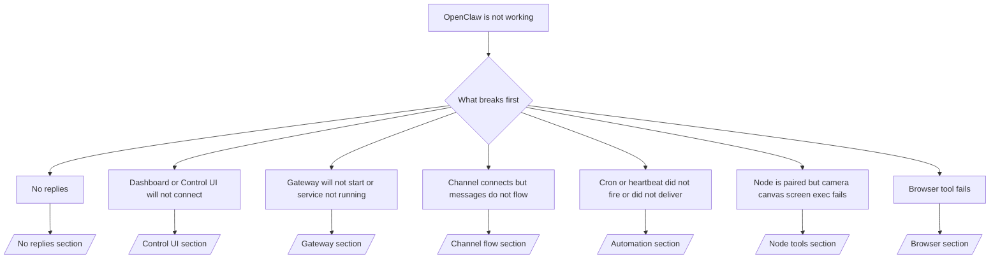

---
read_when:
    - OpenClaw non funziona e ti serve il percorso più rapido per risolvere.
    - Vuoi un flusso di triage prima di immergerti in runbook approfonditi
summary: Hub di risoluzione dei problemi basato prima sui sintomi per OpenClaw
title: Risoluzione dei problemi generali
x-i18n:
    generated_at: "2026-06-27T17:38:36Z"
    model: gpt-5.5
    postprocess_version: locale-links-v1
    provider: openai
    source_hash: ae1236c73e3a5c9237bd81d603e8dca18c595a8bcbb71f5931bfbf2389b342cd
    source_path: help/troubleshooting.md
    workflow: 16
---

Se hai solo 2 minuti, usa questa pagina come punto di ingresso per il triage.

## Primi 60 secondi

Esegui questa sequenza esatta nell'ordine:

```bash
openclaw status
openclaw status --all
openclaw gateway probe
openclaw gateway status
openclaw doctor
openclaw channels status --probe
openclaw logs --follow
```

Output corretto in una riga:

- `openclaw status` → mostra i canali configurati e nessun errore di autenticazione evidente.
- `openclaw status --all` → il report completo è presente e condivisibile.
- `openclaw gateway probe` → il target Gateway previsto è raggiungibile (`Reachable: yes`). `Capability: ...` indica quale livello di autenticazione il probe ha potuto dimostrare, e `Read probe: limited - missing scope: operator.read` indica diagnostica degradata, non un errore di connessione.
- `openclaw gateway status` → `Runtime: running`, `Connectivity probe: ok` e una riga `Capability: ...` plausibile. Usa `--require-rpc` se ti serve anche la prova RPC con ambito di lettura.
- `openclaw doctor` → nessun errore bloccante di configurazione/servizio.
- `openclaw channels status --probe` → un Gateway raggiungibile restituisce lo stato di trasporto live per account
  più risultati di probe/audit come `works` o `audit ok`; se il
  Gateway non è raggiungibile, il comando ripiega su riepiloghi solo di configurazione.
- `openclaw logs --follow` → attività stabile, nessun errore fatale ripetuto.

## L'assistente sembra limitato o senza strumenti

Se l'assistente non può ispezionare file, eseguire comandi, usare l'automazione del browser o
vedere gli strumenti previsti, controlla prima il profilo strumenti effettivo:

```bash
openclaw status
openclaw status --all
openclaw doctor
```

Cause comuni:

- `tools.profile: "messaging"` è intenzionalmente ristretto per agenti solo chat.
- `tools.profile: "coding"` è il profilo abituale per repository, file, shell
  e workflow runtime.
- `tools.profile: "full"` espone il set di strumenti più ampio e dovrebbe essere limitato
  ad agenti affidabili controllati dall'operatore.
- Gli override per agente `agents.list[].tools` possono restringere o ampliare il profilo
  root per un agente.

Modifica il profilo strumenti root o per agente, poi riavvia o ricarica il Gateway
ed esegui di nuovo `openclaw status --all`. Vedi [Strumenti](/it/tools) per il modello
di profilo e gli override allow/deny.

## Contesto lungo Anthropic 429

Se vedi:
`HTTP 429: rate_limit_error: Extra usage is required for long context requests`,
vai a [/gateway/troubleshooting#anthropic-429-extra-usage-required-for-long-context](/it/gateway/troubleshooting#anthropic-429-extra-usage-required-for-long-context).

## Backend locale compatibile con OpenAI funziona direttamente ma fallisce in OpenClaw

Se il tuo backend locale o self-hosted `/v1` risponde a piccoli probe diretti
`/v1/chat/completions` ma fallisce con `openclaw infer model run` o nei normali
turni dell'agente:

1. Se l'errore cita `messages[].content` e si aspetta una stringa, imposta
   `models.providers.<provider>.models[].compat.requiresStringContent: true`.
2. Se il backend continua a fallire solo nei turni agente OpenClaw, imposta
   `models.providers.<provider>.models[].compat.supportsTools: false` e riprova.
3. Se le chiamate dirette minime continuano a funzionare ma prompt OpenClaw più grandi mandano in crash il
   backend, tratta il problema rimanente come una limitazione del modello/server upstream e
   continua nel runbook approfondito:
   [/gateway/troubleshooting#local-openai-compatible-backend-passes-direct-probes-but-agent-runs-fail](/it/gateway/troubleshooting#local-openai-compatible-backend-passes-direct-probes-but-agent-runs-fail)

## Installazione del Plugin fallisce con estensioni openclaw mancanti

Se l'installazione fallisce con `package.json missing openclaw.extensions`, il pacchetto plugin
usa una struttura vecchia che OpenClaw non accetta più.

Correzione nel pacchetto plugin:

1. Aggiungi `openclaw.extensions` a `package.json`.
2. Punta le voci ai file runtime compilati (di solito `./dist/index.js`).
3. Ripubblica il plugin ed esegui di nuovo `openclaw plugins install <package>`.

Esempio:

```json
{
  "name": "@openclaw/my-plugin",
  "version": "1.2.3",
  "openclaw": {
    "extensions": ["./dist/index.js"]
  }
}
```

Riferimento: [Architettura dei Plugin](/it/plugins/architecture)

## La policy di installazione blocca installazioni o aggiornamenti dei plugin

Se un aggiornamento termina ma i plugin sono obsoleti, disabilitati o mostrano messaggi come
`blocked by install policy`, `install policy failed closed` o
`Disabled "<plugin>" after plugin update failure`, controlla
`security.installPolicy`.

La policy di installazione viene eseguita durante installazioni e aggiornamenti dei plugin. Le versioni dei plugin
di proprietà di OpenClaw normalmente avanzano con la release di OpenClaw, quindi un aggiornamento di OpenClaw può
richiedere anche aggiornamenti corrispondenti dei plugin `@openclaw/*` durante la sincronizzazione post-aggiornamento.

Evita queste forme di policy ampie, a meno che tu non mantenga anche la regola di aggiornamento
corrispondente:

- Bloccare i plugin di proprietà di OpenClaw su una singola vecchia versione esatta, ad esempio consentendo
  solo `@openclaw/*@2026.5.3`.
- Bloccare solo in base al tipo di origine, ad esempio ogni richiesta di plugin npm, network o
  `request.mode: "update"`.
- Trattare il comando di policy come opzionale. Quando `security.installPolicy` è
  abilitato, un eseguibile di policy mancante, lento, non leggibile o bloccato dai permessi
  fallisce in modalità chiusa.
- Approvare versioni di plugin senza considerare `openclawVersion` della richiesta di policy
  e i metadati del candidato plugin.

Regole di policy più sicure consentono aggiornamenti affidabili dei plugin di proprietà di OpenClaw quando il
candidato è compatibile con l'host OpenClaw corrente, invece di fissare una
singola release per sempre. Se blocchi npm per impostazione predefinita, crea un'eccezione ristretta
per i pacchetti plugin `@openclaw/*` affidabili o per gli id plugin che usi. Se
distingui richieste di installazione e aggiornamento, applica la stessa regola di fiducia a
`request.mode: "update"`.

Ripristino:

```bash
openclaw doctor --deep
openclaw plugins update --all
openclaw status --all
```

Se la policy è intenzionalmente rigida, allentala per la finestra di aggiornamento OpenClaw
affidabile, riesegui `openclaw plugins update --all`, poi ripristina la regola più restrittiva.
Se un plugin è stato disabilitato dopo un errore di aggiornamento, ispezionalo e riabilitalo solo
dopo che l'aggiornamento riesce:

```bash
openclaw plugins inspect <plugin-id> --runtime --json
openclaw plugins enable <plugin-id>
```

Riferimento: [Policy di installazione dell'operatore](/it/tools/skills-config#operator-install-policy-securityinstallpolicy)

## Plugin presente ma bloccato da proprietà sospetta

Se `openclaw doctor`, setup o avvisi di avvio mostrano:

```text
blocked plugin candidate: suspicious ownership (... uid=1000, expected uid=0 or root)
plugin present but blocked
```

i file del plugin sono posseduti da un utente Unix diverso dal processo che li carica.
Non rimuovere la configurazione del plugin. Correggi la proprietà dei file o esegui OpenClaw come
lo stesso utente che possiede la directory di stato.

Le installazioni Docker normalmente vengono eseguite come `node` (uid `1000`). Per il setup Docker
predefinito, ripara i bind mount dell'host:

```bash
sudo chown -R 1000:1000 /path/to/openclaw-config /path/to/openclaw-workspace
openclaw doctor --fix
```

Se esegui intenzionalmente OpenClaw come root, ripara invece la root plugin gestita con
proprietà root:

```bash
sudo chown -R root:root /path/to/openclaw-config/npm
openclaw doctor --fix
```

Documentazione approfondita:

- [Proprietà del percorso plugin](/it/tools/plugin#blocked-plugin-path-ownership)
- [Permessi Docker](/it/install/docker#permissions-and-eacces)

## Albero decisionale



<AccordionGroup>
  <Accordion title="No replies">
    ```bash
    openclaw status
    openclaw gateway status
    openclaw channels status --probe
    openclaw pairing list --channel <channel> [--account <id>]
    openclaw logs --follow
    ```

    L'output corretto appare così:

    - `Runtime: running`
    - `Connectivity probe: ok`
    - `Capability: read-only`, `write-capable` o `admin-capable`
    - Il tuo canale mostra il trasporto connesso e, dove supportato, `works` o `audit ok` in `channels status --probe`
    - Il mittente risulta approvato (oppure la policy DM è aperta/allowlist)

    Firme di log comuni:

    - `drop guild message (mention required` → il gating delle menzioni ha bloccato il messaggio in Discord.
    - `pairing request` → il mittente non è approvato ed è in attesa di approvazione dell'abbinamento via DM.
    - `blocked` / `allowlist` nei log del canale → mittente, stanza o gruppo è filtrato.

    Pagine approfondite:

    - [/gateway/troubleshooting#no-replies](/it/gateway/troubleshooting#no-replies)
    - [/channels/troubleshooting](/it/channels/troubleshooting)
    - [/channels/pairing](/it/channels/pairing)

  </Accordion>

  <Accordion title="Dashboard or Control UI will not connect">
    ```bash
    openclaw status
    openclaw gateway status
    openclaw logs --follow
    openclaw doctor
    openclaw channels status --probe
    ```

    L'output corretto appare così:

    - `Dashboard: http://...` è mostrato in `openclaw gateway status`
    - `Connectivity probe: ok`
    - `Capability: read-only`, `write-capable` o `admin-capable`
    - Nessun loop di autenticazione nei log

    Firme di log comuni:

    - `device identity required` → il contesto HTTP/non sicuro non può completare l'autenticazione del dispositivo.
    - `origin not allowed` → il browser `Origin` non è consentito per il target Gateway della Control UI.
    - `AUTH_TOKEN_MISMATCH` con suggerimenti di retry (`canRetryWithDeviceToken=true`) → può avvenire automaticamente un retry singolo con device-token affidabile.
    - Quel retry con token in cache riusa il set di ambiti in cache salvato con il token del dispositivo abbinato.
      I chiamanti con `deviceToken` esplicito / `scopes` espliciti mantengono invece
      il set di ambiti richiesto.
    - Nel percorso asincrono della Control UI Tailscale Serve, i tentativi falliti per lo stesso
      `{scope, ip}` sono serializzati prima che il limiter registri l'errore, quindi un
      secondo retry errato concorrente può già mostrare `retry later`.
    - `too many failed authentication attempts (retry later)` da un'origine browser localhost → errori ripetuti dalla stessa `Origin` sono temporaneamente
      bloccati; un'altra origine localhost usa un bucket separato.
    - `unauthorized` ripetuto dopo quel retry → token/password errato, mismatch della modalità auth o token del dispositivo abbinato obsoleto.
    - `gateway connect failed:` → la UI sta puntando a URL/porta errati o a un Gateway irraggiungibile.

    Pagine approfondite:

    - [/gateway/troubleshooting#dashboard-control-ui-connectivity](/it/gateway/troubleshooting#dashboard-control-ui-connectivity)
    - [/web/control-ui](/it/web/control-ui)
    - [/gateway/authentication](/it/gateway/authentication)

  </Accordion>

  <Accordion title="Gateway will not start or service installed but not running">
    ```bash
    openclaw status
    openclaw gateway status
    openclaw logs --follow
    openclaw doctor
    openclaw channels status --probe
    ```

    L'output corretto appare così:

    - `Service: ... (loaded)`
    - `Runtime: running`
    - `Connectivity probe: ok`
    - `Capability: read-only`, `write-capable` o `admin-capable`

    Firme di log comuni:

    - `Gateway start blocked: set gateway.mode=local` o `existing config is missing gateway.mode` → la modalità Gateway è remota, oppure al file di configurazione manca il timbro local-mode e deve essere riparato.
    - `refusing to bind gateway ... without auth` → bind non local loopback senza un percorso di autenticazione Gateway valido (token/password, o trusted-proxy dove configurato).
    - `another gateway instance is already listening` o `EADDRINUSE` → porta già occupata.

    Pagine approfondite:

    - [/gateway/troubleshooting#gateway-service-not-running](/it/gateway/troubleshooting#gateway-service-not-running)
    - [/gateway/background-process](/it/gateway/background-process)
    - [/gateway/configuration](/it/gateway/configuration)

  </Accordion>

  <Accordion title="Il canale si connette ma i messaggi non circolano">
    ```bash
    openclaw status
    openclaw gateway status
    openclaw logs --follow
    openclaw doctor
    openclaw channels status --probe
    ```

    Un output corretto appare così:

    - Il trasporto del canale è connesso.
    - I controlli di abbinamento/allowlist passano.
    - Le menzioni vengono rilevate dove richieste.

    Firme di log comuni:

    - `mention required` → il gating delle menzioni di gruppo ha bloccato l'elaborazione.
    - `pairing` / `pending` → il mittente del DM non è ancora approvato.
    - `not_in_channel`, `missing_scope`, `Forbidden`, `401/403` → problema con il token di autorizzazione del canale.

    Pagine di approfondimento:

    - [/gateway/troubleshooting#channel-connected-messages-not-flowing](/it/gateway/troubleshooting#channel-connected-messages-not-flowing)
    - [/channels/troubleshooting](/it/channels/troubleshooting)

  </Accordion>

  <Accordion title="Cron o Heartbeat non si è attivato o non ha consegnato">
    ```bash
    openclaw status
    openclaw gateway status
    openclaw cron status
    openclaw cron list
    openclaw cron runs --id <jobId> --limit 20
    openclaw logs --follow
    ```

    Un output corretto appare così:

    - `cron.status` mostra che è abilitato con un prossimo risveglio.
    - `cron runs` mostra voci `ok` recenti.
    - Heartbeat è abilitato e non è fuori dall'orario attivo.

    Firme di log comuni:

    - `cron: scheduler disabled; jobs will not run automatically` → Cron è disabilitato.
    - `heartbeat skipped` con `reason=quiet-hours` → fuori dall'orario attivo configurato.
    - `heartbeat skipped` con `reason=empty-heartbeat-file` → `HEARTBEAT.md` esiste ma contiene solo scaffolding vuoto, commenti, intestazioni, fence o checklist vuota.
    - `heartbeat skipped` con `reason=no-tasks-due` → la modalità attività di `HEARTBEAT.md` è attiva, ma nessuno degli intervalli delle attività è ancora scaduto.
    - `heartbeat skipped` con `reason=alerts-disabled` → tutta la visibilità di Heartbeat è disabilitata (`showOk`, `showAlerts` e `useIndicator` sono tutti disattivati).
    - `requests-in-flight` → lane principale occupata; il risveglio di Heartbeat è stato rinviato.
    - `unknown accountId` → l'account di destinazione della consegna Heartbeat non esiste.

    Pagine di approfondimento:

    - [/gateway/troubleshooting#cron-and-heartbeat-delivery](/it/gateway/troubleshooting#cron-and-heartbeat-delivery)
    - [/automation/cron-jobs#troubleshooting](/it/automation/cron-jobs#troubleshooting)
    - [/gateway/heartbeat](/it/gateway/heartbeat)

  </Accordion>

  <Accordion title="Node è abbinato ma lo strumento non riesce con camera canvas screen exec">
    ```bash
    openclaw status
    openclaw gateway status
    openclaw nodes status
    openclaw nodes describe --node <idOrNameOrIp>
    openclaw logs --follow
    ```

    Un output corretto appare così:

    - Node è elencato come connesso e abbinato per il ruolo `node`.
    - La capability esiste per il comando che stai invocando.
    - Lo stato dell'autorizzazione è concesso per lo strumento.

    Firme di log comuni:

    - `NODE_BACKGROUND_UNAVAILABLE` → porta l'app del Node in primo piano.
    - `*_PERMISSION_REQUIRED` → l'autorizzazione del sistema operativo è stata negata o manca.
    - `SYSTEM_RUN_DENIED: approval required` → l'approvazione exec è in sospeso.
    - `SYSTEM_RUN_DENIED: allowlist miss` → il comando non è nell'allowlist exec.

    Pagine di approfondimento:

    - [/gateway/troubleshooting#node-paired-tool-fails](/it/gateway/troubleshooting#node-paired-tool-fails)
    - [/nodes/troubleshooting](/it/nodes/troubleshooting)
    - [/tools/exec-approvals](/it/tools/exec-approvals)

  </Accordion>

  <Accordion title="Exec chiede improvvisamente l'approvazione">
    ```bash
    openclaw config get tools.exec.host
    openclaw config get tools.exec.security
    openclaw config get tools.exec.ask
    openclaw gateway restart
    ```

    Cosa è cambiato:

    - Se `tools.exec.host` non è impostato, il valore predefinito è `auto`.
    - `host=auto` si risolve in `sandbox` quando è attivo un runtime sandbox, altrimenti in `gateway`.
    - `host=auto` riguarda solo il routing; il comportamento "YOLO" senza prompt deriva da `security=full` più `ask=off` su gateway/node.
    - Su `gateway` e `node`, `tools.exec.security` non impostato usa come predefinito `full`.
    - `tools.exec.ask` non impostato usa come predefinito `off`.
    - Risultato: se vedi approvazioni, qualche policy locale all'host o per sessione ha reso exec più restrittivo rispetto ai valori predefiniti attuali.

    Ripristina il comportamento predefinito attuale senza approvazione:

    ```bash
    openclaw config set tools.exec.host gateway
    openclaw config set tools.exec.security full
    openclaw config set tools.exec.ask off
    openclaw gateway restart
    ```

    Alternative più sicure:

    - Imposta solo `tools.exec.host=gateway` se vuoi soltanto un routing dell'host stabile.
    - Usa `security=allowlist` con `ask=on-miss` se vuoi host exec ma vuoi comunque una revisione quando ci sono mancate corrispondenze nell'allowlist.
    - Abilita la modalità sandbox se vuoi che `host=auto` torni a risolversi in `sandbox`.

    Firme di log comuni:

    - `Approval required.` → il comando è in attesa di `/approve ...`.
    - `SYSTEM_RUN_DENIED: approval required` → l'approvazione exec su host Node è in sospeso.
    - `exec host=sandbox requires a sandbox runtime for this session` → selezione sandbox implicita/esplicita, ma la modalità sandbox è disattivata.

    Pagine di approfondimento:

    - [/tools/exec](/it/tools/exec)
    - [/tools/exec-approvals](/it/tools/exec-approvals)
    - [/gateway/security#what-the-audit-checks-high-level](/it/gateway/security#what-the-audit-checks-high-level)

  </Accordion>

  <Accordion title="Lo strumento browser non riesce">
    ```bash
    openclaw status
    openclaw gateway status
    openclaw browser status
    openclaw logs --follow
    openclaw doctor
    ```

    Un output corretto appare così:

    - Lo stato del browser mostra `running: true` e un browser/profilo scelto.
    - `openclaw` si avvia, oppure `user` può vedere le schede Chrome locali.

    Firme di log comuni:

    - `unknown command "browser"` o `unknown command 'browser'` → `plugins.allow` è impostato e non include `browser`.
    - `Failed to start Chrome CDP on port` → l'avvio del browser locale non è riuscito.
    - `browser.executablePath not found` → il percorso del binario configurato è errato.
    - `browser.cdpUrl must be http(s) or ws(s)` → l'URL CDP configurato usa uno schema non supportato.
    - `browser.cdpUrl has invalid port` → l'URL CDP configurato ha una porta non valida o fuori intervallo.
    - `No Chrome tabs found for profile="user"` → il profilo di collegamento Chrome MCP non ha schede Chrome locali aperte.
    - `Remote CDP for profile "<name>" is not reachable` → l'endpoint CDP remoto configurato non è raggiungibile da questo host.
    - `Browser attachOnly is enabled ... not reachable` o `Browser attachOnly is enabled and CDP websocket ... is not reachable` → il profilo solo collegamento non ha un target CDP live.
    - override obsoleti di viewport / modalità scura / locale / offline su profili solo collegamento o CDP remoto → esegui `openclaw browser stop --browser-profile <name>` per chiudere la sessione di controllo attiva e rilasciare lo stato di emulazione senza riavviare il Gateway.

    Pagine di approfondimento:

    - [/gateway/troubleshooting#browser-tool-fails](/it/gateway/troubleshooting#browser-tool-fails)
    - [/tools/browser#missing-browser-command-or-tool](/it/tools/browser#missing-browser-command-or-tool)
    - [/tools/browser-linux-troubleshooting](/it/tools/browser-linux-troubleshooting)
    - [/tools/browser-wsl2-windows-remote-cdp-troubleshooting](/it/tools/browser-wsl2-windows-remote-cdp-troubleshooting)

  </Accordion>

</AccordionGroup>

## Correlati

- [FAQ](/it/help/faq) — domande frequenti
- [Risoluzione dei problemi del Gateway](/it/gateway/troubleshooting) — problemi specifici del Gateway
- [Doctor](/it/gateway/doctor) — controlli di integrità e riparazioni automatizzati
- [Risoluzione dei problemi dei canali](/it/channels/troubleshooting) — problemi di connettività dei canali
- [Risoluzione dei problemi di automazione](/it/automation/cron-jobs#troubleshooting) — problemi di Cron e Heartbeat
