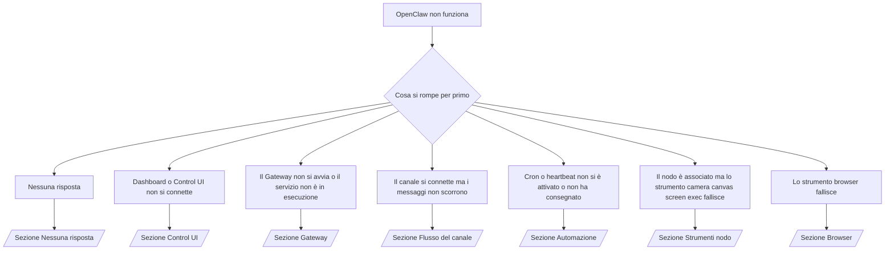

---
read_when:
    - OpenClaw non funziona e ti serve il percorso più rapido verso una soluzione
    - Vuoi un flusso di triage prima di passare a runbook più approfonditi
summary: Hub di troubleshooting orientato ai sintomi per OpenClaw
title: Troubleshooting generale
x-i18n:
    generated_at: "2026-04-05T13:54:51Z"
    model: gpt-5.4
    provider: openai
    source_hash: 23ae9638af5edf5a5e0584ccb15ba404223ac3b16c2d62eb93b2c9dac171c252
    source_path: help/troubleshooting.md
    workflow: 15
---

# Troubleshooting

Se hai solo 2 minuti, usa questa pagina come punto di ingresso per il triage.

## Primi 60 secondi

Esegui questa sequenza esattamente in quest'ordine:

```bash
openclaw status
openclaw status --all
openclaw gateway probe
openclaw gateway status
openclaw doctor
openclaw channels status --probe
openclaw logs --follow
```

Output corretto in una riga:

- `openclaw status` → mostra i canali configurati e nessun errore di autenticazione evidente.
- `openclaw status --all` → il report completo è presente e condivisibile.
- `openclaw gateway probe` → la destinazione gateway prevista è raggiungibile (`Reachable: yes`). `RPC: limited - missing scope: operator.read` indica diagnostica degradata, non un errore di connessione.
- `openclaw gateway status` → `Runtime: running` e `RPC probe: ok`.
- `openclaw doctor` → nessun errore bloccante di configurazione/servizio.
- `openclaw channels status --probe` → se il gateway è raggiungibile, restituisce lo stato live del trasporto per account più risultati di probe/audit come `works` o `audit ok`; se il gateway non è raggiungibile, il comando ricade su riepiloghi basati solo sulla configurazione.
- `openclaw logs --follow` → attività regolare, nessun errore fatale ripetuto.

## Anthropic long context 429

Se vedi:
`HTTP 429: rate_limit_error: Extra usage is required for long context requests`,
vai a [/gateway/troubleshooting#anthropic-429-extra-usage-required-for-long-context](/gateway/troubleshooting#anthropic-429-extra-usage-required-for-long-context).

## L'installazione del plugin fallisce con openclaw extensions mancanti

Se l'installazione fallisce con `package.json missing openclaw.extensions`, il pacchetto del plugin
usa una struttura vecchia che OpenClaw non accetta più.

Correzione nel pacchetto del plugin:

1. Aggiungi `openclaw.extensions` a `package.json`.
2. Fai puntare le entry ai file runtime compilati (di solito `./dist/index.js`).
3. Ripubblica il plugin ed esegui di nuovo `openclaw plugins install <package>`.

Esempio:

```json
{
  "name": "@openclaw/my-plugin",
  "version": "1.2.3",
  "openclaw": {
    "extensions": ["./dist/index.js"]
  }
}
```

Riferimento: [Plugin architecture](/plugins/architecture)

## Albero decisionale



<AccordionGroup>
  <Accordion title="Nessuna risposta">
    ```bash
    openclaw status
    openclaw gateway status
    openclaw channels status --probe
    openclaw pairing list --channel <channel> [--account <id>]
    openclaw logs --follow
    ```

    Un output corretto appare così:

    - `Runtime: running`
    - `RPC probe: ok`
    - Il tuo canale mostra il trasporto connesso e, dove supportato, `works` o `audit ok` in `channels status --probe`
    - Il mittente risulta approvato (oppure la policy DM è open/allowlist)

    Firme comuni nei log:

    - `drop guild message (mention required` → il gating delle mention ha bloccato il messaggio in Discord.
    - `pairing request` → il mittente non è approvato ed è in attesa di approvazione del pairing DM.
    - `blocked` / `allowlist` nei log del canale → mittente, stanza o gruppo è filtrato.

    Pagine di approfondimento:

    - [/gateway/troubleshooting#no-replies](/gateway/troubleshooting#no-replies)
    - [/channels/troubleshooting](/it/channels/troubleshooting)
    - [/channels/pairing](/it/channels/pairing)

  </Accordion>

  <Accordion title="Dashboard o Control UI non si connette">
    ```bash
    openclaw status
    openclaw gateway status
    openclaw logs --follow
    openclaw doctor
    openclaw channels status --probe
    ```

    Un output corretto appare così:

    - `Dashboard: http://...` è mostrato in `openclaw gateway status`
    - `RPC probe: ok`
    - Nessun loop di autenticazione nei log

    Firme comuni nei log:

    - `device identity required` → HTTP/contesto non sicuro non può completare l'autenticazione del dispositivo.
    - `origin not allowed` → l'`Origin` del browser non è consentito per la destinazione gateway della Control UI.
    - `AUTH_TOKEN_MISMATCH` con suggerimenti di retry (`canRetryWithDeviceToken=true`) → può avvenire automaticamente un singolo retry con device token fidato.
    - Quel retry con token in cache riusa l'insieme di scope in cache memorizzato con il device token associato. I chiamanti con `deviceToken` esplicito / `scopes` espliciti mantengono invece l'insieme di scope richiesto.
    - Sul percorso asincrono Tailscale Serve della Control UI, i tentativi falliti per lo stesso `{scope, ip}` vengono serializzati prima che il limiter registri il fallimento, quindi un secondo retry errato concorrente può già mostrare `retry later`.
    - `too many failed authentication attempts (retry later)` da un'origine browser localhost → i fallimenti ripetuti da quello stesso `Origin` vengono temporaneamente bloccati; un'altra origine localhost usa un bucket separato.
    - `unauthorized` ripetuti dopo quel retry → token/password errati, mismatch della modalità di autenticazione o device token associato obsoleto.
    - `gateway connect failed:` → la UI sta puntando all'URL/porta sbagliati oppure il gateway non è raggiungibile.

    Pagine di approfondimento:

    - [/gateway/troubleshooting#dashboard-control-ui-connectivity](/gateway/troubleshooting#dashboard-control-ui-connectivity)
    - [/web/control-ui](/web/control-ui)
    - [/gateway/authentication](/gateway/authentication)

  </Accordion>

  <Accordion title="Il Gateway non si avvia o il servizio è installato ma non è in esecuzione">
    ```bash
    openclaw status
    openclaw gateway status
    openclaw logs --follow
    openclaw doctor
    openclaw channels status --probe
    ```

    Un output corretto appare così:

    - `Service: ... (loaded)`
    - `Runtime: running`
    - `RPC probe: ok`

    Firme comuni nei log:

    - `Gateway start blocked: set gateway.mode=local` o `existing config is missing gateway.mode` → la modalità gateway è remote, oppure nel file di configurazione manca il flag di modalità locale e deve essere riparato.
    - `refusing to bind gateway ... without auth` → bind non loopback senza un percorso di autenticazione gateway valido (token/password oppure trusted-proxy dove configurato).
    - `another gateway instance is already listening` o `EADDRINUSE` → porta già occupata.

    Pagine di approfondimento:

    - [/gateway/troubleshooting#gateway-service-not-running](/gateway/troubleshooting#gateway-service-not-running)
    - [/gateway/background-process](/gateway/background-process)
    - [/gateway/configuration](/gateway/configuration)

  </Accordion>

  <Accordion title="Il canale si connette ma i messaggi non scorrono">
    ```bash
    openclaw status
    openclaw gateway status
    openclaw logs --follow
    openclaw doctor
    openclaw channels status --probe
    ```

    Un output corretto appare così:

    - Il trasporto del canale è connesso.
    - I controlli pairing/allowlist passano.
    - Le mention vengono rilevate dove richiesto.

    Firme comuni nei log:

    - `mention required` → il gating delle mention di gruppo ha bloccato l'elaborazione.
    - `pairing` / `pending` → il mittente DM non è ancora approvato.
    - `not_in_channel`, `missing_scope`, `Forbidden`, `401/403` → problema di token permessi del canale.

    Pagine di approfondimento:

    - [/gateway/troubleshooting#channel-connected-messages-not-flowing](/gateway/troubleshooting#channel-connected-messages-not-flowing)
    - [/channels/troubleshooting](/it/channels/troubleshooting)

  </Accordion>

  <Accordion title="Cron o heartbeat non si è attivato o non ha consegnato">
    ```bash
    openclaw status
    openclaw gateway status
    openclaw cron status
    openclaw cron list
    openclaw cron runs --id <jobId> --limit 20
    openclaw logs --follow
    ```

    Un output corretto appare così:

    - `cron.status` mostra che è abilitato con un prossimo risveglio.
    - `cron runs` mostra voci recenti `ok`.
    - Heartbeat è abilitato e non fuori dalle ore attive.

    Firme comuni nei log:

- `cron: scheduler disabled; jobs will not run automatically` → cron è disabilitato.
- `heartbeat skipped` con `reason=quiet-hours` → fuori dalle ore attive configurate.
- `heartbeat skipped` con `reason=empty-heartbeat-file` → `HEARTBEAT.md` esiste ma contiene solo struttura vuota o solo intestazioni.
- `heartbeat skipped` con `reason=no-tasks-due` → la modalità task di `HEARTBEAT.md` è attiva ma nessun intervallo dei task è ancora scaduto.
- `heartbeat skipped` con `reason=alerts-disabled` → tutta la visibilità heartbeat è disabilitata (`showOk`, `showAlerts` e `useIndicator` sono tutti off).
- `requests-in-flight` → la corsia principale è occupata; il risveglio heartbeat è stato rimandato.
- `unknown accountId` → l'account di destinazione della consegna heartbeat non esiste.

      Pagine di approfondimento:

      - [/gateway/troubleshooting#cron-and-heartbeat-delivery](/gateway/troubleshooting#cron-and-heartbeat-delivery)
      - [/automation/cron-jobs#troubleshooting](/it/automation/cron-jobs#troubleshooting)
      - [/gateway/heartbeat](/gateway/heartbeat)

    </Accordion>

    <Accordion title="Il nodo è associato ma lo strumento camera canvas screen exec fallisce">
      ```bash
      openclaw status
      openclaw gateway status
      openclaw nodes status
      openclaw nodes describe --node <idOrNameOrIp>
      openclaw logs --follow
      ```

      Un output corretto appare così:

      - Il nodo è elencato come connesso e associato per il ruolo `node`.
      - La capability esiste per il comando che stai invocando.
      - Lo stato dei permessi è granted per lo strumento.

      Firme comuni nei log:

      - `NODE_BACKGROUND_UNAVAILABLE` → porta l'app del nodo in primo piano.
      - `*_PERMISSION_REQUIRED` → il permesso del sistema operativo è stato negato o manca.
      - `SYSTEM_RUN_DENIED: approval required` → l'approvazione exec è in attesa.
      - `SYSTEM_RUN_DENIED: allowlist miss` → comando non presente nella allowlist exec.

      Pagine di approfondimento:

      - [/gateway/troubleshooting#node-paired-tool-fails](/gateway/troubleshooting#node-paired-tool-fails)
      - [/nodes/troubleshooting](/nodes/troubleshooting)
      - [/tools/exec-approvals](/tools/exec-approvals)

    </Accordion>

    <Accordion title="Exec improvvisamente chiede approvazione">
      ```bash
      openclaw config get tools.exec.host
      openclaw config get tools.exec.security
      openclaw config get tools.exec.ask
      openclaw gateway restart
      ```

      Cosa è cambiato:

      - Se `tools.exec.host` non è impostato, il valore predefinito è `auto`.
      - `host=auto` si risolve in `sandbox` quando è attivo un runtime sandbox, altrimenti in `gateway`.
      - `host=auto` è solo routing; il comportamento senza prompt "YOLO" deriva da `security=full` più `ask=off` su gateway/node.
      - Su `gateway` e `node`, se `tools.exec.security` non è impostato il valore predefinito è `full`.
      - Se `tools.exec.ask` non è impostato, il valore predefinito è `off`.
      - Risultato: se stai vedendo approvazioni, qualche policy locale all'host o per sessione ha irrigidito exec rispetto ai valori predefiniti correnti.

      Ripristinare il comportamento attuale predefinito senza approvazione:

      ```bash
      openclaw config set tools.exec.host gateway
      openclaw config set tools.exec.security full
      openclaw config set tools.exec.ask off
      openclaw gateway restart
      ```

      Alternative più sicure:

      - Imposta solo `tools.exec.host=gateway` se vuoi semplicemente un routing host stabile.
      - Usa `security=allowlist` con `ask=on-miss` se vuoi exec sull'host ma vuoi comunque revisione per le mancate corrispondenze nella allowlist.
      - Abilita la modalità sandbox se vuoi che `host=auto` torni a risolversi in `sandbox`.

      Firme comuni nei log:

      - `Approval required.` → il comando è in attesa di `/approve ...`.
      - `SYSTEM_RUN_DENIED: approval required` → l'approvazione exec sull'host del nodo è in attesa.
      - `exec host=sandbox requires a sandbox runtime for this session` → selezione sandbox implicita/esplicita ma modalità sandbox disattivata.

      Pagine di approfondimento:

      - [/tools/exec](/tools/exec)
      - [/tools/exec-approvals](/tools/exec-approvals)
      - [/gateway/security#runtime-expectation-drift](/gateway/security#runtime-expectation-drift)

    </Accordion>

    <Accordion title="Lo strumento browser fallisce">
      ```bash
      openclaw status
      openclaw gateway status
      openclaw browser status
      openclaw logs --follow
      openclaw doctor
      ```

      Un output corretto appare così:

      - Lo stato del browser mostra `running: true` e un browser/profilo scelto.
      - `openclaw` si avvia, oppure `user` può vedere le schede Chrome locali.

      Firme comuni nei log:

      - `unknown command "browser"` o `unknown command 'browser'` → `plugins.allow` è impostato e non include `browser`.
      - `Failed to start Chrome CDP on port` → l'avvio del browser locale è fallito.
      - `browser.executablePath not found` → il percorso binario configurato è errato.
      - `browser.cdpUrl must be http(s) or ws(s)` → l'URL CDP configurato usa uno schema non supportato.
      - `browser.cdpUrl has invalid port` → l'URL CDP configurato ha una porta non valida o fuori intervallo.
      - `No Chrome tabs found for profile="user"` → il profilo di attach Chrome MCP non ha schede Chrome locali aperte.
      - `Remote CDP for profile "<name>" is not reachable` → l'endpoint CDP remoto configurato non è raggiungibile da questo host.
      - `Browser attachOnly is enabled ... not reachable` o `Browser attachOnly is enabled and CDP websocket ... is not reachable` → il profilo attach-only non ha una destinazione CDP live.
      - override obsoleti di viewport / dark-mode / locale / offline su profili attach-only o CDP remoto → esegui `openclaw browser stop --browser-profile <name>` per chiudere la sessione di controllo attiva e rilasciare lo stato di emulazione senza riavviare il gateway.

      Pagine di approfondimento:

      - [/gateway/troubleshooting#browser-tool-fails](/gateway/troubleshooting#browser-tool-fails)
      - [/tools/browser#missing-browser-command-or-tool](/tools/browser#missing-browser-command-or-tool)
      - [/tools/browser-linux-troubleshooting](/tools/browser-linux-troubleshooting)
      - [/tools/browser-wsl2-windows-remote-cdp-troubleshooting](/tools/browser-wsl2-windows-remote-cdp-troubleshooting)

    </Accordion>
  </AccordionGroup>

## Correlati

- [FAQ](/help/faq) — domande frequenti
- [Gateway Troubleshooting](/gateway/troubleshooting) — problemi specifici del gateway
- [Doctor](/gateway/doctor) — controlli di integrità e riparazioni automatizzati
- [Channel Troubleshooting](/it/channels/troubleshooting) — problemi di connettività dei canali
- [Automation Troubleshooting](/it/automation/cron-jobs#troubleshooting) — problemi di cron e heartbeat
