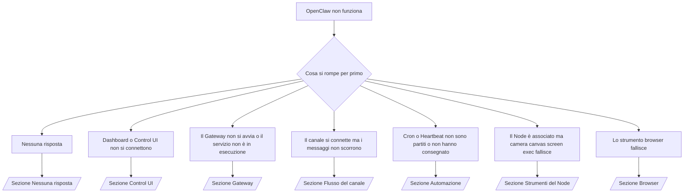

---
read_when:
    - OpenClaw non funziona e hai bisogno del percorso più rapido verso una soluzione
    - Vuoi un flusso di triage prima di entrare nei runbook approfonditi
summary: Hub di risoluzione dei problemi di OpenClaw orientato ai sintomi
title: Risoluzione generale dei problemi
x-i18n:
    generated_at: "2026-04-24T08:44:34Z"
    model: gpt-5.4
    provider: openai
    source_hash: c832c3f7609c56a5461515ed0f693d2255310bf2d3958f69f57c482bcbef97f0
    source_path: help/troubleshooting.md
    workflow: 15
---

Se hai solo 2 minuti, usa questa pagina come punto di ingresso per il triage.

## Primi 60 secondi

Esegui questa sequenza esatta in ordine:

```bash
openclaw status
openclaw status --all
openclaw gateway probe
openclaw gateway status
openclaw doctor
openclaw channels status --probe
openclaw logs --follow
```

Buon output, in sintesi:

- `openclaw status` → mostra i canali configurati e nessun errore auth evidente.
- `openclaw status --all` → il report completo è presente e condivisibile.
- `openclaw gateway probe` → il target Gateway previsto è raggiungibile (`Reachable: yes`). `Capability: ...` indica quale livello auth la probe è riuscita a dimostrare, e `Read probe: limited - missing scope: operator.read` indica diagnostica degradata, non un errore di connessione.
- `openclaw gateway status` → `Runtime: running`, `Connectivity probe: ok` e una riga `Capability: ...` plausibile. Usa `--require-rpc` se hai bisogno anche della prova RPC con scope di lettura.
- `openclaw doctor` → nessun errore bloccante di configurazione/servizio.
- `openclaw channels status --probe` → se il Gateway è raggiungibile, restituisce stato di trasporto live per account
  più risultati di probe/audit come `works` o `audit ok`; se il
  Gateway non è raggiungibile, il comando usa come fallback riepiloghi basati solo sulla configurazione.
- `openclaw logs --follow` → attività regolare, nessun errore fatale ripetuto.

## Anthropic long context 429

Se vedi:
`HTTP 429: rate_limit_error: Extra usage is required for long context requests`,
vai a [/gateway/troubleshooting#anthropic-429-extra-usage-required-for-long-context](/it/gateway/troubleshooting#anthropic-429-extra-usage-required-for-long-context).

## Un backend locale compatibile OpenAI funziona direttamente ma fallisce in OpenClaw

Se il tuo backend locale o self-hosted `/v1` risponde a piccole probe dirette
`/v1/chat/completions` ma fallisce su `openclaw infer model run` o nei normali
turni dell'agente:

1. Se l'errore menziona `messages[].content` che si aspetta una stringa, imposta
   `models.providers.<provider>.models[].compat.requiresStringContent: true`.
2. Se il backend continua a fallire solo nei turni dell'agente OpenClaw, imposta
   `models.providers.<provider>.models[].compat.supportsTools: false` e riprova.
3. Se le piccole chiamate dirette continuano a funzionare ma i prompt OpenClaw più grandi mandano in crash il
   backend, tratta il problema residuo come una limitazione del modello/server a monte e
   continua nel runbook approfondito:
   [/gateway/troubleshooting#local-openai-compatible-backend-passes-direct-probes-but-agent-runs-fail](/it/gateway/troubleshooting#local-openai-compatible-backend-passes-direct-probes-but-agent-runs-fail)

## L'installazione del Plugin fallisce per estensioni openclaw mancanti

Se l'installazione fallisce con `package.json missing openclaw.extensions`, il pacchetto Plugin
usa una forma vecchia che OpenClaw non accetta più.

Correzione nel pacchetto Plugin:

1. Aggiungi `openclaw.extensions` a `package.json`.
2. Punta le voci ai file runtime buildati (di solito `./dist/index.js`).
3. Ripubblica il Plugin ed esegui di nuovo `openclaw plugins install <package>`.

Esempio:

```json
{
  "name": "@openclaw/my-plugin",
  "version": "1.2.3",
  "openclaw": {
    "extensions": ["./dist/index.js"]
  }
}
```

Riferimento: [Architettura dei Plugin](/it/plugins/architecture)

## Albero decisionale



<AccordionGroup>
  <Accordion title="Nessuna risposta">
    ```bash
    openclaw status
    openclaw gateway status
    openclaw channels status --probe
    openclaw pairing list --channel <channel> [--account <id>]
    openclaw logs --follow
    ```

    Un buon output si presenta così:

    - `Runtime: running`
    - `Connectivity probe: ok`
    - `Capability: read-only`, `write-capable` oppure `admin-capable`
    - Il tuo canale mostra il trasporto connesso e, dove supportato, `works` o `audit ok` in `channels status --probe`
    - Il mittente risulta approvato (oppure la policy DM è open/allowlist)

    Firme comuni nei log:

    - `drop guild message (mention required` → il vincolo delle menzioni ha bloccato il messaggio in Discord.
    - `pairing request` → il mittente non è approvato ed è in attesa di approvazione dell'associazione DM.
    - `blocked` / `allowlist` nei log del canale → mittente, stanza o gruppo sono filtrati.

    Pagine approfondite:

    - [/gateway/troubleshooting#no-replies](/it/gateway/troubleshooting#no-replies)
    - [/channels/troubleshooting](/it/channels/troubleshooting)
    - [/channels/pairing](/it/channels/pairing)

  </Accordion>

  <Accordion title="Dashboard o Control UI non si connettono">
    ```bash
    openclaw status
    openclaw gateway status
    openclaw logs --follow
    openclaw doctor
    openclaw channels status --probe
    ```

    Un buon output si presenta così:

    - `Dashboard: http://...` è mostrato in `openclaw gateway status`
    - `Connectivity probe: ok`
    - `Capability: read-only`, `write-capable` oppure `admin-capable`
    - Nessun loop auth nei log

    Firme comuni nei log:

    - `device identity required` → il contesto HTTP/non sicuro non può completare l'auth del dispositivo.
    - `origin not allowed` → l'`Origin` del browser non è consentito per il target Gateway della Control UI.
    - `AUTH_TOKEN_MISMATCH` con suggerimenti di retry (`canRetryWithDeviceToken=true`) → può avvenire automaticamente un retry attendibile con token dispositivo.
    - Quel retry con token in cache riusa l'insieme di scope in cache memorizzato con il token dispositivo associato. I chiamanti con `deviceToken` esplicito / `scopes` espliciti mantengono invece il proprio insieme di scope richiesto.
    - Nel percorso asincrono Tailscale Serve Control UI, i tentativi falliti per lo stesso
      `{scope, ip}` vengono serializzati prima che il limiter registri il fallimento, quindi un secondo retry concorrente errato può già mostrare `retry later`.
    - `too many failed authentication attempts (retry later)` da un'origine browser localhost → i fallimenti ripetuti dalla stessa `Origin` vengono temporaneamente bloccati; un'altra origine localhost usa un bucket separato.
    - `unauthorized` ripetuti dopo quel retry → token/password errati, modalità auth non corrispondente o token dispositivo associato obsoleto.
    - `gateway connect failed:` → la UI punta a URL/porta errati o a un Gateway non raggiungibile.

    Pagine approfondite:

    - [/gateway/troubleshooting#dashboard-control-ui-connectivity](/it/gateway/troubleshooting#dashboard-control-ui-connectivity)
    - [/web/control-ui](/it/web/control-ui)
    - [/gateway/authentication](/it/gateway/authentication)

  </Accordion>

  <Accordion title="Il Gateway non si avvia o il servizio è installato ma non è in esecuzione">
    ```bash
    openclaw status
    openclaw gateway status
    openclaw logs --follow
    openclaw doctor
    openclaw channels status --probe
    ```

    Un buon output si presenta così:

    - `Service: ... (loaded)`
    - `Runtime: running`
    - `Connectivity probe: ok`
    - `Capability: read-only`, `write-capable` oppure `admin-capable`

    Firme comuni nei log:

    - `Gateway start blocked: set gateway.mode=local` oppure `existing config is missing gateway.mode` → la modalità Gateway è remote, oppure nel file di configurazione manca il marcatore della modalità locale e deve essere riparato.
    - `refusing to bind gateway ... without auth` → bind non loopback senza un percorso auth Gateway valido (token/password, o trusted-proxy dove configurato).
    - `another gateway instance is already listening` oppure `EADDRINUSE` → porta già occupata.

    Pagine approfondite:

    - [/gateway/troubleshooting#gateway-service-not-running](/it/gateway/troubleshooting#gateway-service-not-running)
    - [/gateway/background-process](/it/gateway/background-process)
    - [/gateway/configuration](/it/gateway/configuration)

  </Accordion>

  <Accordion title="Il canale si connette ma i messaggi non scorrono">
    ```bash
    openclaw status
    openclaw gateway status
    openclaw logs --follow
    openclaw doctor
    openclaw channels status --probe
    ```

    Un buon output si presenta così:

    - Il trasporto del canale è connesso.
    - I controlli di associazione/allowlist passano.
    - Le menzioni vengono rilevate dove richiesto.

    Firme comuni nei log:

    - `mention required` → il vincolo delle menzioni nel gruppo ha bloccato l'elaborazione.
    - `pairing` / `pending` → il mittente DM non è ancora approvato.
    - `not_in_channel`, `missing_scope`, `Forbidden`, `401/403` → problema di permessi o token del canale.

    Pagine approfondite:

    - [/gateway/troubleshooting#channel-connected-messages-not-flowing](/it/gateway/troubleshooting#channel-connected-messages-not-flowing)
    - [/channels/troubleshooting](/it/channels/troubleshooting)

  </Accordion>

  <Accordion title="Cron o Heartbeat non sono partiti o non hanno consegnato">
    ```bash
    openclaw status
    openclaw gateway status
    openclaw cron status
    openclaw cron list
    openclaw cron runs --id <jobId> --limit 20
    openclaw logs --follow
    ```

    Un buon output si presenta così:

    - `cron.status` mostra che è abilitato con un prossimo wake.
    - `cron runs` mostra recenti voci `ok`.
    - Heartbeat è abilitato e non è fuori dalle ore attive.

    Firme comuni nei log:

    - `cron: scheduler disabled; jobs will not run automatically` → Cron è disabilitato.
    - `heartbeat skipped` con `reason=quiet-hours` → fuori dalle ore attive configurate.
    - `heartbeat skipped` con `reason=empty-heartbeat-file` → `HEARTBEAT.md` esiste ma contiene solo scaffolding vuoto/solo intestazioni.
    - `heartbeat skipped` con `reason=no-tasks-due` → la modalità task di `HEARTBEAT.md` è attiva ma nessuno degli intervalli delle attività è ancora dovuto.
    - `heartbeat skipped` con `reason=alerts-disabled` → tutta la visibilità di Heartbeat è disabilitata (`showOk`, `showAlerts` e `useIndicator` sono tutti spenti).
    - `requests-in-flight` → corsia principale occupata; il wake di Heartbeat è stato rimandato.
    - `unknown accountId` → l'account di destinazione per la consegna di Heartbeat non esiste.

    Pagine approfondite:

    - [/gateway/troubleshooting#cron-and-heartbeat-delivery](/it/gateway/troubleshooting#cron-and-heartbeat-delivery)
    - [/automation/cron-jobs#troubleshooting](/it/automation/cron-jobs#troubleshooting)
    - [/gateway/heartbeat](/it/gateway/heartbeat)

  </Accordion>

  <Accordion title="Il Node è associato ma lo strumento camera canvas screen exec fallisce">
    ```bash
    openclaw status
    openclaw gateway status
    openclaw nodes status
    openclaw nodes describe --node <idOrNameOrIp>
    openclaw logs --follow
    ```

    Un buon output si presenta così:

    - Il Node è elencato come connesso e associato per il ruolo `node`.
    - Esiste la capacità per il comando che stai invocando.
    - Lo stato del permesso è concesso per lo strumento.

    Firme comuni nei log:

    - `NODE_BACKGROUND_UNAVAILABLE` → porta l'app del Node in foreground.
    - `*_PERMISSION_REQUIRED` → il permesso del sistema operativo è stato negato o manca.
    - `SYSTEM_RUN_DENIED: approval required` → l'approvazione exec è in sospeso.
    - `SYSTEM_RUN_DENIED: allowlist miss` → comando non presente nella allowlist exec.

    Pagine approfondite:

    - [/gateway/troubleshooting#node-paired-tool-fails](/it/gateway/troubleshooting#node-paired-tool-fails)
    - [/nodes/troubleshooting](/it/nodes/troubleshooting)
    - [/tools/exec-approvals](/it/tools/exec-approvals)

  </Accordion>

  <Accordion title="Exec chiede improvvisamente approvazione">
    ```bash
    openclaw config get tools.exec.host
    openclaw config get tools.exec.security
    openclaw config get tools.exec.ask
    openclaw gateway restart
    ```

    Cosa è cambiato:

    - Se `tools.exec.host` non è impostato, il valore predefinito è `auto`.
    - `host=auto` si risolve in `sandbox` quando un runtime sandbox è attivo, altrimenti in `gateway`.
    - `host=auto` riguarda solo l'instradamento; il comportamento senza prompt "YOLO" deriva da `security=full` più `ask=off` su gateway/node.
    - Su `gateway` e `node`, `tools.exec.security` non impostato ha come predefinito `full`.
    - `tools.exec.ask` non impostato ha come predefinito `off`.
    - Risultato: se stai vedendo richieste di approvazione, qualche policy locale dell'host o per sessione ha ristretto exec rispetto ai valori predefiniti correnti.

    Ripristina l'attuale comportamento predefinito senza approvazione:

    ```bash
    openclaw config set tools.exec.host gateway
    openclaw config set tools.exec.security full
    openclaw config set tools.exec.ask off
    openclaw gateway restart
    ```

    Alternative più sicure:

    - Imposta solo `tools.exec.host=gateway` se vuoi solo un instradamento host stabile.
    - Usa `security=allowlist` con `ask=on-miss` se vuoi exec host ma desideri comunque una revisione in caso di mancata corrispondenza della allowlist.
    - Abilita la modalità sandbox se vuoi che `host=auto` torni a risolversi in `sandbox`.

    Firme comuni nei log:

    - `Approval required.` → il comando è in attesa di `/approve ...`.
    - `SYSTEM_RUN_DENIED: approval required` → l'approvazione exec dell'host Node è in sospeso.
    - `exec host=sandbox requires a sandbox runtime for this session` → selezione implicita/esplicita della sandbox ma modalità sandbox disattivata.

    Pagine approfondite:

    - [/tools/exec](/it/tools/exec)
    - [/tools/exec-approvals](/it/tools/exec-approvals)
    - [/gateway/security#what-the-audit-checks-high-level](/it/gateway/security#what-the-audit-checks-high-level)

  </Accordion>

  <Accordion title="Lo strumento browser fallisce">
    ```bash
    openclaw status
    openclaw gateway status
    openclaw browser status
    openclaw logs --follow
    openclaw doctor
    ```

    Un buon output si presenta così:

    - Lo stato del browser mostra `running: true` e un browser/profilo scelto.
    - `openclaw` si avvia, oppure `user` può vedere le schede Chrome locali.

    Firme comuni nei log:

    - `unknown command "browser"` oppure `unknown command 'browser'` → `plugins.allow` è impostato e non include `browser`.
    - `Failed to start Chrome CDP on port` → avvio del browser locale fallito.
    - `browser.executablePath not found` → il percorso del binario configurato è errato.
    - `browser.cdpUrl must be http(s) or ws(s)` → l'URL CDP configurato usa uno schema non supportato.
    - `browser.cdpUrl has invalid port` → l'URL CDP configurato ha una porta errata o fuori intervallo.
    - `No Chrome tabs found for profile="user"` → il profilo di attach Chrome MCP non ha schede Chrome locali aperte.
    - `Remote CDP for profile "<name>" is not reachable` → l'endpoint CDP remoto configurato non è raggiungibile da questo host.
    - `Browser attachOnly is enabled ... not reachable` oppure `Browser attachOnly is enabled and CDP websocket ... is not reachable` → il profilo attach-only non ha un target CDP live.
    - override obsoleti di viewport / dark-mode / locale / offline su profili attach-only o remote CDP → esegui `openclaw browser stop --browser-profile <name>` per chiudere la sessione di controllo attiva e rilasciare lo stato di emulazione senza riavviare il Gateway.

    Pagine approfondite:

    - [/gateway/troubleshooting#browser-tool-fails](/it/gateway/troubleshooting#browser-tool-fails)
    - [/tools/browser#missing-browser-command-or-tool](/it/tools/browser#missing-browser-command-or-tool)
    - [/tools/browser-linux-troubleshooting](/it/tools/browser-linux-troubleshooting)
    - [/tools/browser-wsl2-windows-remote-cdp-troubleshooting](/it/tools/browser-wsl2-windows-remote-cdp-troubleshooting)

  </Accordion>

</AccordionGroup>

## Correlati

- [FAQ](/it/help/faq) — domande frequenti
- [Risoluzione dei problemi del Gateway](/it/gateway/troubleshooting) — problemi specifici del Gateway
- [Doctor](/it/gateway/doctor) — controlli automatici dello stato e riparazioni
- [Risoluzione dei problemi del canale](/it/channels/troubleshooting) — problemi di connettività del canale
- [Risoluzione dei problemi di automazione](/it/automation/cron-jobs#troubleshooting) — problemi con Cron e Heartbeat
