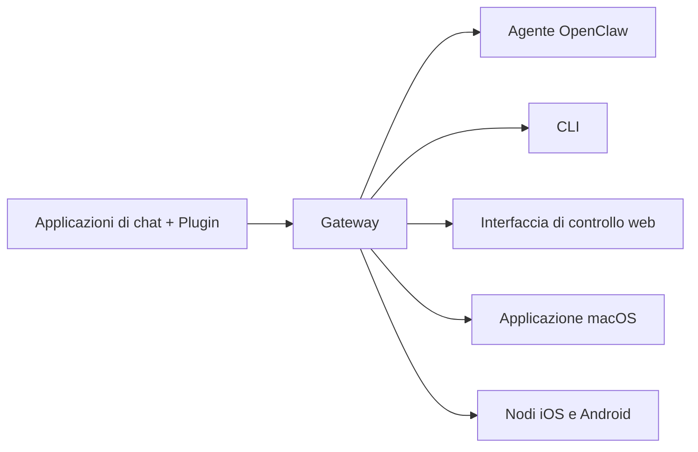

---
read_when:
    - Presentazione di OpenClaw ai nuovi utenti
summary: OpenClaw è un gateway multicanale per agenti di IA che funziona su qualsiasi sistema operativo.
title: OpenClaw
x-i18n:
    generated_at: "2026-07-16T14:26:51Z"
    model: gpt-5.6
    postprocess_version: locale-links-v1
    prompt_version: 32
    provider: openai
    source_hash: fe97e7299be4855fd9af21838e0626b5a5c8aafe46d982859e9033f0efec2443
    source_path: index.md
    workflow: 16
---

# OpenClaw 🦞

<p align="center">
    
    
</p>

> _"ESFOLIA! ESFOLIA!"_ — Probabilmente un'aragosta spaziale

<p align="center">
  <strong>Gateway per qualsiasi sistema operativo che consente agli agenti IA di operare su Discord, Google Chat, iMessage, Matrix, Microsoft Teams, Signal, Slack, Telegram, WhatsApp, Zalo e altro ancora.</strong><br />
  Invia un messaggio e ricevi in tasca la risposta di un agente. Esegui un unico Gateway per Plugin di canale, WebChat e nodi mobili.
</p>

<Columns>
  <Card title="Per iniziare" href="/it/start/getting-started" icon="rocket">
    Installa OpenClaw e avvia il Gateway in pochi minuti.
  </Card>
  <Card title="Esegui la configurazione iniziale" href="/it/start/wizard" icon="list-checks">
    Configurazione guidata con `openclaw onboard` e procedure di associazione.
  </Card>
  <Card title="Connetti un canale" href="/it/channels" icon="message-circle">
    Collega Discord, Signal, Telegram, WhatsApp e altri servizi per chattare ovunque.
  </Card>
  <Card title="Apri l'interfaccia di controllo" href="/it/web/control-ui" icon="layout-dashboard">
    Avvia il pannello di controllo nel browser per chat, configurazione e sessioni.
  </Card>
</Columns>

## Esplorazione della documentazione

Nei browser per dispositivi mobili, il menu delle sezioni potrebbe apparire senza la barra completa delle schede per desktop. Utilizzare
questi collegamenti principali per accedere dal corpo della pagina alle stesse aree di primo livello della documentazione.

<Columns>
  <Card title="Per iniziare" href="/it" icon="rocket">
    Panoramica, presentazione, primi passi e guide alla configurazione.
  </Card>
  <Card title="Installazione" href="/it/install" icon="download">
    Metodi di installazione, aggiornamenti, container, hosting e configurazione avanzata.
  </Card>
  <Card title="Canali" href="/it/channels" icon="messages-square">
    Canali di messaggistica, associazione, instradamento, gruppi di accesso e controllo qualità dei canali.
  </Card>
  <Card title="Agenti" href="/it/concepts/architecture" icon="bot">
    Architettura, sessioni, contesto, memoria e instradamento multi-agente.
  </Card>
  <Card title="Funzionalità" href="/it/tools" icon="wand-sparkles">
    Strumenti, Skills, Cron, Webhook e funzionalità di automazione.
  </Card>
  <Card title="ClawHub" href="/it/clawhub" icon="store">
    Marketplace di Plugin, pubblicazione, selezione e indicazioni sull'affidabilità.
  </Card>
  <Card title="Modelli" href="/it/providers" icon="brain">
    Provider, configurazione dei modelli, failover e servizi di modelli locali.
  </Card>
  <Card title="Piattaforme" href="/it/platforms" icon="monitor-smartphone">
    macOS, Windows, iOS, Android, nodi e interfacce web.
  </Card>
  <Card title="Gateway e operazioni" href="/it/gateway" icon="server">
    Configurazione, sicurezza, diagnostica e gestione del Gateway.
  </Card>
  <Card title="Riferimenti" href="/it/cli" icon="terminal">
    Riferimenti della CLI, schemi, RPC, note di rilascio e modelli.
  </Card>
  <Card title="Assistenza" href="/it/help" icon="life-buoy">
    Risoluzione dei problemi, domande frequenti, test, diagnostica e verifiche dell'ambiente.
  </Card>
</Columns>

## Che cos'è OpenClaw?

OpenClaw è un **gateway self-hosted** che collega le applicazioni di chat preferite — Discord, Google Chat, iMessage, Matrix, Microsoft Teams, Signal, Slack, Telegram, WhatsApp, Zalo e altre tramite Plugin di canale — agli agenti IA per la programmazione. Un singolo processo Gateway viene eseguito sul proprio computer (o su un server) e funge da ponte tra le applicazioni di messaggistica e un assistente IA sempre disponibile.

**A chi è destinato?** A sviluppatori e utenti esperti che desiderano un assistente IA personale a cui poter inviare messaggi da qualsiasi luogo, senza rinunciare al controllo dei propri dati né dipendere da un servizio in hosting.

**Che cosa lo rende diverso?**

- **Self-hosted**: viene eseguito sul proprio hardware, secondo le proprie regole
- **Multicanale**: un unico Gateway gestisce contemporaneamente ogni Plugin di canale configurato
- **Nativo per gli agenti**: progettato per agenti di programmazione con utilizzo di strumenti, sessioni, memoria e instradamento multi-agente
- **Open source**: distribuito con licenza MIT e sviluppato dalla comunità

**Che cosa serve?** Node 24.15+ (consigliato), Node 22 LTS (`22.22.3+`) per la compatibilità oppure Node 25.9+, una chiave API del provider scelto e 5 minuti. Per ottenere la massima qualità e sicurezza, utilizzare il modello di ultima generazione più potente disponibile.

## Funzionamento



Il Gateway è l'unica fonte di verità per sessioni, instradamento e connessioni ai canali.

## Funzionalità principali

<Columns>
  <Card title="Gateway multicanale" icon="network" href="/it/channels">
    Discord, iMessage, Signal, Slack, Telegram, WhatsApp, WebChat e altri servizi con un unico processo Gateway.
  </Card>
  <Card title="Plugin di canale" icon="plug" href="/it/tools/plugin">
    I Plugin di canale aggiungono Matrix, Nostr, Twitch, Zalo e altri servizi; i Plugin ufficiali vengono installati su richiesta.
  </Card>
  <Card title="Instradamento multi-agente" icon="route" href="/it/concepts/multi-agent">
    Sessioni isolate per agente, spazio di lavoro o mittente.
  </Card>
  <Card title="Supporto multimediale" icon="image" href="/it/nodes/images">
    Invio e ricezione di immagini, audio e documenti.
  </Card>
  <Card title="Interfaccia di controllo web" icon="monitor" href="/it/web/control-ui">
    Pannello di controllo nel browser per chat, configurazione, sessioni e nodi.
  </Card>
  <Card title="Nodi mobili" icon="smartphone" href="/it/nodes">
    Associazione di nodi iOS e Android per Canvas, fotocamera e flussi di lavoro vocali.
  </Card>
</Columns>

## Avvio rapido

<Steps>
  <Step title="Installa OpenClaw">
    ```bash
    npm install -g openclaw@latest
    ```
  </Step>
  <Step title="Esegui la configurazione iniziale e installa il servizio">
    ```bash
    openclaw onboard --install-daemon
    ```
  </Step>
  <Step title="Chat">
    Aprire l'interfaccia di controllo nel browser e inviare un messaggio:

    ```bash
    openclaw dashboard
    ```

    In alternativa, connettere un canale ([Telegram](/it/channels/telegram) è il più rapido) e chattare dal telefono.

  </Step>
</Steps>

Per la configurazione completa dell'installazione e dell'ambiente di sviluppo, consultare [Per iniziare](/it/start/getting-started).

## Pannello di controllo

Aprire l'interfaccia di controllo nel browser dopo l'avvio del Gateway.

- Impostazione locale predefinita: [http://127.0.0.1:18789/](http://127.0.0.1:18789/)
- Accesso remoto: [Interfacce web](/it/web) e [Tailscale](/it/gateway/tailscale)

<p align="center">
  
</p>

## Configurazione (facoltativa)

La configurazione si trova in `~/.openclaw/openclaw.json`.

- Se **non si esegue alcuna operazione**, OpenClaw utilizza il runtime dell'agente OpenClaw incluso; i messaggi diretti condividono la sessione principale dell'agente e ogni chat di gruppo dispone di una sessione separata.
- Per limitare l'accesso, iniziare con `channels.whatsapp.allowFrom` e, per i gruppi, con le regole relative alle menzioni.

Esempio:

```json5
{
  channels: {
    whatsapp: {
      allowFrom: ["+15555550123"],
      groups: { "*": { requireMention: true } },
    },
  },
  messages: { groupChat: { mentionPatterns: ["@openclaw"] } },
}
```

## Da dove iniziare

<Columns>
  <Card title="Sezioni della documentazione" href="/it/start/hubs" icon="book-open">
    Tutta la documentazione e le guide, organizzate per caso d'uso.
  </Card>
  <Card title="Configurazione" href="/it/gateway/configuration" icon="settings">
    Impostazioni principali del Gateway, token e configurazione del provider.
  </Card>
  <Card title="Accesso remoto" href="/it/gateway/remote" icon="globe">
    Modelli di accesso tramite SSH e tailnet.
  </Card>
  <Card title="Canali" href="/it/channels/telegram" icon="message-square">
    Configurazione specifica per canale per Discord, Feishu, Microsoft Teams, Telegram, WhatsApp e altri servizi.
  </Card>
  <Card title="Nodi" href="/it/nodes" icon="smartphone">
    Nodi iOS e Android con associazione, Canvas, fotocamera e azioni del dispositivo.
  </Card>
  <Card title="Assistenza" href="/it/help" icon="life-buoy">
    Soluzioni comuni e punto di accesso alla risoluzione dei problemi.
  </Card>
</Columns>

## Ulteriori informazioni

<Columns>
  <Card title="Elenco completo delle funzionalità" href="/it/concepts/features" icon="list">
    Funzionalità complete per canali, instradamento e contenuti multimediali.
  </Card>
  <Card title="Instradamento multi-agente" href="/it/concepts/multi-agent" icon="route">
    Isolamento degli spazi di lavoro e sessioni per agente.
  </Card>
  <Card title="Sicurezza" href="/it/gateway/security" icon="shield">
    Token, elenchi di elementi consentiti e controlli di sicurezza.
  </Card>
  <Card title="Risoluzione dei problemi" href="/it/gateway/troubleshooting" icon="wrench">
    Diagnostica del Gateway ed errori comuni.
  </Card>
  <Card title="Informazioni e riconoscimenti" href="/it/reference/credits" icon="info">
    Origini del progetto, collaboratori e licenza.
  </Card>
</Columns>
