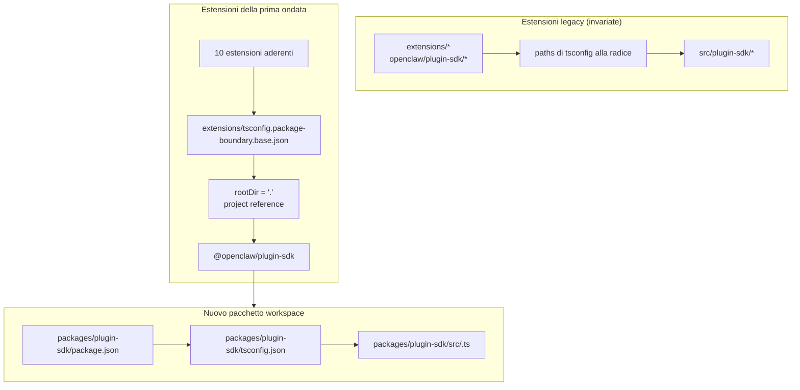

# refactor: Rendere plugin-sdk un vero pacchetto workspace in modo incrementale

## Panoramica

Questo piano introduce un vero pacchetto workspace per il plugin SDK in
`packages/plugin-sdk` e lo usa per far aderire una piccola prima ondata di estensioni ai
confini dei pacchetti imposti dal compilatore. L'obiettivo è fare in modo che gli import relativi illegali falliscano con il normale `tsc` per un insieme selezionato di estensioni provider incluse,
senza imporre una migrazione a livello di repository o una gigantesca superficie di conflitti di merge.

Il passaggio incrementale chiave è eseguire per un po' due modalità in parallelo:

| Modalità     | Forma dell'import        | Chi la usa                            | Applicazione                                  |
| ------------ | ------------------------ | ------------------------------------- | --------------------------------------------- |
| Modalità legacy | `openclaw/plugin-sdk/*`  | tutte le estensioni esistenti non aderenti | il comportamento permissivo attuale rimane    |
| Modalità opt-in | `@openclaw/plugin-sdk/*` | solo le estensioni della prima ondata | `rootDir` locale al pacchetto + project references |

## Inquadramento del problema

L'attuale repository esporta un'ampia superficie pubblica del plugin SDK, ma non è un vero
pacchetto workspace. Invece:

- `tsconfig.json` alla radice mappa `openclaw/plugin-sdk/*` direttamente a
  `src/plugin-sdk/*.ts`
- le estensioni che non hanno aderito al precedente esperimento condividono ancora quel
  comportamento globale di alias sorgente
- aggiungere `rootDir` funziona solo quando gli import SDK consentiti smettono di risolversi nel sorgente grezzo del repository

Questo significa che il repository può descrivere la policy di confine desiderata, ma TypeScript
non la applica in modo pulito per la maggior parte delle estensioni.

Serve un percorso incrementale che:

- renda reale `plugin-sdk`
- sposti l'SDK verso un pacchetto workspace chiamato `@openclaw/plugin-sdk`
- cambi solo circa 10 estensioni nella prima PR
- lasci il resto dell'albero delle estensioni sul vecchio schema fino a una pulizia successiva
- eviti il flusso `tsconfig.plugin-sdk.dts.json` + dichiarazioni generate in postinstall come meccanismo principale per il rollout della prima ondata

## Traccia dei requisiti

- R1. Creare un vero pacchetto workspace per il plugin SDK sotto `packages/`.
- R2. Chiamare il nuovo pacchetto `@openclaw/plugin-sdk`.
- R3. Dare al nuovo pacchetto SDK il proprio `package.json` e `tsconfig.json`.
- R4. Mantenere funzionanti gli import legacy `openclaw/plugin-sdk/*` per le estensioni non aderenti
  durante la finestra di migrazione.
- R5. Far aderire solo una piccola prima ondata di estensioni nella prima PR.
- R6. Le estensioni della prima ondata devono fallire in modo chiuso per gli import relativi che escono
  dalla root del loro pacchetto.
- R7. Le estensioni della prima ondata devono consumare l'SDK tramite una dipendenza di pacchetto
  e una TS project reference, non tramite alias `paths` alla radice.
- R8. Il piano deve evitare un passaggio obbligatorio di generazione in postinstall a livello repo per la correttezza dell'editor.
- R9. Il rollout della prima ondata deve essere revisionabile e integrabile come PR di dimensioni moderate,
  non come refactor a livello di repository di oltre 300 file.

## Confini dell'ambito

- Nessuna migrazione completa di tutte le estensioni incluse nella prima PR.
- Nessun obbligo di eliminare `src/plugin-sdk` nella prima PR.
- Nessun obbligo di ricollegare immediatamente ogni percorso di build o test alla radice per usare il nuovo pacchetto.
- Nessun tentativo di imporre squiggles di VS Code per ogni estensione non aderente.
- Nessuna pulizia lint ampia per il resto dell'albero delle estensioni.
- Nessuna grande modifica del comportamento a runtime oltre a risoluzione degli import, proprietà dei pacchetti,
  e applicazione dei confini per le estensioni aderenti.

## Contesto e ricerca

### Codice e pattern rilevanti

- `pnpm-workspace.yaml` include già `packages/*` e `extensions/*`, quindi un
  nuovo pacchetto workspace sotto `packages/plugin-sdk` si adatta al layout
  esistente del repository.
- I pacchetti workspace esistenti come `packages/memory-host-sdk/package.json`
  e `packages/plugin-package-contract/package.json` usano già mappe `exports` locali al pacchetto
  radicate in `src/*.ts`.
- `package.json` alla radice pubblica attualmente la superficie SDK tramite `./plugin-sdk`
  e gli export `./plugin-sdk/*` supportati da `dist/plugin-sdk/*.js` e
  `dist/plugin-sdk/*.d.ts`.
- `src/plugin-sdk/entrypoints.ts` e `scripts/lib/plugin-sdk-entrypoints.json`
  fungono già da inventario canonico degli entrypoint per la superficie SDK.
- `tsconfig.json` alla radice attualmente mappa:
  - `openclaw/plugin-sdk` -> `src/plugin-sdk/index.ts`
  - `openclaw/plugin-sdk/*` -> `src/plugin-sdk/*.ts`
- Il precedente esperimento sui confini ha mostrato che `rootDir` locale al pacchetto funziona per
  gli import relativi illegali solo dopo che gli import SDK consentiti smettono di risolversi nel sorgente grezzo esterno al pacchetto dell'estensione.

### Insieme di estensioni della prima ondata

Questo piano presume che la prima ondata sia l'insieme centrato sui provider che è meno probabile
trascinare con sé casi limite complessi del runtime dei canali:

- `extensions/anthropic`
- `extensions/exa`
- `extensions/firecrawl`
- `extensions/groq`
- `extensions/mistral`
- `extensions/openai`
- `extensions/perplexity`
- `extensions/tavily`
- `extensions/together`
- `extensions/xai`

### Inventario della superficie SDK della prima ondata

Le estensioni della prima ondata attualmente importano un sottoinsieme gestibile di sottopercorsi SDK.
Il pacchetto iniziale `@openclaw/plugin-sdk` deve coprire solo questi:

- `agent-runtime`
- `cli-runtime`
- `config-runtime`
- `core`
- `image-generation`
- `media-runtime`
- `media-understanding`
- `plugin-entry`
- `plugin-runtime`
- `provider-auth`
- `provider-auth-api-key`
- `provider-auth-login`
- `provider-auth-runtime`
- `provider-catalog-shared`
- `provider-entry`
- `provider-http`
- `provider-model-shared`
- `provider-onboard`
- `provider-stream-family`
- `provider-stream-shared`
- `provider-tools`
- `provider-usage`
- `provider-web-fetch`
- `provider-web-search`
- `realtime-transcription`
- `realtime-voice`
- `runtime-env`
- `secret-input`
- `security-runtime`
- `speech`
- `testing`

### Apprendimenti istituzionali

- Nessuna voce rilevante `docs/solutions/` era presente in questo worktree.

### Riferimenti esterni

- Nessuna ricerca esterna è stata necessaria per questo piano. Il repository contiene già i
  pattern rilevanti per pacchetti workspace ed export SDK.

## Decisioni tecniche chiave

- Introdurre `@openclaw/plugin-sdk` come nuovo pacchetto workspace mantenendo attiva
  la superficie legacy `openclaw/plugin-sdk/*` durante la migrazione.
  Motivazione: questo consente a un insieme di estensioni della prima ondata di passare alla reale
  risoluzione tramite pacchetti senza forzare tutte le estensioni e tutti i percorsi di build alla radice a cambiare contemporaneamente.

- Usare una configurazione base di confine dedicata con opt-in come
  `extensions/tsconfig.package-boundary.base.json` invece di sostituire la
  base esistente delle estensioni per tutti.
  Motivazione: il repository deve supportare simultaneamente sia la modalità legacy sia quella opt-in delle estensioni durante la migrazione.

- Usare TS project references dalle estensioni della prima ondata verso
  `packages/plugin-sdk/tsconfig.json` e impostare
  `disableSourceOfProjectReferenceRedirect` per la modalità di confine opt-in.
  Motivazione: questo fornisce a `tsc` un vero grafo di pacchetti scoraggiando al contempo il fallback dell'editor e del compilatore verso il traversal del sorgente grezzo.

- Mantenere `@openclaw/plugin-sdk` privato nella prima ondata.
  Motivazione: l'obiettivo immediato è l'applicazione interna dei confini e la sicurezza della migrazione,
  non pubblicare un secondo contratto SDK esterno prima che la superficie sia stabile.

- Spostare solo i sottopercorsi SDK della prima ondata nella prima implementazione, e
  mantenere bridge di compatibilità per il resto.
  Motivazione: spostare fisicamente tutti i 315 file `src/plugin-sdk/*.ts` in una sola PR è
  esattamente la superficie di conflitto di merge che questo piano sta cercando di evitare.

- Non fare affidamento su `scripts/postinstall-bundled-plugins.mjs` per costruire le
  dichiarazioni SDK per la prima ondata.
  Motivazione: i flussi espliciti di build/reference sono più facili da comprendere e mantengono
  il comportamento del repository più prevedibile.

## Questioni aperte

### Risolte durante la pianificazione

- Quali estensioni dovrebbero essere nella prima ondata?
  Usare le 10 estensioni provider/web-search elencate sopra perché sono
  strutturalmente più isolate rispetto ai pacchetti canale più pesanti.

- La prima PR dovrebbe sostituire l'intero albero delle estensioni?
  No. La prima PR dovrebbe supportare due modalità in parallelo e far aderire solo
  la prima ondata.

- La prima ondata dovrebbe richiedere una build delle dichiarazioni in postinstall?
  No. Il grafo package/reference dovrebbe essere esplicito, e la CI dovrebbe eseguire in modo intenzionale il typecheck locale al pacchetto pertinente.

### Rimandate all'implementazione

- Se il pacchetto della prima ondata possa puntare direttamente a `src/*.ts` locali al pacchetto
  tramite le sole project references, oppure se sia ancora richiesto un piccolo passaggio di emissione delle dichiarazioni
  per il pacchetto `@openclaw/plugin-sdk`.
  Questa è una questione di validazione del grafo TS di competenza dell'implementazione.

- Se il pacchetto `openclaw` alla radice debba fare subito da proxy per i sottopercorsi SDK della prima ondata verso gli output di `packages/plugin-sdk` o continuare a usare shim di compatibilità generati sotto `src/plugin-sdk`.
  Questo è un dettaglio di compatibilità e forma della build che dipende dal percorso di implementazione minimo
  che mantiene la CI verde.

## Progettazione tecnica di alto livello

> Questo illustra l'approccio previsto ed è una guida direzionale per la revisione, non una specifica di implementazione. L'agente che implementa dovrebbe trattarlo come contesto, non come codice da riprodurre.

## Unità di implementazione

- [ ] **Unità 1: Introdurre il vero pacchetto workspace `@openclaw/plugin-sdk`**

**Obiettivo:** Creare un vero pacchetto workspace per l'SDK che possa possedere la
superficie dei sottopercorsi della prima ondata senza forzare una migrazione a livello di repository.

**Requisiti:** R1, R2, R3, R8, R9

**Dipendenze:** Nessuna

**File:**

- Creare: `packages/plugin-sdk/package.json`
- Creare: `packages/plugin-sdk/tsconfig.json`
- Creare: `packages/plugin-sdk/src/index.ts`
- Creare: `packages/plugin-sdk/src/*.ts` per i sottopercorsi SDK della prima ondata
- Modificare: `pnpm-workspace.yaml` solo se sono necessarie regolazioni dei glob dei pacchetti
- Modificare: `package.json`
- Modificare: `src/plugin-sdk/entrypoints.ts`
- Modificare: `scripts/lib/plugin-sdk-entrypoints.json`
- Test: `src/plugins/contracts/plugin-sdk-workspace-package.contract.test.ts`

**Approccio:**

- Aggiungere un nuovo pacchetto workspace chiamato `@openclaw/plugin-sdk`.
- Iniziare solo con i sottopercorsi SDK della prima ondata, non con l'intero albero di 315 file.
- Se spostare direttamente un entrypoint della prima ondata creasse una diff troppo grande, la
  prima PR può introdurre prima quel sottopercorso in `packages/plugin-sdk/src` come sottile
  wrapper di pacchetto e poi spostare la source of truth al pacchetto in una PR di follow-up per quel cluster di sottopercorsi.
- Riutilizzare la macchina di inventario degli entrypoint esistente in modo che la superficie del pacchetto della prima ondata sia dichiarata in un unico posto canonico.
- Mantenere attivi gli export del pacchetto alla radice per gli utenti legacy mentre il pacchetto workspace diventa il nuovo contratto opt-in.

**Pattern da seguire:**

- `packages/memory-host-sdk/package.json`
- `packages/plugin-package-contract/package.json`
- `src/plugin-sdk/entrypoints.ts`

**Scenari di test:**

- Percorso felice: il pacchetto workspace esporta ogni sottopercorso della prima ondata elencato
  nel piano e non manca nessun export richiesto per la prima ondata.
- Caso limite: i metadati di export del pacchetto restano stabili quando l'elenco delle voci della prima ondata
  viene rigenerato o confrontato con l'inventario canonico.
- Integrazione: gli export legacy dell'SDK del pacchetto alla radice restano presenti dopo l'introduzione
  del nuovo pacchetto workspace.

**Verifica:**

- Il repository contiene un pacchetto workspace `@openclaw/plugin-sdk` valido con una
  mappa di export stabile per la prima ondata e nessuna regressione negli export legacy del `package.json`
  alla radice.

- [ ] **Unità 2: Aggiungere una modalità di confine TS con opt-in per le estensioni applicate come pacchetto**

**Obiettivo:** Definire la modalità di configurazione TS che useranno le estensioni aderenti,
lasciando invariato il comportamento TS esistente delle estensioni per tutti gli altri.

**Requisiti:** R4, R6, R7, R8, R9

**Dipendenze:** Unità 1

**File:**

- Creare: `extensions/tsconfig.package-boundary.base.json`
- Creare: `tsconfig.boundary-optin.json`
- Modificare: `extensions/xai/tsconfig.json`
- Modificare: `extensions/openai/tsconfig.json`
- Modificare: `extensions/anthropic/tsconfig.json`
- Modificare: `extensions/mistral/tsconfig.json`
- Modificare: `extensions/groq/tsconfig.json`
- Modificare: `extensions/together/tsconfig.json`
- Modificare: `extensions/perplexity/tsconfig.json`
- Modificare: `extensions/tavily/tsconfig.json`
- Modificare: `extensions/exa/tsconfig.json`
- Modificare: `extensions/firecrawl/tsconfig.json`
- Test: `src/plugins/contracts/extension-package-project-boundaries.test.ts`
- Test: `test/extension-package-tsc-boundary.test.ts`

**Approccio:**

- Lasciare `extensions/tsconfig.base.json` al suo posto per le estensioni legacy.
- Aggiungere una nuova configurazione base opt-in che:
  - imposta `rootDir: "."`
  - referenzia `packages/plugin-sdk`
  - abilita `composite`
  - disabilita il redirect della sorgente della project reference quando necessario
- Aggiungere una configurazione solution dedicata per il grafo di typecheck della prima ondata invece di
  rimodellare il progetto TS dell'intero repository nella stessa PR.

**Nota di esecuzione:** Iniziare con un typecheck canary locale al pacchetto che fallisce per una sola
estensione aderente prima di applicare il pattern a tutte e 10.

**Pattern da seguire:**

- Pattern esistente di `tsconfig.json` locale all'estensione dal precedente
  lavoro sui confini
- Pattern di pacchetto workspace da `packages/memory-host-sdk`

**Scenari di test:**

- Percorso felice: ogni estensione aderente esegue correttamente il typecheck tramite la
  configurazione TS di confine del pacchetto.
- Percorso di errore: un import relativo canary da `../../src/cli/acp-cli.ts` fallisce
  con `TS6059` per un'estensione aderente.
- Integrazione: le estensioni non aderenti restano intatte e non devono
  partecipare alla nuova solution config.

**Verifica:**

- Esiste un grafo di typecheck dedicato per le 10 estensioni aderenti, e gli import relativi errati da una di esse falliscono con il normale `tsc`.

- [ ] **Unità 3: Migrare le estensioni della prima ondata a `@openclaw/plugin-sdk`**

**Obiettivo:** Modificare le estensioni della prima ondata affinché consumino il vero pacchetto SDK
tramite metadati di dipendenza, project references e import per nome di pacchetto.

**Requisiti:** R5, R6, R7, R9

**Dipendenze:** Unità 2

**File:**

- Modificare: `extensions/anthropic/package.json`
- Modificare: `extensions/exa/package.json`
- Modificare: `extensions/firecrawl/package.json`
- Modificare: `extensions/groq/package.json`
- Modificare: `extensions/mistral/package.json`
- Modificare: `extensions/openai/package.json`
- Modificare: `extensions/perplexity/package.json`
- Modificare: `extensions/tavily/package.json`
- Modificare: `extensions/together/package.json`
- Modificare: `extensions/xai/package.json`
- Modificare: gli import di produzione e test sotto ciascuna delle 10 root di estensione che
  attualmente referenziano `openclaw/plugin-sdk/*`

**Approccio:**

- Aggiungere `@openclaw/plugin-sdk: workspace:*` alle `devDependencies` delle estensioni della prima ondata.
- Sostituire gli import `openclaw/plugin-sdk/*` in quei pacchetti con
  `@openclaw/plugin-sdk/*`.
- Mantenere gli import interni locali all'estensione su barrel locali come `./api.ts` e
  `./runtime-api.ts`.
- Non modificare le estensioni non aderenti in questa PR.

**Pattern da seguire:**

- Barrel di import locali all'estensione esistenti (`api.ts`, `runtime-api.ts`)
- Forma della dipendenza di pacchetto usata da altri pacchetti workspace `@openclaw/*`

**Scenari di test:**

- Percorso felice: ogni estensione migrata continua a registrarsi/caricarsi tramite i suoi test plugin esistenti dopo la riscrittura degli import.
- Caso limite: gli import SDK solo per test nell'insieme di estensioni aderenti continuano a risolversi correttamente tramite il nuovo pacchetto.
- Integrazione: le estensioni migrate non richiedono alias `openclaw/plugin-sdk/*` del pacchetto alla radice per il typecheck.

**Verifica:**

- Le estensioni della prima ondata buildano e vengono testate contro `@openclaw/plugin-sdk`
  senza aver bisogno del percorso alias SDK legacy alla radice.

- [ ] **Unità 4: Preservare la compatibilità legacy mentre la migrazione è parziale**

**Obiettivo:** Mantenere funzionante il resto del repository mentre l'SDK esiste sia in forma legacy sia in forma di nuovo pacchetto durante la migrazione.

**Requisiti:** R4, R8, R9

**Dipendenze:** Unità 1-3

**File:**

- Modificare: `src/plugin-sdk/*.ts` per shim di compatibilità della prima ondata, se necessario
- Modificare: `package.json`
- Modificare: la build o il wiring di export che assembla gli artefatti SDK
- Test: `src/plugins/contracts/plugin-sdk-runtime-api-guardrails.test.ts`
- Test: `src/plugins/contracts/plugin-sdk-index.bundle.test.ts`

**Approccio:**

- Mantenere `openclaw/plugin-sdk/*` alla radice come superficie di compatibilità per le estensioni legacy
  e per i consumer esterni che non si stanno ancora spostando.
- Usare shim generati oppure wiring proxy di export alla radice per i sottopercorsi della prima ondata
  che sono stati spostati in `packages/plugin-sdk`.
- Non tentare di ritirare la superficie SDK alla radice in questa fase.

**Pattern da seguire:**

- Generazione esistente degli export SDK alla radice tramite `src/plugin-sdk/entrypoints.ts`
- Compatibilità di export del pacchetto esistente in `package.json` alla radice

**Scenari di test:**

- Percorso felice: un import SDK legacy alla radice continua a risolversi per un'estensione non aderente dopo che il nuovo pacchetto esiste.
- Caso limite: un sottopercorso della prima ondata funziona sia tramite la superficie legacy alla radice sia tramite la nuova superficie del pacchetto durante la finestra di migrazione.
- Integrazione: i test di contratto su index/bundle di plugin-sdk continuano a vedere una superficie pubblica coerente.

**Verifica:**

- Il repository supporta sia la modalità di consumo SDK legacy sia quella opt-in
  senza rompere le estensioni invariate.

- [ ] **Unità 5: Aggiungere applicazione mirata e documentare il contratto di migrazione**

**Obiettivo:** Far entrare in CI e nelle linee guida per i contributor il nuovo comportamento per la
prima ondata senza fingere che l'intero albero delle estensioni sia stato migrato.

**Requisiti:** R5, R6, R8, R9

**Dipendenze:** Unità 1-4

**File:**

- Modificare: `package.json`
- Modificare: i file di workflow CI che dovrebbero eseguire il typecheck di confine con opt-in
- Modificare: `AGENTS.md`
- Modificare: `docs/plugins/sdk-overview.md`
- Modificare: `docs/plugins/sdk-entrypoints.md`
- Modificare: `docs/plans/2026-04-05-001-refactor-extension-package-resolution-boundary-plan.md`

**Approccio:**

- Aggiungere un gate esplicito per la prima ondata, come un'esecuzione `tsc -b` solution dedicata per
  `packages/plugin-sdk` più le 10 estensioni aderenti.
- Documentare che il repository ora supporta sia la modalità legacy sia quella opt-in delle estensioni,
  e che il nuovo lavoro sui confini delle estensioni dovrebbe preferire il percorso del nuovo pacchetto.
- Registrare la regola di migrazione della prossima ondata in modo che le PR successive possano aggiungere più estensioni
  senza dover ridiscutere l'architettura.

**Pattern da seguire:**

- Test di contratto esistenti sotto `src/plugins/contracts/`
- Aggiornamenti della documentazione esistenti che spiegano migrazioni a fasi

**Scenari di test:**

- Percorso felice: il nuovo gate di typecheck della prima ondata passa per il pacchetto workspace
  e per le estensioni aderenti.
- Percorso di errore: introdurre un nuovo import relativo illegale in un'estensione aderente fa fallire il gate di typecheck mirato.
- Integrazione: la CI non richiede ancora alle estensioni non aderenti di soddisfare la nuova modalità di confine del pacchetto.

**Verifica:**

- Il percorso di applicazione della prima ondata è documentato, testato ed eseguibile senza
  forzare la migrazione dell'intero albero delle estensioni.

## Impatto a livello di sistema

- **Grafo di interazione:** questo lavoro tocca la source of truth dell'SDK, gli export del pacchetto alla radice,
  i metadati dei pacchetti delle estensioni, il layout del grafo TS e la verifica in CI.
- **Propagazione degli errori:** la modalità di errore principale prevista diventa l'errore TS a compile-time
  (`TS6059`) nelle estensioni aderenti invece di guasti solo da script personalizzati.
- **Rischi per il ciclo di vita dello stato:** la migrazione a doppia superficie introduce rischio di deriva tra
  gli export di compatibilità alla radice e il nuovo pacchetto workspace.
- **Parità della superficie API:** i sottopercorsi della prima ondata devono rimanere semanticamente identici
  sia tramite `openclaw/plugin-sdk/*` sia tramite `@openclaw/plugin-sdk/*` durante la transizione.
- **Copertura di integrazione:** i test unitari non bastano; sono richiesti typecheck mirati del grafo di pacchetti
  per dimostrare il confine.
- **Invarianti invariate:** le estensioni non aderenti mantengono il comportamento attuale nella PR 1. Questo piano non rivendica l'applicazione dei confini di import a livello di repository.

## Rischi e dipendenze

| Rischio                                                                                                 | Mitigazione                                                                                                             |
| ------------------------------------------------------------------------------------------------------- | ----------------------------------------------------------------------------------------------------------------------- |
| Il pacchetto della prima ondata continua a risolversi nel sorgente grezzo e `rootDir` non fallisce davvero in modo chiuso | Rendere il primo passaggio di implementazione un canary package-reference su una estensione aderente prima di estendere al set completo |
| Spostare troppo sorgente SDK in una volta sola ricrea il problema originale dei conflitti di merge     | Spostare solo i sottopercorsi della prima ondata nella prima PR e mantenere bridge di compatibilità alla radice        |
| Le superfici SDK legacy e nuova divergono semanticamente                                                | Mantenere un singolo inventario degli entrypoint, aggiungere test di contratto di compatibilità e rendere esplicita la parità della doppia superficie |
| I percorsi di build/test del repository alla radice iniziano accidentalmente a dipendere dal nuovo pacchetto in modi non controllati | Usare una solution config dedicata con opt-in e mantenere fuori dalla prima PR le modifiche alla topologia TS a livello radice |

## Consegna per fasi

### Fase 1

- Introdurre `@openclaw/plugin-sdk`
- Definire la superficie dei sottopercorsi della prima ondata
- Dimostrare che una estensione aderente può fallire in modo chiuso tramite `rootDir`

### Fase 2

- Far aderire le 10 estensioni della prima ondata
- Mantenere attiva la compatibilità alla radice per tutti gli altri

### Fase 3

- Aggiungere altre estensioni in PR successive
- Spostare altri sottopercorsi SDK nel pacchetto workspace
- Ritirare la compatibilità alla radice solo dopo che l'insieme legacy delle estensioni sarà scomparso

## Note operative / di documentazione

- La prima PR dovrebbe descriversi esplicitamente come una migrazione a doppia modalità, non come il completamento dell'applicazione a livello di repository.
- La guida di migrazione dovrebbe rendere facile alle PR successive aggiungere altre estensioni
  seguendo lo stesso pattern package/dependency/reference.

## Fonti e riferimenti

- Piano precedente: `docs/plans/2026-04-05-001-refactor-extension-package-resolution-boundary-plan.md`
- Configurazione workspace: `pnpm-workspace.yaml`
- Inventario degli entrypoint SDK esistente: `src/plugin-sdk/entrypoints.ts`
- Export SDK alla radice esistenti: `package.json`
- Pattern di pacchetti workspace esistenti:
  - `packages/memory-host-sdk/package.json`
  - `packages/plugin-package-contract/package.json`
