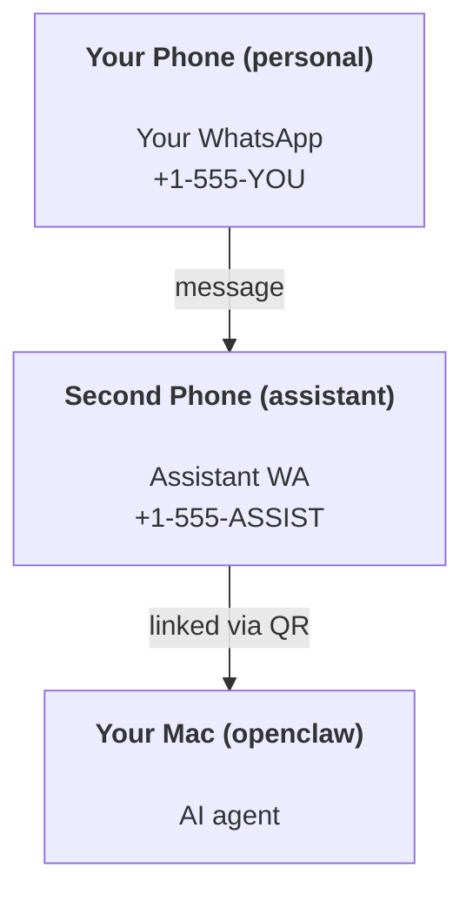

---
read_when:
    - Onboarding di una nuova istanza dell'assistente
    - Revisione delle implicazioni di sicurezza/permessi
summary: Guida end-to-end per eseguire OpenClaw come assistente personale con avvertenze di sicurezza
title: Configurazione dell'assistente personale
x-i18n:
    generated_at: "2026-04-24T09:02:50Z"
    model: gpt-5.4
    provider: openai
    source_hash: 3048f2faae826fc33d962f1fac92da3c0ce464d2de803fee381c897eb6c76436
    source_path: start/openclaw.md
    workflow: 15
---

# Creare un assistente personale con OpenClaw

OpenClaw è un gateway self-hosted che collega Discord, Google Chat, iMessage, Matrix, Microsoft Teams, Signal, Slack, Telegram, WhatsApp, Zalo e altro ad agenti AI. Questa guida copre la configurazione "assistente personale": un numero WhatsApp dedicato che si comporta come il tuo assistente AI sempre attivo.

## ⚠️ Prima la sicurezza

Stai mettendo un agente nella posizione di:

- eseguire comandi sulla tua macchina (a seconda della tua policy sugli strumenti)
- leggere/scrivere file nel tuo spazio di lavoro
- inviare messaggi in uscita tramite WhatsApp/Telegram/Discord/Mattermost e altri canali integrati

Inizia in modo conservativo:

- Imposta sempre `channels.whatsapp.allowFrom` (non eseguire mai in modalità aperta al mondo sul tuo Mac personale).
- Usa un numero WhatsApp dedicato per l'assistente.
- Gli Heartbeat ora sono predefiniti ogni 30 minuti. Disabilitali finché non ti fidi della configurazione impostando `agents.defaults.heartbeat.every: "0m"`.

## Prerequisiti

- OpenClaw installato e sottoposto a onboarding — vedi [Getting Started](/it/start/getting-started) se non l'hai ancora fatto
- Un secondo numero di telefono (SIM/eSIM/prepagato) per l'assistente

## Configurazione a due telefoni (consigliata)

Ti serve questo:



Se colleghi il tuo WhatsApp personale a OpenClaw, ogni messaggio destinato a te diventa “input dell'agente”. Raramente è ciò che vuoi.

## Avvio rapido in 5 minuti

1. Associa WhatsApp Web (mostra QR; scansionalo con il telefono dell'assistente):

```bash
openclaw channels login
```

2. Avvia il Gateway (lascialo in esecuzione):

```bash
openclaw gateway --port 18789
```

3. Inserisci una configurazione minima in `~/.openclaw/openclaw.json`:

```json5
{
  gateway: { mode: "local" },
  channels: { whatsapp: { allowFrom: ["+15555550123"] } },
}
```

Ora invia un messaggio al numero dell'assistente dal tuo telefono presente nella allowlist.

Quando l'onboarding termina, OpenClaw apre automaticamente la dashboard e stampa un link pulito (senza token). Se la dashboard richiede autenticazione, incolla il secret condiviso configurato nelle impostazioni della Control UI. L'onboarding usa un token per impostazione predefinita (`gateway.auth.token`), ma anche l'autenticazione con password funziona se hai cambiato `gateway.auth.mode` in `password`. Per riaprirla in seguito: `openclaw dashboard`.

## Dai all'agente uno spazio di lavoro (AGENTS)

OpenClaw legge istruzioni operative e “memoria” dalla directory dello spazio di lavoro.

Per impostazione predefinita, OpenClaw usa `~/.openclaw/workspace` come spazio di lavoro dell'agente, e lo creerà (insieme ai file iniziali `AGENTS.md`, `SOUL.md`, `TOOLS.md`, `IDENTITY.md`, `USER.md`, `HEARTBEAT.md`) automaticamente durante setup/prima esecuzione dell'agente. `BOOTSTRAP.md` viene creato solo quando lo spazio di lavoro è completamente nuovo (non dovrebbe ricomparire dopo che lo elimini). `MEMORY.md` è facoltativo (non viene creato automaticamente); quando presente, viene caricato per le sessioni normali. Le sessioni dei sottoagenti iniettano solo `AGENTS.md` e `TOOLS.md`.

Suggerimento: tratta questa cartella come la “memoria” di OpenClaw e trasformala in un repository git (idealmente privato) così `AGENTS.md` + i file di memoria vengono sottoposti a backup. Se git è installato, gli spazi di lavoro completamente nuovi vengono inizializzati automaticamente.

```bash
openclaw setup
```

Guida completa al layout dello spazio di lavoro + backup: [Agent workspace](/it/concepts/agent-workspace)
Workflow della memoria: [Memory](/it/concepts/memory)

Facoltativo: scegli uno spazio di lavoro diverso con `agents.defaults.workspace` (supporta `~`).

```json5
{
  agent: {
    workspace: "~/.openclaw/workspace",
  },
}
```

Se distribuisci già i tuoi file dello spazio di lavoro da un repository, puoi disabilitare completamente la creazione dei file bootstrap:

```json5
{
  agent: {
    skipBootstrap: true,
  },
}
```

## La configurazione che lo trasforma in "un assistente"

OpenClaw usa come predefinita una buona configurazione da assistente, ma in genere vorrai regolare:

- persona/istruzioni in [`SOUL.md`](/it/concepts/soul)
- valori predefiniti del thinking (se desiderato)
- Heartbeat (una volta che ti fidi della configurazione)

Esempio:

```json5
{
  logging: { level: "info" },
  agent: {
    model: "anthropic/claude-opus-4-6",
    workspace: "~/.openclaw/workspace",
    thinkingDefault: "high",
    timeoutSeconds: 1800,
    // Inizia con 0; abilitalo più tardi.
    heartbeat: { every: "0m" },
  },
  channels: {
    whatsapp: {
      allowFrom: ["+15555550123"],
      groups: {
        "*": { requireMention: true },
      },
    },
  },
  routing: {
    groupChat: {
      mentionPatterns: ["@openclaw", "openclaw"],
    },
  },
  session: {
    scope: "per-sender",
    resetTriggers: ["/new", "/reset"],
    reset: {
      mode: "daily",
      atHour: 4,
      idleMinutes: 10080,
    },
  },
}
```

## Sessioni e memoria

- File di sessione: `~/.openclaw/agents/<agentId>/sessions/{{SessionId}}.jsonl`
- Metadati della sessione (uso dei token, ultimo route, ecc): `~/.openclaw/agents/<agentId>/sessions/sessions.json` (legacy: `~/.openclaw/sessions/sessions.json`)
- `/new` o `/reset` avvia una sessione nuova per quella chat (configurabile tramite `resetTriggers`). Se inviato da solo, l'agente risponde con un breve saluto per confermare il reset.
- `/compact [instructions]` compatta il contesto della sessione e riporta il budget di contesto rimanente.

## Heartbeat (modalità proattiva)

Per impostazione predefinita, OpenClaw esegue un Heartbeat ogni 30 minuti con il prompt:
`Read HEARTBEAT.md if it exists (workspace context). Follow it strictly. Do not infer or repeat old tasks from prior chats. If nothing needs attention, reply HEARTBEAT_OK.`
Imposta `agents.defaults.heartbeat.every: "0m"` per disabilitarlo.

- Se `HEARTBEAT.md` esiste ma è effettivamente vuoto (solo righe vuote e intestazioni markdown come `# Heading`), OpenClaw salta l'esecuzione Heartbeat per risparmiare chiamate API.
- Se il file manca, l'Heartbeat viene comunque eseguito e il modello decide cosa fare.
- Se l'agente risponde con `HEARTBEAT_OK` (facoltativamente con breve padding; vedi `agents.defaults.heartbeat.ackMaxChars`), OpenClaw sopprime la consegna in uscita per quell'Heartbeat.
- Per impostazione predefinita, la consegna Heartbeat verso destinazioni in stile DM `user:<id>` è consentita. Imposta `agents.defaults.heartbeat.directPolicy: "block"` per sopprimere la consegna a destinazione diretta mantenendo attive le esecuzioni Heartbeat.
- Gli Heartbeat eseguono turni completi dell'agente — intervalli più brevi consumano più token.

```json5
{
  agent: {
    heartbeat: { every: "30m" },
  },
}
```

## Media in entrata e in uscita

Gli allegati in ingresso (immagini/audio/documenti) possono essere esposti al tuo comando tramite template:

- `{{MediaPath}}` (percorso locale del file temporaneo)
- `{{MediaUrl}}` (pseudo-URL)
- `{{Transcript}}` (se la trascrizione audio è abilitata)

Allegati in uscita dall'agente: includi `MEDIA:<path-or-url>` su una riga a sé (senza spazi). Esempio:

```
Ecco lo screenshot.
MEDIA:https://example.com/screenshot.png
```

OpenClaw li estrae e li invia come media insieme al testo.

Il comportamento dei percorsi locali segue lo stesso modello di fiducia della lettura file dell'agente:

- Se `tools.fs.workspaceOnly` è `true`, i percorsi locali `MEDIA:` in uscita restano limitati alla radice temp di OpenClaw, alla cache media, ai percorsi dello spazio di lavoro dell'agente e ai file generati dalla sandbox.
- Se `tools.fs.workspaceOnly` è `false`, `MEDIA:` in uscita può usare file locali dell'host che l'agente è già autorizzato a leggere.
- Gli invii locali dell'host continuano comunque a consentire solo media e tipi di documento sicuri (immagini, audio, video, PDF e documenti Office). Testo semplice e file simili a secret non vengono trattati come media inviabili.

Questo significa che immagini/file generati fuori dallo spazio di lavoro possono ora essere inviati quando la tua policy fs consente già quelle letture, senza riaprire l'esfiltrazione arbitraria di allegati di testo dell'host.

## Checklist operativa

```bash
openclaw status          # stato locale (credenziali, sessioni, eventi in coda)
openclaw status --all    # diagnosi completa (sola lettura, incollabile)
openclaw status --deep   # chiede al gateway una probe live di integrità con probe dei canali quando supportate
openclaw health --json   # snapshot di integrità del gateway (WS; per impostazione predefinita può restituire uno snapshot recente in cache)
```

I log si trovano in `/tmp/openclaw/` (predefinito: `openclaw-YYYY-MM-DD.log`).

## Passi successivi

- WebChat: [WebChat](/it/web/webchat)
- Operazioni Gateway: [Gateway runbook](/it/gateway)
- Cron + wakeup: [Cron jobs](/it/automation/cron-jobs)
- Companion macOS nella barra menu: [OpenClaw macOS app](/it/platforms/macos)
- App Node iOS: [iOS app](/it/platforms/ios)
- App Node Android: [Android app](/it/platforms/android)
- Stato Windows: [Windows (WSL2)](/it/platforms/windows)
- Stato Linux: [Linux app](/it/platforms/linux)
- Sicurezza: [Security](/it/gateway/security)

## Correlati

- [Getting started](/it/start/getting-started)
- [Setup](/it/start/setup)
- [Panoramica dei canali](/it/channels)
