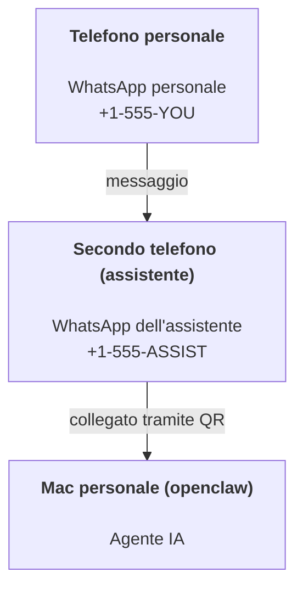

---
read_when:
    - Configurazione iniziale di una nuova istanza dell'assistente
    - Revisione delle implicazioni per la sicurezza e le autorizzazioni
summary: Guida completa all'esecuzione di OpenClaw come assistente personale, con avvertenze di sicurezza
title: Configurazione dell'assistente personale
x-i18n:
    generated_at: "2026-07-16T15:02:38Z"
    model: gpt-5.6
    postprocess_version: locale-links-v1
    prompt_version: 32
    provider: openai
    source_hash: e8c34e31314f55647059fd600935330110add27b338a675bc0ce1529bebb207d
    source_path: start/openclaw.md
    workflow: 16
---

OpenClaw è un gateway self-hosted che collega Discord, Google Chat, iMessage, Matrix, Microsoft Teams, Signal, Slack, Telegram, WhatsApp, Zalo e altri servizi agli agenti IA. Questa guida illustra la configurazione dell'"assistente personale": un numero WhatsApp dedicato che si comporta come un assistente IA sempre attivo.

## Prima di tutto, la sicurezza

Fornire un canale a un agente gli consente potenzialmente di eseguire comandi sulla macchina (a seconda dei criteri configurati per gli strumenti), leggere e scrivere file nell'area di lavoro e inviare messaggi tramite qualsiasi canale connesso. Iniziare con cautela:

- Impostare sempre `channels.whatsapp.allowFrom` (non eseguire mai un'istanza accessibile pubblicamente sul proprio Mac personale).
- Usare un numero WhatsApp dedicato per l'assistente.
- Per impostazione predefinita, gli Heartbeat vengono eseguiti ogni 30 minuti. Disabilitarli impostando `agents.defaults.heartbeat.every: "0m"` finché la configurazione non è considerata affidabile.

## Prerequisiti

- OpenClaw installato e configurato tramite onboarding; se non è ancora stato fatto, consultare [Guida introduttiva](/it/start/getting-started)
- Un secondo numero di telefono (SIM/eSIM/prepagata) per l'assistente

## Configurazione con due telefoni (consigliata)

La configurazione desiderata è questa:



Se si collega il proprio WhatsApp personale a OpenClaw, ogni messaggio ricevuto diventa un "input dell'agente". Raramente è ciò che si desidera.

## Avvio rapido in 5 minuti

1. Associare WhatsApp Web (viene mostrato un codice QR; scansionarlo con il telefono dell'assistente):

```bash
openclaw channels login
```

2. Avviare il Gateway (lasciarlo in esecuzione):

```bash
openclaw gateway --port 18789
```

3. Inserire una configurazione minima in `~/.openclaw/openclaw.json`:

```json5
{
  gateway: { mode: "local" },
  channels: { whatsapp: { allowFrom: ["+15555550123"] } },
}
```

Inviare ora un messaggio al numero dell'assistente dal telefono incluso nell'elenco consentito.

Al termine dell'onboarding, OpenClaw apre automaticamente la dashboard e mostra un link semplice (senza token). Se la dashboard richiede l'autenticazione, incollare il segreto condiviso configurato nelle impostazioni di Control UI. Per impostazione predefinita, l'onboarding usa un token (`gateway.auth.token`), ma funziona anche l'autenticazione tramite password se `gateway.auth.mode` è stato impostato su `password`. Per riaprire la dashboard in seguito: `openclaw dashboard`.

## Assegnare un'area di lavoro all'agente (AGENTS)

OpenClaw legge le istruzioni operative e la "memoria" dalla directory dell'area di lavoro.

Per impostazione predefinita, OpenClaw usa `~/.openclaw/workspace` come area di lavoro dell'agente e la crea automaticamente (insieme ai file iniziali `AGENTS.md`, `SOUL.md`, `TOOLS.md`, `IDENTITY.md`, `USER.md` e `HEARTBEAT.md`) durante l'onboarding o alla prima esecuzione dell'agente. `BOOTSTRAP.md` viene creato solo per un'area di lavoro nuova e non dovrebbe ricomparire dopo essere stato eliminato. `MEMORY.md` è facoltativo e non viene mai creato automaticamente; quando è presente, viene caricato per le sessioni normali. Le sessioni dei subagenti inseriscono solo `AGENTS.md` e `TOOLS.md`.

<Tip>
Considerare questa cartella come la memoria di OpenClaw e trasformarla in un repository git (preferibilmente privato), in modo da eseguire il backup di `AGENTS.md` e dei file di memoria. Se git è installato, le nuove aree di lavoro vengono inizializzate automaticamente con `git init`.
</Tip>

Per creare le cartelle dell'area di lavoro e della configurazione senza eseguire l'intera procedura guidata di onboarding:

```bash
openclaw setup --baseline
```

(`openclaw setup` senza argomenti è un alias di `openclaw onboard` ed esegue l'intera procedura guidata interattiva.)

Struttura completa dell'area di lavoro e guida al backup: [Area di lavoro dell'agente](/it/concepts/agent-workspace)
Flusso di lavoro della memoria: [Memoria](/it/concepts/memory)

Facoltativo: scegliere un'altra area di lavoro con `agents.defaults.workspace` (supporta `~`).

```json5
{
  agents: {
    defaults: {
      workspace: "~/.openclaw/workspace",
    },
  },
}
```

Se i file dell'area di lavoro vengono già distribuiti da un repository, è possibile disabilitare completamente la creazione dei file di bootstrap:

```json5
{
  agents: {
    defaults: {
      skipBootstrap: true,
    },
  },
}
```

## La configurazione che lo trasforma in "un assistente"

Le impostazioni predefinite di OpenClaw offrono una buona configurazione da assistente, ma in genere è opportuno personalizzare:

- personalità/istruzioni in [`SOUL.md`](/it/concepts/soul)
- impostazioni predefinite del ragionamento (se desiderato)
- Heartbeat (quando la configurazione è considerata affidabile)

Esempio:

```json5
{
  logging: { level: "info" },
  agents: {
    defaults: {
      model: { primary: "anthropic/claude-opus-4-8" },
      workspace: "~/.openclaw/workspace",
      thinkingDefault: "high",
      timeoutSeconds: 1800,
      // Iniziare con 0; abilitare in seguito.
      heartbeat: { every: "0m" },
    },
    list: [
      {
        id: "main",
        default: true,
        groupChat: {
          mentionPatterns: ["@openclaw", "openclaw"],
        },
      },
    ],
  },
  channels: {
    whatsapp: {
      allowFrom: ["+15555550123"],
      groups: {
        "*": { requireMention: true },
      },
    },
  },
  session: {
    scope: "per-sender",
    resetTriggers: ["/new", "/reset"],
    reset: {
      mode: "daily",
      atHour: 4,
      idleMinutes: 10080,
    },
  },
}
```

## Sessioni e memoria

- Righe delle sessioni, righe delle trascrizioni e metadati (utilizzo dei token, ultimo instradamento e così via): `~/.openclaw/agents/<agentId>/agent/openclaw-agent.sqlite`
- Artefatti delle trascrizioni legacy/archiviate: `~/.openclaw/agents/<agentId>/sessions/`
- Origine della migrazione delle righe legacy: `~/.openclaw/agents/<agentId>/sessions/sessions.json`
- `/new` o `/reset` avvia una nuova sessione per la chat interessata (configurabile tramite `session.resetTriggers`). Se inviato da solo, OpenClaw conferma il ripristino senza invocare il modello.
- `/compact [instructions]` esegue la Compaction del contesto della sessione e indica il budget di contesto rimanente.

## Heartbeat (modalità proattiva)

Per impostazione predefinita, OpenClaw esegue un Heartbeat ogni 30 minuti con il prompt:
`Read HEARTBEAT.md if it exists (workspace context). Follow it strictly. Do not infer or repeat old tasks from prior chats. If nothing needs attention, reply HEARTBEAT_OK.`
Impostare `agents.defaults.heartbeat.every: "0m"` per disabilitarlo.

- Se `HEARTBEAT.md` esiste ma è di fatto vuoto (contiene solo righe vuote, commenti Markdown/HTML, intestazioni Markdown come `# Heading`, delimitatori di blocchi o elementi vuoti di elenchi di controllo), OpenClaw salta l'esecuzione dell'Heartbeat per risparmiare chiamate API.
- Se il file non è presente, l'Heartbeat viene comunque eseguito e il modello decide cosa fare.
- Se l'agente risponde con `HEARTBEAT_OK` (eventualmente con un breve testo aggiuntivo; vedere `agents.defaults.heartbeat.ackMaxChars`), OpenClaw non effettua l'invio in uscita per quell'Heartbeat.
- Per impostazione predefinita, è consentita la consegna degli Heartbeat a destinazioni `user:<id>` di tipo messaggio diretto. Impostare `agents.defaults.heartbeat.directPolicy: "block"` per impedire la consegna alle destinazioni dirette mantenendo attive le esecuzioni degli Heartbeat.
- Gli Heartbeat eseguono turni completi dell'agente: intervalli più brevi consumano più token.

```json5
{
  agents: {
    defaults: {
      heartbeat: { every: "30m" },
    },
  },
}
```

## Contenuti multimediali in entrata e in uscita

Gli allegati in entrata (immagini/audio/documenti) possono essere resi disponibili al comando tramite modelli:

- `{{MediaPath}}` (percorso del file temporaneo locale)
- `{{MediaUrl}}` (pseudo-URL)
- `{{Transcript}}` (se la trascrizione audio è abilitata)

Gli allegati in uscita inviati dall'agente usano campi multimediali strutturati nello strumento per i messaggi o nel payload della risposta, come `media`, `mediaUrl`, `mediaUrls`, `path` o `filePath`. Esempio di argomenti dello strumento per i messaggi:

```json
{
  "message": "Ecco lo screenshot.",
  "mediaUrl": "https://example.com/screenshot.png"
}
```

OpenClaw invia i contenuti multimediali strutturati insieme al testo. Le risposte finali legacy dell'assistente possono ancora essere normalizzate per compatibilità, ma l'output degli strumenti, l'output del browser, i blocchi di streaming e le azioni dei messaggi non interpretano il testo come comandi per gli allegati.

Il comportamento dei percorsi locali segue lo stesso modello di attendibilità per la lettura dei file applicato all'agente:

- Se `tools.fs.workspaceOnly` è `true`, i percorsi dei contenuti multimediali locali in uscita rimangono limitati alla radice temporanea di OpenClaw, alla cache multimediale, ai percorsi dell'area di lavoro dell'agente e ai file generati dalla sandbox.
- Se `tools.fs.workspaceOnly` è `false`, i contenuti multimediali locali in uscita possono usare file locali dell'host che l'agente è già autorizzato a leggere.
- I percorsi locali possono essere assoluti, relativi all'area di lavoro o relativi alla directory home mediante `~/`.
- Gli invii locali dall'host consentono comunque solo contenuti multimediali e tipi di documenti sicuri (immagini, audio, video, PDF, documenti Office e documenti di testo convalidati come Markdown/MD, TXT, JSON, YAML e YML). Si tratta di un'estensione del limite di attendibilità esistente per la lettura dall'host, non di uno strumento di scansione dei segreti: se l'agente può leggere un file `secret.txt` o `config.json` locale dell'host, può allegarlo quando l'estensione e la convalida del contenuto corrispondono.

Conservare i file sensibili al di fuori del file system leggibile dall'agente oppure mantenere `tools.fs.workspaceOnly: true` per applicare restrizioni più severe agli invii da percorsi locali.

## Elenco di controllo operativo

```bash
openclaw status          # stato locale (credenziali, sessioni, eventi in coda)
openclaw status --all    # diagnosi completa (sola lettura, incollabile)
openclaw status --deep   # verifica dei canali (WhatsApp Web + Telegram + Discord + Slack + Signal)
openclaw health --json   # istantanea dello stato del gateway tramite la connessione WS
```

I log si trovano in `/tmp/openclaw/` (valore predefinito: `openclaw-YYYY-MM-DD.log`).

## Passaggi successivi

- WebChat: [WebChat](/it/web/webchat)
- Operazioni del Gateway: [Manuale operativo del Gateway](/it/gateway)
- Cron + riattivazioni: [Processi Cron](/it/automation/cron-jobs)
- Applicazione complementare per la barra dei menu di macOS: [App OpenClaw per macOS](/it/platforms/macos)
- App Node per iOS: [App iOS](/it/platforms/ios)
- App Node per Android: [App Android](/it/platforms/android)
- Hub Windows: [Windows](/it/platforms/windows)
- Stato di Linux: [App Linux](/it/platforms/linux)
- Sicurezza: [Sicurezza](/it/gateway/security)

## Contenuti correlati

- [Guida introduttiva](/it/start/getting-started)
- [Configurazione](/it/start/setup)
- [Panoramica dei canali](/it/channels)
