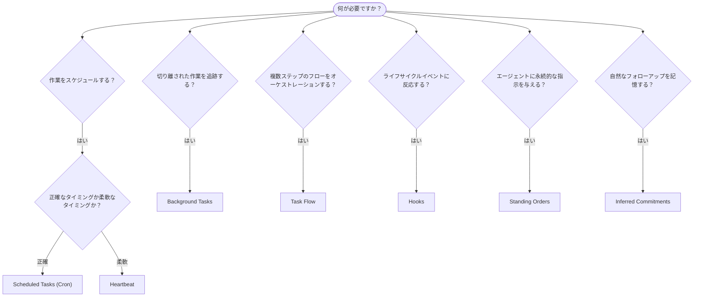

OpenClawは、タスク、スケジュール済みジョブ、推論されたコミットメント、イベントフック、Standing Ordersを通じてバックグラウンドで作業を実行します。このページでは、適切な仕組みを選び、それらがどのように連携するかを理解できます。

## クイック判断ガイド

| ユースケース                            | 推奨                   | 理由                                             |
| --------------------------------------- | ---------------------- | ------------------------------------------------ |
| 毎日午前9時ちょうどにレポートを送信する | Scheduled Tasks (Cron) | 正確なタイミング、分離された実行                 |
| 20分後にリマインドする                  | Scheduled Tasks (Cron) | 正確なタイミングの単発実行（`--at`）            |
| 毎週の詳細分析を実行する                | Scheduled Tasks (Cron) | 独立したタスクで、別のモデルも使用可能           |
| 30分ごとに受信箱を確認する              | Heartbeat              | 他の確認とまとめて処理でき、コンテキストを考慮   |
| 予定表で近づいているイベントを監視する  | Heartbeat              | 定期的な認識に自然に適合                         |
| 言及された面接の後に確認する            | Inferred Commitments   | メモリのようなフォローアップで、正確なリマインダー要求ではない |
| ユーザーコンテキストの後に軽いケア確認をする | Inferred Commitments   | 同じエージェントとチャンネルにスコープされる     |
| サブエージェントまたはACP実行の状態を調べる | Background Tasks       | タスク台帳がすべての切り離された作業を追跡する   |
| 何がいつ実行されたかを監査する          | Background Tasks       | `openclaw tasks list` と `openclaw tasks audit` |
| 複数ステップの調査後に要約する          | Task Flow              | リビジョン追跡付きの耐久的なオーケストレーション |
| セッションリセット時にスクリプトを実行する | Hooks                  | イベント駆動で、ライフサイクルイベント時に発火   |
| すべてのツール呼び出しでコードを実行する | Plugin hooks           | インプロセスフックがツール呼び出しをインターセプトできる |
| 返信前に常にコンプライアンスを確認する  | Standing Orders        | すべてのセッションに自動的に注入される           |

### Scheduled Tasks (Cron) と Heartbeat

| 観点            | Scheduled Tasks (Cron)              | Heartbeat                             |
| --------------- | ----------------------------------- | ------------------------------------- |
| タイミング      | 正確（cron式、単発）                | おおよそ（デフォルトは30分ごと）      |
| セッションコンテキスト | 新規（分離）または共有              | メインセッションの完全なコンテキスト  |
| タスクレコード  | 常に作成される                      | 作成されない                          |
| 配信            | チャンネル、webhook、または無音     | メインセッション内にインライン        |
| 最適な用途      | レポート、リマインダー、バックグラウンドジョブ | 受信箱確認、予定表、通知              |

正確なタイミングや分離された実行が必要な場合はScheduled Tasks (Cron)を使用します。完全なセッションコンテキストが役立ち、おおよそのタイミングで十分な場合はHeartbeatを使用します。

## コア概念

### スケジュール済みタスク（cron）

Cronは、正確なタイミングのためのGateway組み込みスケジューラーです。ジョブを永続化し、適切な時刻にエージェントを起動し、出力をチャットチャンネルまたはwebhookエンドポイントに配信できます。単発リマインダー、繰り返し式、インバウンドwebhookトリガーをサポートします。

[Scheduled Tasks](/ja-JP/automation/cron-jobs)を参照してください。

### タスク

バックグラウンドタスク台帳は、すべての切り離された作業を追跡します。ACP実行、サブエージェントの起動、分離されたcron実行、CLI操作が含まれます。タスクはレコードであり、スケジューラーではありません。確認には`openclaw tasks list`と`openclaw tasks audit`を使用します。

[Background Tasks](/ja-JP/automation/tasks)を参照してください。

### 推論されたコミットメント

コミットメントは、オプトインの短命なフォローアップメモリです。OpenClawは通常の会話からそれらを推論し、同じエージェントとチャンネルにスコープし、期限になった確認をheartbeat経由で配信します。ユーザーが正確に要求したリマインダーは引き続きcronの担当です。

[Inferred Commitments](/ja-JP/concepts/commitments)を参照してください。

### Task Flow

Task Flowは、バックグラウンドタスクの上にあるフローオーケストレーション基盤です。管理同期モードとミラー同期モード、リビジョン追跡、確認用の`openclaw tasks flow list|show|cancel`を備えた耐久的な複数ステップフローを管理します。

[Task Flow](/ja-JP/automation/taskflow)を参照してください。

### Standing Orders

Standing Ordersは、定義されたプログラムに対してエージェントに恒久的な運用権限を付与します。これはワークスペースファイル（通常は`AGENTS.md`）に置かれ、すべてのセッションに注入されます。時間ベースの強制にはcronと組み合わせます。

[Standing Orders](/ja-JP/automation/standing-orders)を参照してください。

### Hooks

内部フックは、エージェントのライフサイクルイベント（`/new`、`/reset`、`/stop`）、セッションCompaction、Gateway起動、メッセージフローによってトリガーされるイベント駆動スクリプトです。ディレクトリから自動的に検出され、`openclaw hooks`で管理できます。インプロセスのツール呼び出しインターセプトには、[Plugin hooks](/ja-JP/plugins/hooks)を使用します。

[Hooks](/ja-JP/automation/hooks)を参照してください。

### Heartbeat

Heartbeatは、定期的なメインセッションのターンです（デフォルトは30分ごと）。複数の確認（受信箱、予定表、通知）を、完全なセッションコンテキストを持つ1回のエージェントターンにまとめます。Heartbeatのターンはタスクレコードを作成せず、日次またはアイドル時のセッションリセットの新鮮さを延長しません。小さなチェックリストには`HEARTBEAT.md`を使用し、heartbeat自体の中で期限到来時のみの定期確認を行いたい場合は`tasks:`ブロックを使用します。空のheartbeatファイルは`empty-heartbeat-file`としてスキップされ、期限到来時のみのタスクモードは`no-tasks-due`としてスキップされます。cron作業がアクティブまたはキューにある間、Heartbeatは延期されます。また、`heartbeat.skipWhenBusy`は、同じエージェントのセッションキー付きサブエージェントまたはネストされたレーンがビジーな間、そのエージェントを延期することもできます。

[Heartbeat](/ja-JP/gateway/heartbeat)を参照してください。

## 連携の仕組み

- **Cron**は、正確なスケジュール（日次レポート、週次レビュー）と単発リマインダーを処理します。すべてのcron実行はタスクレコードを作成します。
- **Heartbeat**は、定期的な監視（受信箱、予定表、通知）を30分ごとの1回のまとめられたターンで処理します。
- **Hooks**は、特定のイベント（セッションリセット、Compaction、メッセージフロー）にカスタムスクリプトで反応します。Plugin hooksはツール呼び出しを対象にします。
- **Standing orders**は、エージェントに永続的なコンテキストと権限の境界を与えます。
- **Task Flow**は、個々のタスクの上で複数ステップのフローを調整します。
- **Tasks**は、すべての切り離された作業を自動的に追跡し、確認と監査を可能にします。

## 関連

- [Scheduled Tasks](/ja-JP/automation/cron-jobs) — 正確なスケジューリングと単発リマインダー
- [Inferred Commitments](/ja-JP/concepts/commitments) — メモリのようなフォローアップ確認
- [Background Tasks](/ja-JP/automation/tasks) — すべての切り離された作業のタスク台帳
- [Task Flow](/ja-JP/automation/taskflow) — 耐久的な複数ステップフローのオーケストレーション
- [Hooks](/ja-JP/automation/hooks) — イベント駆動のライフサイクルスクリプト
- [Plugin hooks](/ja-JP/plugins/hooks) — インプロセスのツール、プロンプト、メッセージ、ライフサイクルフック
- [Standing Orders](/ja-JP/automation/standing-orders) — 永続的なエージェント指示
- [Heartbeat](/ja-JP/gateway/heartbeat) — 定期的なメインセッションのターン
- [Configuration Reference](/ja-JP/gateway/configuration-reference) — すべての設定キー
