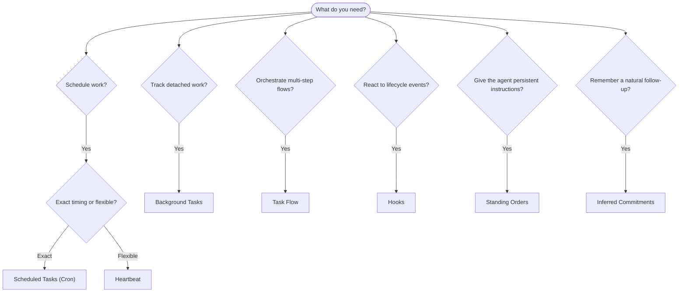

OpenClaw は、タスク、スケジュール済みジョブ、推測されたコミットメント、イベントフック、常設指示を通じてバックグラウンドで作業を実行します。このページでは、適切な仕組みの選び方と、それらがどのように連携するかを説明します。

## クイック判断ガイド

| ユースケース                                | 推奨                   | 理由                                             |
| --------------------------------------- | ---------------------- | ------------------------------------------------ |
| 毎日のレポートを午前9時ちょうどに送信する         | スケジュール済みタスク (Cron) | 正確なタイミング、分離された実行                 |
| 20分後にリマインドする                 | スケジュール済みタスク (Cron) | 正確なタイミングの単発実行 (`--at`)            |
| 毎週の詳細分析を実行する                | スケジュール済みタスク (Cron) | 独立したタスク、別のモデルを使用可能         |
| 30分ごとに受信箱を確認する                | Heartbeat              | 他の確認とバッチ処理、コンテキスト対応         |
| 今後の予定についてカレンダーを監視する    | Heartbeat              | 定期的な把握に自然に適合               |
| 言及された面接の後に確認する    | 推測されたコミットメント   | メモリのようなフォローアップ、正確なリマインダー要求ではない |
| ユーザーのコンテキスト後にやさしく様子を確認する | 推測されたコミットメント   | 同じエージェントとチャンネルにスコープされる             |
| サブエージェントまたは ACP 実行の状態を調べる | バックグラウンドタスク       | タスク台帳がすべての切り離された作業を追跡する            |
| 何がいつ実行されたかを監査する                 | バックグラウンドタスク       | `openclaw tasks list` と `openclaw tasks audit` |
| 複数ステップの調査後に要約する      | Task Flow              | リビジョン追跡付きの永続的なオーケストレーション     |
| セッションリセット時にスクリプトを実行する           | フック                  | イベント駆動で、ライフサイクルイベント時に発火する          |
| すべてのツール呼び出しでコードを実行する         | Plugin フック           | プロセス内フックでツール呼び出しをインターセプトできる        |
| 返信前に常にコンプライアンスを確認する | 常設指示        | すべてのセッションに自動的に注入される        |

### スケジュール済みタスク (Cron) と Heartbeat

| 観点       | スケジュール済みタスク (Cron)              | Heartbeat                             |
| --------------- | ----------------------------------- | ------------------------------------- |
| タイミング          | 正確 (cron 式、単発)  | おおよそ (デフォルトは30分ごと)    |
| セッションコンテキスト | 新規 (分離) または共有          | メインセッションの完全なコンテキスト             |
| タスク記録    | 常に作成される                      | 作成されない                         |
| 配信        | チャンネル、webhook、またはサイレント         | メインセッション内にインライン                |
| 最適な用途        | レポート、リマインダー、バックグラウンドジョブ | 受信箱確認、カレンダー、通知 |

正確なタイミングや分離された実行が必要な場合は、スケジュール済みタスク (Cron) を使用します。完全なセッションコンテキストが有用で、おおよそのタイミングで問題ない場合は Heartbeat を使用します。

## コア概念

### スケジュール済みタスク (cron)

Cron は、正確なタイミングのための Gateway 組み込みスケジューラーです。ジョブを永続化し、適切な時刻にエージェントを起動し、出力をチャットチャンネルまたは webhook エンドポイントへ配信できます。単発リマインダー、繰り返し式、受信 webhook トリガーをサポートします。

[スケジュール済みタスク](/ja-JP/automation/cron-jobs)を参照してください。

### タスク

バックグラウンドタスク台帳は、ACP 実行、サブエージェントの生成、分離された cron 実行、CLI 操作など、すべての切り離された作業を追跡します。タスクは記録であり、スケジューラーではありません。確認には `openclaw tasks list` と `openclaw tasks audit` を使用します。

[バックグラウンドタスク](/ja-JP/automation/tasks)を参照してください。

### 推測されたコミットメント

コミットメントは、オプトインの短期間のフォローアップメモリです。OpenClaw は通常の会話からそれらを推測し、同じエージェントとチャンネルにスコープし、期限が来た確認を Heartbeat 経由で配信します。ユーザーが正確に要求したリマインダーは、引き続き cron に属します。

[推測されたコミットメント](/ja-JP/concepts/commitments)を参照してください。

### Task Flow

Task Flow は、バックグラウンドタスクの上にあるフローオーケストレーション基盤です。管理型およびミラー型の同期モード、リビジョン追跡、確認用の `openclaw tasks flow list|show|cancel` を備えた、永続的な複数ステップのフローを管理します。

[Task Flow](/ja-JP/automation/taskflow)を参照してください。

### 常設指示

常設指示は、定義されたプログラムに対する永続的な運用権限をエージェントに付与します。ワークスペースファイル (通常は `AGENTS.md`) に置かれ、すべてのセッションに注入されます。時間ベースの適用には cron と組み合わせます。

[常設指示](/ja-JP/automation/standing-orders)を参照してください。

### フック

内部フックは、エージェントのライフサイクルイベント (`/new`、`/reset`、`/stop`)、セッション Compaction、Gateway 起動、メッセージフローによってトリガーされるイベント駆動スクリプトです。ディレクトリから自動検出され、`openclaw hooks` で管理できます。プロセス内のツール呼び出しインターセプトには、[Plugin フック](/ja-JP/plugins/hooks)を使用します。

[フック](/ja-JP/automation/hooks)を参照してください。

### Heartbeat

Heartbeat は、定期的なメインセッションターン (デフォルトは30分ごと) です。複数の確認 (受信箱、カレンダー、通知) を、完全なセッションコンテキストを持つ1回のエージェントターンにまとめます。Heartbeat ターンはタスク記録を作成せず、日次/アイドルセッションリセットの鮮度を延長しません。小さなチェックリストには `HEARTBEAT.md` を使用し、Heartbeat 自体の内部で期限到来分のみの定期確認を行いたい場合は `tasks:` ブロックを使用します。空の Heartbeat ファイルは `empty-heartbeat-file` としてスキップされ、期限到来分のみのタスクモードは `no-tasks-due` としてスキップされます。cron 作業がアクティブまたはキューにある間は Heartbeat が延期され、`heartbeat.skipWhenBusy` によってサブエージェントまたはネストされたレーンがビジーの間も延期できます。

[Heartbeat](/ja-JP/gateway/heartbeat)を参照してください。

## それぞれの連携方法

- **Cron** は、正確なスケジュール (毎日のレポート、週次レビュー) と単発リマインダーを処理します。すべての cron 実行はタスク記録を作成します。
- **Heartbeat** は、30分ごとの1回のバッチ化されたターンで、通常の監視 (受信箱、カレンダー、通知) を処理します。
- **フック** は、特定のイベント (セッションリセット、Compaction、メッセージフロー) にカスタムスクリプトで反応します。Plugin フックはツール呼び出しを対象にします。
- **常設指示** は、エージェントに永続的なコンテキストと権限境界を与えます。
- **Task Flow** は、個々のタスクの上で複数ステップのフローを調整します。
- **タスク** は、すべての切り離された作業を自動的に追跡し、確認および監査できるようにします。

## 関連

- [スケジュール済みタスク](/ja-JP/automation/cron-jobs) — 正確なスケジューリングと単発リマインダー
- [推測されたコミットメント](/ja-JP/concepts/commitments) — メモリのようなフォローアップ確認
- [バックグラウンドタスク](/ja-JP/automation/tasks) — すべての切り離された作業のタスク台帳
- [Task Flow](/ja-JP/automation/taskflow) — 永続的な複数ステップフローのオーケストレーション
- [フック](/ja-JP/automation/hooks) — イベント駆動のライフサイクルスクリプト
- [Plugin フック](/ja-JP/plugins/hooks) — プロセス内のツール、プロンプト、メッセージ、ライフサイクルフック
- [常設指示](/ja-JP/automation/standing-orders) — 永続的なエージェント指示
- [Heartbeat](/ja-JP/gateway/heartbeat) — 定期的なメインセッションターン
- [設定リファレンス](/ja-JP/gateway/configuration-reference) — すべての設定キー
