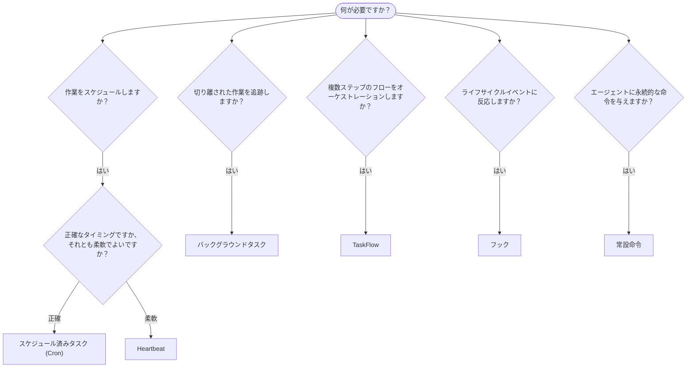

---
read_when:
    - OpenClawで作業を自動化する方法を決める
    - Heartbeat、Cron、フック、常設命令のどれを選ぶか
    - 適切な自動化の入り口を探す
summary: '自動化メカニズムの概要: タスク、Cron、フック、常設命令、TaskFlow'
title: 自動化とタスク
x-i18n:
    generated_at: "2026-04-24T04:45:01Z"
    model: gpt-5.4
    provider: openai
    source_hash: 1b4615cc05a6d0ef7c92f44072d11a2541bc5e17b7acb88dc27ddf0c36b2dcab
    source_path: automation/index.md
    workflow: 15
---

OpenClawは、タスク、スケジュール済みジョブ、イベントフック、常設命令を通じて、バックグラウンドで作業を実行します。このページでは、適切なメカニズムを選び、それらがどのように連携するかを理解するのに役立ちます。

## クイック決定ガイド

| ユースケース | 推奨 | 理由 |
| --------------------------------------- | ---------------------- | ------------------------------------------------ |
| 毎日午前9時ちょうどにレポートを送信する | スケジュール済みタスク (Cron) | 正確なタイミング、分離された実行 |
| 20分後にリマインドする | スケジュール済みタスク (Cron) | 正確なタイミングでの単発実行 (`--at`) |
| 毎週詳細な分析を実行する | スケジュール済みタスク (Cron) | 独立したタスクで、別のモデルを使用可能 |
| 30分ごとに受信トレイを確認する | Heartbeat | 他の確認とまとめて実行され、コンテキストを認識する |
| 今後の予定についてカレンダーを監視する | Heartbeat | 定期的な状況認識に自然に適合する |
| サブエージェントまたはACP実行の状態を確認する | バックグラウンドタスク | タスク台帳がすべての切り離された作業を追跡する |
| 何がいつ実行されたかを監査する | バックグラウンドタスク | `openclaw tasks list` と `openclaw tasks audit` |
| 複数ステップの調査を行ってから要約する | TaskFlow | リビジョン追跡付きの永続的なオーケストレーション |
| セッションのリセット時にスクリプトを実行する | フック | イベント駆動で、ライフサイクルイベント時に起動する |
| すべてのツール呼び出しでコードを実行する | フック | フックはイベントタイプでフィルタできる |
| 応答前に常にコンプライアンスを確認する | 常設命令 | 毎回のセッションに自動的に注入される |

### スケジュール済みタスク (Cron) と Heartbeat の比較

| 観点 | スケジュール済みタスク (Cron) | Heartbeat |
| --------------- | ----------------------------------- | ------------------------------------- |
| タイミング | 正確 (cron式、単発実行) | おおよそ (デフォルトでは30分ごと) |
| セッションコンテキスト | 新規 (分離) または共有 | メインセッションの完全なコンテキスト |
| タスク記録 | 常に作成される | 作成されない |
| 配信 | チャネル、Webhook、またはサイレント | メインセッション内にインライン表示 |
| 最適な用途 | レポート、リマインダー、バックグラウンドジョブ | 受信トレイ確認、カレンダー、通知 |

正確なタイミングや分離された実行が必要な場合は、スケジュール済みタスク (Cron) を使用します。作業が完全なセッションコンテキストの恩恵を受け、おおよそのタイミングで問題ない場合は、Heartbeatを使用します。

## 中核となる概念

### スケジュール済みタスク (cron)

Cronは、正確なタイミングのためのGateway内蔵スケジューラです。ジョブを永続化し、適切なタイミングでエージェントを起こし、出力をチャットチャネルやWebhookエンドポイントに配信できます。単発のリマインダー、繰り返し式、受信Webhookトリガーをサポートします。

[スケジュール済みタスク](/ja-JP/automation/cron-jobs)を参照してください。

### タスク

バックグラウンドタスク台帳は、ACP実行、サブエージェント生成、分離されたcron実行、CLI操作など、すべての切り離された作業を追跡します。タスクはスケジューラではなく、記録です。`openclaw tasks list` と `openclaw tasks audit` を使用して確認します。

[バックグラウンドタスク](/ja-JP/automation/tasks)を参照してください。

### TaskFlow

TaskFlowは、バックグラウンドタスクの上位にあるフローオーケストレーション基盤です。管理モードおよびミラーモードの同期、リビジョン追跡、確認用の `openclaw tasks flow list|show|cancel` とともに、永続的な複数ステップのフローを管理します。

[TaskFlow](/ja-JP/automation/taskflow)を参照してください。

### 常設命令

常設命令は、定義されたプログラムに対する恒久的な運用権限をエージェントに付与します。これらはワークスペースファイル（通常は`AGENTS.md`）に存在し、すべてのセッションに注入されます。時間ベースの強制にはcronと組み合わせてください。

[常設命令](/ja-JP/automation/standing-orders)を参照してください。

### フック

フックは、エージェントのライフサイクルイベント（`/new`、`/reset`、`/stop`）、セッションCompaction、Gateway起動、メッセージフロー、ツール呼び出しによってトリガーされるイベント駆動型スクリプトです。フックはディレクトリから自動的に検出され、`openclaw hooks` で管理できます。

[フック](/ja-JP/automation/hooks)を参照してください。

### Heartbeat

Heartbeatは、定期的なメインセッションターンです（デフォルトでは30分ごと）。複数の確認（受信トレイ、カレンダー、通知）を、完全なセッションコンテキストを持つ1回のエージェントターンにまとめます。Heartbeatターンではタスク記録は作成されません。小さなチェックリストには `HEARTBEAT.md` を使用し、Heartbeat自体の中で期限到来時のみの定期チェックを行いたい場合は `tasks:` ブロックを使用します。空のheartbeatファイルは `empty-heartbeat-file` としてスキップされ、期限到来時のみのタスクモードは `no-tasks-due` としてスキップされます。

[Heartbeat](/ja-JP/gateway/heartbeat)を参照してください。

## どのように連携するか

- **Cron** は、正確なスケジュール（毎日のレポート、毎週のレビュー）と単発のリマインダーを処理します。すべてのcron実行でタスク記録が作成されます。
- **Heartbeat** は、定期的な監視（受信トレイ、カレンダー、通知）を30分ごとに1回のバッチ処理ターンで行います。
- **フック** は、特定のイベント（ツール呼び出し、セッションリセット、Compaction）に対してカスタムスクリプトで反応します。
- **常設命令** は、エージェントに永続的なコンテキストと権限の境界を与えます。
- **TaskFlow** は、個々のタスクの上位で複数ステップのフローを調整します。
- **タスク** は、すべての切り離された作業を自動的に追跡するため、確認や監査ができます。

## 関連

- [スケジュール済みタスク](/ja-JP/automation/cron-jobs) — 正確なスケジューリングと単発のリマインダー
- [バックグラウンドタスク](/ja-JP/automation/tasks) — すべての切り離された作業のためのタスク台帳
- [TaskFlow](/ja-JP/automation/taskflow) — 永続的な複数ステップのフローオーケストレーション
- [フック](/ja-JP/automation/hooks) — イベント駆動型ライフサイクルスクリプト
- [常設命令](/ja-JP/automation/standing-orders) — 永続的なエージェント命令
- [Heartbeat](/ja-JP/gateway/heartbeat) — 定期的なメインセッションターン
- [設定リファレンス](/ja-JP/gateway/configuration-reference) — すべての設定キー
