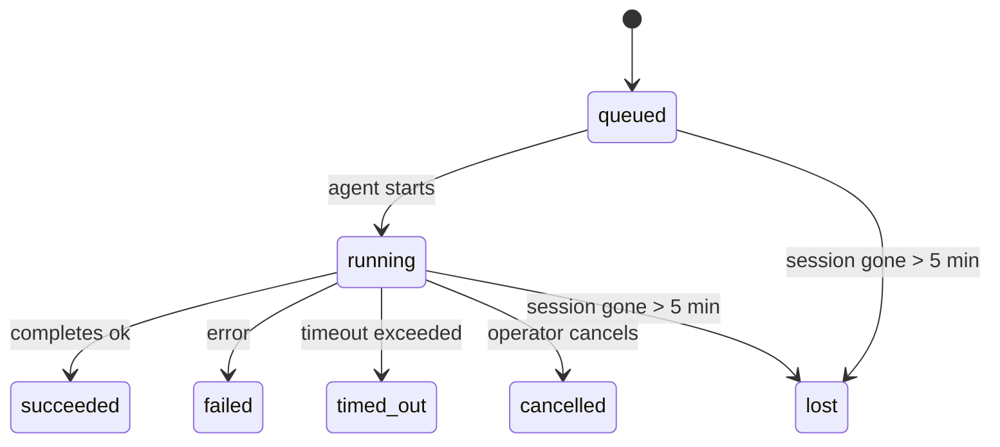

---
read_when:
    - 進行中または最近完了したバックグラウンド作業の確認
    - 分離されたエージェント実行の配信失敗のデバッグ
    - バックグラウンド実行がセッション、Cron、および Heartbeat とどのように関連するかを理解する
summary: ACP 実行、サブエージェント、分離された Cron ジョブ、および CLI 操作のバックグラウンドタスク追跡
title: バックグラウンドタスク
x-i18n:
    generated_at: "2026-04-21T04:43:45Z"
    model: gpt-5.4
    provider: openai
    source_hash: ba5511b1c421bdf505fc7d34f09e453ac44e85213fcb0f082078fa957aa91fe7
    source_path: automation/tasks.md
    workflow: 15
---

# バックグラウンドタスク

> **スケジューリングをお探しですか？** 適切な仕組みを選ぶには [Automation & Tasks](/ja-JP/automation) を参照してください。このページで扱うのはバックグラウンド作業の**追跡**であり、スケジューリングではありません。

バックグラウンドタスクは、**メインの会話セッションの外側**で実行される作業を追跡します:
ACP 実行、サブエージェントの起動、分離された Cron ジョブの実行、および CLI から開始された操作です。

タスクはセッション、Cron ジョブ、または Heartbeat を置き換えるものではありません — それらは、どの分離された作業が、いつ発生し、成功したかどうかを記録する**アクティビティ台帳**です。

<Note>
すべてのエージェント実行がタスクを作成するわけではありません。Heartbeat ターンと通常の対話型チャットは作成しません。すべての Cron 実行、ACP 起動、サブエージェント起動、および CLI エージェントコマンドは作成します。
</Note>

## 要点

- タスクはスケジューラではなく**記録**です — Cron と Heartbeat が作業をいつ実行するかを決め、タスクは何が起きたかを追跡します。
- ACP、サブエージェント、すべての Cron ジョブ、および CLI 操作はタスクを作成します。Heartbeat ターンは作成しません。
- 各タスクは `queued → running → terminal`（succeeded、failed、timed_out、cancelled、または lost）を移動します。
- Cron タスクは、Cron ランタイムがまだジョブを所有している間は存続します。チャットに裏打ちされた CLI タスクは、所有する実行コンテキストがまだアクティブな間だけ存続します。
- 完了はプッシュ駆動です。分離された作業は完了時に直接通知するか、要求元セッション/Heartbeat を起こせるため、通常はステータスをポーリングするループは適切ではありません。
- 分離された Cron 実行とサブエージェント完了では、最終的なクリーンアップ記録処理の前に、その子セッションに対して追跡されたブラウザータブ/プロセスをベストエフォートでクリーンアップします。
- 分離された Cron 配信では、子孫サブエージェントの作業がまだ排出中である間は古い中間親応答を抑制し、配信前に最終的な子孫出力が到着した場合はそちらを優先します。
- 完了通知はチャネルに直接配信されるか、次の Heartbeat のためにキューに入れられます。
- `openclaw tasks list` はすべてのタスクを表示し、`openclaw tasks audit` は問題を明らかにします。
- 終端レコードは 7 日間保持され、その後自動的に削除されます。

## クイックスタート

```bash
# すべてのタスクを一覧表示（新しい順）
openclaw tasks list

# ランタイムまたはステータスで絞り込み
openclaw tasks list --runtime acp
openclaw tasks list --status running

# 特定のタスクの詳細を表示（ID、run ID、または session key で指定）
openclaw tasks show <lookup>

# 実行中のタスクをキャンセル（子セッションを終了）
openclaw tasks cancel <lookup>

# タスクの通知ポリシーを変更
openclaw tasks notify <lookup> state_changes

# 健全性監査を実行
openclaw tasks audit

# メンテナンスをプレビューまたは適用
openclaw tasks maintenance
openclaw tasks maintenance --apply

# TaskFlow の状態を確認
openclaw tasks flow list
openclaw tasks flow show <lookup>
openclaw tasks flow cancel <lookup>
```

## タスクを作成するもの

| ソース                 | ランタイム種別 | タスクレコードが作成されるタイミング                  | デフォルトの通知ポリシー |
| ---------------------- | -------------- | ----------------------------------------------------- | ------------------------ |
| ACP バックグラウンド実行 | `acp`          | 子 ACP セッションを起動したとき                       | `done_only`              |
| サブエージェントオーケストレーション | `subagent`     | `sessions_spawn` によってサブエージェントを起動したとき | `done_only`              |
| Cron ジョブ（すべての種類）  | `cron`         | すべての Cron 実行（メインセッションと分離実行）      | `silent`                 |
| CLI 操作               | `cli`          | ゲートウェイ経由で実行される `openclaw agent` コマンド | `silent`                 |
| エージェントメディアジョブ | `cli`          | セッションに裏打ちされた `video_generate` 実行        | `silent`                 |

メインセッションの Cron タスクは、デフォルトで `silent` 通知ポリシーを使用します — 追跡用のレコードは作成しますが、通知は生成しません。分離された Cron タスクもデフォルトは `silent` ですが、独自のセッションで実行されるため、より見えやすくなります。

セッションに裏打ちされた `video_generate` 実行も `silent` 通知ポリシーを使用します。これらもタスクレコードを作成しますが、完了は内部ウェイクとして元のエージェントセッションに返されるため、エージェント自身がフォローアップメッセージを書き、完成した動画を添付できます。`tools.media.asyncCompletion.directSend` を有効にすると、非同期の `music_generate` および `video_generate` 完了は、要求元セッションを起こす経路にフォールバックする前に、まずチャネルへの直接配信を試みます。

セッションに裏打ちされた `video_generate` タスクがまだアクティブな間、このツールはガードレールとしても機能します。同じセッション内で繰り返し `video_generate` を呼び出すと、2 つ目の同時生成を開始する代わりに、アクティブなタスクステータスを返します。エージェント側から明示的な進捗/ステータス確認を行いたい場合は、`action: "status"` を使用してください。

**タスクを作成しないもの:**

- Heartbeat ターン — メインセッション。詳細は [Heartbeat](/ja-JP/gateway/heartbeat) を参照
- 通常の対話型チャットターン
- 直接の `/command` 応答

## タスクライフサイクル



| ステータス   | 意味                                                                       |
| ------------ | -------------------------------------------------------------------------- |
| `queued`     | 作成済みで、エージェントの開始待ち                                         |
| `running`    | エージェントターンが現在実行中                                             |
| `succeeded`  | 正常に完了                                                                 |
| `failed`     | エラーを伴って完了                                                         |
| `timed_out`  | 設定されたタイムアウトを超過                                               |
| `cancelled`  | オペレーターが `openclaw tasks cancel` で停止                             |
| `lost`       | 5 分の猶予期間後に、ランタイムが権威ある裏付け状態を失った                 |

遷移は自動で行われます — 関連するエージェント実行が終了すると、タスクステータスはそれに合わせて更新されます。

`lost` はランタイムを認識します:

- ACP タスク: 裏付けとなる ACP 子セッションメタデータが消えた。
- サブエージェントタスク: 裏付けとなる子セッションが対象エージェントストアから消えた。
- Cron タスク: Cron ランタイムがそのジョブをアクティブとして追跡しなくなった。
- CLI タスク: 分離された子セッションタスクは子セッションを使用します。チャットに裏打ちされた CLI タスクは代わりにライブ実行コンテキストを使用するため、チャネル/グループ/ダイレクトセッション行が残っていても存続しません。

## 配信と通知

タスクが終端状態に達すると、OpenClaw が通知します。配信経路は 2 つあります。

**直接配信** — タスクにチャネルターゲット（`requesterOrigin`）がある場合、完了メッセージはそのチャネル（Telegram、Discord、Slack など）に直接送られます。サブエージェント完了では、利用可能な場合に OpenClaw は結び付けられたスレッド/トピックのルーティングも保持し、直接配信を諦める前に、要求元セッションの保存済みルート（`lastChannel` / `lastTo` / `lastAccountId`）から欠けている `to` / account を補完できます。

**セッションキュー配信** — 直接配信に失敗した場合、または origin が設定されていない場合、更新は要求元セッション内のシステムイベントとしてキューに入れられ、次の Heartbeat で表面化します。

<Tip>
タスク完了は即時の Heartbeat ウェイクを引き起こすため、結果をすぐに確認できます — 次に予定された Heartbeat ティックを待つ必要はありません。
</Tip>

つまり、通常のワークフローはプッシュベースです。分離された作業は一度開始したら、完了時にランタイムが起こすか通知するのに任せます。タスク状態のポーリングは、デバッグ、介入、または明示的な監査が必要な場合にだけ行ってください。

### 通知ポリシー

各タスクについて、どの程度通知を受け取るかを制御します。

| ポリシー              | 配信される内容                                                          |
| --------------------- | ----------------------------------------------------------------------- |
| `done_only` (デフォルト) | 終端状態のみ（succeeded、failed など） — **これがデフォルトです**       |
| `state_changes`       | すべての状態遷移と進捗更新                                              |
| `silent`              | 何も通知しない                                                          |

タスク実行中にポリシーを変更します:

```bash
openclaw tasks notify <lookup> state_changes
```

## CLI リファレンス

### `tasks list`

```bash
openclaw tasks list [--runtime <acp|subagent|cron|cli>] [--status <status>] [--json]
```

出力列: Task ID、種類、ステータス、配信、Run ID、子セッション、要約。

### `tasks show`

```bash
openclaw tasks show <lookup>
```

lookup トークンには task ID、run ID、または session key を指定できます。タイミング、配信状態、エラー、および終端要約を含む完全なレコードを表示します。

### `tasks cancel`

```bash
openclaw tasks cancel <lookup>
```

ACP およびサブエージェントタスクでは、これにより子セッションが終了されます。CLI 追跡タスクでは、キャンセルはタスクレジストリに記録されます（別個の子ランタイムハンドルはありません）。ステータスは `cancelled` に遷移し、該当する場合は配信通知が送信されます。

### `tasks notify`

```bash
openclaw tasks notify <lookup> <done_only|state_changes|silent>
```

### `tasks audit`

```bash
openclaw tasks audit [--json]
```

運用上の問題を明らかにします。問題が検出された場合、所見は `openclaw status` にも表示されます。

| 所見                      | 重大度 | トリガー                                               |
| ------------------------- | ------ | ------------------------------------------------------ |
| `stale_queued`            | warn   | 10 分を超えて queued のまま                            |
| `stale_running`           | error  | 30 分を超えて running のまま                           |
| `lost`                    | error  | ランタイムに裏打ちされたタスク所有権が消失             |
| `delivery_failed`         | warn   | 配信に失敗し、通知ポリシーが `silent` ではない         |
| `missing_cleanup`         | warn   | 終端タスクだがクリーンアップタイムスタンプがない       |
| `inconsistent_timestamps` | warn   | タイムライン違反（たとえば開始前に終了している）       |

### `tasks maintenance`

```bash
openclaw tasks maintenance [--json]
openclaw tasks maintenance --apply [--json]
```

これを使用して、タスクと Task Flow 状態の突合、クリーンアップ刻印、および削除をプレビューまたは適用します。

突合はランタイムを認識します:

- ACP/サブエージェントタスクは、裏付けとなる子セッションを確認します。
- Cron タスクは、Cron ランタイムがまだそのジョブを所有しているかを確認します。
- チャットに裏打ちされた CLI タスクは、チャットセッション行だけでなく、所有するライブ実行コンテキストを確認します。

完了クリーンアップもランタイムを認識します:

- サブエージェント完了では、通知クリーンアップが続行する前に、子セッションの追跡されたブラウザータブ/プロセスをベストエフォートで閉じます。
- 分離された Cron 完了では、実行が完全に終了する前に、Cron セッションの追跡されたブラウザータブ/プロセスをベストエフォートで閉じます。
- 分離された Cron 配信では、必要に応じて子孫サブエージェントのフォローアップを待ち、古い親確認テキストを通知する代わりにそれを抑制します。
- サブエージェント完了配信では、最新の可視 assistant テキストを優先し、それが空の場合はサニタイズ済みの最新 tool/toolResult テキストにフォールバックします。また、タイムアウトのみのツール呼び出し実行は短い部分進捗要約にまとめられる場合があります。
- クリーンアップ失敗によって、実際のタスク結果が隠されることはありません。

### `tasks flow list|show|cancel`

```bash
openclaw tasks flow list [--status <status>] [--json]
openclaw tasks flow show <lookup> [--json]
openclaw tasks flow cancel <lookup>
```

個々のバックグラウンドタスクレコードではなく、オーケストレーションする Task Flow のほうが関心対象である場合にこれらを使用してください。

## チャットタスクボード（`/tasks`）

任意のチャットセッションで `/tasks` を使用すると、そのセッションにリンクされたバックグラウンドタスクを確認できます。ボードには、アクティブおよび最近完了したタスクについて、ランタイム、ステータス、タイミング、進捗またはエラーの詳細が表示されます。

現在のセッションに表示可能なリンク済みタスクがない場合、`/tasks` はエージェントローカルのタスク数にフォールバックするため、他セッションの詳細を漏らさずに概要を把握できます。

完全なオペレーター台帳を確認するには、CLI を使用します: `openclaw tasks list`。

## Status 統合（タスク負荷）

`openclaw status` には、ひと目でわかるタスク要約が含まれます。

```
Tasks: 3 queued · 2 running · 1 issues
```

この要約では、次を報告します。

- **active** — `queued` + `running` の件数
- **failures** — `failed` + `timed_out` + `lost` の件数
- **byRuntime** — `acp`、`subagent`、`cron`、`cli` ごとの内訳

`/status` と `session_status` ツールの両方は、クリーンアップを考慮したタスクスナップショットを使用します。アクティブなタスクが優先され、古い完了済み行は非表示になり、最近の失敗はアクティブな作業が残っていない場合にのみ表示されます。これにより、ステータスカードは今重要なことに集中できます。

## 保存とメンテナンス

### タスクの保存場所

タスクレコードは、次の場所にある SQLite に永続化されます。

```
$OPENCLAW_STATE_DIR/tasks/runs.sqlite
```

レジストリは Gateway 起動時にメモリへ読み込まれ、再起動をまたいだ永続性のために書き込みを SQLite へ同期します。

### 自動メンテナンス

スイーパーは **60 秒**ごとに実行され、次の 3 つを処理します。

1. **突合** — アクティブなタスクに、まだ権威あるランタイムの裏付けがあるかを確認します。ACP/サブエージェントタスクは子セッション状態を使用し、Cron タスクはアクティブジョブの所有状態を使用し、チャットに裏打ちされた CLI タスクは所有する実行コンテキストを使用します。その裏付け状態が 5 分を超えて失われている場合、タスクは `lost` としてマークされます。
2. **クリーンアップ刻印** — 終端タスクに `cleanupAfter` タイムスタンプ（endedAt + 7 日）を設定します。
3. **削除** — `cleanupAfter` 日付を過ぎたレコードを削除します。

**保持期間**: 終端タスクレコードは **7 日間**保持され、その後自動的に削除されます。設定は不要です。

## タスクと他のシステムの関係

### タスクと Task Flow

[Task Flow](/ja-JP/automation/taskflow) は、バックグラウンドタスクの上位にあるフローオーケストレーション層です。1 つのフローは、そのライフタイムの間に managed または mirrored sync モードを使用して複数のタスクを調整できます。個々のタスクレコードを調べるには `openclaw tasks` を、オーケストレーションするフローを調べるには `openclaw tasks flow` を使用します。

詳細は [Task Flow](/ja-JP/automation/taskflow) を参照してください。

### タスクと Cron

Cron ジョブの**定義**は `~/.openclaw/cron/jobs.json` にあり、ランタイム実行状態はその隣の `~/.openclaw/cron/jobs-state.json` にあります。**すべての** Cron 実行はタスクレコードを作成します — メインセッション実行と分離実行の両方です。メインセッションの Cron タスクはデフォルトで `silent` 通知ポリシーを使用するため、通知を生成せずに追跡されます。

[Scheduled Tasks](/ja-JP/automation/cron-jobs) を参照してください。

### タスクと Heartbeat

Heartbeat 実行はメインセッションターンです — タスクレコードは作成しません。タスクが完了すると、結果をすぐに確認できるよう Heartbeat ウェイクをトリガーできます。

[Heartbeat](/ja-JP/gateway/heartbeat) を参照してください。

### タスクとセッション

タスクは `childSessionKey`（作業が実行される場所）と `requesterSessionKey`（それを開始した人）を参照する場合があります。セッションは会話コンテキストであり、タスクはその上でのアクティビティ追跡です。

### タスクとエージェント実行

タスクの `runId` は、作業を実行しているエージェント実行にリンクされます。エージェントのライフサイクルイベント（開始、終了、エラー）は自動的にタスクステータスを更新するため、ライフサイクルを手動で管理する必要はありません。

## 関連

- [Automation & Tasks](/ja-JP/automation) — すべての自動化メカニズムの概要
- [Task Flow](/ja-JP/automation/taskflow) — タスクの上位にあるフローオーケストレーション
- [Scheduled Tasks](/ja-JP/automation/cron-jobs) — バックグラウンド作業のスケジューリング
- [Heartbeat](/ja-JP/gateway/heartbeat) — 定期的なメインセッションターン
- [CLI: Tasks](/cli/index#tasks) — CLI コマンドリファレンス
