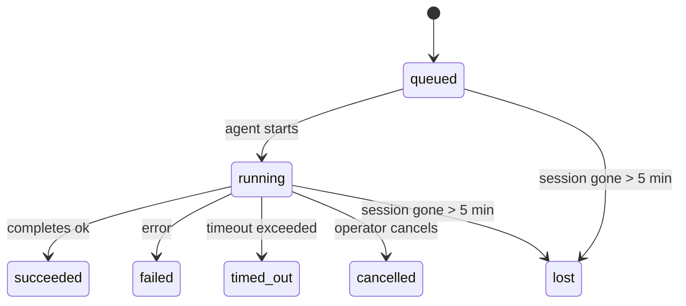

---
read_when:
    - 進行中または最近完了したバックグラウンド作業を確認する
    - デタッチされたエージェント実行の配信失敗をデバッグする
    - バックグラウンド実行がセッション、Cron、Heartbeat とどのように関係するかを理解する
sidebarTitle: Background tasks
summary: ACP 実行、サブエージェント、分離された Cron ジョブ、CLI 操作のバックグラウンドタスク追跡
title: バックグラウンドタスク
x-i18n:
    generated_at: "2026-05-06T04:57:21Z"
    model: gpt-5.5
    provider: openai
    source_hash: 055e16b4f53dbd089cc72eea7fe80bdaee5451dc56fa6e88a742f98e566bb57a
    source_path: automation/tasks.md
    workflow: 16
---

<Note>
スケジュール設定を探している場合は、適切な仕組みを選ぶために [自動化とタスク](/ja-JP/automation) を参照してください。このページはバックグラウンド作業のアクティビティ台帳であり、スケジューラーではありません。
</Note>

バックグラウンドタスクは、**メインの会話セッションの外部**で実行される作業を追跡します。ACP 実行、サブエージェントの生成、分離された cron ジョブ実行、CLI から開始された操作などです。

タスクは、セッション、cron ジョブ、Heartbeat を置き換えるものではありません。タスクは、どの切り離された作業がいつ発生し、成功したかどうかを記録する**アクティビティ台帳**です。

<Note>
すべてのエージェント実行がタスクを作成するわけではありません。Heartbeat ターンと通常の対話型チャットは作成しません。すべての cron 実行、ACP 生成、サブエージェント生成、CLI エージェントコマンドは作成します。
</Note>

## TL;DR

- タスクはスケジューラーではなく**記録**です。cron と Heartbeat が作業を_いつ_実行するかを決め、タスクは_何が起きたか_を追跡します。
- ACP、サブエージェント、すべての cron ジョブ、CLI 操作はタスクを作成します。Heartbeat ターンは作成しません。
- 各タスクは `queued → running → terminal`（succeeded、failed、timed_out、cancelled、lost のいずれか）を進みます。
- Cron タスクは、cron ランタイムがまだジョブを所有している間は live のままです。
  メモリ上のランタイム状態がなくなった場合、タスクメンテナンスはタスクを lost としてマークする前に、まず永続化された cron 実行履歴を確認します。
- 完了はプッシュ駆動です。切り離された作業は、完了時に直接通知するか、リクエスターのセッション/Heartbeat を起こせるため、ステータスのポーリングループは通常適切な形ではありません。
- 分離された cron 実行とサブエージェント完了は、最終クリーンアップの帳簿処理の前に、子セッションで追跡されたブラウザータブ/プロセスをベストエフォートでクリーンアップします。
- 分離された cron 配信は、子孫サブエージェント作業がまだ排出中の間は古くなった暫定的な親返信を抑制し、配信前に子孫の最終出力が到着した場合はそれを優先します。
- 完了通知はチャネルに直接配信されるか、次の Heartbeat 用にキューに入れられます。
- `openclaw tasks list` はすべてのタスクを表示します。`openclaw tasks audit` は問題を表面化します。
- 終端レコードは 7 日間保持され、その後自動的に削除されます。

## クイックスタート

<Tabs>
  <Tab title="List and filter">
    ```bash
    # List all tasks (newest first)
    openclaw tasks list

    # Filter by runtime or status
    openclaw tasks list --runtime acp
    openclaw tasks list --status running
    ```

  </Tab>
  <Tab title="Inspect">
    ```bash
    # Show details for a specific task (by ID, run ID, or session key)
    openclaw tasks show <lookup>
    ```
  </Tab>
  <Tab title="Cancel and notify">
    ```bash
    # Cancel a running task (kills the child session)
    openclaw tasks cancel <lookup>

    # Change notification policy for a task
    openclaw tasks notify <lookup> state_changes
    ```

  </Tab>
  <Tab title="Audit and maintenance">
    ```bash
    # Run a health audit
    openclaw tasks audit

    # Preview or apply maintenance
    openclaw tasks maintenance
    openclaw tasks maintenance --apply
    ```

  </Tab>
  <Tab title="Task flow">
    ```bash
    # Inspect TaskFlow state
    openclaw tasks flow list
    openclaw tasks flow show <lookup>
    openclaw tasks flow cancel <lookup>
    ```
  </Tab>
</Tabs>

## タスクを作成するもの

| ソース                 | ランタイム種別 | タスクレコードが作成されるタイミング                          | 既定の通知ポリシー |
| ---------------------- | ------------ | ------------------------------------------------------ | --------------------- |
| ACP バックグラウンド実行    | `acp`        | 子 ACP セッションを生成するとき                           | `done_only`           |
| サブエージェントのオーケストレーション | `subagent`   | `sessions_spawn` でサブエージェントを生成するとき               | `done_only`           |
| Cron ジョブ（全種類）  | `cron`       | すべての cron 実行（メインセッションと分離実行）       | `silent`              |
| CLI 操作         | `cli`        | Gateway 経由で実行される `openclaw agent` コマンド | `silent`              |
| エージェントメディアジョブ       | `cli`        | セッションに紐づく `music_generate`/`video_generate` 実行  | `silent`              |

<AccordionGroup>
  <Accordion title="Notify defaults for cron and media">
    メインセッションの cron タスクは既定で `silent` 通知ポリシーを使用します。追跡用の記録は作成しますが、通知は生成しません。分離された cron タスクも既定では `silent` ですが、独自のセッションで実行されるため、より見えやすくなります。

    セッションに紐づく `music_generate` と `video_generate` 実行も `silent` 通知ポリシーを使用します。これらもタスクレコードを作成しますが、完了は内部 wake として元のエージェントセッションに返されるため、エージェントがフォローアップメッセージを書き、完成したメディアを自分で添付できます。グループ/チャネルの完了は通常の可視返信ポリシーに従うため、ソース配信で必要な場合、エージェントはメッセージツールを使用します。完了エージェントがツール専用ルートでメッセージツール配信の証拠を生成できない場合、OpenClaw はメディアを非公開のままにせず、完了フォールバックを元のチャネルへ直接送信します。

  </Accordion>
  <Accordion title="Concurrent video_generate guardrail">
    セッションに紐づく `video_generate` タスクがまだアクティブな間、このツールはガードレールとしても機能します。同じセッションで `video_generate` を繰り返し呼び出すと、2 つ目の同時生成を開始する代わりに、アクティブなタスクステータスを返します。エージェント側から明示的に進行状況/ステータスを参照したい場合は `action: "status"` を使用します。
  </Accordion>
  <Accordion title="What does not create tasks">
    - Heartbeat ターン - メインセッション。[Heartbeat](/ja-JP/gateway/heartbeat) を参照
    - 通常の対話型チャットターン
    - 直接の `/command` 応答

  </Accordion>
</AccordionGroup>

## タスクのライフサイクル



| ステータス      | 意味                                                              |
| ----------- | -------------------------------------------------------------------------- |
| `queued`    | 作成済みで、エージェントの開始を待っています                                    |
| `running`   | エージェントターンが実行中です                                           |
| `succeeded` | 正常に完了しました                                                     |
| `failed`    | エラーで完了しました                                                    |
| `timed_out` | 設定されたタイムアウトを超過しました                                            |
| `cancelled` | オペレーターが `openclaw tasks cancel` で停止しました                        |
| `lost`      | 5 分間の猶予期間後、ランタイムが権威ある裏付け状態を失いました |

遷移は自動的に発生します。関連付けられたエージェント実行が終了すると、タスクステータスはそれに合わせて更新されます。

エージェント実行の完了は、アクティブなタスクレコードに対して権威があります。成功した切り離し実行は `succeeded` として確定し、通常の実行エラーは `failed` として確定し、タイムアウトまたは中止の結果は `timed_out` として確定します。オペレーターがすでにタスクをキャンセルしている場合、またはランタイムが `failed`、`timed_out`、`lost` のようなより強い終端状態をすでに記録している場合、後から来た成功シグナルがその終端ステータスを格下げすることはありません。

`lost` はランタイムを認識します。

- ACP タスク: 裏付けとなる ACP 子セッションメタデータが消えました。
- サブエージェントタスク: 裏付けとなる子セッションがターゲットエージェントストアから消えました。
- Cron タスク: cron ランタイムがそのジョブをアクティブとして追跡しなくなり、永続化された
  cron 実行履歴にもその実行の終端結果が示されていません。オフライン CLI
  監査は、それ自身の空のインプロセス cron ランタイム状態を権威として扱いません。
- CLI タスク: 分離された子セッションタスクは子セッションを使用します。チャットに紐づく
  CLI タスクは代わりに live 実行コンテキストを使用するため、残っている
  チャネル/グループ/ダイレクトセッション行がそれらを生存状態に保つことはありません。Gateway に紐づく
  `openclaw agent` 実行もその実行結果から確定するため、完了した実行が
  スイーパーによって `lost` とマークされるまでアクティブのままになることはありません。

## 配信と通知

タスクが終端状態に到達すると、OpenClaw が通知します。配信経路は 2 つあります。

**直接配信** - タスクにチャネルターゲット（`requesterOrigin`）がある場合、完了メッセージはそのチャネル（Telegram、Discord、Slack など）へ直接送られます。サブエージェントの完了では、OpenClaw は利用可能な場合に紐づいたスレッド/トピックルーティングも保持し、直接配信を諦める前に、リクエスターセッションに保存されたルート（`lastChannel` / `lastTo` / `lastAccountId`）から不足している `to` / アカウントを補完できます。

**セッションキュー配信** - 直接配信が失敗した場合、または origin が設定されていない場合、更新はリクエスターのセッション内のシステムイベントとしてキューに入れられ、次の Heartbeat で表示されます。

<Tip>
タスク完了は即時の Heartbeat wake をトリガーするため、結果をすばやく確認できます。次にスケジュールされた Heartbeat tick を待つ必要はありません。
</Tip>

つまり、通常のワークフローはプッシュベースです。切り離された作業を一度開始し、その後は完了時にランタイムが wake するか通知するのに任せます。タスク状態のポーリングは、デバッグ、介入、または明示的な監査が必要な場合にのみ行います。

### 通知ポリシー

各タスクについて、どの程度通知を受け取るかを制御します。

| ポリシー                | 配信される内容                                                       |
| --------------------- | ----------------------------------------------------------------------- |
| `done_only`（既定） | 終端状態（succeeded、failed など）のみ - **これが既定です** |
| `state_changes`       | すべての状態遷移と進行状況更新                              |
| `silent`              | 何も配信しません                                                          |

タスクの実行中にポリシーを変更します。

```bash
openclaw tasks notify <lookup> state_changes
```

## CLI リファレンス

<AccordionGroup>
  <Accordion title="tasks list">
    ```bash
    openclaw tasks list [--runtime <acp|subagent|cron|cli>] [--status <status>] [--json]
    ```

    出力列: タスク ID、種類、ステータス、配信、実行 ID、子セッション、概要。

  </Accordion>
  <Accordion title="tasks show">
    ```bash
    openclaw tasks show <lookup>
    ```

    検索トークンには、タスク ID、実行 ID、またはセッションキーを指定できます。タイミング、配信状態、エラー、終端概要を含む完全なレコードを表示します。

  </Accordion>
  <Accordion title="tasks cancel">
    ```bash
    openclaw tasks cancel <lookup>
    ```

    ACP とサブエージェントタスクでは、これにより子セッションが kill されます。CLI で追跡されるタスクでは、キャンセルはタスクレジストリに記録されます（別個の子ランタイムハンドルはありません）。ステータスは `cancelled` に遷移し、該当する場合は配信通知が送信されます。

  </Accordion>
  <Accordion title="tasks notify">
    ```bash
    openclaw tasks notify <lookup> <done_only|state_changes|silent>
    ```
  </Accordion>
  <Accordion title="tasks audit">
    ```bash
    openclaw tasks audit [--json]
    ```

    運用上の問題を表面化します。問題が検出された場合、検出結果は `openclaw status` にも表示されます。

    | 検出項目                  | 重大度     | トリガー                                                                                                         |
    | ------------------------- | ---------- | ---------------------------------------------------------------------------------------------------------------- |
    | `stale_queued`            | warn       | 10分を超えてキューに入っている                                                                                   |
    | `stale_running`           | error      | 30分を超えて実行中                                                                                               |
    | `lost`                    | warn/error | ランタイムに裏付けられたタスク所有権が消失した。保持された lost タスクは `cleanupAfter` までは警告、その後はエラーになる |
    | `delivery_failed`         | warn       | 配信に失敗し、通知ポリシーが `silent` ではない                                                                    |
    | `missing_cleanup`         | warn       | クリーンアップのタイムスタンプがない終端タスク                                                                    |
    | `inconsistent_timestamps` | warn       | タイムライン違反（たとえば開始前に終了している）                                                                  |

  </Accordion>
  <Accordion title="tasks のメンテナンス">
    ```bash
    openclaw tasks maintenance [--json]
    openclaw tasks maintenance --apply [--json]
    ```

    タスクと Task Flow 状態に対して、照合、クリーンアップのタイムスタンプ付与、プルーニングをプレビューまたは適用するために使います。

    照合はランタイムを認識します。

    - ACP/サブエージェントタスクは、裏付けとなる子セッションを確認します。
    - 子セッションに再起動リカバリ用のトゥームストーンがあるサブエージェントタスクは、復旧可能な裏付けセッションとして扱われるのではなく、lost としてマークされます。
    - Cron タスクは、Cron ランタイムがまだジョブを所有しているかを確認し、その後 `lost` にフォールバックする前に、永続化された Cron 実行ログ/ジョブ状態から終端ステータスを復旧します。メモリ内の Cron アクティブジョブ Set については Gateway プロセスだけが権威を持ちます。オフライン CLI 監査は永続的な履歴を使用しますが、そのローカル Set が空であることだけを理由に Cron タスクを lost としてマークすることはありません。
    - チャットに裏付けられた CLI タスクは、チャットセッション行だけでなく、所有元のライブ実行コンテキストを確認します。

    完了時のクリーンアップもランタイムを認識します。

    - サブエージェント完了時は、アナウンスのクリーンアップを続ける前に、子セッションで追跡されているブラウザータブ/プロセスをベストエフォートで閉じます。
    - 分離された Cron の完了時は、実行が完全に終了する前に、Cron セッションで追跡されているブラウザータブ/プロセスをベストエフォートで閉じます。
    - 分離された Cron 配信は、必要に応じて子孫サブエージェントのフォローアップを待ち、古い親確認テキストをアナウンスする代わりに抑制します。
    - サブエージェント完了配信では、最新の表示可能なアシスタントテキストを優先します。それが空の場合は、サニタイズ済みの最新 tool/toolResult テキストにフォールバックし、タイムアウトのみのツール呼び出し実行は短い部分進捗サマリーに折りたたまれることがあります。終端の failed 実行は、取得済みの返信テキストを再生せずに失敗ステータスをアナウンスします。
    - クリーンアップ失敗によって、実際のタスク結果が隠されることはありません。

  </Accordion>
  <Accordion title="tasks flow の list | show | cancel">
    ```bash
    openclaw tasks flow list [--status <status>] [--json]
    openclaw tasks flow show <lookup> [--json]
    openclaw tasks flow cancel <lookup>
    ```

    個々のバックグラウンドタスク記録ではなく、それを編成している Task Flow に関心がある場合に使います。

  </Accordion>
</AccordionGroup>

## チャットタスクボード（`/tasks`）

任意のチャットセッションで `/tasks` を使うと、そのセッションにリンクされたバックグラウンドタスクを確認できます。ボードには、アクティブなタスクと最近完了したタスクが、ランタイム、ステータス、タイミング、進捗またはエラー詳細とともに表示されます。

現在のセッションに表示可能なリンク済みタスクがない場合、`/tasks` はエージェントローカルのタスク数にフォールバックするため、他のセッションの詳細を漏らさずに概要を確認できます。

完全な運用台帳には CLI を使います: `openclaw tasks list`。

## ステータス統合（タスク負荷）

`openclaw status` には、一目でわかるタスクサマリーが含まれます。

```
Tasks: 3 queued · 2 running · 1 issues
```

サマリーは次を報告します。

- **active** - `queued` + `running` の数
- **failures** - `failed` + `timed_out` + `lost` の数
- **byRuntime** - `acp`、`subagent`、`cron`、`cli` 別の内訳

`/status` と `session_status` ツールはいずれも、クリーンアップを認識したタスクスナップショットを使用します。アクティブなタスクが優先され、古い完了行は非表示になり、最近の失敗はアクティブな作業が残っていない場合にのみ表示されます。これにより、ステータスカードは今重要なことに集中できます。

## ストレージとメンテナンス

### タスクの保存場所

タスク記録は SQLite の次の場所に永続化されます。

```
$OPENCLAW_STATE_DIR/tasks/runs.sqlite
```

レジストリは Gateway 起動時にメモリへ読み込まれ、再起動をまたいだ耐久性のために書き込みを SQLite へ同期します。
Gateway は、SQLite のデフォルトの自動チェックポイントしきい値に加え、定期的およびシャットダウン時の `TRUNCATE` チェックポイントを使って、SQLite の write-ahead log を一定範囲内に保ちます。

### 自動メンテナンス

スイーパーは **60秒** ごとに実行され、4つのことを処理します。

<Steps>
  <Step title="照合">
    アクティブなタスクに、まだ権威のあるランタイムの裏付けがあるかを確認します。ACP/サブエージェントタスクは子セッション状態を使い、Cron タスクはアクティブジョブ所有権を使い、チャットに裏付けられた CLI タスクは所有元の実行コンテキストを使います。その裏付け状態が5分を超えて失われている場合、タスクは `lost` としてマークされます。
  </Step>
  <Step title="ACP セッション修復">
    終端または孤立した、親所有のワンショット ACP セッションを閉じます。また、アクティブな会話バインディングが残っていない場合にのみ、古い終端または孤立した永続 ACP セッションを閉じます。
  </Step>
  <Step title="クリーンアップのタイムスタンプ付与">
    終端タスクに `cleanupAfter` タイムスタンプを設定します（endedAt + 7日）。保持期間中、lost タスクは監査では警告として表示されます。`cleanupAfter` が期限切れになった後、またはクリーンアップメタデータがない場合、それらはエラーになります。
  </Step>
  <Step title="プルーニング">
    `cleanupAfter` 日付を過ぎた記録を削除します。
  </Step>
</Steps>

<Note>
**保持:** 終端タスク記録は **7日間** 保持され、その後自動的にプルーニングされます。設定は不要です。
</Note>

## タスクと他のシステムの関係

<AccordionGroup>
  <Accordion title="タスクと Task Flow">
    [Task Flow](/ja-JP/automation/taskflow) は、バックグラウンドタスクの上にあるフロー編成レイヤーです。単一のフローは、その存続期間中に、managed または mirrored 同期モードを使って複数のタスクを調整できます。個々のタスク記録を調べるには `openclaw tasks` を使い、編成しているフローを調べるには `openclaw tasks flow` を使います。

    詳細は [Task Flow](/ja-JP/automation/taskflow) を参照してください。

  </Accordion>
  <Accordion title="タスクと Cron">
    Cron ジョブの**定義**は `~/.openclaw/cron/jobs.json` にあります。ランタイム実行状態は、その隣の `~/.openclaw/cron/jobs-state.json` にあります。**すべての** Cron 実行は、メインセッションと分離実行の両方でタスク記録を作成します。メインセッションの Cron タスクは、通知を生成せずに追跡するため、デフォルトで `silent` 通知ポリシーになります。

    [Cron Jobs](/ja-JP/automation/cron-jobs) を参照してください。

  </Accordion>
  <Accordion title="タスクと Heartbeat">
    Heartbeat 実行はメインセッションのターンであり、タスク記録を作成しません。タスクが完了すると、結果をすぐに確認できるよう Heartbeat の wake をトリガーできます。

    [Heartbeat](/ja-JP/gateway/heartbeat) を参照してください。

  </Accordion>
  <Accordion title="タスクとセッション">
    タスクは `childSessionKey`（作業が実行される場所）と `requesterSessionKey`（開始した人）を参照する場合があります。セッションは会話コンテキストであり、タスクはその上のアクティビティ追跡です。
  </Accordion>
  <Accordion title="タスクとエージェント実行">
    タスクの `runId` は、作業を行うエージェント実行へリンクします。エージェントのライフサイクルイベント（開始、終了、エラー）はタスクステータスを自動的に更新するため、ライフサイクルを手動で管理する必要はありません。
  </Accordion>
</AccordionGroup>

## 関連

- [自動化とタスク](/ja-JP/automation) - すべての自動化メカニズムの概要
- [CLI: タスク](/ja-JP/cli/tasks) - CLI コマンドリファレンス
- [Heartbeat](/ja-JP/gateway/heartbeat) - 定期的なメインセッションターン
- [スケジュールされたタスク](/ja-JP/automation/cron-jobs) - バックグラウンド作業のスケジュール
- [Task Flow](/ja-JP/automation/taskflow) - タスクの上位にあるフロー編成
