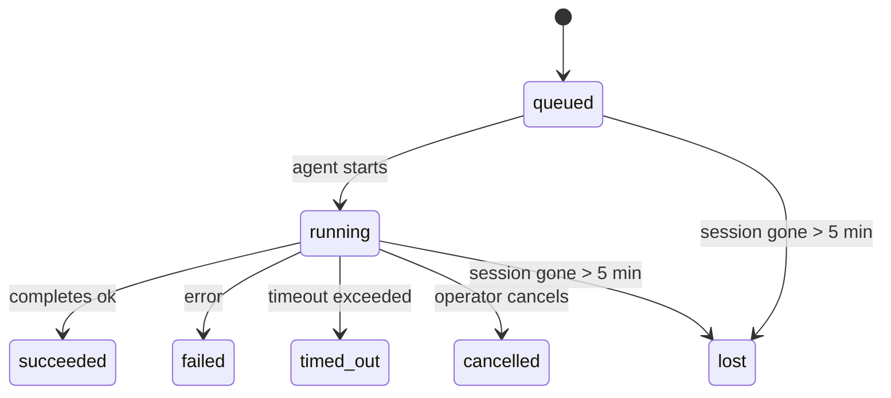

---
read_when:
    - 進行中または最近完了したバックグラウンド作業の確認
    - デタッチされたエージェント実行の配信失敗をデバッグする
    - バックグラウンド実行とセッション、Cron、Heartbeat の関係を理解する
sidebarTitle: Background tasks
summary: ACP 実行、サブエージェント、分離された Cron ジョブ、CLI 操作のバックグラウンドタスク追跡
title: バックグラウンドタスク
x-i18n:
    generated_at: "2026-05-05T06:16:23Z"
    model: gpt-5.5
    provider: openai
    source_hash: bafd959feaf2e220820ec56bf1ef144207d05757418e9971ebf427844cf30c46
    source_path: automation/tasks.md
    workflow: 16
---

<Note>
スケジューリングを探していますか？適切な仕組みを選ぶには[自動化とタスク](/ja-JP/automation)を参照してください。このページはバックグラウンド作業の活動台帳であり、スケジューラーではありません。
</Note>

バックグラウンドタスクは、**メインの会話セッションの外側**で実行される作業を追跡します。ACP 実行、サブエージェントの生成、分離された Cron ジョブ実行、CLI から開始された操作などです。

タスクはセッション、Cron ジョブ、Heartbeat を置き換えるものではありません。切り離された作業で何が起きたか、いつ起きたか、成功したかどうかを記録する**活動台帳**です。

<Note>
すべてのエージェント実行がタスクを作成するわけではありません。Heartbeat ターンや通常の対話型チャットは作成しません。すべての Cron 実行、ACP 生成、サブエージェント生成、CLI エージェントコマンドは作成します。
</Note>

## 要約

- タスクはスケジューラーではなく**記録**です。Cron と Heartbeat が作業を_いつ_実行するかを決め、タスクは_何が起きたか_を追跡します。
- ACP、サブエージェント、すべての Cron ジョブ、CLI 操作はタスクを作成します。Heartbeat ターンは作成しません。
- 各タスクは `queued → running → terminal`（succeeded、failed、timed_out、cancelled、lost）の順に進みます。
- Cron タスクは、Cron ランタイムがまだそのジョブを所有している間はライブのままです。
  メモリ内ランタイム状態がなくなった場合、タスクメンテナンスはタスクを lost とマークする前に、まず永続化された Cron 実行履歴を確認します。
- 完了はプッシュ駆動です。切り離された作業は、完了時に直接通知するか requester セッション/Heartbeat を起こせるため、ステータスのポーリングループは通常は適切な形ではありません。
- 分離された Cron 実行とサブエージェント完了は、最終的なクリーンアップ記録の前に、子セッションで追跡されているブラウザータブ/プロセスのクリーンアップをベストエフォートで行います。
- 分離された Cron 配信は、子孫サブエージェント作業がまだ排出中の間は古い中間の親返信を抑制し、配信前に最終的な子孫出力が届いた場合はそれを優先します。
- 完了通知はチャンネルに直接配信されるか、次の Heartbeat までキューに入れられます。
- `openclaw tasks list` はすべてのタスクを表示します。`openclaw tasks audit` は問題を表面化します。
- 終端レコードは 7 日間保持され、その後自動的に削除されます。

## クイックスタート

<Tabs>
  <Tab title="一覧表示とフィルター">
    ```bash
    # List all tasks (newest first)
    openclaw tasks list

    # Filter by runtime or status
    openclaw tasks list --runtime acp
    openclaw tasks list --status running
    ```

  </Tab>
  <Tab title="検査">
    ```bash
    # Show details for a specific task (by ID, run ID, or session key)
    openclaw tasks show <lookup>
    ```
  </Tab>
  <Tab title="キャンセルと通知">
    ```bash
    # Cancel a running task (kills the child session)
    openclaw tasks cancel <lookup>

    # Change notification policy for a task
    openclaw tasks notify <lookup> state_changes
    ```

  </Tab>
  <Tab title="監査とメンテナンス">
    ```bash
    # Run a health audit
    openclaw tasks audit

    # Preview or apply maintenance
    openclaw tasks maintenance
    openclaw tasks maintenance --apply
    ```

  </Tab>
  <Tab title="タスクフロー">
    ```bash
    # Inspect TaskFlow state
    openclaw tasks flow list
    openclaw tasks flow show <lookup>
    openclaw tasks flow cancel <lookup>
    ```
  </Tab>
</Tabs>

## タスクを作成するもの

| ソース                 | ランタイム種別 | タスクレコードが作成されるタイミング                   | デフォルト通知ポリシー |
| ---------------------- | ------------ | ------------------------------------------------------ | --------------------- |
| ACP バックグラウンド実行 | `acp`        | 子 ACP セッションの生成                                | `done_only`           |
| サブエージェントオーケストレーション | `subagent`   | `sessions_spawn` によるサブエージェントの生成          | `done_only`           |
| Cron ジョブ（すべての種別） | `cron`       | すべての Cron 実行（メインセッションと分離）           | `silent`              |
| CLI 操作               | `cli`        | Gateway 経由で実行される `openclaw agent` コマンド     | `silent`              |
| エージェントメディアジョブ | `cli`        | セッションに紐づく `music_generate`/`video_generate` 実行 | `silent`              |

<AccordionGroup>
  <Accordion title="Cron とメディアの通知デフォルト">
    メインセッションの Cron タスクはデフォルトで `silent` 通知ポリシーを使います。追跡用のレコードは作成しますが、通知は生成しません。分離された Cron タスクもデフォルトは `silent` ですが、独自のセッションで実行されるため、より見えやすくなります。

    セッションに紐づく `music_generate` と `video_generate` の実行も `silent` 通知ポリシーを使います。これらもタスクレコードを作成しますが、完了は内部 wake として元のエージェントセッションに返されるため、エージェントがフォローアップメッセージを書き、完成したメディアを自分で添付できます。グループ/チャンネルの完了は通常の表示返信ポリシーに従うため、ソース配信で必要な場合、エージェントはメッセージツールを使います。ツールのみの経路で完了エージェントがメッセージツール配信の証拠を生成できない場合、OpenClaw はメディアを非公開のままにせず、完了フォールバックを元のチャンネルに直接送信します。

  </Accordion>
  <Accordion title="同時 video_generate ガードレール">
    セッションに紐づく `video_generate` タスクがまだアクティブな間、このツールはガードレールとしても機能します。同じセッション内で `video_generate` 呼び出しを繰り返すと、2 つ目の同時生成を開始する代わりに、アクティブなタスクのステータスを返します。エージェント側から明示的な進行状況/ステータス照会をしたい場合は、`action: "status"` を使ってください。
  </Accordion>
  <Accordion title="タスクを作成しないもの">
    - Heartbeat ターン — メインセッションです。[Heartbeat](/ja-JP/gateway/heartbeat)を参照してください
    - 通常の対話型チャットターン
    - 直接の `/command` 応答

  </Accordion>
</AccordionGroup>

## タスクライフサイクル



| ステータス      | 意味                                                                       |
| ----------- | -------------------------------------------------------------------------- |
| `queued`    | 作成済みで、エージェントの開始を待っています                               |
| `running`   | エージェントターンが実行中です                                             |
| `succeeded` | 正常に完了しました                                                         |
| `failed`    | エラーで完了しました                                                       |
| `timed_out` | 構成されたタイムアウトを超過しました                                       |
| `cancelled` | オペレーターにより `openclaw tasks cancel` で停止されました                |
| `lost`      | 5 分間の猶予期間後、ランタイムが権威ある裏付け状態を失いました             |

遷移は自動的に起こります。関連付けられたエージェント実行が終了すると、タスクステータスはそれに合わせて更新されます。

エージェント実行の完了は、アクティブなタスクレコードに対して権威があります。成功した切り離し実行は `succeeded` として確定し、通常の実行エラーは `failed` として確定し、タイムアウトまたは中止の結果は `timed_out` として確定します。オペレーターがすでにタスクをキャンセルしている場合、またはランタイムが `failed`、`timed_out`、`lost` のようなより強い終端状態をすでに記録している場合、後から成功シグナルが届いてもその終端ステータスを格下げしません。

`lost` はランタイムを考慮します。

- ACP タスク: 裏付けとなる ACP 子セッションメタデータが消えました。
- サブエージェントタスク: 裏付けとなる子セッションが対象エージェントストアから消えました。
- Cron タスク: Cron ランタイムがそのジョブをアクティブとして追跡しなくなり、永続化された
  Cron 実行履歴にもその実行の終端結果が示されていません。オフライン CLI
  監査は、自身の空のインプロセス Cron ランタイム状態を権威として扱いません。
- CLI タスク: 分離された子セッションタスクは子セッションを使います。チャットに紐づく
  CLI タスクは代わりにライブ実行コンテキストを使うため、残存している
  チャンネル/グループ/ダイレクトのセッション行がそれらを生存扱いにし続けることはありません。Gateway に紐づく
  `openclaw agent` 実行もその実行結果から確定するため、完了した実行が
  sweeper によって `lost` とマークされるまでアクティブのまま残ることはありません。

## 配信と通知

タスクが終端状態に達すると、OpenClaw が通知します。配信経路は 2 つあります。

**直接配信** — タスクにチャンネルターゲット（`requesterOrigin`）がある場合、完了メッセージはそのチャンネル（Telegram、Discord、Slack など）へ直接送られます。サブエージェント完了では、OpenClaw は利用可能な場合にバインドされたスレッド/トピックのルーティングも保持し、直接配信を諦める前に、requester セッションに保存されたルート（`lastChannel` / `lastTo` / `lastAccountId`）から欠けている `to` / アカウントを補完できます。

**セッションキュー配信** — 直接配信に失敗した場合、または origin が設定されていない場合、更新は requester のセッションにシステムイベントとしてキューに入り、次の Heartbeat で表面化します。

<Tip>
タスク完了は即時の Heartbeat wake をトリガーするため、結果をすばやく確認できます。次にスケジュールされた Heartbeat tick を待つ必要はありません。
</Tip>

つまり、通常のワークフローはプッシュベースです。切り離された作業を一度開始し、完了時にランタイムが wake または通知するのを待ちます。デバッグ、介入、明示的な監査が必要な場合にのみタスク状態をポーリングしてください。

### 通知ポリシー

各タスクについて受け取る通知量を制御します。

| ポリシー                | 配信される内容                                                        |
| --------------------- | ----------------------------------------------------------------------- |
| `done_only`（デフォルト） | 終端状態（succeeded、failed など）のみ — **これがデフォルトです** |
| `state_changes`       | すべての状態遷移と進行状況更新                              |
| `silent`              | 何も配信しません                                                          |

タスクの実行中にポリシーを変更します。

```bash
openclaw tasks notify <lookup> state_changes
```

## CLI リファレンス

<AccordionGroup>
  <Accordion title="tasks list">
    ```bash
    openclaw tasks list [--runtime <acp|subagent|cron|cli>] [--status <status>] [--json]
    ```

    出力列: タスク ID、種類、ステータス、配信、実行 ID、子セッション、概要。

  </Accordion>
  <Accordion title="tasks show">
    ```bash
    openclaw tasks show <lookup>
    ```

    lookup トークンには、タスク ID、実行 ID、またはセッションキーを指定できます。タイミング、配信状態、エラー、終端概要を含む完全なレコードを表示します。

  </Accordion>
  <Accordion title="tasks cancel">
    ```bash
    openclaw tasks cancel <lookup>
    ```

    ACP とサブエージェントタスクでは、これにより子セッションを終了します。CLI で追跡されるタスクでは、キャンセルはタスクレジストリに記録されます（別個の子ランタイムハンドルはありません）。ステータスは `cancelled` に遷移し、該当する場合は配信通知が送信されます。

  </Accordion>
  <Accordion title="tasks notify">
    ```bash
    openclaw tasks notify <lookup> <done_only|state_changes|silent>
    ```
  </Accordion>
  <Accordion title="tasks audit">
    ```bash
    openclaw tasks audit [--json]
    ```

    運用上の問題を表面化します。問題が検出された場合、検出結果は `openclaw status` にも表示されます。

    | 検出項目                  | 重要度     | トリガー                                                                                                     |
    | ------------------------- | ---------- | ------------------------------------------------------------------------------------------------------------ |
    | `stale_queued`            | warn       | 10分を超えてキューに入っている                                                                               |
    | `stale_running`           | error      | 30分を超えて実行中                                                                                           |
    | `lost`                    | warn/error | ランタイムに裏付けられたタスク所有権が消失した。保持されている lost タスクは `cleanupAfter` までは警告になり、その後エラーになる |
    | `delivery_failed`         | warn       | 配信に失敗し、通知ポリシーが `silent` ではない                                                               |
    | `missing_cleanup`         | warn       | クリーンアップのタイムスタンプがない終了済みタスク                                                           |
    | `inconsistent_timestamps` | warn       | タイムライン違反（たとえば開始前に終了している）                                                             |

  </Accordion>
  <Accordion title="タスクのメンテナンス">
    ```bash
    openclaw tasks maintenance [--json]
    openclaw tasks maintenance --apply [--json]
    ```

    タスクと Task Flow 状態の照合、クリーンアップのタイムスタンプ付け、プルーニングをプレビューまたは適用するために使います。

    照合はランタイムを考慮します。

    - ACP/サブエージェントタスクは、裏付けとなる子セッションを確認します。
    - 子セッションに再起動リカバリの tombstone があるサブエージェントタスクは、復旧可能な裏付けセッションとして扱われるのではなく、lost としてマークされます。
    - Cron タスクは、cron ランタイムがまだジョブを所有しているかを確認し、その後 `lost` にフォールバックする前に、永続化された cron 実行ログ/ジョブ状態から終了ステータスを復元します。メモリ内の cron アクティブジョブセットについては Gateway プロセスだけが信頼できる情報源です。オフラインの CLI 監査は永続化された履歴を使いますが、そのローカル Set が空であることだけを理由に cron タスクを lost としてマークしません。
    - チャットに裏付けられた CLI タスクは、チャットセッション行だけではなく、所有しているライブ実行コンテキストを確認します。

    完了クリーンアップもランタイムを考慮します。

    - サブエージェント完了時は、通知クリーンアップが続行される前に、子セッションで追跡されているブラウザータブ/プロセスをベストエフォートで閉じます。
    - 分離 cron 完了時は、実行が完全に終了する前に、cron セッションで追跡されているブラウザータブ/プロセスをベストエフォートで閉じます。
    - 分離 cron 配信は、必要に応じて子孫サブエージェントのフォローアップを待ち、古い親確認テキストを通知する代わりに抑制します。
    - サブエージェント完了配信は、最新の表示可能なアシスタントテキストを優先します。それが空の場合は、サニタイズされた最新の tool/toolResult テキストにフォールバックし、タイムアウトのみのツール呼び出し実行は短い進捗途中サマリーに折りたたまれることがあります。終了済みの失敗した実行は、取得済みの返信テキストを再生せずに失敗ステータスを通知します。
    - クリーンアップ失敗が本来のタスク結果を覆い隠すことはありません。

  </Accordion>
  <Accordion title="tasks flow list | show | cancel">
    ```bash
    openclaw tasks flow list [--status <status>] [--json]
    openclaw tasks flow show <lookup> [--json]
    openclaw tasks flow cancel <lookup>
    ```

    個々のバックグラウンドタスクレコードではなく、オーケストレーションしている Task Flow に関心がある場合に使います。

  </Accordion>
</AccordionGroup>

## チャットタスクボード（`/tasks`）

任意のチャットセッションで `/tasks` を使うと、そのセッションにリンクされたバックグラウンドタスクを確認できます。ボードには、アクティブなタスクと最近完了したタスクが、ランタイム、ステータス、タイミング、進捗またはエラーの詳細とともに表示されます。

現在のセッションに表示可能なリンク済みタスクがない場合、`/tasks` はエージェントローカルのタスク数にフォールバックするため、他セッションの詳細を漏らさずに概要を確認できます。

完全なオペレーター台帳には CLI を使います: `openclaw tasks list`。

## ステータス統合（タスク負荷）

`openclaw status` には、一目で分かるタスクサマリーが含まれます。

```
Tasks: 3 queued · 2 running · 1 issues
```

サマリーは次を報告します。

- **active** — `queued` + `running` の数
- **failures** — `failed` + `timed_out` + `lost` の数
- **byRuntime** — `acp`、`subagent`、`cron`、`cli` ごとの内訳

`/status` と `session_status` ツールはどちらも、クリーンアップを考慮したタスクスナップショットを使います。アクティブなタスクが優先され、古い完了済み行は非表示になり、最近の失敗はアクティブな作業が残っていない場合にのみ表示されます。これにより、ステータスカードは今重要なことに集中できます。

## ストレージとメンテナンス

### タスクの保存場所

タスクレコードは SQLite で次の場所に永続化されます。

```
$OPENCLAW_STATE_DIR/tasks/runs.sqlite
```

レジストリは gateway 起動時にメモリへ読み込まれ、再起動をまたいだ耐久性のために書き込みを SQLite へ同期します。
Gateway は、SQLite のデフォルトの自動チェックポイントしきい値に加えて、定期的な `TRUNCATE` チェックポイントとシャットダウン時の `TRUNCATE` チェックポイントを使って、SQLite の先行書き込みログを制限します。

### 自動メンテナンス

sweeper は **60秒** ごとに実行され、4つの処理を扱います。

<Steps>
  <Step title="照合">
    アクティブなタスクに、信頼できるランタイムの裏付けがまだあるかを確認します。ACP/サブエージェントタスクは子セッション状態を使い、cron タスクはアクティブジョブの所有権を使い、チャットに裏付けられた CLI タスクは所有している実行コンテキストを使います。その裏付け状態が5分を超えてなくなっている場合、タスクは `lost` としてマークされます。
  </Step>
  <Step title="ACP セッション修復">
    終了済みまたは孤立した親所有の一回限りの ACP セッションを閉じます。また、アクティブな会話バインディングが残っていない場合にのみ、古い終了済みまたは孤立した永続 ACP セッションを閉じます。
  </Step>
  <Step title="クリーンアップのタイムスタンプ付け">
    終了済みタスクに `cleanupAfter` タイムスタンプを設定します（endedAt + 7日）。保持期間中、lost タスクは引き続き監査で警告として表示されます。`cleanupAfter` の期限が切れた後、またはクリーンアップメタデータが欠けている場合は、エラーになります。
  </Step>
  <Step title="プルーニング">
    `cleanupAfter` 日を過ぎたレコードを削除します。
  </Step>
</Steps>

<Note>
**保持:** 終了済みタスクレコードは **7日間** 保持され、その後自動的にプルーニングされます。設定は不要です。
</Note>

## タスクと他のシステムの関係

<AccordionGroup>
  <Accordion title="タスクと Task Flow">
    [Task Flow](/ja-JP/automation/taskflow) は、バックグラウンドタスクの上にあるフローオーケストレーションレイヤーです。1つのフローは、そのライフタイム中に、managed または mirrored の同期モードを使って複数のタスクを調整することがあります。個々のタスクレコードを調べるには `openclaw tasks` を使い、オーケストレーションしているフローを調べるには `openclaw tasks flow` を使います。

    詳細は [Task Flow](/ja-JP/automation/taskflow) を参照してください。

  </Accordion>
  <Accordion title="タスクと cron">
    cron ジョブの**定義**は `~/.openclaw/cron/jobs.json` にあり、ランタイム実行状態はその横の `~/.openclaw/cron/jobs-state.json` にあります。**すべての** cron 実行は、メインセッションと分離セッションの両方でタスクレコードを作成します。メインセッションの cron タスクは、通知を生成せずに追跡するため、デフォルトで `silent` 通知ポリシーになります。

    [Cron ジョブ](/ja-JP/automation/cron-jobs) を参照してください。

  </Accordion>
  <Accordion title="タスクと heartbeat">
    Heartbeat 実行はメインセッションのターンであり、タスクレコードを作成しません。タスクが完了すると、結果をすぐに確認できるように heartbeat wake をトリガーできます。

    [Heartbeat](/ja-JP/gateway/heartbeat) を参照してください。

  </Accordion>
  <Accordion title="タスクとセッション">
    タスクは `childSessionKey`（作業が実行される場所）と `requesterSessionKey`（開始した人）を参照することがあります。セッションは会話コンテキストであり、タスクはその上にあるアクティビティ追跡です。
  </Accordion>
  <Accordion title="タスクとエージェント実行">
    タスクの `runId` は、作業を行っているエージェント実行にリンクします。エージェントのライフサイクルイベント（開始、終了、エラー）はタスクステータスを自動的に更新します。ライフサイクルを手動で管理する必要はありません。
  </Accordion>
</AccordionGroup>

## 関連

- [自動化とタスク](/ja-JP/automation) — すべての自動化メカニズムの概要
- [CLI: タスク](/ja-JP/cli/tasks) — CLI コマンドリファレンス
- [Heartbeat](/ja-JP/gateway/heartbeat) — 定期的なメインセッションターン
- [スケジュール済みタスク](/ja-JP/automation/cron-jobs) — バックグラウンド作業のスケジューリング
- [Task Flow](/ja-JP/automation/taskflow) — タスクの上にあるフローオーケストレーション
